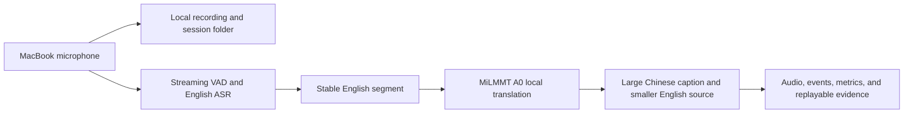

# Sermon Video Chinese Subtitles

  
  

This repository has one product goal: help Chinese-speaking attendees follow an English sermon. It now has two concrete operator workflows—a Saturday post-live PDF workflow and a Sunday local live-caption POC. Everything else is research, evaluation, or infrastructure supporting those two paths.

The complete diagrams, artifact contracts, local latency budget, and test gates are in the [two-workflow README](docs/workflows/README.zh.md).

> This is an independent personal open-source project. It is not affiliated with, endorsed by, sponsored by, approved by, or operated by Mariners Church. Use only public or otherwise authorized media, and do not bypass access controls, DRM, or platform restrictions.

## 1. Working workflows

### A. Saturday: livestream/archive to two reviewed PDFs

The Saturday workflow discovers or receives the public livestream URL, preserves the complete post-live media, asks an operator to confirm the sermon window, transcribes the English sermon, prepares the Chinese reading text, and renders two canonical outputs for Sunday use:

1. `sermon_zh_en_reading.pdf` — the bilingual translation/reading edition.
2. `sermon_interpretation_zh.pdf` — the Chinese sermon companion/outline, limited to sermon-related supporting information.

This is the repository's mature post-live path. A run is not complete until the source, approved window, reading-text QA, both PDFs, and both PDF QA reports are present and passing.

Key references:

- [Stable post-live reading-PDF workflow](docs/stable-post-live-reading-pdf-workflow.md)
- [Codex local weekend production runbook](docs/codex-local-production-runbook.zh.md)
- [Sermon Production Supervisor Agent](docs/sermon-production-supervisor-agent.md)

### B. Sunday: local microphone to live Chinese captions

The Sunday workflow runs locally on a MacBook: browser microphone capture, durable audio/event logging, local English ASR, MiLMMT English-to-Chinese translation, and a one-page large-type caption display.

The current POC already implements microphone selection, recording, per-session folders, event logs, local MiLMMT A0 translation, responsive captions, and replayable test evidence. The browser still uses labeled English replay fixtures until local ASR is integrated and benchmarked.

Key references:

- [Complete Saturday/Sunday workflow and latency budget](docs/workflows/README.zh.md)
- [Local live-caption POC](experiments/local-live-poc/README.md)
- [Local live-caption design](experiments/local-live-poc/DESIGN.zh.md)

## 2. Discovery, gaps, and next work

### What has been demonstrated

| Area | Current evidence |
|---|---|
| Saturday PDF production | Two canonical PDFs, reading-text QA, PDF QA, human sermon-window gate, resumable state |
| Sunday live POC | Real microphone recording, local session artifacts, MiLMMT A0 translation, large responsive UI |
| Saturday-to-Sunday context | Ordered weekly-pack builder, guarded terminology/reference retrieval, no-context A0 baseline |
| Replay and A/B foundation | Original recording, append-only events, model/prompt/latency metadata, deterministic replay inputs |

### Active discovery and missing gates

- **Local English ASR:** select and benchmark a real `whisper.cpp` model on sermon audio, then connect stable English segments to the existing gateway. Until this passes, live English remains a fixture rather than microphone transcription.
- **End-to-end latency:** current MiLMMT warm translation is roughly 0.29–0.48 seconds in a small local sample; ASR is not yet measured. The current planning estimate is 0.6–1.5 seconds for ASR plus translation compute, and 1.2–2.8 seconds from end-of-utterance to stable Chinese after VAD/UI overhead. These are targets, not an SLO.
- **Content-pack A/B:** use Saturday captions to prepare approved terms, Scripture references, and optional aligned examples; compare `A0 / none` against guarded context using the same Sunday recording.
- **Local runtime options:** Ollama is the current A0 path; direct MLX serving remains a Discovery alternative and must use the same frozen inputs and latency/quality gate before replacement.
- **Operational readiness:** add a real ASR fixture suite, long-running microphone soak, audio-route checks, storage-retention rules, and a Sunday operator runbook before calling the live path production-ready.
- **Phone use:** the UI is responsive at iPhone width, but phone-as-second-screen synchronization and LAN HTTPS are separate discovery items.

### Post-training track

Post-training remains a separate project and must not complicate the live POC contract:

1. Build a provenance-preserving parallel corpus from existing subtitle sources, reviewed Saturday/Sunday translations, terminology corrections, and selected audio evidence.
2. Freeze train/dev/test splits by sermon to prevent segment leakage; only human-approved `Gold` material is eligible for promotion.
3. Use a strong teacher translation plus independent bilingual review; send only risky segments and a stable sample to audio review.
4. Train a smaller student translation model with SFT/LoRA, then compare it against MiLMMT A0 on terminology, Scripture names, adequacy, hallucination rate, and latency.
5. Promote a model only when the frozen evaluation gate passes. The browser should remain unchanged; replacing `LOCAL_LIVE_OLLAMA_MODEL` swaps the backend model.

All other architecture, provider comparisons, cloud experiments, historical realtime prototypes, and deployment notes belong in the [documentation index](docs/README.md), not in the primary product narrative.
