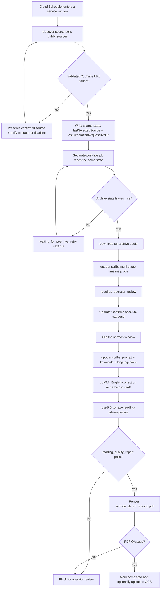

# Sermon Video Chinese Subtitles

<p>
  <a href="./README.zh.md">
    
  </a>
  <a href="./LICENSE">
    
  </a>
</p>

This repository's production path is supervised by a single `Sermon Production Supervisor` Agent. Cloud Scheduler wakes the workflow, existing scripts remain the deterministic execution layer, and the agent reads durable state and advances the process safely. The workflow pauses for human sermon-boundary confirmation and ends with a reviewed Chinese-English reading PDF:

1. Cloud Scheduler polls public Mariners / YouTube sources during configured service windows
2. the canonical YouTube watch URL is saved into resumable shared state
3. a separate post-live task waits until the archive becomes `was_live`
4. the full audio is downloaded and a machine-suggested sermon window is generated
5. an operator independently confirms absolute start and end offsets in the full media
6. `gpt-transcribe` builds the English reference using a prompt, keywords, and `languages=["en"]`
7. the pipeline creates the Chinese draft and performs two reading-edition passes
8. it renders the bilingual reading PDF
9. the run becomes complete only after reading-text QA and PDF QA both pass

The production deliverable is currently the reading PDF. Default `reading` mode does not depend on `whisper-1`; synchronized SRT/VTT output requires an explicit switch to subtitle mode.

Agent architecture, shadow/execute modes, durable human approval, and Scheduler integration:

- [Sermon Reading-PDF Production Supervisor Agent](docs/sermon-production-supervisor-agent.md)
- [证道阅读版生产 Supervisor Agent](docs/sermon-production-supervisor-agent.zh.md)

## One-Page Workflow


The slide summarizes the current production path: scheduled discovery, shared-state preservation, human-confirmed sermon boundaries, `gpt-transcribe` plus two reading-editing passes, dual QA gates, and the final Chinese-English reading PDF.

## Disclaimer

This is an independent personal open-source project. It is not affiliated with, endorsed by, sponsored by, approved by, or operated by Mariners Church.

The project uses publicly accessible Mariners Church live streams, live archives, and public video metadata as source material for transcription, translation, subtitle timing, and technical feasibility research. It does not use private Mariners Church systems, private media, YouTube Studio access, internal files, or any non-public channel permissions.

The project does not bypass paywalls, access controls, DRM, platform restrictions, or copyright protections. Operators are responsible for using the tools only with public or otherwise authorized audio/video sources and for respecting Mariners Church, YouTube, and other applicable terms and rights.

## End-to-End Production Workflow

The current stable workflow is documented in detail here:

- [Stable post-live reading PDF workflow](docs/stable-post-live-reading-pdf-workflow.md)
- [稳定的 post-live 阅读版 PDF 工作流](docs/stable-post-live-reading-pdf-workflow.zh.md)
- [Sermon Reading-PDF Production Supervisor Agent](docs/sermon-production-supervisor-agent.md)
- [Production `gpt-transcribe` and reading-PDF audit](docs/gpt-transcribe-reading-pdf-production-audit-2026-07-31.zh.md)

### Flowchart



### 1. Scheduled live-link discovery and state capture

Source discovery and content generation are separate jobs. `discover-source` stays lightweight: it checks public pages and metadata, selects a source, writes state, and emits deduplicated notifications. It does not run the long transcription/PDF workflow inside the request.

The production deployment documentation currently defines these polling windows:

| Window | Scheduler cadence | Sunday route | Purpose |
|---|---|---|---|
| Saturday 4:00 service | `*/5 16 * * SAT` | `upcoming` | Poll for the `sat400` stream every five minutes |
| Saturday 5:30 service | `30-59/5 17 * * SAT` | `upcoming` | Poll for the `sat530` stream every five minutes |
| Sunday 8:30 fallback | `*/2 7-9 * * SUN` | `current` | Continue discovery if Saturday missed the source |
| Sunday 10:00 fallback | `*/2 9-10 * * SUN` | `current` | Keep a separate fallback for the later service |

The Scheduler calls:

```text
POST /api/admin/sundays/{upcoming|current}/discover-source
```

In production, `LIVE_SOURCE_MONITOR_STATE_URI` points at a durable shared object, normally a GCS `backend-state.json`. Downstream jobs primarily read:

- `lastSelectedSource`: the validated selected source
- `lastGenerationRequest.liveUrl`: the canonical URL used for later download
- `lastSunday`: a guard against using a source from the wrong Sunday

A later fallback result must not erase a confirmed URL for the same Sunday. Missing-source and operator-deadline notifications are deduplicated so every Scheduler tick does not send the same alert.

Local development can use:

```text
artifacts/live-source-monitor/state.json
```

### 2. Wait for post-live and propose the sermon window

A separate timeline-probe scheduled task reads the same state. The production runbook currently checks every ten minutes on Saturday evening:

```text
sermon-post-live-timeline-probe  */10 18-23 * * SAT
POST /api/admin/sundays/upcoming/post-live-subtitles
payload.mode = timeline-probe
```

If the archive is not yet `was_live`, the task returns `waiting_for_post_live` and retries on the next run without starting model work. Once the archive is downloadable, the timeline job:

1. downloads the complete livestream audio
2. performs a 120-second coarse scan
3. performs a 30-second transition scan
4. performs 5-second fine scans around the likely start and end
5. writes `suggestedWindow`
6. stops at `requires_operator_review`

The suggestion narrows the review range; it is not an approved clip boundary. The operator must independently watch the archive and confirm that `start-time` and `end-time` are absolute offsets in the full media.

If cloud download authorization fails, the state becomes `waiting_for_download_access`. After a local authorized download and GCS handoff, the cloud task resumes from existing stages instead of repeating discovery or timeline work.

### 3. Generate the reading edition and final PDF

After the operator confirms the sermon boundaries, trigger `mode=generate-reviewed`, or run the same reviewed generation path locally:

```bash
python3 scripts/run_post_live_subtitle_generation.py \
  --sunday 2026-07-26 \
  --state-file artifacts/live-source-monitor/state.json \
  --work-root artifacts/post-live-runs \
  --out artifacts/post-live-subtitle-generation/report.json \
  --slug mariners_VIDEO_ID \
  --start-time 00:29:35 \
  --end-time 01:00:55 \
  --output-mode reading \
  --reference-model gpt-transcribe
```

This step reuses downloaded audio and completed core artifacts, then:

1. clips the sermon using the human-confirmed absolute offsets
2. creates the English reference with `gpt-transcribe`
3. records the context prompt, glossary keywords, and `languages=["en"]` in auditable metadata
4. uses `gpt-5.6` for English correction and the Chinese draft
5. uses `gpt-5.6-sol` with `high` reasoning for two reading-edition passes
6. checks `reading-edition-v2/reading_quality_report.json`
7. renders `sermon_zh_en_reading.pdf`
8. checks every page for blank pages, overflow, sparse orphans, long lines, missing glyphs, names, and scripture risks
9. updates `run-status.json` and optionally uploads artifacts to GCS only after all gates pass

Before running, the shell must already contain `OPENAI_API_KEY`, or the command must receive a Secret Manager resource name through `--api-key-secret`. Never put a raw key in a command, log, or repository file.

### Manual URL fallback

Scheduled discovery is the primary path. Use manual capture only when discovery cannot find the correct source or an operator must replace an incorrect selection:

```bash
python3 scripts/live_source_monitor.py \
  --sunday 2026-07-26 \
  --manual-url 'https://www.youtube.com/watch?v=VIDEO_ID' \
  --out artifacts/live-source-monitor/report.json \
  --state-file artifacts/live-source-monitor/state.json
```

After this state correction, the post-live, timeline, reading-edition, and PDF stages remain unchanged.

### Completion rule

Do not call the run complete because the Scheduler found a URL, audio was downloaded, or partial ASR exists. The stable completion condition is:

- source URL saved into shared state with a matching Sunday
- archive confirmed post-live
- sermon start and end manually confirmed
- `reading-edition-v2/reading_quality_report.json` reports pass
- `sermon_zh_en_reading.pdf` generated
- `sermon_zh_en_reading.qa.json` reports pass
- `summary.json`, the run report, and `run-status.json` written
- final run status is `completed`

### Automation and human boundaries

| Stage | Automated | Human confirmation |
|---|---|---|
| Discovery | Scheduled polling, URL validation, state persistence, deduplicated notifications | Correct conflicting candidates or a wrong source |
| Post-live | Check `was_live`, download, retry or hand off failures | Resolve download authorization when automation cannot |
| Timeline | Multi-stage probe and `suggestedWindow` | Independently confirm absolute sermon start and end |
| Content | ASR, English correction, Chinese draft, two reading-edition passes | Review QA blocks or content anomalies |
| PDF | Rendering and page-level machine QA | Spot-check and approve final delivery/publication |

## Main outputs

The primary operator outputs for this workflow are:

- `asr_reference.json` or `asr_reference_chunks.json`
- `segments_timed_en_corrected.json`
- `segments_timed_zh.json`
- `sermon_zh_en_reading.pdf`
- `sermon_zh_en_reading.qa.json`
- `reading-edition-v2/reading_quality_report.json`
- `summary.json`
- `run-status.json`

The default `reading` mode does not call `whisper-1`. Its internal timing values organize reading blocks and are not publishable subtitle timing. `whisper-1` is enabled only when the operator explicitly selects `--output-mode subtitles`.

## Working but Secondary

These paths already work, but they are not the primary repo entrypoint:

- [backend/README.md](backend/README.md): backend worker and Cloud Run orchestration
- [web/README.md](web/README.md): frontend/admin and playback prototype

They should be documented as supporting paths around the stable post-live reading-PDF workflow, not as the main workflow itself.

## Background

The longer-term product goal remains improving the 11:30 PT congregation listening experience for Chinese-speaking attendees. The current stable workflow is the most reliable operator path for preserving a source, confirming the sermon window, and producing a bilingual reading PDF after the service.

## Documentation

| Area | English | Chinese |
|---|---|---|
| Stable workflow | [docs/stable-post-live-reading-pdf-workflow.md](docs/stable-post-live-reading-pdf-workflow.md) | [docs/stable-post-live-reading-pdf-workflow.zh.md](docs/stable-post-live-reading-pdf-workflow.zh.md) |
| Production Supervisor Agent | [docs/sermon-production-supervisor-agent.md](docs/sermon-production-supervisor-agent.md) | [docs/sermon-production-supervisor-agent.zh.md](docs/sermon-production-supervisor-agent.zh.md) |
| Documentation index | [docs/README.md](docs/README.md) | [docs/README.zh.md](docs/README.zh.md) |
| System design | [docs/system-design.md](docs/system-design.md) | [docs/system-design.zh.md](docs/system-design.zh.md) |
| System design gap analysis | [docs/system-design-gap-analysis.md](docs/system-design-gap-analysis.md) | [docs/system-design-gap-analysis.zh.md](docs/system-design-gap-analysis.zh.md) |
| Findings report | [docs/findings-report.md](docs/findings-report.md) | [docs/findings-report.zh.md](docs/findings-report.zh.md) |
| Model/provider comparison | [docs/model-provider-comparison.md](docs/model-provider-comparison.md) | [docs/model-provider-comparison.zh.md](docs/model-provider-comparison.zh.md) |
| Cloud Run deployment prep | [docs/cloud-run-deployment-prep.md](docs/cloud-run-deployment-prep.md) | [docs/cloud-run-deployment-prep.zh.md](docs/cloud-run-deployment-prep.zh.md) |
| Admin workflow | [docs/admin-workflow.md](docs/admin-workflow.md) | [docs/admin-workflow.zh.md](docs/admin-workflow.zh.md) |
| Post-live reviewed Sunday publication | [Chinese runbook](docs/post-live-reviewed-sunday-publication.zh.md) | [same Chinese runbook](docs/post-live-reviewed-sunday-publication.zh.md) |
| Scripture source | [docs/scripture-source.md](docs/scripture-source.md) | [docs/scripture-source.zh.md](docs/scripture-source.zh.md) |
| Observability and logs | [docs/observability.md](docs/observability.md) | [docs/observability.zh.md](docs/observability.zh.md) |
| Open-source readiness | [docs/open-source-readiness.md](docs/open-source-readiness.md) | [docs/open-source-readiness.zh.md](docs/open-source-readiness.zh.md) |
| Sunday live test runbook | [docs/sunday-live-test-runbook.md](docs/sunday-live-test-runbook.md) | [docs/sunday-live-test-runbook.zh.md](docs/sunday-live-test-runbook.zh.md) |
| YouTube source analysis | [bilingual report](docs/youtube-sermon-subtitle-pipeline-analysis.zh-en.md) | [same bilingual report](docs/youtube-sermon-subtitle-pipeline-analysis.zh-en.md) |
| Offline live-archive timing feasibility | [Chinese report](docs/offline-live-archive-timing-feasibility.zh.md) | [same Chinese report](docs/offline-live-archive-timing-feasibility.zh.md) |
| Backlog and review | [docs/backlog.md](docs/backlog.md), [docs/review-testing.md](docs/review-testing.md) | [docs/backlog.zh.md](docs/backlog.zh.md) |

## Prerequisites

For the stable local workflow:

- Python 3.10 or newer
- `yt-dlp` available on `PATH`
- network access to the public source URLs used in the run
- `OPENAI_API_KEY` in the shell, or a usable `--api-key-secret`

For GCS / Cloud Run-style artifact publishing:

- Google Cloud SDK `gcloud` installed and authenticated
- access to the target GCS bucket
- Secret Manager resource names for model/API keys; do not pass raw key material

## Open-Source Hygiene

- Do not commit API keys, cookies, generated transcripts, generated captions, model output JSONL, private media, or service account JSON files.
- Runtime secrets belong in Google Secret Manager. See [Cloud Run deployment prep](docs/cloud-run-deployment-prep.md).
- Generated artifacts belong in GCS or ignored local `artifacts/`.
- Respect platform permissions, copyright, and terms of service. This project does not bypass access controls or DRM.
- Before making the repository public, run the [open-source readiness checklist](docs/open-source-readiness.md).

## Contributing

See [CONTRIBUTING.md](CONTRIBUTING.md), [CONTRIBUTING.zh.md](CONTRIBUTING.zh.md), [SECURITY.md](SECURITY.md), and [SECURITY.zh.md](SECURITY.zh.md).

## License

MIT. See [LICENSE](LICENSE).
