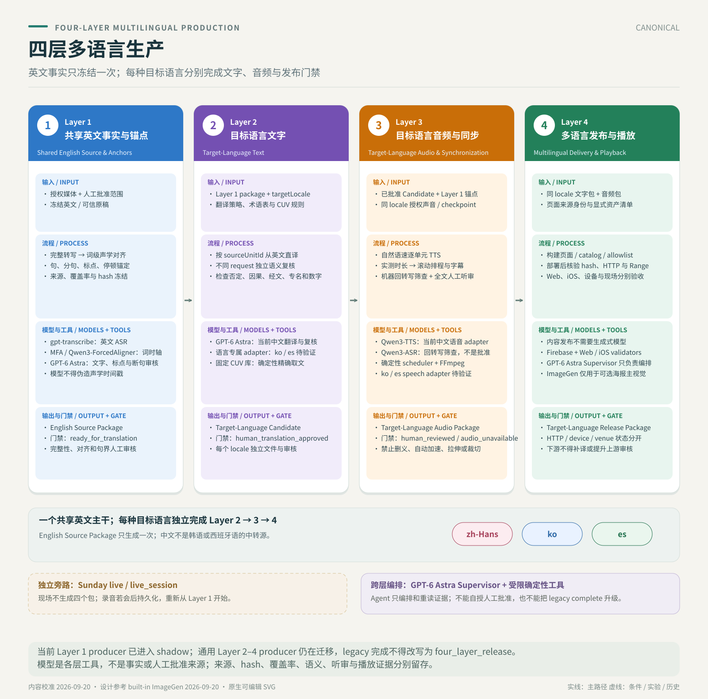

# Sermon Video Chinese Subtitles

<p>
  <a href="./README.zh.md">
    
  </a>
  <a href="./LICENSE">
    
  </a>
</p>

**[Four-layer multilingual production: bilingual HTML workflow (GitHub)](https://github.com/JonathanJing/sermon-video-zh-subtitles/blob/main/docs/tongxing-video-to-page.html)** — shows each layer's inputs, process, models/deterministic tools, output, gate and current implementation boundary.

Help Chinese-speaking attendees follow an English sermon. The featured direction is **Chinese dubbing prepared on Saturday for playback against the same video on Sunday**: reviewed source text, authorized speaker-reference speech synthesis, MP3 audio, timed Chinese captions, and a sermon companion. Dual-PDF production and local live captions remain separate workflows.

> **State calibrated on 2026-09-20.** “Jesus promises” by Eric Geiger is published with Chinese audio generated locally on MacBook. The user confirmed listening acceptance and Firebase/iOS playback; venue synchronization remains unverified. A share poster with a real weekly-page QR code is now a default weekly deliverable. See the [September 20 production record (中文)](docs/production-2026-09-20.zh.md). Full weekly media, audio and PDFs stay outside Git.

> This is an independent personal open-source project. It is not affiliated with, endorsed by, sponsored by, approved by, or operated by Mariners Church. Use only public or otherwise authorized media, and do not bypass access controls, DRM, or platform restrictions.

## Four-layer production architecture: shared English source to multilingual playback

The production pipeline has four layers: **Shared English Source & Anchors → Target-Language Text → Target-Language Audio & Synchronization → Multilingual Delivery & Playback**. Each layer has its own deliverable and acceptance gate; passing one layer does not imply that the next layer has passed. Chinese is the current primary production language. Korean and Spanish are future target-language lanes that can use the same interfaces, but each must pass its own translation, audio, and release review.

| Layer | Responsibility | Model and program roles | Deliverable and acceptance gate |
|---|---|---|---|
| 1. Shared English Source & Anchors | Lock the source and sermon window, recover the complete English, align words to source audio, then establish stable sentence, clause, punctuation and pause anchors | `gpt-transcribe` or a trustworthy manuscript supplies text; MFA, Qwen ForcedAligner and other candidates supply acoustic word locations; an LLM may review text, punctuation and sentence boundaries but must not invent timestamps | `English Source Package`: immutable anchors, word times, provenance, hashes and coverage evidence |
| 2. Target-Language Text | Translate directly from English anchors, preserving every unit and checking negation, causality, Scripture, names, numbers and terminology | The current Chinese path uses GPT/Astra-class translation plus an independent review pass; each future locale selects its own translator, reviewer, prompts and terminology | `Target-Language Candidate`: target text, exact English-anchor coverage, model receipts and independent review state |
| 3. Target-Language Audio & Synchronization | Generate natural-rate speech from approved text, measure actual duration and schedule it against English clauses and pauses | Qwen3-TTS and similar speech models synthesize audio; Qwen3-ASR-style back-transcription is a machine screen only; a deterministic scheduler owns duration, gaps and timeline placement, followed by complete human listening | `Target-Language Audio Package`: audio, captions, schedule, screening and listening state |
| 4. Multilingual Delivery & Playback | Bind the correct video, text, audio, captions, page and language selectors, then deploy, download and play them on supported clients | Page builders, FFmpeg, Firebase, Web/iOS clients and validators deliver artifacts; a Supervisor/Agent orchestrates state but does not replace content truth or human acceptance | `Target-Language Release Package`: locale-isolated assets, hashes, HTTP/download checks and player verification |



Multilingual expansion follows these contracts:

- Shared English Source & Anchors produces one shared, frozen anchor set. Chinese, Korean, Spanish and other languages branch directly from English; Chinese must not become a pivot source for another language.
- Each target language records its `locale`, English-anchor hash, translation/review model identities, voice model or checkpoint, timeline and human-review state. Failure in one locale neither blocks nor approves another automatically.
- Models may be replaced or A/B-tested within a layer, but responsibilities do not blur across layers: a Forced Aligner does not prove semantic completeness, a translation model does not determine acoustic time, back-transcription is not human listening, and a successful deployment is not venue acceptance.
- Sentence anchoring and clause-stable splitting sit at the English-to-translation boundary: first stabilize what was said and when, then let each target language express it early, completely and naturally.

The canonical names, input/output schemas and invalidation rules live in the [four-layer multilingual interfaces (中文)](docs/multilingual-production-interfaces.zh.md). See also the [workflow map (中文)](docs/workflows/README.zh.md), [sentence-aligned interpretation design (中文)](docs/sentence-aligned-interpretation.zh.md), and [system design and model choices (中文)](docs/sermon-dubbing-system-design.zh.md).

All future prepared multilingual production runs must be tracked through these four layers. Existing dual-PDF and Chinese page tools remain usable as scoped legacy adapters, but their own `complete` state is not the same as a complete four-layer release. Sunday live captions remain a separate real-time path; publishing a finalized live recording later starts at Layer 1.

## Sunday operation: prepare a new caption session

[Operations whitepaper (中文)](docs/sunday-live-operations-whitepaper.zh.md) · [Agent execution entry (中文)](docs/sunday-live-agent-runbook.zh.md)

Use the existing Sunday app to prepare the operator page, create a recording session and obtain its phone-viewer link. Each session gets a new identity; routine Sunday operation does not redeploy the website. The Agent entry covers preflight, microphone and sharing scope, recovery, and verified saving. “Prepare” opens a standby page without starting a recording.

```text
Read docs/sunday-live-agent-runbook.zh.md and prepare this Sunday's caption page
using the installed runtime. Check for an active recording first, open the
operator page in standby, and report the effective model and preflight results.
```

## 1. Featured: English sermon video → Chinese dubbing in the speaker’s voice

[Listening app](https://ai-for-god-sermon-audio.web.app) · [System design and model choices (中文)](docs/sermon-dubbing-system-design.zh.md) · [Operator runbook](experiments/sermon-dubbing-poc/SATURDAY_AUDIO_RUNBOOK.zh.md) · [This week’s production record (中文)](docs/production-2026-09-20.zh.md)


**Source identity determines playback.** The September 20 edition uses the user-confirmed complete service recording, with the sermon window **29:49–1:02:09** inside a **1:16:07** video. Same-video intake supports an approved window in a full recording as well as a verified sermon-only file. Archive intake remains available; another recording of the same message is not automatically interchangeable.

| Stage | Current implementation |
|---|---|
| English video transcription | `gpt-transcribe`; reuse trustworthy English sources and check ambiguous audio separately |
| Spoken Chinese revision and review | In-conversation `gpt-6-astra`, checking complete meaning, negation, Scripture, names and quotation boundaries |
| Speaker voice | This edition: MacBook-local MLX Qwen3-TTS with an authorized speaker reference; Spark training remains a separate route |
| Audio checks and timing | Local Qwen3-ASR back-transcription, ForcedAligner acoustic anchors, and measured natural speech budgets |
| Listening delivery | Dedicated Firebase app with weekly selection, MP3 downloads, captions, outline, seeking and fine adjustment |

**Current edition:** [Jesus promises — September 20](https://ai-for-god-sermon-audio.web.app/?week=2026-09-20-same_video-7c193fd4-bc90-4f3b-aa00-37dfe8423aa0), Eric Geiger, Revelation 2–3. Source-bound Chinese review, exact CUV quotation locks, local speech synthesis and measured timing were followed by pronunciation repairs and user listening acceptance. Firebase and iOS playback were accepted by the user; the [production record](docs/production-2026-09-20.zh.md) keeps stage timing, token accounting and evidence boundaries.

**Default weekly poster:** after publication and HTTP verification, Codex creates ImageGen artwork and composes catalog text plus a real QR code for the exact weekly-page link. Final PNG and sharing-preview decoding and visual QA are required. This is a delivery step; the scheduled Supervisor does not automatically call ImageGen, upload or send the poster. See the [weekly release procedure](docs/tongxing-weekly-release.zh.md#每周海报交付).

**Current limits:** user listening and Firebase/iOS acceptance do not establish venue synchronization. Source timeline alignment and same-recording sound-location capability retain their separate evidence; a different live delivery cannot reuse the timing unchanged. The [August 30 candidate report](docs/sermon-dubbing-astra-review-2026-09-05.zh.md) remains historical evidence.

## Why dual PDFs and live captions remain


Sunday services currently do not have dependable Chinese captions. Generic live speech translation can produce a useful draft, but it does not reliably preserve Scripture references, biblical names, quoted verses, or church-specific terminology. Unstable segmentation and end-to-end delay can also make otherwise correct text difficult to follow in the room.

When Sunday is a new live delivery rather than playback of the same video, prepared dubbing cannot be applied directly. The earlier live-caption hypothesis was to extract and translate the Saturday public livestream, then reuse that content on Sunday. Testing exposed an important boundary: the Saturday and Sunday sermons may follow the same message framework, but they cannot be assumed to be the same delivery word for word. Wording, order, examples, and live additions may differ. A Saturday transcript is therefore useful preparation, but it cannot be the source of truth for Sunday captions.

The current architecture supports an optional guarded hybrid; the tested Sunday default remains `contextPolicy=none`: Sunday live audio and the English recognized from it remain authoritative, while authorized Saturday material supplies guarded structure, terminology, Scripture references, and reviewed examples. Domain post-training remains a separate evaluation track, with a v4.1 candidate now available for local trials. Quality and latency improvements require frozen evaluations; successful integration does not promote the candidate.


## 2. Other independent workflows

### A. Saturday: livestream/archive to two reviewed PDFs

The Saturday workflow discovers or receives the public livestream URL, preserves the complete post-live media, asks an operator to confirm the sermon window, transcribes the English sermon, prepares the Chinese reading text, and renders two canonical outputs for Sunday use:

1. `sermon_zh_en_reading.pdf` — the bilingual translation/reading edition.
2. `sermon_interpretation_zh.pdf` — the Chinese sermon companion/outline, limited to sermon-related supporting information.

<table>
  <tr>
    <th>Bilingual reading edition</th>
    <th>Chinese sermon companion</th>
  </tr>
  <tr>
    <td></td>
    <td></td>
  </tr>
</table>

_Real page-1 renders from the 2026-08-30 run. Both individual PDF QA reports pass; complete per-run PDFs remain outside Git. See the [example provenance](docs/assets/pdf-examples/README.md)._


The weekly Supervisor uses Astra Medium for translation, two reading reviews and the companion text, and enables Context Pack export after PDF QA. Exported message identity starts as `unknown`; automatic export is not human approval.

This is the repository's mature post-live path. A run is not complete until the source, approved window, reading-text QA, both PDFs, and both PDF QA reports are present and passing.

Key references:

- [Stable post-live reading-PDF workflow](docs/stable-post-live-reading-pdf-workflow.md)
- [Codex local weekend production runbook](docs/codex-local-production-runbook.zh.md)
- [Sermon Production Supervisor Agent](docs/sermon-production-supervisor-agent.md)

### B. Sunday: local microphone to live Chinese captions

The Sunday workflow runs locally on a MacBook: browser microphone capture, durable audio/event logging, local English ASR, MiLMMT English-to-Chinese translation, and a one-page large-type caption display.


The default implementation uses independent MediaRecorder recovery audio, 16 kHz PCM over WebSocket, Qwen3-ASR/MLX, and MiLMMT Q8 through Ollama. Immutable English finals pass a lexical fragment guard before immediate translation. The `readable_chunks` display retains the previous complete bilingual pair; Firebase Hosting/Realtime Database provides public read-only viewing, with a separate LAN/SSE fallback. Gateway recovery resumes the same session, preserves recording and viewer identity, and records caption gaps explicitly.

The merged runtime completed a **60-minute browser WAV replay** (20 minutes of unique audio repeated three times): **1,287 ASR finals → 1,287 translations → 1,287 readable operator-page displays**. P95 was **1.776 seconds from audio-segment end**, or **4.763 seconds from segment start**, to the first readable caption. This is delivery evidence, not translation accuracy, physical microphone/phone proof, or venue acceptance. See the [current readiness report](experiments/local-live-poc/benchmarks/SUNDAY_READINESS_20260904.zh.md).

**Optional v4.1 trial:** start the POC with [Sunday Live Captions.command](experiments/local-live-poc/Sunday%20Live%20Captions.command), then choose **v4.1 Q5 · 实验候选** before recording. The page can start its separate local MLX service when the frozen model package is installed. This candidate has not passed the theological quality gate; its sessions display and save locally, with LAN/Firebase sharing disabled. See the [setup and recovery guide](experiments/local-live-poc/MILMMT_V41_LOCAL.zh.md).


Key references:

- [Complete Saturday/Sunday workflow and latency budget](docs/workflows/README.zh.md)
- [Local live-caption POC](experiments/local-live-poc/README.md)
- [Local live-caption design](experiments/local-live-poc/DESIGN.zh.md)

## 3. Discovery, gaps, and next work

The [Tongxing native iOS client](apps/tongxing-ios/README.zh.md) is integrated on `main` and remains a development-validation client. It reuses the published catalog, audio, and captions for offline listening, system audio controls, bilingual text, and short microphone-based sound alignment; code integration or a development build does not establish physical-device, TestFlight, venue, or App Store acceptance.

### What has been demonstrated

| Area | Current evidence |
|---|---|
| Saturday PDF production | Workflow code, tests, dated QA evidence, human sermon-window gate, resumable state; generated PDFs remain local/ignored |
| Sunday live POC | Real-model browser WAV replay, readable display acknowledgements, verified recovery recording, phone viewport and reconnect checks; field gates remain |
| Saturday-to-Sunday context | Exporter, builder/retriever, readiness and Gateway capability ceiling implemented; Supervisor exports after PDF QA with message identity initially `unknown` |
| Replay and A/B | Frozen inputs and hashes; actual 3s/6s ASR and bounded translation-unit comparisons; neither candidate promoted |
| v4.1 post-training integration | Optional Q5/MLX provider in the POC; 45-second original-audio file replay produced 17 English and 17 Chinese finals; browser recording/save controls verified separately; quality gate still fails |
| Operations | One-click start/stop, runtime identity, current-connection drain, same-session recovery, bounded public publisher and LAN fallback |

### Active discovery and missing gates

- **Saturday production bridge:** the Supervisor enables `--export-sunday-context` after dual-PDF QA. Export does not grant live usage: same-message approval, hashes, expiry and review status determine readiness. English-only alignment does not change the frozen A0 prompt. See the [Context Pack contract](docs/saturday-to-sunday-context-pack-plan.zh.md).
- **Semantic fidelity:** proper names, incomplete sentences, negation, causality and Scripture relations still need listening and bilingual human review. ASR Gold remains fail-closed; eight diagnostic listening groups are prepared locally. Machine-reviewed references are not human Gold.
- **Segmentation:** keep the 3-second window, `translationUnitPolicy=legacy`, `content_words` fragment guard and `contextPolicy=none` defaults. Longer windows and bounded semantic assembly produced both improvements and regressions; the latter remains opt-in evaluation code.
- **Recovery:** the actual Gateway restart replay preserved the independent recording, but had a 1.6-second PCM gap, one unresolved in-flight ASR task and a 7.234-second interval between new captions. Recovery is not lossless captioning.
- **Field acceptance:** venue microphone/mixer input, non-speech, physical phones on Wi-Fi/cellular and actual phone render latency still require validation. Public-viewer tab reconnect and portrait/landscape browser tests do not close these gates.
- **Resource ceiling:** 357 in-recording samples in the latest replay had zero swap, with initial/tail sampling gaps explicitly reported. Translation-process RSS rose from 5,863.719 to 9,664.609 MiB and still grew in the last ten minutes; no plateau or consecutive-service bound has been demonstrated.
- **Optional enhancements:** real weekly Pack benefit, alternate local serving and domain post-training remain separate evaluations. The no-Pack A0 path must continue working.

### Post-training track

The v4.1 candidate can now be selected in the local POC. Its fixed runtime keeps recording independent and binds the model identity to each session. The [integration report](experiments/local-live-poc/benchmarks/MILMMT_V41_POC_INTEGRATION_20260905.zh.md) separates file replay from the quiet-room browser recording check: this run did not verify speech translation rendered in the browser, acoustic input, or venue readiness.

Training and quality acceptance remain separate from the operator workflow:

1. Build a provenance-preserving parallel corpus from existing subtitle sources, reviewed Saturday/Sunday translations, terminology corrections, and selected audio evidence.
2. Freeze train/dev/test splits by sermon to prevent segment leakage; only human-approved `Gold` material is eligible for promotion.
3. Use a strong teacher translation plus independent bilingual review; send only risky segments and a stable sample to audio review.
4. Train a smaller student translation model with SFT/LoRA, then compare it against MiLMMT A0 on terminology, Scripture names, adequacy, hallucination rate, and latency.
5. Promote a model only when the frozen evaluation gate passes. Ollama models use `LOCAL_LIVE_OLLAMA_MODEL`; the experimental v4.1 MLX provider uses its own pinned adapter and explicit pre-recording selection. A successful launch or code merge does not change the default model.

Detailed architecture, provider comparisons, cloud experiments, historical realtime prototypes, and deployment notes are indexed in the [documentation index](docs/README.md). The completed experiment boundaries are summarized below.

## 4. 已做实验与 A/B：不同方向的边界探索

下表只列已实际运行的比较或 POC。它们使用的音频、文本、设备和评价方式不同，不能合并成一张“最佳模型”排行榜。机器参考、模型裁判、文件回放、浏览器事件和人工听审分别是不同等级的证据。

| 探索方向与方法 | 已观察到的结果 | 当前边界与选择 | 证据 |
|---|---|---|---|
| 本地翻译模型，四模型同源文本比较 | 239 个冻结英文段均完成；Qwen3.5 9B 自动参考 BLEU `43.25` 最高，Hy-MT2 1.8B 的请求 P95 `1.627s` 最短。 | 量化格式不同，且缺独立语义人审和 ASR／字幕共存验证；不凭自动分数替换周日默认模型。 | [翻译榜单](data/benchmarks/live-sermon-translation-v1/runs/macbook-text-baselines/translation-only-leaderboard-20260903.md) |
| 英文 ASR，同音频 Qwen 与 Whisper 对照 | 10 分钟 1 倍速回放给出 Qwen3-ASR 与 `small.en` 的暂定质量／资源比较；Qwen 后续完成 MiLMMT 共存和浏览器长测。 | 参考文本仍是模型审核层，且两条流式延迟口径不同；没有人工逐字 Gold 或现场麦克风验收。 | [本地 ASR 基准](docs/local-asr-benchmark.zh.md) |
| 实时 ASR 最长窗口，3 秒／6 秒 A/B | 90 秒同源回放中，6 秒减少部分碎片，却仍截断关键关系并出现增译；从音频段开始到首条字幕事件的 P95 从 `4.790s` 升至 `7.910s`。 | 保留 3 秒默认；字幕事件不是屏幕呈现，单一开发片段也不能证明总体准确率。 | [窗口 A/B](experiments/local-live-poc/benchmarks/asr-window-ab-20260904.md) |
| 翻译单元，原始 final／有界合并 A/B | 对 42 个发生变化的单元完成 126 次 MiLMMT 请求；合并修复部分断句，也在否定、因果和经文关系上产生严重退化。 | `legacy` 保持默认；少一次请求不等于端到端更快或语义更准。 | [单元 A/B](experiments/local-live-poc/benchmarks/translation-unit-ab-20260904.md) |
| Layer 1 英文词对齐，Qwen／MFA 同输入对照 | 同一 60 秒音频与 191 词上，两者都保留词序；Qwen 有 3 个零时长词，MFA 没有。 | MFA 只通过本轮结构门槛；无人工逐词 Gold，不能宣称其边界更准确。 | [对齐器对照](experiments/english-word-timeline-poc/ALIGNER-COMPARISON-2026-09-20.zh.md) |
| Layer 2 韩语，Astra／Sol 初译与复核 A/B，Gemini 裁判 | 14 单元小样本里，Astra 与 Sol reviewer 均检出 6/6 植入错误；扩至 45 单元／44 组时，Sol 的逐组发现促使 Gemini 定向裁决确认 2 处需修订，而 Gemini 全文扫描曾报告 0 问题。 | 新生产组合选 Astra 初译、Sol 逐组独立复核；Astra 单独初译和 Gemini “零问题”都不替代冻结 policy、语言插件与人工批准。模型会话缺 OpenAI API 成本／延迟收据，样本也非整篇证道。 | [A/B 证据摘要](docs/reports/20260923-layer2-astra-sol-gemini-ab.zh.md) · [生产流程](docs/target-language-astra-sol-production.zh.md) |
| Layer 3 语速／停顿，整句、pace 指令与短语装配对照 | 六句英文窗口 `40.88s`；复制句间停顿的韩语音轨为 `35.83s`，同模型 pace 指令后为 `35.59s`。中文句内拼接版虽接近总时长，用户听后指出语速与接缝不自然。 | 总时长和完整解码不能替代局部同步、源语声学停顿证据或目标语人耳自然度；完整句自然语速对照仍非同步达标。 | [多语言韵律 POC](docs/multilingual-prosody-poc.zh.md) |
| 声音适配，Qwen Base／训练 speaker 同稿探针 | 固定中文稿的第二轮探针中，Base 出现较大片段重复和混杂，训练 speaker 的回转写只留下两处差异候选。 | 条件输入也从参考音频变为 speaker slot，不能把差异单独归因于训练；跨证道、音色相似度和人耳验收未完成。 | [授权声音试验](experiments/sermon-dubbing-poc/AUTHORIZED_VOICE_REPORT_20260905.zh.md) |
| 周日模型后训练，v4.1 单路径集成 POC | 45 秒原声文件回放产生 17 条英文 final、17 条中文 final；网页录音与保存控制单独验证。 | 这不是与当前 Q8 的同条件质量 A/B；v4.1 神学质量门仍未通过，文件事件不等于现场或浏览器中文字幕验收。 | [v4.1 集成报告](experiments/local-live-poc/benchmarks/MILMMT_V41_POC_INTEGRATION_20260905.zh.md) |

实验结论仅在其冻结输入与验证路径内成立。提升默认模型或生产资产时，仍需匹配的来源身份、独立质量审核、时延／资源与恢复证据，以及对应层的人审、听审和设备验收。媒体与完整模型响应保留在 Git ignored 的本地 `artifacts/`；README 链接的是可提交的紧凑报告。
