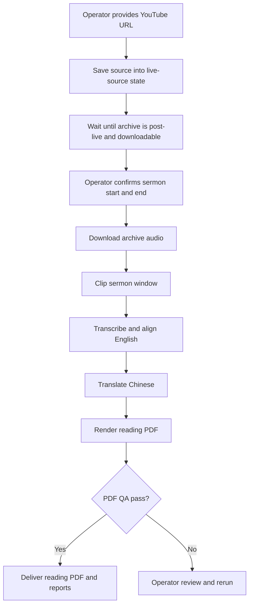

# Sermon Video Chinese Subtitles

<p>
  <a href="./README.zh.md">
    
  </a>
  <a href="./LICENSE">
    
  </a>
</p>

This repository's current primary workflow is a stable post-live operator flow:

1. save a sermon video URL into resumable state
2. manually confirm the sermon start and end time
3. run the subtitle pipeline
4. generate a Chinese-English reading PDF
5. treat the run as complete only after PDF QA passes

The frontend and backend paths already work, but they are not the main workflow described in this root README today.

## Disclaimer

This is an independent personal open-source project. It is not affiliated with, endorsed by, sponsored by, approved by, or operated by Mariners Church.

The project uses publicly accessible Mariners Church live streams, live archives, and public video metadata as source material for transcription, translation, subtitle timing, and technical feasibility research. It does not use private Mariners Church systems, private media, YouTube Studio access, internal files, or any non-public channel permissions.

The project does not bypass paywalls, access controls, DRM, platform restrictions, or copyright protections. Operators are responsible for using the tools only with public or otherwise authorized audio/video sources and for respecting Mariners Church, YouTube, and other applicable terms and rights.

## Stable Workflow

The current stable workflow is documented in detail here:

- [Stable post-live reading PDF workflow](docs/stable-post-live-reading-pdf-workflow.md)
- [稳定的 post-live 阅读版 PDF 工作流](docs/stable-post-live-reading-pdf-workflow.zh.md)

### Flowchart



### Primary commands

Save the manual source URL:

```bash
python3 scripts/live_source_monitor.py \
  --sunday 2026-07-26 \
  --manual-url 'https://www.youtube.com/watch?v=VIDEO_ID' \
  --out artifacts/live-source-monitor/report.json \
  --state-file artifacts/live-source-monitor/state.json
```

Run the stable post-live generation path after the sermon window is manually confirmed:

```bash
python3 scripts/run_post_live_subtitle_generation.py \
  --sunday 2026-07-26 \
  --state-file artifacts/live-source-monitor/state.json \
  --work-root artifacts/post-live-runs \
  --out artifacts/post-live-subtitle-generation/report.json \
  --slug mariners_VIDEO_ID \
  --start-time 00:29:35 \
  --end-time 01:00:55
```

Before the second command, make sure `OPENAI_API_KEY` is already available in the shell, or use `--api-key-secret`.

### Completion rule

Do not call the run complete just because ASR or subtitle files exist. The stable completion condition is:

- source URL saved into state
- sermon start and end manually confirmed
- `sermon_zh_en_reading.pdf` generated
- `sermon_zh_en_reading.qa.json` reports pass
- run report and run status written

## Main outputs

The primary operator outputs for this workflow are:

- `sermon_zh_relative.srt`
- `sermon_en_relative.srt`
- `sermon_zh_mobile.pdf`
- `sermon_zh_en_reading.pdf`
- `sermon_zh_mobile.qa.json`
- `sermon_zh_en_reading.qa.json`
- `summary.json`
- `run-status.json`

## Working but Secondary

These paths already work, but they are not the primary repo entrypoint:

- [backend/README.md](backend/README.md): backend worker and Cloud Run orchestration
- [web/README.md](web/README.md): frontend/admin and playback prototype

They should be documented as supporting paths around the stable post-live reading-PDF workflow, not as the main workflow itself.

## Background

The longer-term product goal remains improving the 11:30 PT congregation listening experience for Chinese-speaking attendees. The current stable workflow is the most reliable operator path for preserving a source, confirming the sermon window, and producing a bilingual reading PDF after the service.

## Documentation

| Area | English | Chinese |
|---|---|---|
| Stable workflow | [docs/stable-post-live-reading-pdf-workflow.md](docs/stable-post-live-reading-pdf-workflow.md) | [docs/stable-post-live-reading-pdf-workflow.zh.md](docs/stable-post-live-reading-pdf-workflow.zh.md) |
| Documentation index | [docs/README.md](docs/README.md) | [docs/README.zh.md](docs/README.zh.md) |
| System design | [docs/system-design.md](docs/system-design.md) | [docs/system-design.zh.md](docs/system-design.zh.md) |
| System design gap analysis | [docs/system-design-gap-analysis.md](docs/system-design-gap-analysis.md) | [docs/system-design-gap-analysis.zh.md](docs/system-design-gap-analysis.zh.md) |
| Findings report | [docs/findings-report.md](docs/findings-report.md) | [docs/findings-report.zh.md](docs/findings-report.zh.md) |
| Model/provider comparison | [docs/model-provider-comparison.md](docs/model-provider-comparison.md) | [docs/model-provider-comparison.zh.md](docs/model-provider-comparison.zh.md) |
| Cloud Run deployment prep | [docs/cloud-run-deployment-prep.md](docs/cloud-run-deployment-prep.md) | [docs/cloud-run-deployment-prep.zh.md](docs/cloud-run-deployment-prep.zh.md) |
| Admin workflow | [docs/admin-workflow.md](docs/admin-workflow.md) | [docs/admin-workflow.zh.md](docs/admin-workflow.zh.md) |
| Post-live reviewed Sunday publication | [Chinese runbook](docs/post-live-reviewed-sunday-publication.zh.md) | [same Chinese runbook](docs/post-live-reviewed-sunday-publication.zh.md) |
| Scripture source | [docs/scripture-source.md](docs/scripture-source.md) | [docs/scripture-source.zh.md](docs/scripture-source.zh.md) |
| Observability and logs | [docs/observability.md](docs/observability.md) | [docs/observability.zh.md](docs/observability.zh.md) |
| Open-source readiness | [docs/open-source-readiness.md](docs/open-source-readiness.md) | [docs/open-source-readiness.zh.md](docs/open-source-readiness.zh.md) |
| Sunday live test runbook | [docs/sunday-live-test-runbook.md](docs/sunday-live-test-runbook.md) | [docs/sunday-live-test-runbook.zh.md](docs/sunday-live-test-runbook.zh.md) |
| YouTube source analysis | [bilingual report](docs/youtube-sermon-subtitle-pipeline-analysis.zh-en.md) | [same bilingual report](docs/youtube-sermon-subtitle-pipeline-analysis.zh-en.md) |
| Offline live-archive timing feasibility | [Chinese report](docs/offline-live-archive-timing-feasibility.zh.md) | [same Chinese report](docs/offline-live-archive-timing-feasibility.zh.md) |
| Backlog and review | [docs/backlog.md](docs/backlog.md), [docs/review-testing.md](docs/review-testing.md) | [docs/backlog.zh.md](docs/backlog.zh.md) |

## Prerequisites

For the stable local workflow:

- Python 3.10 or newer
- `yt-dlp` available on `PATH`
- network access to the public source URLs used in the run
- `OPENAI_API_KEY` in the shell, or a usable `--api-key-secret`

For GCS / Cloud Run-style artifact publishing:

- Google Cloud SDK `gcloud` installed and authenticated
- access to the target GCS bucket
- Secret Manager resource names for model/API keys; do not pass raw key material

## Open-Source Hygiene

- Do not commit API keys, cookies, generated transcripts, generated captions, model output JSONL, private media, or service account JSON files.
- Runtime secrets belong in Google Secret Manager. See [Cloud Run deployment prep](docs/cloud-run-deployment-prep.md).
- Generated artifacts belong in GCS or ignored local `artifacts/`.
- Respect platform permissions, copyright, and terms of service. This project does not bypass access controls or DRM.
- Before making the repository public, run the [open-source readiness checklist](docs/open-source-readiness.md).

## Contributing

See [CONTRIBUTING.md](CONTRIBUTING.md), [CONTRIBUTING.zh.md](CONTRIBUTING.zh.md), [SECURITY.md](SECURITY.md), and [SECURITY.zh.md](SECURITY.zh.md).

## License

MIT. See [LICENSE](LICENSE).
