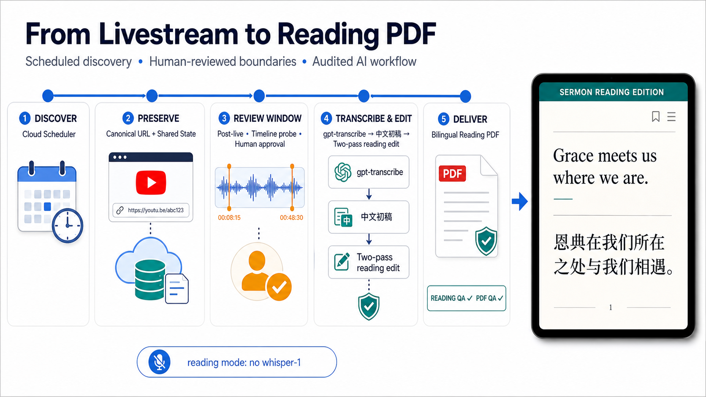
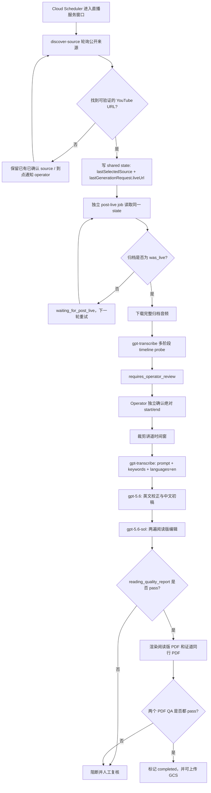

# 证道视频中文字幕

<p>
  <a href="./README.md">
    
  </a>
  <a href="./LICENSE">
    
  </a>
</p>

这个仓库当前的生产主流程，是一条由 `Sermon Production Supervisor` Agent 监管的 post-live 流程。GCP 只负责轻量找源、GCS 持久状态和网页发布；Codex 本地定时任务负责下载、时间轴、转写、阅读编辑和 PDF 生产。Agent 读取持久状态并安全推进；在人工确认证道边界后，流程统一生成两个核心 PDF：中英阅读版 PDF 和中文证道同行 PDF：

1. 定时器在配置的直播窗口内轮询公开的 Mariners / YouTube 来源
2. 找到 canonical YouTube watch URL 后，保存到可恢复的 shared state
3. 独立的 post-live 任务等待直播归档变成 `was_live`
4. 下载完整音频并生成讲道开始/结束的机器建议
5. operator 独立观看录像，确认完整媒体中的绝对开始和结束时间
6. `gpt-transcribe` 使用 prompt、keywords 和 `languages=["en"]` 生成英文参考稿
7. 生成中文初稿，再完成两遍阅读版编辑
8. 渲染中英阅读版 PDF，并生成只包含证道摘要、脉络、明确经文和可追溯讲道摘录（中文译文）的证道同行 PDF
9. 阅读稿 QA 和两个 PDF 的 QA 都通过后，才把运行标记为完成

当前生产核心交付物统一为 `sermon_zh_en_reading.pdf` 和 `sermon_companion_zh.pdf`。证道同行不包含讨论题、反思题、祷告或应用任务。默认 `reading` 模式不依赖 `whisper-1`；只有需要同步 SRT/VTT 时，才显式切换到字幕模式。

Agent 架构、shadow/execute 模式、人工审批文件和 Scheduler 接入见：

- [证道阅读版生产 Supervisor Agent](docs/sermon-production-supervisor-agent.zh.md)
- [Sermon Reading-PDF Production Supervisor Agent](docs/sermon-production-supervisor-agent.md)
- [Codex 本地周末生产 runbook](docs/codex-local-production-runbook.zh.md)

## 一页流程总览



这张图概括了当前生产路径：定时找源、保存 shared state、人工确认证道时间窗、`gpt-transcribe` 与两遍阅读编辑、双重 QA，以及最终的中英阅读版 PDF。

## 免责声明

这是一个独立的个人开源项目，不属于 Mariners Church 官方项目，也没有获得 Mariners Church 的隶属、背书、赞助、批准或运营支持。

本项目只基于公开可访问的 Mariners Church 直播、直播归档和公开视频 metadata，进行英文听写、中文翻译、字幕时间轴处理和技术可行性研究。本项目不使用 Mariners Church 私有系统、私有媒体、YouTube Studio 权限、内部文件或任何非公开频道权限。

本项目不绕过付费墙、访问控制、DRM、平台限制或版权保护。使用者应只在公开或已授权的音视频来源上运行这些工具，并自行遵守 Mariners Church、YouTube 以及其他适用的平台条款和权利边界。

## 端到端生产流程

当前稳定主流程的详细文档：

- [稳定的 post-live 阅读版 PDF 工作流](docs/stable-post-live-reading-pdf-workflow.zh.md)
- [Stable post-live reading PDF workflow](docs/stable-post-live-reading-pdf-workflow.md)
- [证道阅读版生产 Supervisor Agent](docs/sermon-production-supervisor-agent.zh.md)
- [生产环境 `gpt-transcribe` 与阅读版 PDF 审核](docs/gpt-transcribe-reading-pdf-production-audit-2026-07-31.zh.md)

### 流程图



### 1. 定时器发现并保存直播链接

找源和生成是两个独立任务。`discover-source` 应保持轻量：只检查公开页面和 metadata、选择 source、写 state、发送去重通知，不在请求内执行长时间的转录或 PDF 生成。

生产部署文档当前定义的轮询窗口是：

| 窗口 | Scheduler cadence | Sunday route | 作用 |
|---|---|---|---|
| 周六 4:00 service | `*/5 16 * * SAT` | `upcoming` | 每 5 分钟寻找 `sat400` 直播 |
| 周六 5:30 service | `30-59/5 17 * * SAT` | `upcoming` | 每 5 分钟寻找 `sat530` 直播 |
| 周日 8:30 fallback | `*/2 7-9 * * SUN` | `current` | 周六未抓到时继续兜底 |
| 周日 10:00 fallback | `*/2 9-10 * * SUN` | `current` | 独立保留第二场兜底 |

Scheduler 调用：

```text
POST /api/admin/sundays/{upcoming|current}/discover-source
```

生产 shared state 由 `LIVE_SOURCE_MONITOR_STATE_URI` 指向持久化对象，通常是 GCS 上的 `backend-state.json`。后续任务主要读取：

- `lastSelectedSource`：已经验证和选择的 source
- `lastGenerationRequest.liveUrl`：后续下载使用的 canonical URL
- `lastSunday`：防止把错误日期的 source 用到本周运行

后续轮询即使只得到 fallback，也不能清空同一个 Sunday 已确认的 URL。找源失败或超过 operator alert 时间时，通知会去重，避免定时器每轮重复报警。

本地开发时可以使用：

```text
artifacts/live-source-monitor/state.json
```

### 2. 等待直播结束并生成时间轴建议

独立的 timeline-probe 定时任务读取同一个 state。生产 runbook 当前使用周六晚间每 10 分钟检查一次：

```text
sermon-post-live-timeline-probe  */10 18-23 * * SAT
POST /api/admin/sundays/upcoming/post-live-subtitles
payload.mode = timeline-probe
```

如果 archive 还不是 `was_live`，任务返回 `waiting_for_post_live`，下一轮继续检查，不启动模型。archive 可下载后，timeline job 会：

1. 下载完整直播音频
2. 先做 120 秒粗粒度扫描
3. 再做 30 秒 transition 扫描
4. 在开始和结束附近做 5 秒精查
5. 写出 `suggestedWindow`
6. 停在 `requires_operator_review`

机器建议只用于缩小人工检查范围，不能直接成为最终剪裁边界。operator 必须独立观看完整录像，并确认 `start-time` / `end-time` 是完整媒体中的绝对偏移。

云端下载授权失败时，状态进入 `waiting_for_download_access`。完成本地授权下载和 GCS handoff 后，云任务可以从已有阶段继续，不需要重新找源或重做时间轴。

### 3. 生成两个核心 PDF

operator 确认边界后，再触发 `mode=generate-reviewed`，或在本地运行同一条稳定的 reviewed generation：

```bash
python3 scripts/run_post_live_subtitle_generation.py \
  --sunday 2026-07-26 \
  --state-file artifacts/live-source-monitor/state.json \
  --work-root artifacts/post-live-runs \
  --out artifacts/post-live-subtitle-generation/report.json \
  --slug mariners_VIDEO_ID \
  --start-time 00:29:35 \
  --end-time 01:00:55 \
  --output-mode reading \
  --reference-model gpt-transcribe
```

这一步会复用已经下载的音频和已完成的核心产物，并依次执行：

1. 按人工确认的绝对时间裁剪讲道
2. 用 `gpt-transcribe` 生成英文参考稿
3. 把上下文 prompt、词汇表 keywords 和 `languages=["en"]` 写入可审核 metadata
4. 用 `gpt-5.6` 做英文校正和中文初稿
5. 用 `gpt-5.6-sol`、`high` reasoning 完成两遍阅读版编辑
6. 检查 `reading-edition-v2/reading_quality_report.json`
7. 渲染 `sermon_zh_en_reading.pdf`
8. 基于证道摘要、脉络、明确经文和逐段可追溯的讲道摘录（中文译文），生成 `sermon_companion_zh.pdf`
9. 校验两个 PDF，并在同行内容出现 discussion/application 字段时阻断
10. QA 全部通过后更新 `run-status.json` 为完成，并按配置上传 GCS

执行前，shell 环境必须已有 `OPENAI_API_KEY`，或者显式传入 Secret Manager resource name：`--api-key-secret`。不要把 raw key 写入命令、日志或仓库。

### 人工 URL 兜底

定时发现是主路径。只有定时器无法找到正确 source，或 operator 需要纠正错误选择时，才手工保存 canonical URL：

```bash
python3 scripts/live_source_monitor.py \
  --sunday 2026-07-26 \
  --manual-url 'https://www.youtube.com/watch?v=VIDEO_ID' \
  --out artifacts/live-source-monitor/report.json \
  --state-file artifacts/live-source-monitor/state.json
```

手工写入后，后续 post-live、timeline、阅读稿和 PDF 流程保持不变。

### 完成标准

不能因为定时器找到了链接、下载了音频或已经有部分 ASR，就把任务算作完成。当前稳定完成条件是：

- source URL 已保存进 shared state，且 Sunday 匹配
- archive 已确认进入 post-live
- 证道开始和结束时间已人工确认
- `reading-edition-v2/reading_quality_report.json` 报告为 pass
- `sermon_zh_en_reading.pdf` 已生成
- `sermon_zh_en_reading.qa.json` 报告为 pass
- `sermon_companion_zh.pdf` 已生成
- `sermon_companion_zh.qa.json` 报告为 pass
- `summary.json`、run report 和 `run-status.json` 已写出
- 运行最终状态是 `completed`

### 自动化与人工边界

| 阶段 | 自动执行 | 必须人工确认 |
|---|---|---|
| 找源 | 定时轮询、URL 验证、state 保存、去重通知 | 候选冲突或错误 source 时纠正 |
| Post-live | 检查 `was_live`、下载、失败后重试/交接 | 下载权限无法自动恢复时处理授权 |
| 时间轴 | 多阶段探测并给出 `suggestedWindow` | 独立确认证道绝对开始和结束 |
| 内容生成 | ASR、英文校正、中文初稿、两遍阅读编辑 | QA 阻断或内容异常时复核 |
| PDF | 渲染和逐页机器 QA | 最终交付/发布前抽查和批准 |

## 主要产物

这条主流程的主要 operator 输出包括：

- `asr_reference.json` 或 `asr_reference_chunks.json`
- `segments_timed_en_corrected.json`
- `segments_timed_zh.json`
- `sermon_zh_en_reading.pdf`
- `sermon_zh_en_reading.qa.json`
- `sermon_companion_zh.pdf`
- `sermon_companion_zh.qa.json`
- `sermon-companion/insights/openai-notes.json`
- `reading-edition-v2/reading_quality_report.json`
- `summary.json`
- `run-status.json`

默认 `reading` 模式不调用 `whisper-1`，内部时间仅用于组织阅读段落，不是可发布的字幕时间轴。只有明确运行 `--output-mode subtitles` 时，才会启用 `whisper-1` 生成同步 SRT/VTT。

## 已 working 但属于次要路径

下面这些路径已经 working，但它们不是当前 repo 首页的主入口：

- [backend/README.md](backend/README.md)：backend worker 和 Cloud Run orchestration
- [web/README.md](web/README.md)：frontend/admin 和播放原型

当前应把它们作为稳定 post-live 阅读版 PDF 工作流周边的支持路径来写，而不是作为主流程本身。

## 背景

更长期的产品目标，仍然是改善 11:30 PT 中文会众现场听道体验。只是就今天这个 repo 的可稳定交付路径来说，最可靠的主流程是：保住 source、人工确认时间窗、生成双语阅读版 PDF。

## 文档

| 主题 | English | 中文 |
|---|---|---|
| 稳定主流程 | [docs/stable-post-live-reading-pdf-workflow.md](docs/stable-post-live-reading-pdf-workflow.md) | [docs/stable-post-live-reading-pdf-workflow.zh.md](docs/stable-post-live-reading-pdf-workflow.zh.md) |
| Production Supervisor Agent | [docs/sermon-production-supervisor-agent.md](docs/sermon-production-supervisor-agent.md) | [docs/sermon-production-supervisor-agent.zh.md](docs/sermon-production-supervisor-agent.zh.md) |
| 文档索引 | [docs/README.md](docs/README.md) | [docs/README.zh.md](docs/README.zh.md) |
| System Design | [docs/system-design.md](docs/system-design.md) | [docs/system-design.zh.md](docs/system-design.zh.md) |
| System Design 实现差距审计 | [docs/system-design-gap-analysis.md](docs/system-design-gap-analysis.md) | [docs/system-design-gap-analysis.zh.md](docs/system-design-gap-analysis.zh.md) |
| Findings Report | [docs/findings-report.md](docs/findings-report.md) | [docs/findings-report.zh.md](docs/findings-report.zh.md) |
| 模型/Provider 比较 | [docs/model-provider-comparison.md](docs/model-provider-comparison.md) | [docs/model-provider-comparison.zh.md](docs/model-provider-comparison.zh.md) |
| Cloud Run 部署准备 | [docs/cloud-run-deployment-prep.md](docs/cloud-run-deployment-prep.md) | [docs/cloud-run-deployment-prep.zh.md](docs/cloud-run-deployment-prep.zh.md) |
| Admin 工作流 | [docs/admin-workflow.md](docs/admin-workflow.md) | [docs/admin-workflow.zh.md](docs/admin-workflow.zh.md) |
| Post-live reviewed Sunday 发布路径 | [中文 runbook](docs/post-live-reviewed-sunday-publication.zh.md) | [同一份中文 runbook](docs/post-live-reviewed-sunday-publication.zh.md) |
| 中文圣经来源 | [docs/scripture-source.md](docs/scripture-source.md) | [docs/scripture-source.zh.md](docs/scripture-source.zh.md) |
| 观测与日志 | [docs/observability.md](docs/observability.md) | [docs/observability.zh.md](docs/observability.zh.md) |
| 开源准备检查 | [docs/open-source-readiness.md](docs/open-source-readiness.md) | [docs/open-source-readiness.zh.md](docs/open-source-readiness.zh.md) |
| 周日 live test runbook | [docs/sunday-live-test-runbook.md](docs/sunday-live-test-runbook.md) | [docs/sunday-live-test-runbook.zh.md](docs/sunday-live-test-runbook.zh.md) |
| YouTube source analysis | [中英文报告](docs/youtube-sermon-subtitle-pipeline-analysis.zh-en.md) | [同一份中英文报告](docs/youtube-sermon-subtitle-pipeline-analysis.zh-en.md) |
| 离线直播链接时间可行性 | [中文报告](docs/offline-live-archive-timing-feasibility.zh.md) | [同一份中文报告](docs/offline-live-archive-timing-feasibility.zh.md) |
| Backlog / Review | [docs/backlog.md](docs/backlog.md), [docs/review-testing.md](docs/review-testing.md) | [docs/backlog.zh.md](docs/backlog.zh.md) |

## 运行前提

对这条稳定本地主流程来说，需要：

- Python 3.10 或更新版本
- `yt-dlp` 已安装并可从 `PATH` 调用
- 能访问本次运行所需的公开视频源 URL
- shell 环境里已有 `OPENAI_API_KEY`，或者使用可用的 `--api-key-secret`

如果要做 GCS / Cloud Run 风格的 artifact 发布，还需要：

- Google Cloud SDK `gcloud` 已安装并完成认证
- 对目标 GCS bucket 有访问权限
- 使用 Secret Manager resource name 配置模型/API key，不传 raw key

## 开源安全边界

- 不提交 API key、cookies、生成转写、生成字幕、模型输出 JSONL、私有媒体或 service account JSON。
- 运行时 secret 进入 Google Secret Manager，详见 [Cloud Run 部署准备](docs/cloud-run-deployment-prep.zh.md)。
- 生成物进入 GCS 或本地忽略目录 `artifacts/`。
- 尊重平台权限、版权和服务条款。本项目不绕过访问控制或 DRM。
- repo 改成 public 前，先跑 [开源准备检查](docs/open-source-readiness.zh.md)。

## 贡献

见 [CONTRIBUTING.zh.md](CONTRIBUTING.zh.md)、[CONTRIBUTING.md](CONTRIBUTING.md)、[SECURITY.zh.md](SECURITY.zh.md) 和 [SECURITY.md](SECURITY.md)。

## License

MIT，见 [LICENSE](LICENSE)。
