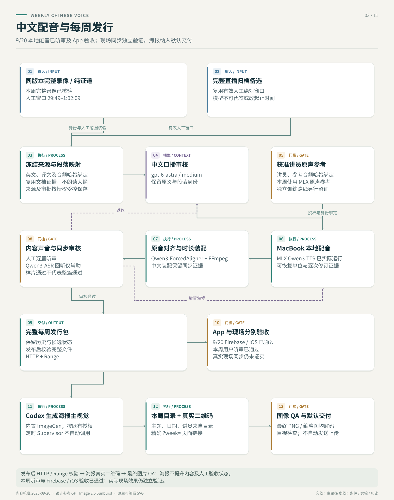

# 证道视频中文字幕

  
  

帮助中文会众听懂英文证道。当前优先展示**周六预制、周日按同一视频时间轴播放的中文配音**：复用已审英文和中文，采用经授权训练的讲员音色，交付 MP3、随声字幕与证道同行大纲。双 PDF 生产和本地实时字幕继续作为独立工作流保留。

> **现状校准：2026-09-05。** 配音已完成整篇同步候选与线上试播；同版本纯证道视频接入、定时配音接线和真实场地验收仍有明确缺口。代码、模型审核、候选发布与人工/现场验收分别留证。每周完整媒体、音频和 PDF 保存在 Git 之外。

> 这是一个独立的个人开源项目，不属于 Mariners Church 官方项目，也没有获得其隶属、背书、赞助、批准或运营支持。只应处理公开或已获授权的媒体，不得绕过访问控制、DRM 或平台限制。

## 1. 优先展示：英文证道视频 → 讲员音色中文配音

[打开中文听译 App](https://ai-for-god-sermon-audio.web.app) · [系统设计与模型选择](docs/sermon-dubbing-system-design.zh.md) · [操作 Runbook](experiments/sermon-dubbing-poc/SATURDAY_AUDIO_RUNBOOK.zh.md) · [本次实测报告](docs/sermon-dubbing-astra-review-2026-09-05.zh.md)

**两路来源并行。** 主路等待周日实际播放的同版本纯证道视频；明确文件身份与纯证道范围后，未来可按整片处理。当前直播归档保留为 fallback，复用已确认的证道起止时间及双 PDF QA。主路未到，不阻挡归档流程；直播归档不自动视为周日同版本视频。

| 阶段 | 当前实现 |
|---|---|
| 视频英文转写 | `gpt-transcribe`；已有可信英文可复用，疑难原声单独复查 |
| 中文口播修订与审核 | 本对话 `gpt-6-astra`；完整语义、否定、经文、专名及引文边界分别核对 |
| 讲员音色 | Spark 上按讲员独立训练的 Qwen3-TTS 1.7B Base；每周复用检查点 |
| 语音检查与时间定位 | 本地 Qwen3-ASR 回转写、ForcedAligner 声学定位；自然语音时长逐段核验 |
| 试听交付 | 独立 Firebase App；按周选择、MP3 下载、字幕、大纲、时间跳转与微调 |

**已验证的候选：** 8 月 30 日证道完成 55 段审阅、18 段口播修订，输出 **29:30 / 118 个语音单元**的同步候选。55 段时槽检查通过，逐块波形核验没有截句、叠音或变速；末句有单独审核的 0.80 秒提前播放，原英文锚点保留。线上文件哈希、下载 Range、播放、跳转及字幕已验证，旧试听样片继续保留。

**当前边界：** 3 处专名发音疑点及 2 处轻微口语/ASR 差异留在试听清单。配音桥接器已验证，定时任务的应用更新未确认；同版本视频接入器、整篇人工听感与真实场地播放尚未验收。播放器的“同步试播”表示与冻结来源时间轴对齐，不表示已自动跟随另一台现场播放器。

## 为什么保留双 PDF 与实时字幕

周日现场目前没有可靠的中文字幕。通用实时语音翻译可以生成初稿，但对经文出处、圣经人名、逐字引用和教会特定术语的处理不够稳定；分段抖动和端到端延迟也会让本来正确的文字难以在现场阅读。

当周日是重新现场讲述而不是播放同一个视频时，不能直接套用预制配音。此前的实时字幕设想，是提取并翻译周六公开直播中的证道，再把内容用于周日。实测发现了一个关键边界：周六和周日可能共享同一篇信息的框架，但不能假定两次讲述逐字一致；措辞、顺序、例子和现场新增内容都可能变化。因此，周六转写适合做准备资料，却不能成为周日字幕的事实来源。

当前架构支持可选的受控混合方案，已测周日默认仍为 `contextPolicy=none`：周日现场音频及由它识别出的当下英文始终具有最高优先级；公开或已获授权的周六材料，只提供受控的结构、术语、经文出处和经过审核的例句。领域后训练继续独立评估，v4.1 候选已可在本机试用。质量和延迟改善必须通过冻结评估证明；完成接入不代表候选已获准升级。

## 2. 其他独立工作流

### A. 周六：从直播/归档生成两个经过审核的 PDF

周六工作流负责发现或接收公开直播链接、保存完整 post-live 媒体、由 operator 确认证道时间窗、生成英文转写与中文阅读稿，最后在周日前形成两个 canonical 交付物：

1. `sermon_zh_en_reading.pdf`：中英翻译稿 / 阅读版。
2. `sermon_interpretation_zh.pdf`：中文“证道同行”/证道大纲，只保留与证道直接相关的辅助信息。

<table>
  <tr>
    <th>中英对照阅读版</th>
    <th>中文证道同行</th>
  </tr>
  <tr>
    <td></td>
    <td></td>
  </tr>
</table>

_图片来自 2026-08-30 真实运行的第一页；两份 PDF 各自的 QA 都为 `pass`，完整运行产物仍保持在 Git 之外。来源和校验信息见[示例 provenance](docs/assets/pdf-examples/README.md)。_

每周 Supervisor 使用 Astra Medium 完成翻译、两轮阅读稿审核和证道同行，并在 PDF QA 后启用 Context Pack 导出。同篇身份初始为 `unknown`；自动导出不等于人工批准。

这是当前更成熟的 post-live 路径。只有 source、人工批准的时间窗、阅读稿 QA、两个 PDF 以及两个 PDF QA 都存在并通过，才算完成。

关键文档：

- [稳定的 post-live 阅读版 PDF 工作流](docs/stable-post-live-reading-pdf-workflow.zh.md)
- [Codex 本地周末生产 runbook](docs/codex-local-production-runbook.zh.md)
- [证道生产 Supervisor Agent](docs/sermon-production-supervisor-agent.zh.md)

### B. 周日：从本地麦克风生成实时中文字幕

周日工作流在 MacBook 本地运行：浏览器麦克风采集、录音和事件持久化、本地英文 ASR、MiLMMT 英译中，以及单页大字号中文字幕。

当前默认实现采用独立 MediaRecorder 恢复录音、16 kHz PCM WebSocket、Qwen3-ASR/MLX 与 Ollama 上的 MiLMMT Q8。不可变英文 final 先经过孤立虚词门控，再即时翻译；`readable_chunks` 保留前一句完整双语字幕。Firebase Hosting/Realtime Database 提供公网只读观看，LAN/SSE 作为独立退路。Gateway 重启可恢复同一 session、录音及观看身份，但字幕缺口会明确记录。

合并版本完成了 **60 分钟浏览器 WAV 回放**（20 分钟唯一音频循环三轮）：**1,287 个 ASR final → 1,287 次翻译 → 1,287 条操作页可读显示**。可读首显 P95 从音频段结束计算为 **1.776 秒**，从段开始计算为 **4.763 秒**。这是链路交付证据，不是翻译准确率、物理麦克风/手机或现场验收。详见[当前验收报告](experiments/local-live-poc/benchmarks/SUNDAY_READINESS_20260904.zh.md)。

**v4.1 可选试用：** 先用 [Sunday Live Captions.command](experiments/local-live-poc/Sunday%20Live%20Captions.command) 启动 POC，再于录音前选择 **v4.1 Q5 · 实验候选**。本机已有冻结模型包时，可从网页启动独立 MLX 服务。该候选尚未通过神学质量门，实验会话仅在本机显示与保存，LAN/Firebase 分享关闭。详见[安装条件、操作与恢复说明](experiments/local-live-poc/MILMMT_V41_LOCAL.zh.md)。

关键文档：

- [周六/周日完整工作流与延迟预算](docs/workflows/README.zh.md)
- [本地实时字幕 POC](experiments/local-live-poc/README.md)
- [本地实时字幕设计](experiments/local-live-poc/DESIGN.zh.md)

## 3. Discovery、缺口与下一步

[同行 iOS 原生客户端](apps/tongxing-ios/README.zh.md)正在独立分支开发，复用已发布目录、音频和字幕，验证离线收听与系统音频控制。开发构建不代表真机、现场或 App Store 验收。

### 已经证明的能力

| 方向 | 当前证据 |
|---|---|
| 周六 PDF 生产 | 工作流代码、测试、带日期的 QA 证据、人工确认证道时间窗和可恢复状态；生成 PDF 保持本地且被忽略 |
| 周日 live POC | 真实模型浏览器 WAV 回放、可读显示回执、恢复录音校验、手机视口与重连检查；现场门槛未闭合 |
| 周六到周日 context | exporter、builder/retriever、readiness、Gateway capability 上限已实现；Supervisor 在 PDF QA 后导出，同篇身份初始为 `unknown` |
| Replay 与 A/B | 冻结输入和 hash；真实 3 秒/6 秒 ASR 与有界翻译单位比较；候选均未升级默认 |
| v4.1 后训练接入 | POC 可选 Q5/MLX；45 秒原声文件回放得到 17 条英文和 17 条中文 final；网页录音及保存另行验证；质量门仍未通过 |
| 运行维护 | 一键启动/停止、运行身份、当前连接 drain、同会话恢复、有界公网发布器与 LAN 退路 |

### 正在探索和仍需补齐的门槛

- **周六生产桥接：** Supervisor 在双 PDF QA 后启用 `--export-sunday-context`。导出不代表允许现场注入；同篇确认、hash、有效期和审核状态共同决定 readiness。English-only 仅用于对齐，不改变冻结 A0 prompt。详见[Context Pack 契约](docs/saturday-to-sunday-context-pack-plan.zh.md)。
- **语义忠实度：** 专名、断句、否定、因果和经文关系仍需听音及人工双语校对。ASR Gold 门保持 fail-closed；本机已准备八组诊断听审材料，机器审核不等于 human Gold。
- **分段选择：** 保留 3 秒窗口、`translationUnitPolicy=legacy`、`content_words` 孤立虚词门控和 `contextPolicy=none`。加长窗口及有界语义合并都有改善与退化；后者只作为显式启用的评估代码。
- **故障恢复：** 实际 Gateway 重启测试保住独立录音，但有 1.6 秒 PCM gap、一个未结算在途 ASR 任务，以及 7.234 秒的新字幕更新间隔。恢复不等于字幕无损。
- **现场验收：** 实际麦克风/调音台、非讲话声音、实体手机 Wi-Fi/蜂窝网络和手机真实显示延迟仍需验证。公网标签页重连、横竖屏浏览器检查不能代替这些门槛。
- **资源上限：** 最新回放的 357 个录音窗口样本中 swap 为 0，起始和末尾缺测区间已单列。翻译进程 RSS 从 5,863.719 增至 9,664.609 MiB，最后十分钟仍增长；尚未证明平台或连续多场运行上限。
- **可选增强：** 真实每周 Pack 收益、其他本地 serving 和领域后训练继续独立评估；无 Pack 的 A0 主路径必须保持可用。

### 后训练方案

v4.1 候选已可在本地 POC 中选择；独立运行时保留录音恢复，并将模型身份绑定到每次会话。[接入验证报告](experiments/local-live-poc/benchmarks/MILMMT_V41_POC_INTEGRATION_20260905.zh.md) 分别记录文件回放与安静环境的网页录音检查；本轮没有验证语音翻译在浏览器中的实际显示、真实声学输入或现场可用性。

训练和质量验收继续与操作流程分开推进：

1. 从既有字幕、周六/周日经过审核的译文、术语修订和选定音频证据构建保留 provenance 的平行语料。
2. 按整篇 sermon 固定 train/dev/test，防止 segment 泄漏；只有人工批准的 `Gold` 数据可以进入 promotion 集合。
3. 用强 teacher 生成初译，再做独立双语 review；仅对高风险片段和固定抽样进行音频核验。
4. 对较小 student model 做 SFT/LoRA，并与 MiLMMT A0 比较术语、经文名称、忠实度、幻觉率和延迟。
5. 只有 frozen evaluation gate 通过才允许 promotion。Ollama 模型使用 `LOCAL_LIVE_OLLAMA_MODEL`；v4.1 MLX 实验模型通过独立固定适配器接入，在录音前显式选择。启动成功或代码合并都不改变默认模型。

其他架构、provider 对比、Cloud 实验、历史 realtime prototype 和部署笔记统一放在[文档索引](docs/README.zh.md)，不再挤进项目首页。
