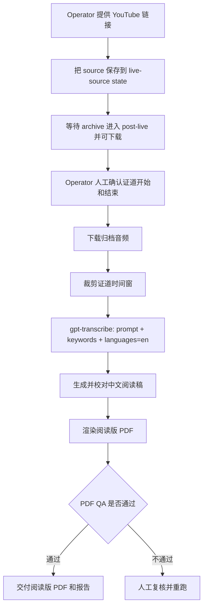

# 证道视频中文字幕

<p>
  <a href="./README.md">
    
  </a>
  <a href="./LICENSE">
    
  </a>
</p>

这个仓库当前最主要的工作流，是一条稳定的 post-live operator 流程：

1. 把证道视频链接保存到可恢复 state
2. 人工确认证道开始和结束时间
3. 用 `gpt-transcribe` 生成英文参考转录
4. 生成中英对照阅读版 PDF
5. 只有 PDF QA 通过后，才算真正完成

前端和后端相关路径现在已经 working，但它们不是当前根 README 里要优先描述的主流程。

## 免责声明

这是一个独立的个人开源项目，不属于 Mariners Church 官方项目，也没有获得 Mariners Church 的隶属、背书、赞助、批准或运营支持。

本项目只基于公开可访问的 Mariners Church 直播、直播归档和公开视频 metadata，进行英文听写、中文翻译、字幕时间轴处理和技术可行性研究。本项目不使用 Mariners Church 私有系统、私有媒体、YouTube Studio 权限、内部文件或任何非公开频道权限。

本项目不绕过付费墙、访问控制、DRM、平台限制或版权保护。使用者应只在公开或已授权的音视频来源上运行这些工具，并自行遵守 Mariners Church、YouTube 以及其他适用的平台条款和权利边界。

## 稳定主流程

当前稳定主流程的详细文档：

- [稳定的 post-live 阅读版 PDF 工作流](docs/stable-post-live-reading-pdf-workflow.zh.md)
- [Stable post-live reading PDF workflow](docs/stable-post-live-reading-pdf-workflow.md)

### 流程图



### 主命令

先保存手工 source URL：

```bash
python3 scripts/live_source_monitor.py \
  --sunday 2026-07-26 \
  --manual-url 'https://www.youtube.com/watch?v=VIDEO_ID' \
  --out artifacts/live-source-monitor/report.json \
  --state-file artifacts/live-source-monitor/state.json
```

然后在人工确认证道时间窗后，运行稳定的 post-live 生成路径：

```bash
python3 scripts/run_post_live_subtitle_generation.py \
  --sunday 2026-07-26 \
  --state-file artifacts/live-source-monitor/state.json \
  --work-root artifacts/post-live-runs \
  --out artifacts/post-live-subtitle-generation/report.json \
  --slug mariners_VIDEO_ID \
  --start-time 00:29:35 \
  --end-time 01:00:55 \
  --output-mode reading \
  --reference-model gpt-transcribe
```

执行第二条命令前，要先保证 shell 环境里已经有 `OPENAI_API_KEY`，或者显式传入 `--api-key-secret`。

### 完成标准

不能因为已经有部分 ASR，就把任务算作完成。当前稳定完成条件是：

- source URL 已保存进 state
- 证道开始和结束时间已人工确认
- `sermon_zh_en_reading.pdf` 已生成
- `sermon_zh_en_reading.qa.json` 报告为 pass
- run report 和 run status 已写出

## 主要产物

这条主流程的主要 operator 输出包括：

- `asr_reference.json` 或 `asr_reference_chunks.json`
- `segments_timed_en_corrected.json`
- `segments_timed_zh.json`
- `sermon_zh_en_reading.pdf`
- `sermon_zh_en_reading.qa.json`
- `reading-edition-v2/reading_quality_report.json`
- `summary.json`
- `run-status.json`

默认 `reading` 模式不调用 `whisper-1`，内部时间仅用于组织阅读段落，不是可发布的字幕时间轴。只有明确运行 `--output-mode subtitles` 时，才会启用 `whisper-1` 生成同步 SRT/VTT。

## 已 working 但属于次要路径

下面这些路径已经 working，但它们不是当前 repo 首页的主入口：

- [backend/README.md](backend/README.md)：backend worker 和 Cloud Run orchestration
- [web/README.md](web/README.md)：frontend/admin 和播放原型

当前应把它们作为稳定 post-live 阅读版 PDF 工作流周边的支持路径来写，而不是作为主流程本身。

## 背景

更长期的产品目标，仍然是改善 11:30 PT 中文会众现场听道体验。只是就今天这个 repo 的可稳定交付路径来说，最可靠的主流程是：保住 source、人工确认时间窗、生成双语阅读版 PDF。

## 文档

| 主题 | English | 中文 |
|---|---|---|
| 稳定主流程 | [docs/stable-post-live-reading-pdf-workflow.md](docs/stable-post-live-reading-pdf-workflow.md) | [docs/stable-post-live-reading-pdf-workflow.zh.md](docs/stable-post-live-reading-pdf-workflow.zh.md) |
| 文档索引 | [docs/README.md](docs/README.md) | [docs/README.zh.md](docs/README.zh.md) |
| System Design | [docs/system-design.md](docs/system-design.md) | [docs/system-design.zh.md](docs/system-design.zh.md) |
| System Design 实现差距审计 | [docs/system-design-gap-analysis.md](docs/system-design-gap-analysis.md) | [docs/system-design-gap-analysis.zh.md](docs/system-design-gap-analysis.zh.md) |
| Findings Report | [docs/findings-report.md](docs/findings-report.md) | [docs/findings-report.zh.md](docs/findings-report.zh.md) |
| 模型/Provider 比较 | [docs/model-provider-comparison.md](docs/model-provider-comparison.md) | [docs/model-provider-comparison.zh.md](docs/model-provider-comparison.zh.md) |
| Cloud Run 部署准备 | [docs/cloud-run-deployment-prep.md](docs/cloud-run-deployment-prep.md) | [docs/cloud-run-deployment-prep.zh.md](docs/cloud-run-deployment-prep.zh.md) |
| Admin 工作流 | [docs/admin-workflow.md](docs/admin-workflow.md) | [docs/admin-workflow.zh.md](docs/admin-workflow.zh.md) |
| Post-live reviewed Sunday 发布路径 | [中文 runbook](docs/post-live-reviewed-sunday-publication.zh.md) | [同一份中文 runbook](docs/post-live-reviewed-sunday-publication.zh.md) |
| 中文圣经来源 | [docs/scripture-source.md](docs/scripture-source.md) | [docs/scripture-source.zh.md](docs/scripture-source.zh.md) |
| 观测与日志 | [docs/observability.md](docs/observability.md) | [docs/observability.zh.md](docs/observability.zh.md) |
| 开源准备检查 | [docs/open-source-readiness.md](docs/open-source-readiness.md) | [docs/open-source-readiness.zh.md](docs/open-source-readiness.zh.md) |
| 周日 live test runbook | [docs/sunday-live-test-runbook.md](docs/sunday-live-test-runbook.md) | [docs/sunday-live-test-runbook.zh.md](docs/sunday-live-test-runbook.zh.md) |
| YouTube source analysis | [中英文报告](docs/youtube-sermon-subtitle-pipeline-analysis.zh-en.md) | [同一份中英文报告](docs/youtube-sermon-subtitle-pipeline-analysis.zh-en.md) |
| 离线直播链接时间可行性 | [中文报告](docs/offline-live-archive-timing-feasibility.zh.md) | [同一份中文报告](docs/offline-live-archive-timing-feasibility.zh.md) |
| Backlog / Review | [docs/backlog.md](docs/backlog.md), [docs/review-testing.md](docs/review-testing.md) | [docs/backlog.zh.md](docs/backlog.zh.md) |

## 运行前提

对这条稳定本地主流程来说，需要：

- Python 3.10 或更新版本
- `yt-dlp` 已安装并可从 `PATH` 调用
- 能访问本次运行所需的公开视频源 URL
- shell 环境里已有 `OPENAI_API_KEY`，或者使用可用的 `--api-key-secret`

如果要做 GCS / Cloud Run 风格的 artifact 发布，还需要：

- Google Cloud SDK `gcloud` 已安装并完成认证
- 对目标 GCS bucket 有访问权限
- 使用 Secret Manager resource name 配置模型/API key，不传 raw key

## 开源安全边界

- 不提交 API key、cookies、生成转写、生成字幕、模型输出 JSONL、私有媒体或 service account JSON。
- 运行时 secret 进入 Google Secret Manager，详见 [Cloud Run 部署准备](docs/cloud-run-deployment-prep.zh.md)。
- 生成物进入 GCS 或本地忽略目录 `artifacts/`。
- 尊重平台权限、版权和服务条款。本项目不绕过访问控制或 DRM。
- repo 改成 public 前，先跑 [开源准备检查](docs/open-source-readiness.zh.md)。

## 贡献

见 [CONTRIBUTING.zh.md](CONTRIBUTING.zh.md)、[CONTRIBUTING.md](CONTRIBUTING.md)、[SECURITY.zh.md](SECURITY.zh.md) 和 [SECURITY.md](SECURITY.md)。

## License

MIT，见 [LICENSE](LICENSE)。
