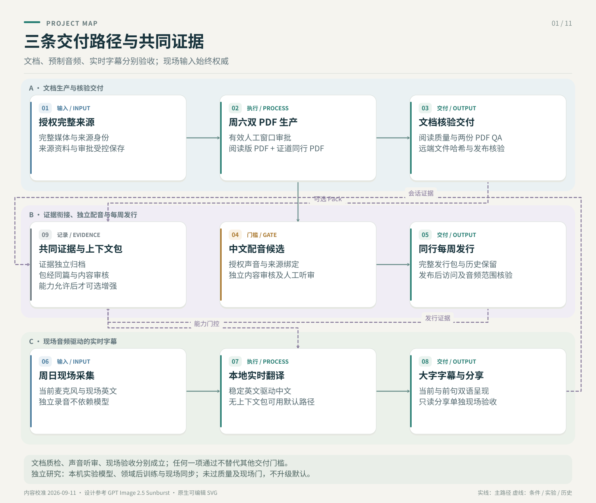
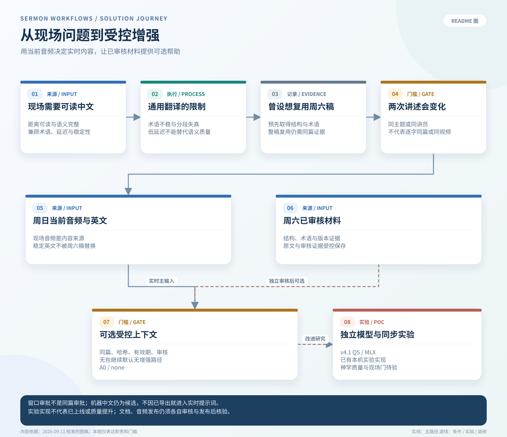
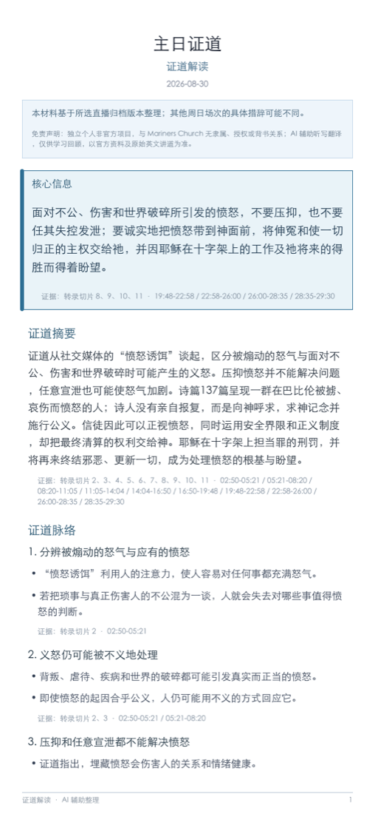
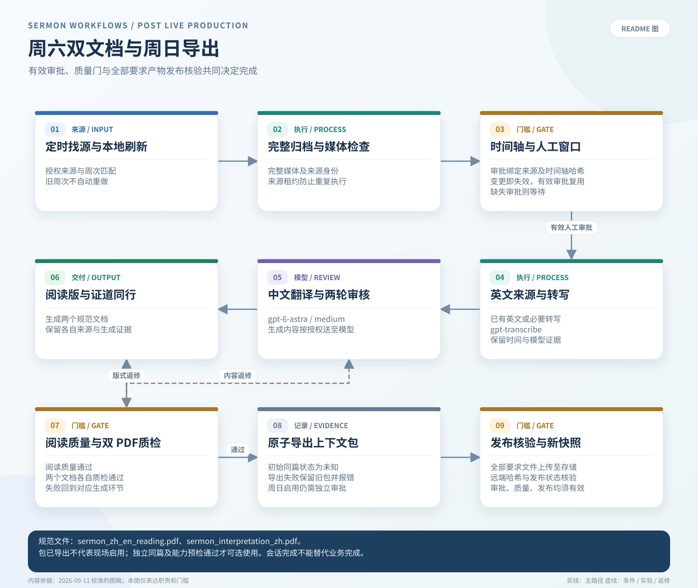
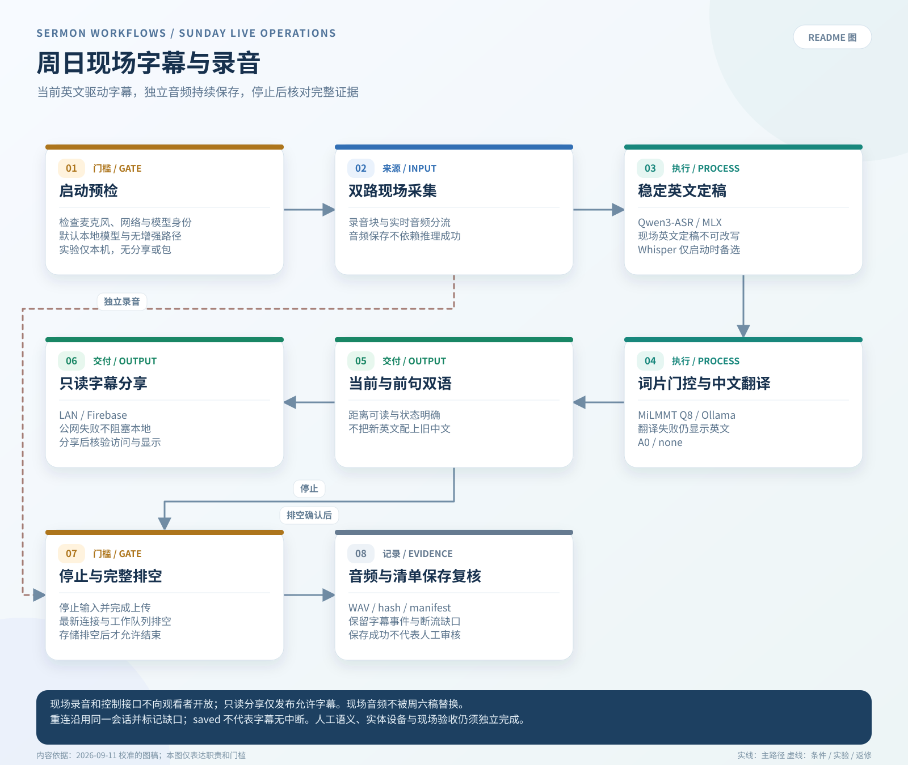
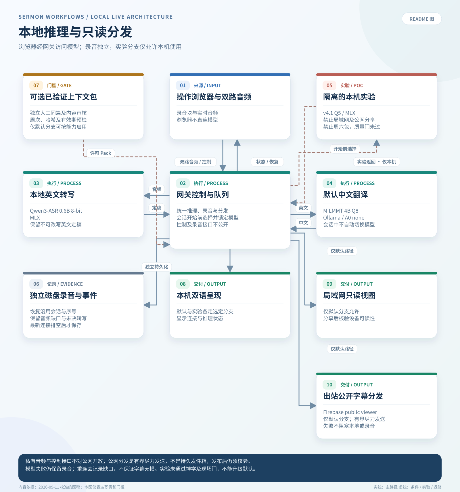

# 证道视频中文字幕

  
  

这个仓库只有一个产品目标：帮助中文会众听懂英文证道。目前真正需要展示的，是两条可以落地的工作流——周六的 post-live PDF 生产，以及周日的本地实时字幕 POC。其他代码都属于这两条路径周边的研究、评估或基础设施。

完整流程图、产物契约、本地延迟预算与测试门槛见：[两条工作流完整说明](docs/workflows/README.zh.md)。

> **现状校准日期：2026-09-04，代码基线 main `beeda82`。** 下文的“当前能力”只依据 `main` 上可复核的代码、测试或已纳入版本控制的报告，不代表本机服务此刻在线，也不代表现场已经验收。每次运行的录音、转写和 PDF 按策略不进入 Git；经过审核且保留 provenance 的 benchmark 衍生数据可以版本化。文中的输出文件名是产物契约，不是仓库内附带的交付文件。

> 这是一个独立的个人开源项目，不属于 Mariners Church 官方项目，也没有获得其隶属、背书、赞助、批准或运营支持。只应处理公开或已获授权的媒体，不得绕过访问控制、DRM 或平台限制。

## 为什么形成现在的架构

周日现场目前没有可靠的中文字幕。通用实时语音翻译可以生成初稿，但对经文出处、圣经人名、逐字引用和教会特定术语的处理不够稳定；分段抖动和端到端延迟也会让本来正确的文字难以在现场阅读。

最初的设想，是提取并翻译周六公开直播中的证道，再把内容用于周日。实测发现了一个关键边界：周六和周日可能共享同一篇信息的框架，但不能假定两次讲述逐字一致；措辞、顺序、例子和现场新增内容都可能变化。因此，周六转写适合做准备资料，却不能成为周日字幕的事实来源。

当前架构支持可选的受控混合方案，已测周日默认仍为 `contextPolicy=none`：周日现场音频及由它识别出的当下英文始终具有最高优先级；公开或已获授权的周六材料，只提供受控的结构、术语、经文出处和经过审核的例句。领域后训练属于独立的后续增强方向，首要目标是提高术语和翻译质量；是否能够降低延迟，必须在相同 frozen 输入和相同硬件上实测，不能预先承诺。

## 1. Working workflows

### A. 周六：从直播/归档生成两个经过审核的 PDF

周六工作流负责发现或接收公开直播链接、保存完整 post-live 媒体、由 operator 确认证道时间窗、生成英文转写与中文阅读稿，最后在周日前形成两个 canonical 交付物：

1. `sermon_zh_en_reading.pdf`：中英翻译稿 / 阅读版。
2. `sermon_interpretation_zh.pdf`：中文“证道同行”/证道大纲，只保留与证道直接相关的辅助信息。

<table>
  <tr>
    <th>中英对照阅读版</th>
    <th>中文证道同行</th>
  </tr>
  <tr>
    <td></td>
    <td></td>
  </tr>
</table>

_图片来自 2026-08-30 真实运行的第一页；两份 PDF 各自的 QA 都为 `pass`，完整运行产物仍保持在 Git 之外。来源和校验信息见[示例 provenance](docs/assets/pdf-examples/README.md)。_

每周 Supervisor 使用 Astra Medium 完成翻译、两轮阅读稿审核和证道同行，并在 PDF QA 后启用 Context Pack 导出。同篇身份初始为 `unknown`；自动导出不等于人工批准。

这是当前更成熟的 post-live 路径。只有 source、人工批准的时间窗、阅读稿 QA、两个 PDF 以及两个 PDF QA 都存在并通过，才算完成。

关键文档：

- [稳定的 post-live 阅读版 PDF 工作流](docs/stable-post-live-reading-pdf-workflow.zh.md)
- [Codex 本地周末生产 runbook](docs/codex-local-production-runbook.zh.md)
- [证道生产 Supervisor Agent](docs/sermon-production-supervisor-agent.zh.md)

### B. 周日：从本地麦克风生成实时中文字幕

周日工作流在 MacBook 本地运行：浏览器麦克风采集、录音和事件持久化、本地英文 ASR、MiLMMT 英译中，以及单页大字号中文字幕。

当前实现采用独立 MediaRecorder 恢复录音、16 kHz PCM WebSocket、Qwen3-ASR/MLX 与 Ollama 上的 MiLMMT Q8。不可变英文 final 先经过孤立虚词门控，再即时翻译；`readable_chunks` 保留前一句完整双语字幕。Firebase Hosting/Realtime Database 提供公网只读观看，LAN/SSE 作为独立退路。Gateway 重启可恢复同一 session、录音及观看身份，但字幕缺口会明确记录。

合并版本完成了 **60 分钟浏览器 WAV 回放**（20 分钟唯一音频循环三轮）：**1,287 个 ASR final → 1,287 次翻译 → 1,287 条操作页可读显示**。可读首显 P95 从音频段结束计算为 **1.776 秒**，从段开始计算为 **4.763 秒**。这是链路交付证据，不是翻译准确率、物理麦克风/手机或现场验收。详见[当前验收报告](experiments/local-live-poc/benchmarks/SUNDAY_READINESS_20260904.zh.md)。

关键文档：

- [周六/周日完整工作流与延迟预算](docs/workflows/README.zh.md)
- [本地实时字幕 POC](experiments/local-live-poc/README.md)
- [本地实时字幕设计](experiments/local-live-poc/DESIGN.zh.md)

## 2. Discovery、缺口与下一步

### 已经证明的能力

| 方向 | 当前证据 |
|---|---|
| 周六 PDF 生产 | 工作流代码、测试、带日期的 QA 证据、人工确认证道时间窗和可恢复状态；生成 PDF 保持本地且被忽略 |
| 周日 live POC | 真实模型浏览器 WAV 回放、可读显示回执、恢复录音校验、手机视口与重连检查；现场门槛未闭合 |
| 周六到周日 context | exporter、builder/retriever、readiness、Gateway capability 上限已实现；Supervisor 在 PDF QA 后导出，同篇身份初始为 `unknown` |
| Replay 与 A/B | 冻结输入和 hash；真实 3 秒/6 秒 ASR 与有界翻译单位比较；候选均未升级默认 |
| 运行维护 | 一键启动/停止、运行身份、当前连接 drain、同会话恢复、有界公网发布器与 LAN 退路 |

### 正在探索和仍需补齐的门槛

- **周六生产桥接：** Supervisor 在双 PDF QA 后启用 `--export-sunday-context`。导出不代表允许现场注入；同篇确认、hash、有效期和审核状态共同决定 readiness。English-only 仅用于对齐，不改变冻结 A0 prompt。详见[Context Pack 契约](docs/saturday-to-sunday-context-pack-plan.zh.md)。
- **语义忠实度：** 专名、断句、否定、因果和经文关系仍需听音及人工双语校对。ASR Gold 门保持 fail-closed；本机已准备八组诊断听审材料，机器审核不等于 human Gold。
- **分段选择：** 保留 3 秒窗口、`translationUnitPolicy=legacy`、`content_words` 孤立虚词门控和 `contextPolicy=none`。加长窗口及有界语义合并都有改善与退化；后者只作为显式启用的评估代码。
- **故障恢复：** 实际 Gateway 重启测试保住独立录音，但有 1.6 秒 PCM gap、一个未结算在途 ASR 任务，以及 7.234 秒的新字幕更新间隔。恢复不等于字幕无损。
- **现场验收：** 实际麦克风/调音台、非讲话声音、实体手机 Wi-Fi/蜂窝网络和手机真实显示延迟仍需验证。公网标签页重连、横竖屏浏览器检查不能代替这些门槛。
- **资源上限：** 最新回放的 357 个录音窗口样本中 swap 为 0，起始和末尾缺测区间已单列。翻译进程 RSS 从 5,863.719 增至 9,664.609 MiB，最后十分钟仍增长；尚未证明平台或连续多场运行上限。
- **可选增强：** 真实每周 Pack 收益、其他本地 serving 和领域后训练继续独立评估；无 Pack 的 A0 主路径必须保持可用。

### 后训练方案

后训练继续作为独立项目，不把训练复杂度放进 live POC：

1. 从既有字幕、周六/周日经过审核的译文、术语修订和选定音频证据构建保留 provenance 的平行语料。
2. 按整篇 sermon 固定 train/dev/test，防止 segment 泄漏；只有人工批准的 `Gold` 数据可以进入 promotion 集合。
3. 用强 teacher 生成初译，再做独立双语 review；仅对高风险片段和固定抽样进行音频核验。
4. 对较小 student model 做 SFT/LoRA，并与 MiLMMT A0 比较术语、经文名称、忠实度、幻觉率和延迟。
5. 只有 frozen evaluation gate 通过才允许 promotion。前端契约保持不变，通过替换 `LOCAL_LIVE_OLLAMA_MODEL` 更换后端模型。

其他架构、provider 对比、Cloud 实验、历史 realtime prototype 和部署笔记统一放在[文档索引](docs/README.zh.md)，不再挤进项目首页。
