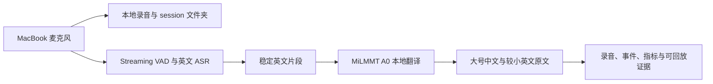

# 证道视频中文字幕

  
  

这个仓库只有一个产品目标：帮助中文会众听懂英文证道。目前真正需要展示的，是两条可以落地的工作流——周六的 post-live PDF 生产，以及周日的本地实时字幕 POC。其他代码都属于这两条路径周边的研究、评估或基础设施。

完整流程图、产物契约、本地延迟预算与测试门槛见：[两条工作流完整说明](docs/workflows/README.zh.md)。

> 这是一个独立的个人开源项目，不属于 Mariners Church 官方项目，也没有获得其隶属、背书、赞助、批准或运营支持。只应处理公开或已获授权的媒体，不得绕过访问控制、DRM 或平台限制。

## 1. Working workflows

### A. 周六：从直播/归档生成两个经过审核的 PDF

周六工作流负责发现或接收公开直播链接、保存完整 post-live 媒体、由 operator 确认证道时间窗、生成英文转写与中文阅读稿，最后在周日前形成两个 canonical 交付物：

1. `sermon_zh_en_reading.pdf`：中英翻译稿 / 阅读版。
2. `sermon_interpretation_zh.pdf`：中文“证道同行”/证道大纲，只保留与证道直接相关的辅助信息。

这是当前更成熟的 post-live 路径。只有 source、人工批准的时间窗、阅读稿 QA、两个 PDF 以及两个 PDF QA 都存在并通过，才算完成。

关键文档：

- [稳定的 post-live 阅读版 PDF 工作流](docs/stable-post-live-reading-pdf-workflow.zh.md)
- [Codex 本地周末生产 runbook](docs/codex-local-production-runbook.zh.md)
- [证道生产 Supervisor Agent](docs/sermon-production-supervisor-agent.zh.md)

### B. 周日：从本地麦克风生成实时中文字幕

周日工作流在 MacBook 本地运行：浏览器麦克风采集、录音和事件持久化、本地英文 ASR、MiLMMT 英译中，以及单页大字号中文字幕。

当前 POC 已实现麦克风选择、真实录音、每次启动自动创建 session 文件夹、事件日志、MiLMMT A0 本地翻译、响应式大字幕和可复现测试证据。由于本地 ASR 尚未接入并完成 benchmark，页面仍使用明确标注的英文回放 fixture，不能把它描述成麦克风转写。

关键文档：

- [周六/周日完整工作流与延迟预算](docs/workflows/README.zh.md)
- [本地实时字幕 POC](experiments/local-live-poc/README.md)
- [本地实时字幕设计](experiments/local-live-poc/DESIGN.zh.md)

## 2. Discovery、缺口与下一步

### 已经证明的能力

| 方向 | 当前证据 |
|---|---|
| 周六 PDF 生产 | 两个 canonical PDF、阅读稿 QA、PDF QA、人工确认证道时间窗、可恢复状态 |
| 周日 live POC | 真实麦克风录音、本地 session 产物、MiLMMT A0 翻译、大字号响应式 UI |
| 周六到周日 context | 有序 weekly pack、受控术语/经文检索、A0 无 context 基线 |
| Replay 与 A/B 基础 | 原始录音、append-only events、模型/prompt/延迟 metadata、确定性回放输入 |

### 正在探索和仍需补齐的门槛

- **本地英文 ASR：** 在真实证道音频上选择并 benchmark `whisper.cpp` 模型，再把稳定英文片段接入现有 gateway。在此之前，live English 仍是 fixture。
- **端到端延迟：** 小样本中 MiLMMT warm translation 约为 0.29–0.48 秒；ASR 尚未实测。目前规划值为 ASR+翻译计算 0.6–1.5 秒，加入 VAD 和 UI 后，从一句话结束到稳定中文约 1.2–2.8 秒。这是预算，不是 SLO。
- **Content-pack A/B：** 从周六字幕生成已审核术语、经文引用与可选对齐例句；用同一段周日录音比较 `A0 / none` 与受控 context。
- **本地 runtime 选择：** 当前 A0 使用 Ollama；直接 MLX serving 继续作为 Discovery 备选，只有在相同 frozen 输入和延迟/质量门槛下通过后才考虑替换。
- **现场可运行性：** 增加真实 ASR fixture、长时间麦克风 soak、音频路由检查、存储保留策略和周日 operator runbook，之后才能称为 production-ready。
- **手机使用：** UI 已验证 iPhone 宽度，但手机第二屏同步与 LAN HTTPS 仍是独立探索项。

### 后训练方案

后训练继续作为独立项目，不把训练复杂度放进 live POC：

1. 从既有字幕、周六/周日经过审核的译文、术语修订和选定音频证据构建保留 provenance 的平行语料。
2. 按整篇 sermon 固定 train/dev/test，防止 segment 泄漏；只有人工批准的 `Gold` 数据可以进入 promotion 集合。
3. 用强 teacher 生成初译，再做独立双语 review；仅对高风险片段和固定抽样进行音频核验。
4. 对较小 student model 做 SFT/LoRA，并与 MiLMMT A0 比较术语、经文名称、忠实度、幻觉率和延迟。
5. 只有 frozen evaluation gate 通过才允许 promotion。前端契约保持不变，通过替换 `LOCAL_LIVE_OLLAMA_MODEL` 更换后端模型。

其他架构、provider 对比、Cloud 实验、历史 realtime prototype 和部署笔记统一放在[文档索引](docs/README.zh.md)，不再挤进项目首页。
