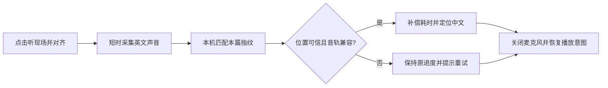

# 同一录音重放：音频指纹对齐

更新：2026-09-07。首版已实现本地 8 秒采音、纯 Swift 指纹匹配、耗时补偿和自动定位；仅同一英文录音正常 1 倍速重放。尚无手机扬声器声学匹配或现场精度结论。

## 当前实现

使用已发布内容的版本化指纹索引，复用 Web 算法与来源契约，避免再制作一套 ShazamKit 目录。`FingerprintIndexStore` 验证同源 HTTPS、8 MB 上限、SHA-256、来源、音轨和索引契约后缓存；首次对齐需要下载索引，之后可离线复用。麦克风 PCM 仅驻留内存，不上传或持久化。

点击后暂停原播放、采音 8 秒并关闭输入，再进行本地匹配；全流程 20 秒截止。只有绑定当前周次、音轨哈希及有效同步能力的可靠结果才会定位。匹配返回的是查询开始位置，按单调时钟补偿采音及处理耗时；原先播放则恢复，原先暂停则保持暂停。换篇、换轨、手动操作、能力撤回、取消、超时或中断会使旧结果失效。切后台取消采音；后台继续匹配不属于本版能力。

Swift 文件回放：63 个正例命中 62 个，1 个强噪声例安全拒绝；103 个负例全部拒绝，已命中例最大误差约 17.12 ms。该结果是 Mac 上的文件测试，不是手机声学或中文语义同步证明。证据：`artifacts/tongxing-ios/2026-09-07/fingerprint/swift-replay-report.json`。

剩余验收：真实 iPhone 权限拒绝/恢复、8 秒麦克风指示关闭、扬声器和耳机路由、取消与来电、房间混响、错录音拒绝、实际中文播放位置、耗时与耗电。同步音轨仍保留候选审核状态，不因指纹命中升级为人工批准。

代码入口：[匹配器](Core/Sources/TongxingCore/FingerprintMatcher.swift)、[索引存储](Infrastructure/FingerprintIndexStore.swift)、[采音](App/MicrophoneCapture.swift)、[请求与播放器协调](App/AudioAlignmentController.swift)。

## 历史方案（2026-09-06，已由上述实现取代）

以下保留原选型与实验设想，ShazamKit、后台完成和预下载安排均不代表当前实现。

## 方案选择

首选 **ShazamKit 自定义音频指纹目录 + 与英文源共用时间轴的中文同步音轨**。手机听到英文录音的一小段后，识别它属于当前录音的哪个时间位置，再把中文同步音轨定位到对应位置。

指纹来自重放的**英文原始录音**，不能从中文合成音频或英文文字生成。即使播放的是视频文件，使用的也是其中的音轨。首版仅支持同一录音、正常1倍速播放；不同编码、音量、设备和房间传播属于需要验证的声学变化。重新讲述、ASR、关键词检索、摄像头和视频帧匹配不进入此版。无法匹配时保留手动定位。

ShazamKit 支持本机自定义目录匹配和录音时间码，Apple 也提供同步学习视频内容的示例；这支持技术选型，但不能代替本项目的纯语音与现场混响实验。[框架说明](https://developer.apple.com/documentation/shazamkit) · [自定义目录示例](https://developer.apple.com/documentation/shazamkit/building-a-custom-catalog-and-matching-audio)

## 用户流程

- 点击后请求必要的麦克风权限，明确显示听音状态与取消入口。初版建议短暂停播，避免扬声器播放的中文干扰英文采集；耳机下不中断播放作为后续路由验证项。
- 开始采音后尽早匹配，有足够证据即可结束；先比较2、5、8、12秒观测窗口，整个采音任务20秒超时。上述是实验参数，不保证几秒即可识别；实际查询长度须遵守目录的最小/最大查询时长。
- 成功后提供“已对齐到…”和撤销。失败、取消、权限拒绝、超时、来电或换篇时关闭输入；若采音已结束，不为后续计算继续占用麦克风。结束时恢复音频路由及最新的播放/暂停意图。
- 一次点击只完成一次校准；切到其他 App 或锁屏后完成该次短时任务仍是验收目标。不定时唤醒、不持续监听。原视频后来暂停、跳转或调速，用户需重新点对齐。

## 预生成资料：每篇一个小目录

1. 冻结实际要重放的英文源版本、授权证道窗口和解码后的音轨。为整个选定音频窗口生成一个 reference signature，避免按字幕句子切成大量小指纹；短时查询仍可定位到长参考中的位置。Apple 推荐每份媒体使用完整参考签名，减少跨签名边界问题。[目录制作建议](https://developer.apple.com/videos/play/wwdc2022/10028/)
2. 将签名和可识别该篇的元数据打包为 `.shazamcatalog`。只加载用户当前所选证道，避免默认加载全部历史内容。目录不包含原始录音波形；容量、加载内存和纯语音命中率需要实测，不预报文件大小。
3. 发布一个有版本的能力清单，至少绑定：`sourceId`、源媒体哈希、reference 时间原点与时长、相对完整视频的偏移、目录路径及 SHA-256、目标中文音轨 ID/哈希、时间轴模式、生成工具版本及审核状态。这些是拟议字段，尚未修改当前 schema。
4. App 下载中文音频时同时缓存指纹目录与能力清单，验证完整性后原子启用。资料齐备可离线运行，不依赖 Shazam 音乐库或现场 ASR；缺失/损坏/旧版本仅禁用自动对齐，不影响已有播放。

本机已通过 `/usr/bin/shazam --help` 确认存在 `signature` 与 `custom-catalog` 命令；也可用 `SHSignatureGenerator` 制作资料。本轮没有生成真实录音指纹或修改发布链路。

## 时间轴：优先验证已有同步音轨

指纹解决“当前听到的是英文录音的哪一秒”。中文音轨是否能使用相同秒数，取决于它怎样制作：

| 中文音轨 | 首版处理 |
| --- | --- |
| 已按英文源时间轴布置、包含必要留白的同步音轨 | 验证来源、时间原点和音轨哈希后，使用对应时间定位 |
| 紧接播放、去除停顿的自然语速音轨 | 不直接自动对齐；留在后续映射方案中，不能按总时长比例换算 |

现有 [`assemble_synchronized`](../../experiments/sermon-dubbing-poc/check_weekly_timing.py) 会创建与证道片段等长的轨道，将中文块放到 `videoStart`，并按同一偏移转换字幕；[`synchronized_candidate`](../../experiments/sermon-dubbing-poc/build_weekly_app.py) 会校验来源、音轨哈希、时长及字幕位置。因此共用时间轴有现成制作路径，不必把现场识别变成英中语义匹配。

只读核对主工作区忽略目录 `artifacts/sermon-dubbing/2026-09-06-live-fallback-v3-numbers/`：

- `job.json`：源片段从完整视频1760秒开始，时长1967秒；58个英中块，132个中文单元。
- `synchronization/assembly.json`：同步候选时长1967秒，`fullDecode=pass`，但 `humanReview=pending`。
- `synchronization/report.json`：含 `videoStart/videoEnd` 和自然中文 `chineseStart/chineseEnd`；`humanSameVideoPlayback=pending`。`videoEnd` 是分配槽末端，不能当成英文发言结束。
- `source-alignment/report.json` 仍有4个 issue。现有公开目录的 cues 和候选证据哈希不足以明确声明“此音轨可以按英文源秒数自动定位”，需要新增能力绑定及独立验证。

时间换算示例（不是已执行匹配）：若指纹目录以证道片段起点为零，匹配得到12:34，则同步中文音轨也定位12:34；若指纹以完整视频起点为零，先减去该版证道起点1760秒。偏移来自清单，不能硬编码当前周数值，也不能减两次。超出内容窗口则拒绝自动定位；目标落在同步音轨留白区时保留留白，不擅自吸附到下一句。

“轨道共用时间轴”与“英中句子同步准确”分别验证。指纹正确也不能修复已有中文块放置错误，不能因此把同步候选升级为已验收内容。

## 手机上的匹配与时间补偿

建议使用 `AVAudioEngine` 的短时输入，显式创建 `SHSession(catalog:)`，把连续 PCM 缓冲交给 `matchStreamingBuffer(_:at:)`；仍由现有 `PlaybackController` 执行最终定位。自管采音便于与现有播放会话、取消和超时统一清理。[流式匹配接口](https://developer.apple.com/documentation/shazamkit/shsession/matchstreamingbuffer(_:at:))

- `matchOffset` 对应查询音频的**起点**，不是匹配完成时的当前位置，且可能为负。
- `predictedCurrentMatchOffset` 提供查询音频当前播放位置的预测。读取时保存单调时钟，定位前只补偿此后的耗时；不能再盲目叠加整段录音时长。[匹配结果定义](https://developer.apple.com/documentation/shazamkit/shmatchedmediaitem)
- 对1倍速、共用时间轴音轨，拟议计算是：`中文目标 = 匹配时刻的源当前位置 + 此后经过时间 - 时间原点差`。定义并验证“匹配时刻”的基准，避免系统预测和自算补偿重复。
- SDK 未保证自动补偿 App 缓冲、AVPlayer seek 或蓝牙输出延迟。原型须对照带已知时间码的参考播放，分别测指纹定位误差、恢复中文输出误差。不能以 seek 参数正确代替实际声音对齐。
- 不用 signature 的 `duration` 代替采样时钟：静音可能使签名时长短于实际采集时间。音频路由改变造成格式或时钟不连续时，取消本轮并恢复状态。

接受条件首先包括正确 reference 身份、合法窗口、匹配位置一致性、音轨时间轴和完整性。初版评估两个不同短时查询是否定位到同一录音，且位置增量与采样时间差一致；不能把重复处理同一次回调当成两次证据。含重复使用的相同音频片段、公共片头或其他不可唯一定位区间时，需要拒绝或延长查询。

2026-09-06 本机 Xcode beta SDK 静态核对：核心自定义目录/匹配 API 覆盖 iOS 17；`confidence` 是 iOS 18.4+，因此首版不能依赖它作为所有设备的唯一门槛。`frequencySkew` 表示频率变化，不是置信度，也不能直接当成播放速度。目录加入引用后再创建 session；iOS 17 使用文件 URL 读写目录。PCM 采样率支持16/32/44.1/48kHz，同一 session 保持格式一致、时钟连续。实施前需对所选 SDK 与设备再次做针对性验证。

每次请求携带会话序号、来源、音轨哈希和开始时的播放器状态版本；取消、换篇、换轨或用户手动定位使旧结果失效。日志默认只保留诊断指标，不保留现场录音、逐字稿，也不请求语音识别权限。

## 实验与完成条件

第一步只验证指纹定位，不接自动跳转：使用已授权的同一英文录音，在首、中、末及随机位置截取查询；比较清晰音频、重新编码、音量变化与加入静音后的结果，记录真实位置及误差。错误录音、纯中文、静音、公共片头和重复音频作为负样本。

第二步用实体 iPhone 听扬声器重放，覆盖实际距离、回声、掌声/旁人说话、手机麦克风与蓝牙路由。统计点击到结果耗时 p50/p95、成功率、拒绝率、误跳率和位置误差，保留样本量；不要把文件匹配成绩当成声学成绩。首次可把“定位误差 p95 不超过0.5秒、点击到恢复 p95 不超过10秒”列为待验证目标，失败时根据证据调整方案，不能声称已达到。

第三步只为已验证兼容的同步音轨接入自动定位：检查中文实际听感、字幕、系统进度、撤销和留白。继续验证点击后锁屏/切后台、取消、超时、来电、缺目录、坏哈希、离线、切换音轨及后台采音结束。首次权限请求在前台完成；后台路径未经实测不能计入完成。

首版完成要求：一键短时采音、可靠定位、自动关闭麦克风、恢复播放意图、结果可撤销；失败或过期结果不修改进度。已有审核状态继续保留。只有必要资料和实测证据齐备，才对该篇、该音轨启用能力。
