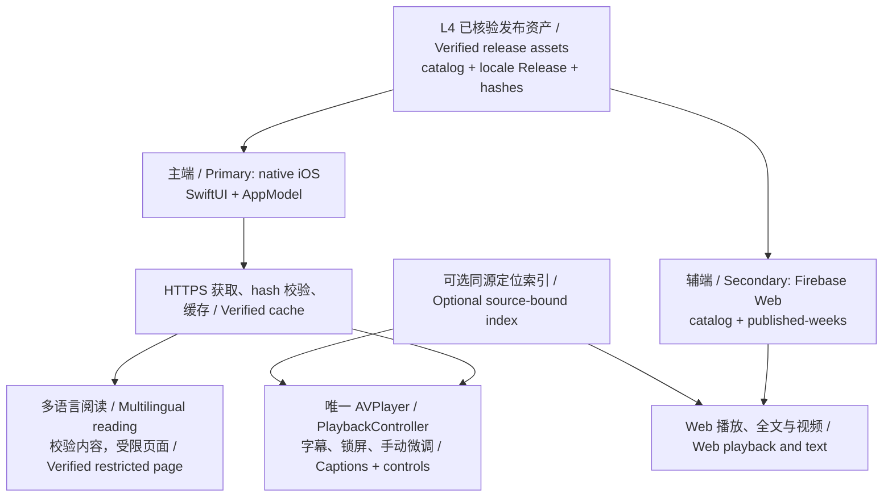

# App 系统设计：iOS 主端与 Firebase Web 辅端

[README](../README.md) · [后端工作流 DAG / Backend](backend-workflow-system-design.zh-en.md) · [执行环境](execution-environment-design.zh.md) · [实验方向](experiment-directions.zh.md) · [文档索引](README.zh.md)

核查日期：2026-09-30；代码基线 `dev@fc3e2fbc60b0fd2c5b59c64fcd515c465efc6b0b`。本文补充客户端系统边界和产品方向；视觉、无障碍和组件规则继续使用现有 [iOS 设计约定](../apps/tongxing-ios/DESIGN.zh.md)，实现与验收继续使用 [iOS README](../apps/tongxing-ios/README.zh.md)及[发布准备清单](../apps/tongxing-ios/RELEASE-READINESS.zh.md)。

**产品方向：原生 iOS 为主要收听端，Firebase Web 为辅助访问与兼容入口。** 这是优先级决策，不表示 iOS 已覆盖 Web 全部功能或完成分发。现有 SwiftUI/AVPlayer 客户端、缓存与声音定位代码支持此方向；Firebase Web 已有独立发布记录。iOS 二进制分发、真机、完整视频入口与现场验收仍按各自证据确认。

## 客户端依赖与数据边界

读者操作路径为选择周次 → 选择可用内容语言 → 校验发布包与资源 → 阅读／播放 → 需要时下载或声音定位。界面语言只改变控件文案，不能将未发布音轨变成可用；语言切换不能继承上一条音轨的定位结果。缺失或错误的指纹索引只禁用声音定位，不伪造上游通过，也不必阻塞普通播放。

| 组件 | 实际仓库入口 | 职责与当前边界 |
|---|---|---|
| 原生 UI 与状态 | [AppModel.swift](../apps/tongxing-ios/App/AppModel.swift)、[ContentView.swift](../apps/tongxing-ios/App/ContentView.swift) | 选择目录、周次、语言，处理下载状态与过期异步结果；不在客户端翻译或合成 |
| 内容合同 | [TongxingCore](../apps/tongxing-ios/Core/Sources/TongxingCore/)、[MultilingualCatalogRepository](../apps/tongxing-ios/Infrastructure/MultilingualCatalogRepository.swift) | 区分 legacy `weekly.json`、v2/v3 catalog 与 v1/v2 Release；校验来源、locale、状态和 hash，Dev candidate 不自动升级 Production |
| 离线与音频 | [Infrastructure](../apps/tongxing-ios/Infrastructure/)、[PlaybackController.swift](../apps/tongxing-ios/App/PlaybackController.swift) | 完整校验后原子保存；单一播放器维护后台音频、历史和中断恢复。系统后台下载及跨进程续传仍见现有 README 限制 |
| Firebase Web | [Web app](../experiments/sermon-dubbing-poc/web/app.mjs)、[published-weeks](../experiments/sermon-dubbing-poc/web/published-weeks.mjs) | 消费既有已发布内容与音轨；三语完整视频页面和旧中文周次保留不同版本合同 |
| 声音定位 | [iOS index store](../apps/tongxing-ios/Infrastructure/FingerprintIndexStore.swift)、[Web fingerprint controller](../experiments/sermon-dubbing-poc/web/fingerprint-ui.mjs)、[定位合同](sermon-app-field-alignment.zh.md) | 已有短时采集与同录音匹配路径；离线源音频回放命中不等于真实手机、噪声环境或另一场现场讲道同步 |
| 使用统计与反馈 | [匿名统计合同](sermon-app-usage.zh.md)、[语言收听统计](sermon-language-listening-statistics.zh.md)、[反馈合同](sermon-listening-feedback.zh.md) | 自愿统计与内容生产分开；原生反馈接入等后续功能不得从 Web 实现推断已完成 |

## 发布包与客户端资格

两端都只消费 Layer 4 明确声明的能力。三语正式内容必须各自经过 L2 文字、L3 Audio Package、L4 Release；允许纯文字时，L3 明确为 `audio_unavailable`，界面禁用不存在的播放功能，不能借另一语言音轨。包合同允许某状态，不代表每个 builder、桥接器或客户端版本都已支持该状态；查看[后端实施地图](backend-workflow-system-design.zh-en.md#实际实现地图--implementation-map)。

正式完整视频路径使用 `/multilingual-v3.json` 与 `/releases-v2/`，同时保留旧目录供旧客户端使用。完整阅读稿与短口播稿分别绑定，不能用字幕中的短稿替换全文。内容包、公开指纹补充接口和英文对照接口保持独立版本及 hash。具体入口与校验见 [9 月 27 日 Layer 4 记录](sep27-full-video-app-layer4.zh.md)。

## 已实现、已记录与待验收

| 状态 | 证据与限制 |
|---|---|
| 已实现：iOS 收听与阅读基础 | 原生播放器、哈希校验缓存、界面语言、双语全文与短时定位见 [iOS README](../apps/tongxing-ios/README.zh.md)。开发构建不是 TestFlight 或 App Store 已交付 |
| 已记录：Firebase 三语 App 发布 | [9 月 27 日记录](sep27-full-video-app-layer4.zh.md)记录三语音轨 HTTP/Range、浏览器播放及 App 内选择；手机宽度截图不是手机真机验收 |
| 已记录：视频存储迁移 | [9 月 28 日 bucket 记录](reports/20260928-full-video-bucket-migration.zh.md)记录 Hosting 精确重定向、完整 SHA 与 Range；其中明确当时 iOS 没有原生完整视频入口 |
| 计划与待验收：iOS 主端完善 | 原生完整视频、分发与真实设备/现场证据按 [Layer 4 App Backlog](multilingual-layer-4-delivery-app-backlog.zh.md)、[iOS Backlog](../apps/tongxing-ios/BACKLOG.zh.md)、[Beta 记录](../apps/tongxing-ios/BETA-TESTING.zh.md)推进，不重复排期 |

本文没有重新访问线上站点、运行 App 或补做设备验收。产品优先级与能力完成度分别报告；当前架构图不能抹去各版本的已知限制。
