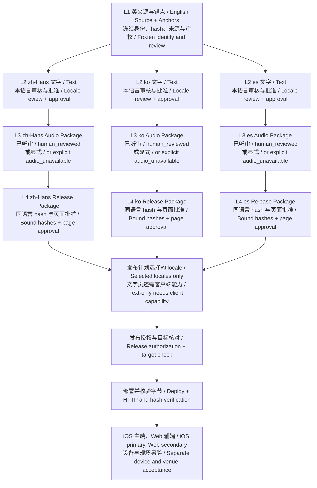
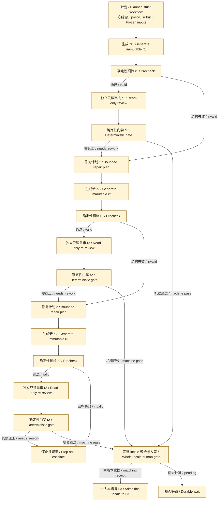

# 后端工作流系统设计 / Backend workflow system design

[README](../README.md) · [App 设计](app-system-design.zh.md) · [执行环境](execution-environment-design.zh.md) · [实验方向](experiment-directions.zh.md) · [文档索引](README.zh.md)

核查日期 / Evidence date: **2026-09-30**。代码基线为 `dev@fc3e2fbc60b0fd2c5b59c64fcd515c465efc6b0b`。本文是当前架构导览；包字段、批准和失效规则仍以[四层接口](multilingual-production-interfaces.zh.md)为准，不建立第二套 schema 或排期。

**已实现 / Implemented** 指此基线有代码及所链接的验证范围；**合同 / Contract** 指必须遵守的边界，未必已有通用执行器；**计划 / Planned** 指尚未落地的目标；**实验 / Experiment** 不能自动取得生产资格。部署、人工听审、设备与现场状态分别记录。

## 四层业务 DAG / Four-layer business DAG

三语直接消费同一已审英文来源，各自经过 Text → Audio → Release。下面展示业务依赖；不表示当前 controller 已能自动执行整条链。每个 L2 节点包括机器审核、语言插件、候选准入和本语言文字人审；带音频的 L3 包还要求整轨听审。Every locale must produce an L3 Audio Package, including explicit `audio_unavailable` for a permitted text-only release. There is no L2 → L4 bypass.

`PLAN` 是发布计划选择的汇合，不是永远等待三语。某语言失败只阻止自己的后继；明确要求同时发布三语时才等待三语。L1 身份变化使所有 locale 下游失效；L2/L3 变化只使相应 locale 下游失效。[Canonical DAG 定义](../scripts/canonical_pipeline_definition.py)与[包检查边界](canonical-package-inspection.zh.md)进一步区分依赖结构、观察和执行。

## 实际实现地图 / Implementation map

| 层 / Layer | 已有路径与职责 / Existing code | 当前边界 / Boundary |
|---|---|---|
| L1 | [English Source builder](../scripts/build_english_source_package.py)、[MFA 生产合同](mfa-production.zh.md)、[source judge](../scripts/judge_english_source_for_translation.py) | 包和声学证据工具已实现；机器 judge 是 shadow，不能写人工批准；canonical L1 自动 dispatch 未完成 |
| L2 | [Astra → Sol runner](../scripts/run_target_language_models.py)、[候选 producer](../scripts/produce_target_language_candidate.py)、[语言插件](../scripts/language_review_plugins/)、[人审入口](../scripts/review_target_language_candidate.py) | 独立模型请求、缓存与人审已存在；当前 Sol 是可编辑候选的 reviewer-editor，不是下图只读 strict-verifier |
| L3 | [speech job](../scripts/prepare_target_language_speech_job.py)、[正式 renderer](../scripts/render_formal_target_language_speech.py)、[package builder](../scripts/build_target_language_audio_package.py)、[听审入口](../scripts/review_target_language_audio.py) | 正式语音需要文字人审、授权音色与同 hash 收据；ASR 只是机器筛查；通用无音频包生成仍非此 builder 职责 |
| L4 | [catalog builder](../scripts/build_multilingual_catalog.py)、[完整视频发布包](../scripts/build_full_video_app_release.py)、[CD 入口](../scripts/run_multilingual_cd.py) | 版本化发布工具已实现；v1/v2 Release、v2/v3 catalog 不可混写；完整视频三语路径仍要求音轨，不代表所有入口支持 text-only |
| 控制 / Control | [固定 L2 adapter](canonical-layer2-controller.zh.md)、[durable jobs](../scripts/sermon_workflow_jobs.py)、[cache recovery](canonical-layer2-cache-recovery.zh.md)、[reconciliation](canonical-layer2-reconciliation.zh.md) | 显式 opt-in 可派发 L2，停在文字人审；当前每 run 最多一个 active locale job，组内按 policy 有界并发；业务独立不等于三语已并行调度 |
| 观察 / Observation | [accounting 实施矩阵](accounting-contract-implementation-matrix.zh.md)、[Tracker](four-layer-production-tracker.zh.md)、[Stage 0 证据](canonical-stage0-evidence.zh.md) | 已有组件验证与待完成项分开；日志或 Tracker 投影不能签发批准，不能以 synthetic 通过宣称生产全链完成 |

Text-only 的现状须分入口看：[catalog builder](../scripts/build_multilingual_catalog.py)默认要求匹配的 `audio_unavailable` L3 包；显式 legacy 兼容选项保留迁移范围，不能据此声称 canonical 四层已完成。[Web 合同测试](../experiments/sermon-dubbing-poc/web/shared-text-only-releases.test.mjs)验证读取边界；schema 可表达、reader 可读取，不等于当前完整视频 producer 已支持通用纯文字发布。旧公开 `/packages/layer3/` 与正式音频私有包的版本链差异见[现有 Backlog 的发布包边界](backlog.zh.md)。

## 生成、独立审核、门禁与新修订 / Generation, review, gate and new revisions

**计划 / Planned，尚非当前 runner 行为。** [PR164 设计快照](https://github.com/JonathanJing/sermon-video-zh-subtitles/blob/fb0da4903717be3844e8114a44c7fcb46d5c9f35/docs/generation-review-gate-design.zh.md)与[对应任务拆分](https://github.com/JonathanJing/sermon-video-zh-subtitles/blob/fb0da4903717be3844e8114a44c7fcb46d5c9f35/docs/generation-review-gate-backlog.zh.md)定义 strict-verifier、review receipt、deterministic gate 与自动修复接线。核查时 PR 仍 open；其他实现分支的进展须以合并后的代码和证据重新校准。本图不修改该 PR 的设计或 backlog。

**进行中 / In flight:** [PR165](https://github.com/JonathanJing/sermon-video-zh-subtitles/pull/165) 在 `56cb444bd9f6d5ea2d3a2c9f990ea7c7e4c00ece` 新增 [D1 私有合同与兼容边界](https://github.com/JonathanJing/sermon-video-zh-subtitles/blob/56cb444bd9f6d5ea2d3a2c9f990ea7c7e4c00ece/docs/rqc-private-contracts.zh.md)：schema、只读快照/binding validator 与显式 strict policy 解析已有实现分支；尚未合入上述 dev 基线，不实现模型调用、固定 Gate 准入或人工批准。D2 日志、D3 strict runner、D4 Gate 和 D5 修复/预算须分别跟随后续 PR 证据；本文不编辑它们的合同或实施矩阵。

以下展开单个 locale/work unit 的修订节点。每次 Generator 写新候选，Reviewer 只读该候选与实际英文，Gate 核对候选 hash、policy、rubric、完整覆盖和批准。The graph is acyclic: repair creates a new revision, never an edge back to an old generation or review node.

图中最多两次内容修订（r1 加 r2/r3）是 PR164 的**建议实验上限**，不是现有 runner 已具备的硬预算。修复计划也须核对依赖闭包、预算和 fresh state；无新证据的相同失败可提前停止。审核调用执行失败与内容失败不同：保留候选，按受限新 attempt 恢复审核；结果未知先对账；inconclusive 等待真实证据或人工裁决，不进入 pass 路径。为了可读，图只展开内容返工主路，完整错误路由以 PR164 为准。

当前 reviewer-editor 的独立调用不代表修改后的文本又经另一个只读请求验证。历史收据保持原语义，不能重标 strict-verifier。API 执行成功、机器审核通过、业务准入是三种状态；机器通过缺人审仍等待。已知修复由固定程序决定；有歧义才使用预算内 Decision proposal；未知程序错误进入独立工程分支，不让工程 Agent 成为每组生产的常规依赖。

## 其他业务范围与维护 / Other scopes and maintenance

[Dual-PDF Supervisor](sermon-production-supervisor-agent.md)的 `complete` 只代表 `dual_pdf`；[周日现场字幕](../experiments/local-live-poc/DESIGN.zh.md)属于 `live_session`。两者不接到 L4 冒充 `four_layer_release`；最终录音进入耐久内容生产时重新从 L1 开始。`preview_only` 预生成 WAV 也不是 L3 包，正式复用须按[层内解耦合同](multilingual-intralayer-review-decoupling.zh.md)重核身份并重新排程、听审。

英文主图在 [README](../README.md#four-layer-production-architecture-shared-english-source-to-multilingual-playback)，本页为中英对应版。修改时同时核对节点 ID、边集合、L3 必经、locale 隔离、修订无回边和状态标签；Mermaid 源直接保存在 Markdown，GitHub 可原生渲染。[图表维护入口](diagrams/README.md)记录验证方式。历史云图继续保留在 [system-design](system-design.zh.md)，不作为当前执行拓扑。
