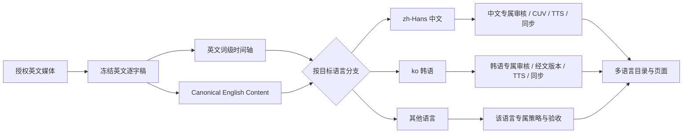
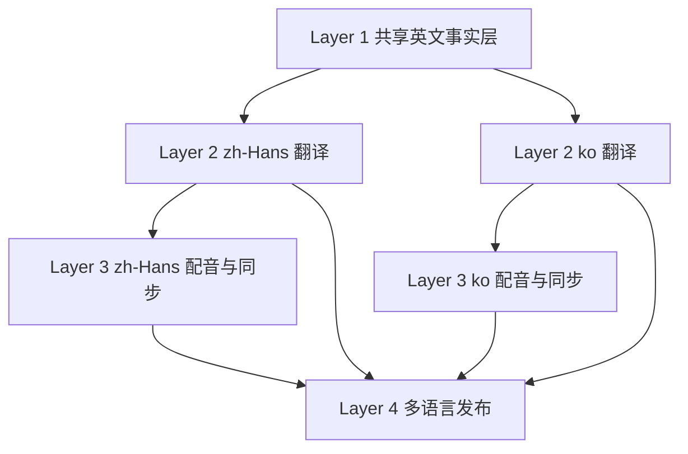

# 英文源到多语言证道生产 POC 流程

状态：**Layer 2／3 准备合同与韩语界面／内容 sidecar 已实现**。本文定义后续方向，不表示韩语翻译、韩语配音或多语言发布已经完成。Layer 1 接口由 `main` 的独立工作负责；本分支只读取其 anchor，不修改或复制英文事实层。

## 1. 目标与不变量

后续生产以同一份冻结英文事实源为根，各目标语言独立生成、审核和发布：



核心规则：

- 英文媒体、冻结英文逐字稿和词级时间轴是跨语言共享的事实源。
- 中文、韩语及以后新增语言是**同级分支**；禁止把已译中文作为韩语或其他语言的默认翻译源。
- 每个目标语言单独保存 model、prompt、术语表、经文版本、翻译、审核、音频、字幕、同步和发布状态。
- 一个语言通过不能提升另一个语言；中文已发布不代表韩语已审，韩语界面可见也不代表韩语音频存在。
- 内容摘要和大纲也从 Canonical English Content 分支，不从另一个目标语言回译。
- 来源批准、语言内容审核、音频听审、视频同步、页面发布、HTTP 核验和设备／现场验收保持独立状态。

## 2. 按 `main` 四层从下向上实施

不要同时把整条中文管线全部参数化。先冻结相邻两层之间的接口，每次只把一层变成语言中立，并让现有中文 adapter 继续通过原回归；韩语作为第二个 consumer 验证接口确实通用。



这里的“从下层分别做多语言”需要区分：

- **Layer 1 不分语言。** 只有一份英文来源、英文词级时间轴和 clause-stable 锚点；复制成 `english-for-zh`、`english-for-ko` 会制造漂移。
- **Layer 2 开始分语言。** 每个 locale 是独立 job、目录、缓存、模型收据和审核状态。
- **Layer 3 沿用相同 locale 边界。** 文字通过不代表该语言有可用 TTS；每个 locale 单独生成、筛查、排程和听审。
- **Layer 4 只聚合已存在资产。** 页面可以同时展示多个 locale，但不能替下游补翻译、补音频或提升审核状态。

### Layer 1：先冻结共享英文接口

现有 `sermon-sentence-anchor-manifest-v2` 和 `clause_stable_v2` 已接近目标：`sourceUnits`、`sourceWordIds`、词时间和边界证据本身不依赖中文。第一步应只做收口，不改翻译或播放行为：

1. 把 Layer 1 的正式输出限定为 `sourceUnits`、英文上下文、来源／实现 hash、边界问题和英文人工审核状态。
2. `translationRequests` 只表达“待翻译的英文范围和上下文”，不出现 `zh`、`ko` 或某语言 prompt。
3. 修复对齐异常和无安全边界单元；Layer 1 有 unresolved issue 时，所有新语言 job 都不能启动。
4. 用现有中文生产输入做 golden replay，证明抽接口前后英文 word ID、边界和时间完全一致。

Layer 1 完成门槛：同一真实整篇英文可生成一个不可变 anchor manifest；中文和韩语 runner 都只读同一 SHA-256，不复制或改写它。

### Layer 2：把中文 candidate 抽成单语言通用 candidate

当前 `sermon-sentence-interpretation-candidate-v1` 把 `chinese`、`chineseUtterances`、`spokenChinese` 写进 schema。不要直接在同一对象增加 `korean` 字段；应新建单语言 v2 合同，每个文件只承载一个 locale：

```json
{
  "schemaVersion": "sermon-target-language-candidate-v2",
  "anchorManifestSha256": "<shared Layer 1>",
  "targetLocale": "ko",
  "translationPolicySha256": "<model + prompt + terminology + scripture policy>",
  "groups": [
    {
      "sourceUnitIds": ["..."],
      "targetUtterances": ["..."],
      "targetText": "...",
      "coverage": [],
      "semanticReview": {},
      "languageReview": {}
    }
  ]
}
```

实施顺序：

1. 先建立 v1 中文 → v2 `zh-Hans` adapter，要求文本、来源覆盖和审核结果逐项等价。
2. 将通用语义检查固定为完整含义、否定／数字／专名、引文归属和无新增含义。
3. 将 `spokenChinese` 等语言特有检查移入 `languageReview` plugin；中文接 CUV／中文口语规则，韩语接韩文术语、敬语、断句和经文版本规则。
4. runner 增加显式 `--target-locale` 和 policy snapshot；缓存键必须包含 locale 与 policy SHA。
5. 韩语先跑固定小 fixture，再跑一篇完整冻结英文；不能复用中文翻译或中文审核 pass。

Layer 2 完成门槛：`zh-Hans` 与 `ko` 各自产出独立 candidate，都覆盖同一套英文 source unit 恰好一次；其中一个失败不会改写另一个状态。

本分支已增加 [`sermon-target-language-candidate-v2`](../schemas/sermon-target-language-candidate-v2.schema.json) 准备合同。它固定 `sourceLocale=en`，把通用语义检查与 `languageReview` 插件检查分开，并禁止 candidate 自称可发布。当前只有合成 fixture 验证，尚未接模型 runner、中文 v1 adapter 或真实整篇韩语翻译，因此还没有达到上述完成门槛。

### Layer 3：把音频实现拆成通用调度器 + 语言 adapter

当前主要硬编码点是 `zh-natural.mp3`、`zh-synced.mp3`、`block.zh`、`language="Chinese"` 和中文回转写规则。按两步迁移：

1. 先把确定性部分抽出：输入 `targetLocale + approved targetText + measured audio duration + Layer 1 anchors`，输出与语言无关的滚动排程、延迟和时槽报告。
2. 再为每个 locale 注册 speech adapter：TTS 模型／checkpoint、语言参数、文本规范化、回转写模型、字幕断行和发音检查。

建议目录隔离：

```text
languages/zh-Hans/audio/...
languages/zh-Hans/synchronization/...
languages/ko/audio/...
languages/ko/synchronization/...
```

韩语按以下顺序放行：短探针发音 → 多段 fixture → 完整自然语速音轨 → 机器回转写筛查 → 人工全文听审 → 同视频 1 倍速验收。Qwen 中文 checkpoint 已通过不能证明同一讲员的韩语发音或自然度通过。

Layer 3 完成门槛：每种语言分别有文字 hash 一致的音频收据、完整解码、自然语速、排程报告和人工听审状态；允许 `ko` 停在 `audio_unavailable`，不阻塞文字版发布。

本分支已增加 [`sermon-target-language-speech-job-v1`](../schemas/sermon-target-language-speech-job-v1.schema.json) 和 [`prepare_target_language_speech_job.py`](../scripts/prepare_target_language_speech_job.py)。准备器只接受人工翻译已批准、完整覆盖共享 anchor 的单语言 candidate，并把输出路径锁在 `languages/<locale>/audio` 与 `languages/<locale>/synchronization`。它不调用 TTS；韩语 adapter 若仍是 `unverified_poc`，任务固定为 `prepared_adapter_validation_required` 且 `synthesisEligible=false`。即使 adapter 已验证，`releaseEligible` 仍为 false，后续必须另做真实合成、回转录、排程和人耳验收。

### Layer 4：最后升级 catalog、Web 和 iOS

Layer 4 不应继续把一个 week 视为“只有一条中文 track”。先加入 v1 catalog adapter，再引入 `languages[locale]`：

1. page/source identity 仍只有一份；各 locale 保存自己的 content、tracks、captions、downloads 和状态。
2. UI 分离 `interfaceLocale`、`contentLocale`、`audioLocale`，不能再由一个语言按钮同时暗示三种能力。
3. 发布合并键从 page ID 扩展为 page ID + locale；更新韩语不能覆盖中文媒体，回退一个 locale 也不回退其他语言。
4. 反馈、收听位置、下载文件名、HTTP receipt、iOS 缓存和现场验收全部带 locale。
5. 缺少音频时明确显示文字版；fallback 必须可见，不把中文音频标成韩语。

Layer 4 完成门槛：同一页面能同时装载 `zh-Hans` 与 `ko`，分别验证内容、音轨可用性、下载、Web/iOS 播放和发布哈希；部署成功仍不等于韩语听审或现场通过。

### 推荐的四个独立交付 PR

| PR | 只改哪一层 | 韩语证据 | 不应夹带 |
|---|---|---|---|
| 1 | Layer 1 英文 source package／anchor 接口 | 韩语 runner 能读取同一 fixture，但不调用翻译 | 韩语 prompt、TTS、UI |
| 2 | Layer 2 target-language candidate v2 | 固定 fixture + 一篇完整韩语翻译／独立复核 | 音频与发布 |
| 3 | Layer 3 speech adapter／通用 scheduler | 韩语探针、完整音轨、回转写、听审与延迟 | catalog v2 或部署 |
| 4 | Layer 4 catalog v2／Web／iOS／发行 | 中韩并存、fallback、HTTP 与端上验证 | 回写翻译或音频状态 |

每个 PR 都先保留旧中文合同，使用 adapter 双写或 shadow 比较；只有该层的真实等价证据通过后，下一 PR 才依赖新合同。这样出现问题时能明确归因于英文锚、翻译、语音还是发布，而不是一次多层改造后无法定位。

## 3. 共享英文主干

### 2.1 来源与范围

沿用现有来源合同，先确定 canonical URL／ID、service date、媒体 SHA-256、时长和操作员批准的证道范围。同讲题、同讲员或同日期不能替代同一录制身份。

输出 `source-package`，至少包含：

- `sourcePackageId`、来源 URL／ID、媒体 SHA-256 和批准范围；
- 英文字幕来源类型（已有字幕或 ASR）及其 provenance；
- 英文逐字稿版本、不可辨识标记和人工／机器审核状态；
- 词级时间轴、覆盖报告、低置信和边界问题；
- 生成时间、工具／模型版本和内容哈希。

英文逐字稿一旦修改，相关意义单元、所有目标语言翻译、对齐、音频和审核均按绑定哈希失效；未变化的英文单元可继续按哈希复用。

### 2.2 Canonical English Content

从冻结英文逐字稿生成一份语言中立的英文内容层，而不是从中文摘要反推英文：

- 英文标题、系列名、经文引用；
- 英文中心信息、摘要、大纲和反思问题；
- 每项内容指向英文 segment／slice ID；
- 区分讲员原话、经文原文、概述和 AI 辅助内容；
- 保存 `sourcePackageSha256`、生成模型／prompt、审核状态和自身 SHA-256。

这一层是页面内容翻译的唯一上游。英文 transcript 仍是事实证据；Canonical English Content 是派生内容，不能冒充讲员逐字稿。

## 4. 目标语言分支

每个 `targetLocale` 建立独立、可恢复的 language job。建议身份至少由以下字段组成：

```json
{
  "schemaVersion": "sermon-language-job-v1",
  "sourcePackageSha256": "<frozen English source package>",
  "canonicalEnglishContentSha256": "<English page content>",
  "targetLocale": "ko",
  "translationPolicySha256": "<prompt + model + glossary + scripture policy>",
  "status": "ready_for_translation"
}
```

### 3.1 语言策略快照

翻译前冻结该语言策略：

- BCP 47 locale，例如 `zh-Hans`、`ko`；
- 系列名、讲员名、地名、神学术语和语气规则；
- 该语言采用的圣经版本、引用许可和“原文／转述／混合引述”处理规则；
- 标点、数字、敬称、专名读音和字幕排版规则；
- 翻译与独立审核使用的 model、prompt 和版本；
- 是否生产 TTS、可用讲员声音资产及目标语言能力。

中文的 CUV 锁定属于 `zh-Hans` 分支专属策略，不能写进共享英文主干。韩语分支必须另行确定并记录韩文圣经版本及引用规则，不能复用 CUV 文本或“中文已核对”的结论。

### 3.2 逐段翻译与完整性

输入是冻结英文意义单元及上下文，输出保存稳定 segment ID 和一对一／一对多／多对一映射。最低检查包括：

- 英文覆盖完整，无静默删义、重复或跨段串移；
- 否定、数字、专名、因果和引文归属一致；
- 经文原文与讲员解释分开；
- 术语表命中及例外有记录；
- 译文自然，但不能以“更短”代替含义完整。

机器初译、机器独立审核、人工内容批准分别记录。只有本语言的审核收据可以推进本语言状态。

### 3.3 页面内容翻译

标题、摘要、大纲和反思从 Canonical English Content 直接翻译。POC 的 `sermon-target-language-content-v1` 要求：

- `sourceLocale` 固定为 `en`；
- `sourceFields` 与目标 `fields` 结构完全一致；
- 目标字段只影响展示，不能写入音频、同步、审核或发布状态；
- English fields SHA-256 和 sidecar SHA-256 写入构建报告；
- 缺译时保留明确 fallback，并记录具体字段路径。

当前韩语 POC 只做到这一展示合同及部分韩语界面；它还不是完整 language job。

### 3.4 可选 TTS 与同步

文字审核通过后，若该语言要提供音轨：

1. 根据该语言生成自然口播稿，保留与英文单元的映射。
2. 检查当前讲员 voice checkpoint 是否真实支持目标语言；不能由中文样片通过推断韩语也可用。
3. 生成自然语速单元、逐单元回转写／发音检查和完整解码证据。
4. 复用共享英文词级时间轴，但独立计算该语言的播放编排和滚动延迟。
5. 无法在自然语速下满足覆盖和延迟时停止该语言发布，重新分组或调整播放方案；不自动加速、裁切或删义。
6. 进行该语言全文听审及同视频 1 倍速验收。

音频文件、cue 文本、ASR 筛查和同步报告必须使用语言中立命名与显式 locale；现有 `zh-natural.mp3`、`zh-synced.mp3`、`block.zh` 等硬编码在迁移前仍属于中文旧合同。

## 5. 多语言目录与页面

目标目录建议升级为 `sermon-weekly-catalog-v2`，把来源页身份和语言资产分开：

```json
{
  "id": "<source page id>",
  "sourceLocale": "en",
  "defaultLocale": "zh-Hans",
  "languages": {
    "zh-Hans": {
      "contentStatus": "reviewed",
      "audioStatus": "full_reviewed",
      "content": {},
      "tracks": []
    },
    "ko": {
      "contentStatus": "draft",
      "audioStatus": "unavailable",
      "content": {},
      "tracks": []
    }
  }
}
```

页面选择分为三件事：

- `interfaceLocale`：按钮、导航和提示语言；
- `contentLocale`：标题、摘要、大纲和字幕语言；
- `audioLocale`：实际播放的音轨语言。

三者不能再由一个按钮隐式绑定。POC 阶段可以允许“韩语界面 + 中文音频”，但页面必须明确标注；正式多语言版应按可用资产限制组合，并为 fallback 给出可见提示。

## 6. 状态机与验收

每个目标语言独立经过：

```text
waiting_for_english_source
→ ready_for_translation
→ translation_draft
→ translation_reviewed
→ content_ready
→ audio_unavailable | audio_candidate
→ audio_reviewed
→ synchronization_candidate
→ synchronization_reviewed
→ release_candidate
→ published_http_verified
→ device_or_venue_accepted
```

`audio_unavailable` 可以是合法的文字版终点，不应伪装成失败；但页面不得显示播放按钮或继承中文音频状态。HTTP 核验仍只证明文件发布，不能替代语言内容、人耳听审或现场验收。

## 7. 从当前中文流程迁移

### Phase 0：韩语 POC（当前分支）

- 三语言界面循环；韩语核心 UI，低频诊断英文 fallback。
- `sourceLocale=en` 的韩语展示 sidecar。
- 单目标语言 candidate v2 schema，以及 Layer 2 → Layer 3 的 fail-closed speech-job 准备器。
- 韩语 TTS adapter 能力仍未验证；当前合同不执行翻译、合成、同步或发布。
- 韩语内容状态固定 `draft`；无韩语音频、字幕审核或发布声明。

### Phase 1：抽出英文主干合同

- 从现有 `blocks[].en`、英文词级时间轴和来源证据生成 `source-package`。
- 新增 Canonical English Content；停止把 `content-locales.mjs` 的中文→英文精确映射当长期上游。
- 用 source/package hash 驱动各语言缓存失效。

### Phase 2：语言中立文字管线

- 将 `zh` 字段、`--zh-model`、中文 CPS／排版检查改为 `translations[targetLocale]` 与语言策略插件。
- 先保留现有中文 adapter，确保历史产物和当前生产不被迁移破坏。
- 韩语跑一篇冻结英文 fixture：翻译、独立审核、内容 sidecar 和页面 fallback。

### Phase 3：语言中立音频管线

- 将中文文件名和 `language="Chinese"` 参数移入 `zh-Hans` adapter。
- 为韩语验证 TTS 模型／checkpoint、发音筛查、字幕断行和自然语速同步。
- 未取得真实整篇证据前，韩语保持文字 POC。

### Phase 4：Catalog v2 与发行

- 页面分离 interface／content／audio locale。
- 发行合并按 page ID + locale 保留历史，不允许一个语言覆盖另一个语言。
- HTTP、设备、听审和现场收据全部带 `targetLocale`。

### Phase 5：新增其他语言

新增语言只添加语言策略、翻译／审核实现、可选 TTS adapter 和验收 fixture；不复制英文下载、逐字稿冻结或词级对齐主干。

## 8. 当前边界

- 现有周六中文 PDF、CUV、中文 TTS、中文同步和正式发行继续按原合同运行，迁移不能静默重标历史产物。
- 周日麦克风实时字幕是独立路径；以后可复用 target-language policy，但不因本 POC 自动变成多语言。
- 韩语内容的人工质量标准、韩文圣经版本、字体／断行、TTS 发音和真实听众验收尚未建立。
- 当前代码中的大量 `zh` 字段和文件名证明实现仍是中文专用；文档目标不能冒充代码已经完成泛化。
