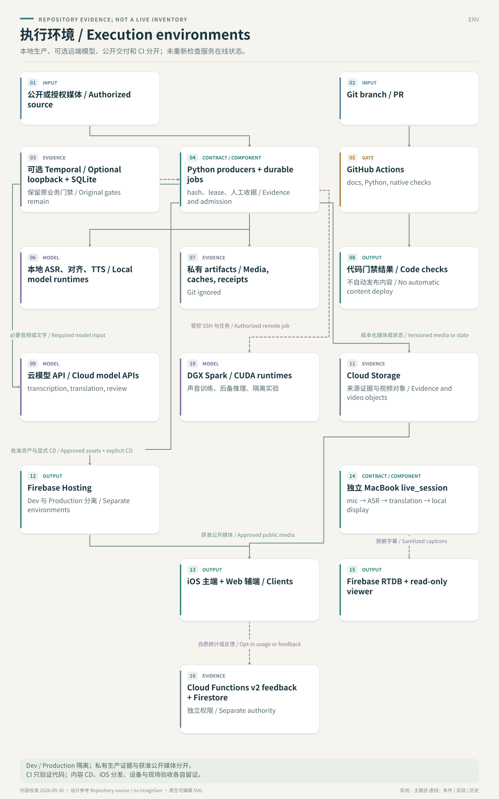

# 执行环境设计：本地、模型、云端与 CI 的边界

[README](../README.md) · [App 设计](app-system-design.zh.md) · [后端工作流 DAG](backend-workflow-system-design.zh-en.md) · [实验方向](experiment-directions.zh.md) · [文档索引](README.zh.md)

核查日期：2026-09-30；代码基线 `dev@fc3e2fbc60b0fd2c5b59c64fcd515c465efc6b0b`。这是仓库代码、配置和既有运行记录支持的拓扑，不是在线资产盘点；本次没有连接 Spark、启动服务、调用模型或部署。部署身份与本机连接参数继续从既有受控配置取得，本文不复制私人主机、账号路径或密钥。

2026-10-01 路由决定：[预制本地制作默认 Spark、MacBook fallback](local-production-compute-policy.zh.md)。本页相应文字和 Mermaid 已更新；下方 SVG 保留 9 月 30 日拓扑快照。云端全流程资源、费用与接入缺口见 [GCP 评估](gcp-production-feasibility-20261001.zh.md)，尚未部署。

## 拓扑 / Execution topology

箭头标明跨边界的数据或动作；可选路径不意味着当前所有服务在线。



<details>
<summary>Mermaid source / 可编辑拓扑源</summary>

```text
flowchart TB
    SOURCE["公开或授权媒体 / Authorized source"] --> LOCAL
    subgraph MAC["MacBook：生产协调与本地计算 / Local execution"]
      LOCAL["Python producers + durable jobs<br/>hash、lease、人工收据 / Evidence and admission"]
      MODELS["本地 ASR、对齐、TTS / Local model runtimes"]
      PRIVATE["私有 artifacts / Media, caches, receipts<br/>Git ignored"]
      TEMP["可选 Temporal / Optional loopback + SQLite<br/>保留原业务门禁 / Original gates remain"]
      LOCAL --> MODELS
      LOCAL --> PRIVATE
      TEMP -.-> LOCAL
    end
    LOCAL -->|"必要音频或文字 / Required model input"| API["云模型 API / Cloud model APIs<br/>transcription, translation, review"]
    LOCAL -->|"受控 SSH 与任务 / Authorized remote job"| SPARK["DGX Spark / CUDA runtimes<br/>默认预制模型计算、声音训练、隔离实验"]
    LOCAL -->|"批准资产与显式 CD / Approved assets + explicit CD"| HOST["Firebase Hosting<br/>Dev 与 Production 分离 / Separate environments"]
    LOCAL -->|"版本化媒体或状态 / Versioned media or state"| GCS["Cloud Storage<br/>来源证据与视频对象 / Evidence and video objects"]
    HOST --> CLIENT["iOS 主端 + Web 辅端 / Clients"]
    GCS -->|"获准公开媒体 / Approved public media"| CLIENT
    LIVE["独立 MacBook live_session<br/>mic → ASR → translation → local display"] -.->|"脱敏字幕 / Sanitized captions"| RTDB["Firebase RTDB + read-only viewer"]
    CLIENT -.->|"自愿统计或反馈 / Opt-in usage or feedback"| FEEDBACK["Cloud Functions v2 feedback + Firestore<br/>独立权限 / Separate authority"]
    GIT["Git branch / PR"] --> CI["GitHub Actions<br/>docs, Python, native checks"]
    CI --> CHECKS["代码门禁结果 / Code checks<br/>不自动发布内容 / No automatic content deploy"]
```

</details>

## 具体运行边界与证据

| 执行域 | 实际入口 / 数据 | 已有能力与限制 |
|---|---|---|
| MacBook 制作工具 | [本地 runbook](codex-local-production-runbook.zh.md)、[固定 L2 controller](../scripts/canonical_layer2_controller.py)、[workflow jobs](../scripts/sermon_workflow_jobs.py) | Python 调度下载、FFmpeg、包校验与生成；磁盘 job/lease/receipt 支持恢复。固定 L2 adapter 与 legacy PDF Supervisor 各有范围，尚非完整 canonical L1–4 自动生产 |
| Apple Silicon 本地模型 | [语音运行合同](../experiments/sermon-dubbing-poc/SPEECH-RUNTIME.zh.md)、[speech backend](../experiments/sermon-dubbing-poc/speech_backend.py)、[正式 L3 renderer](formal-layer3-renderer.zh.md) | legacy weekly runner 的 MPS TTS 与 MLX ASR/ForcedAligner 作为 fallback；现有任务继续原后端恢复。正式多语言 renderer 有自己的授权音色/adapter 合同，尚无完整跨机自动 fallback。模型、revision、设备、精度与实际输入写入收据 |
| DGX Spark | [Spark transport](../experiments/sermon-dubbing-poc/spark_transport.py)、[speech worker](../experiments/sermon-dubbing-poc/spark_speech_worker.py)、[训练说明](../experiments/sermon-dubbing-poc/TRAINING.zh.md) | 受控 SSH 传输、隔离 CUDA 环境、声音训练及预制本地模型计算默认路径；CPU 打包和正式 API 仍有独立执行边界。checkpoint 不匹配或语义失败不能靠换主机绕过 |
| 云模型与控制会话 | [Layer 2 runner](../scripts/run_target_language_models.py)、[Supervisor](sermon-production-supervisor-agent.md) | L2 生产 policy 固定 Astra 初译、Sol 审校；文件转写与控制会话分别记录。现有 dual-PDF Agents API 的 `environment: none` 由本地执行受限工具，不是在云会话内托管完整后端 |
| 本地 Temporal | [Temporal 合同](sermon-temporal.zh.md)、[实现](../scripts/sermon_temporal/) | 已有单机 loopback + SQLite 路径，默认只读；显式执行仍受原 lease/approval 限制。不是 HA 集群；历史不替代媒体、job 和批准备份；不证明当前机器服务在线 |
| 发现与旧云生产 | [Supervisor 历史边界](sermon-production-supervisor-agent.md)、[Cloud Run 历史设计](system-design.zh.md) | 文档记录 Cloud Scheduler 发现源和 GCS 状态；旧 post-live Cloud Run Job 已退役。现存源码不是正在运行的旧生产服务，调度健康须另查 |
| 周日现场字幕 | [本地 POC 设计](../experiments/local-live-poc/DESIGN.zh.md)、[Gateway](../experiments/local-live-poc/backend/gateway.py)、[Firebase publisher](../experiments/local-live-poc/backend/firebase_publisher.py) | 浏览器麦克风、PCM/WebSocket、本地 ASR/Ollama 翻译与恢复录音；独立 LAN/SSE 和 Firebase 只读字幕路径。v4.1 是隔离试验，不因同在 MacBook 就取得分享或生产资格 |
| Firebase 与 GCS | [环境隔离合同](development-branch-and-firebase-environments.zh.md)、[受控 CD](../scripts/run_multilingual_cd.py)、[视频迁移记录](reports/20260928-full-video-bucket-migration.zh.md) | Dev/Production 项目和站点分开。HTML、catalog、音轨、字幕、索引由 Hosting 提供；9 月 28 日记录完整视频在独立 bucket，Hosting 精确 302 指向按 SHA 命名的对象。公开视频对象与私有生产证据是不同访问范围 |
| 反馈、统计与 Tracker | [feedback API](../experiments/sermon-dubbing-poc/feedback-api/README.zh.md)、[Tracker](../experiments/sermon-dubbing-poc/tracker-admin/README.zh.md)、[远端 review bridge](tracker-remote-review-bridge.zh.md) | API/Firestore 与静态媒体分开；Tracker 是脱敏投影，远端请求须由本地 bridge 校验并形成匹配收据，不能直接改本地生产真相。本文不推断每项功能都已部署 |
| GitHub CI | [Python/docs workflow](../.github/workflows/python-tests.yml)、[iOS workflow](../.github/workflows/tongxing-ios.yml)、[promotion policy](../.github/workflows/branch-promotion.yml) | required `unittest`、`native-client`；进入 main 另有 promotion-policy。文档白名单走 links/格式快路径，native/shared contract 按差异运行。CI 不调用生产模型，不随 main push 自动发布每周内容 |

## 存储、网络与恢复

| 数据 | 存储与信任边界 | 恢复或发布规则 |
|---|---|---|
| 代码、schema、prompt、紧凑报告 | Git；通过 PR 进入 `dev`，再按发布规则进入 `main` | 不包含密钥、账号签名、私有媒体、完整模型输出或环境目录 |
| 来源媒体、缓存、模型权重、生产收据 | ignored `artifacts/`、运行目录和显式配置的受控存储 | 复用前核对来源、hash、policy 和角色；未返回结果先对账，不能为补日志重跑付费阶段 |
| 公开页面、音轨、字幕和目录 | 通过批准后发布清单进入指定 Hosting | 内容、代码 SHA、目标环境和 build-report 分别绑定；上传后 HTTP/SHA、Range 独立核验 |
| 完整视频 | 独立 Dev/Production 媒体 bucket；精确对象路径及 CORS | 保留稳定 Hosting URL 与可回退版本；上传成功不等于全部客户端通过 |
| 客户端缓存、播放历史、麦克风片段 | iOS/Web 本地存储与处理，按客户端合同 | 错 hash 不标离线可用；现场采音不成为公开原声上传。匿名统计的自愿开关独立控制 |
| Temporal、job locks、Tracker | Temporal history/SQLite、本地原始 receipts、远端脱敏投影分别存储 | 原始包与人审收据决定准入，观察视图或队列完成状态不能替代批准 |

具体网络动作限于对应工作流：模型请求传必要输入；Spark 走受控远端 worker；客户端读取已批准静态资源；反馈与 RTDB 使用各自数据规则。新环境必须从 runbook 验证依赖、模型缓存与权限，不把现有 host 的私人路径复制为部署设计。

## 发布和未完成事项

代码晋升、内容发行、iOS 签名分发是三个动作。[环境隔离合同](development-branch-and-firebase-environments.zh.md)要求正式 CD 使用干净且与远端一致的 `dev`/`main`、固定候选 hash、目标 project/site 与显式执行。当前 CD 由受控本地入口执行；仓库没有据此建立自动云端内容发布集群。

多机容灾、全局模型资源调度、canonical L1/3/4 dispatch 与 PR164 strict-verifier 接线保持各自待完成状态，见[后端地图](backend-workflow-system-design.zh-en.md)、[Stage 0 阻塞项](canonical-stage0-evidence.zh.md)和[统一 Backlog](backlog.zh.md)。历史成功记录不替代新的部署、模型健康或现场验证。
