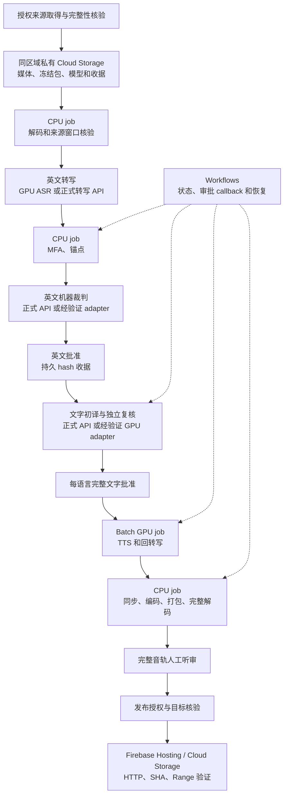

# 预制生产提速与 GCP 全流程可行性评估

评估日期：2026-10-01。范围是 9 月 27 日三语预制制作：31:31.677 来源，420 英文锚点，中文 419、韩语 420、西语 420 个单元，共 1,259；正式初译与复核成功版本共 2,518 次请求。三语原始生成音频合计 90.493 分钟，最终发行约 1.027 GB。模型基准、工作量与假设见 [分层 A/B](local-model-layer-latency-ab-20261001.zh.md)和[可复算工作量](../data/benchmarks/local-layer-latency/2026-10-01/weekly-20260927-projection.json)。本轮只调查、修改项目默认策略和离线验证，没有创建云资源、支付模型试跑、训练声音或发布内容。

**10/7 更新，取代本文的云端起步建议和费用情景：** 正式单讲员 TTS 现在固定 8 副本 × batch8，单张 L4（24GB）放不下，所以下文“从一张 L4 开始”、单 L4 的 $3–7/篇和 $11–27/月情景都已过时，只保留作历史记录。当前评估见 [云端 GPU 资源与并发评估](reports/20261007-cloud-gpu-resources-and-concurrency.zh.md)：按语言各开一张大显存卡（80GB 起，租卡前先实测显存和 CPU），GPU 只占整周墙钟的一小部分。

## 结论和成本边界

本地采用 [Spark 默认、MacBook fallback](local-production-compute-policy.zh.md)。先消除逐片启动和重复装载，验证受限批处理，再评估第二张 GPU。~~云端从一张 L4 开始，建议 `g2-standard-12`（12 vCPU、48GiB 主机内存、24GB 显存）做容量验证；更省的 `g2-standard-8` 留作峰值内存通过后的候选。~~（已被 10/7 评估取代，见上。）

（以下单 L4 预算已过时，见上。）**在假设 GPU VM 累计开机 2–6 小时的情景下，一篇三语的增量云生产基础设施预算约 $3–7，另加固定缓存、外部 API、持续托管和实际观众流量。** 这不是完整正式流程报价或 L4 实测 ETA。按每月四篇，本文情景约 $11–27/月（包含 50GiB 共享模型缓存），尚未覆盖持续增加的历史媒体库与下列未知费用。

必须区分两条云生产路线：

| 路线 | 内容模型 | 能得出的结论 |
|---|---|---|
| 保持正式生产策略，将执行搬到 GCP | 原转写 API、Astra 初译、Sol 复核、现有 Qwen 配音与质检 | 最接近既有流程；模型 API 费用在 GCP VM 费之外，缺少统一覆盖的完整用量，不能计为零 |
| 把本地模型全托管在 GCP | Qwen3-ASR 0.6B、Qwen3.5 9B 文字实验、授权 Qwen3-TTS 1.7B checkpoint；对齐和机器裁判另选经验证的 adapter | 可估算基础设施；9B 初译、复核及三语质量尚未批准，不能称为正式 Astra/Sol 的等效替换 |

“全流程在云端”指来源进入云存储后，计算、编排、审阅入口和交付不依赖 MacBook 开机；人工审稿、听审、发布授权仍是匹配 hash 的持久收据。旧 post-live Cloud Run Job 已退役，新方案需要新 worker、状态存储和审批接线，不能恢复旧 Scheduler 就宣称迁移完成。

## 本地优先优化什么

以下“现状”是本次调研的开发前基线。四项 P1 已按用户决定并行开发，实际入口和离线验收见[提速开发 backlog](local-production-speed-backlog.zh.md)；性能和质量实验尚未运行。

| 优先级 | 方法 | 当前代码事实 | 实施与验证要求 |
|---|---|---|---|
| P0 | 量到实际关键路径 | accounting 已有阶段／依赖日志，网络、远端排队、部分进程外阶段仍有缺口 | 同一请求记录 dispatch、queue、import、load、prefill/decode 或 synthesis、save、transfer、encode、gate；机器耗时、人审和等待分开。先测正式 checkpoint 的三语 10 分钟代表样本，再外推 |
| P1 | 旧 ASR/ForcedAligner worker 批次驻留 | legacy `spark_speech.py` 每次 generate 新 SSH、Docker、权重 hash 和模型 load；canonical `screen_target_language_audio_units.py` 已在整个 CLI 内只装一次 ASR | 将一批单元交给一个 worker，模型身份每 worker 启动检查一次，各单元输入和输出仍分别 hash、留回执。不要对已有驻留路径重复声称收益 |
| P1 | 文字组有限并发 | `run_target_language_models.py` 支持 workers 1–3，当前三份 policy 都为 1；每组仍先初译再独立复核 | 在新实验 policy 测 workers 1/2/3；保留顺序聚合、独立角色和 lease。外部 API 可能减少请求等待，本地单 GPU 的客户端并发不保证吞吐增加 |
| P1 | TTS／回转写短单元批处理 | 正式 TTS 单 job 模型驻留但逐单元调用；正式回转写 batch size 为 1；legacy `render_weekly_audio.py` 已默认 batch=4 | 正式路径测 batch 1/2/4/8，legacy 以现有 batch=4 为基线；同长度分桶减少填充浪费，限制显存和长尾。保留每片 seed、speaker、locale、checkpoint、来源及输出身份；生成结果变化进入新 revision 并复核 |
| P1 | 依赖允许的 CPU/GPU 重叠 | 已有 [PDF 与配音并发合同](parallel-dubbing-contract.zh.md)，原声指纹可预计算 | CPU 负责解码、同步组装、MP3、hash；GPU 负责模型。按 locale 的完整批准包进入下游；三语都完成后统一发布的计划仍遵守，不能逐片越过全篇门禁 |
| P1 | 精确续跑和局部重做 | L2 有返回缓存／raw-response 恢复，TTS 有单元缓存和 revision reuse | 仅重算失败或受上下文影响的组，保留 source/prompt/policy/checkpoint hash；未知 API/远端结果先对账。对全新 happy path 无缓存命中时，不能算成吞吐收益 |
| P2 | attention 与专用推理框架 | 当前 TTS 使用 SDPA；Qwen 官方列 BF16、FlashAttention2、批推理和 vLLM-Omni 路径 | 在 Spark GB10 上先核对构建兼容；用同一个定制 checkpoint 试验，测完整输出、EOS、术语和声音。不能从官方示例推断当前 speaker checkpoint 已兼容或有确定加速倍数 |
| P2 | 多 GPU 分片 | 尚无 canonical 多机统一派发 | 每张 GPU 一个驻留 worker，按预期音频秒数或输出 tokens 分任务，单元独立回执、最终完整聚合。切片保持已审自然句界；不为加速重新切碎句子 |

模型驻留是“同阶段的一批单元只加载一次”，不要求所有模型同时留在显存。不要让多个 TTS 进程互相争抢一个 GPU；Spark 原有文字服务也要计入共享资源与排队，不能通过重启生产服务制造基准。

默认换到 Spark 本身不保证整篇更快：开发前 legacy 质检逐片重载的启动成本可能抵消热推理收益。批次驻留代码仍须实测；之前 3 小时 15 分预算假设模型驻留，正式 producer 和 legacy 执行路径要分别计时。

Qwen 的公开说明提供批推理和加速路径，可作为实验入口；当前项目还需要 adapter、身份和质量验收。[Qwen3-TTS 官方入口](https://github.com/QwenLM/Qwen3-TTS)、[vLLM-Omni Qwen3-TTS 批推理](https://docs.vllm.ai/projects/vllm-omni/en/v0.16.0/user_guide/examples/offline_inference/qwen3_tts/)

### 不把局部加速当成全流程加速

Spark 的全本地代理小计约 131 分钟，其中文字约 71、TTS 约 56；还有主观预留一小时，之前的排程为 3 小时 15 分。正式 Astra/Sol 延迟未知，因此这里只分析原代理预算：

- 假设 TTS 吞吐翻倍，只节省约 28 分钟，原预算约降至 2 小时 45 分，而不是整篇时间减半。
- 再假设文字阶段也翻倍，原预算约降至 2 小时 15 分。
- 两者都是敏感度，尚未实现或实测；一小时未测项可能不足，人工听审另计。一个人依次听三条最终音轨至少 95 分钟。

MacBook 同时分担约 18% 的纯 TTS 音频量，理想值可从 Spark 单机约 56 分降到约 45.5 分；这只节省约 10 分，还增加跨机目录、收据和声音一致性管理。先修重复启动／批处理更值得验证；MacBook 默认保留作为故障恢复资源。

## 全流程云端拓扑

媒体取得首先验证授权路径与云端可获取性。项目曾在 Cloud Run 遇到 YouTube bot-check；不能假设云 GPU 能解决，也不上传私人 cookies 作为默认方案。9 月 27 日已授权的 Drive 来源可作为读取／导入实验，但仍须验证云 service account 的读取权限和同一媒体 SHA。若只能由本机取得，导入后可云端处理，但应如实称为“本机取得媒体＋云制作”。

GPU job 在进入人审前结束，审批在轻量服务／Workflows callback 上等待，再按收据启动下一阶段；避免为了等人而持续计费。Workflows 不替代内容审核，Task 成功不代表 package 获准。Batch 本身没有额外服务费，消耗的 VM、磁盘等照常收费。[Batch 定价](https://cloud.google.com/batch/pricing)、[GPU job](https://docs.cloud.google.com/batch/docs/create-run-job-gpus)、[审批 callback](https://docs.cloud.google.com/workflows/docs/creating-callback-endpoints)

## 模型与机器容量

以下参数字节数是容量下限推算，不是实测峰值；加载副本、tokenizer/codec、KV cache、激活和框架另计。

| 模型／环节 | 容量依据 | 初始资源选择 |
|---|---|---|
| Qwen3-ASR 0.6B / ForcedAligner 0.6B | 每个 BF16 主权重约 1.2 GB；分阶段加载 | 单 L4，批次从 1 开始测 |
| Qwen3-TTS 1.7B 授权 checkpoint | BF16 主权重约 3.4 GB，speech tokenizer/codec 另计；必须沿用正式周次 hash | 单 L4，测试 batch 1/2/4/8 和三语长尾 |
| Qwen3.5 9B BF16 文字实验 | 主权重约 18 GB；24GB 显存剩余容量较紧，不能保证长上下文、batch>1 可用 | 单 L4 有条件候选；测峰值后降低 batch/context 或选择更大显存，量化另做质量试验 |
| Spark 常驻的 27B Q4 文字服务 | 和本次 9B 基准是另一配置；实际 GGUF 大小、KV cache、CUDA 支持需独立盘点 | 不能套用 9B 的时间或内存估计；27B BF16 主权重约 54 GB，超出单 L4 |
| MFA、FFmpeg、同步、页面及 hash | CPU 和磁盘工作，不需要持续占 GPU | `e2-standard-4`，4 vCPU/16GiB；与 GPU VM 的 CPU 复用也是待测方案 |

G2 的 L4 每卡 24GB，双卡各自独立，不能自动视为共享的 48GB。G2 是 Cascade Lake x86，Spark 是 ARM/GB10；重建 linux/amd64 CUDA 镜像与原生依赖，不复制 Spark venv。固定驱动、PyTorch、模型文件身份并留新运行时收据。G2 支持 `pd-balanced`，不支持 `pd-standard`；官方另有限制包括不可直接用 Deep Learning VM image 作为启动盘。[G2 官方规格与限制](https://docs.cloud.google.com/compute/docs/accelerator-optimized-machines)

## GCP 价格与可复算费用

取价日期 2026-10-01，区域 Iowa `us-central1`，USD、Linux、on-demand、默认 RAM；不用 Spot、长期承诺、免费额度或税费推低预算。VM 单价已包含 GPU、vCPU 和默认内存，磁盘与网络另算。

| 规格 | GPU | vCPU / 主机 RAM | 完整 VM 每小时 |
|---|---|---|---:|
| g2-standard-8 | 1 × L4 24GB | 8 / 32GiB | $0.853624312 |
| g2-standard-12 | 1 × L4 24GB | 12 / 48GiB | $1.000416348 |
| g2-standard-24 | 2 × L4，各 24GB | 24 / 96GiB | $2.000832696 |
| e2-standard-4 | 无 | 4 / 16GiB | $0.134022840 |

来源：[GPU VM 官方价格](https://cloud.google.com/products/compute/pricing/accelerator-optimized)、[CPU VM 官方价格](https://cloud.google.com/products/compute/pricing/general-purpose)。增大主机 RAM 不会增大单卡显存。

### 单篇生产情景：单 L4

以 `g2-standard-12` 为主情景。GPU 开机时数包含装载、切换、运行、重试和 GPU 闲等；2/4/6 是情景输入，不是从 Spark 速度推出来的 L4 完成时长。外部 API 文字链可能与 GPU 分阶段执行，所以 GPU 开机时数也不是总墙钟时长。

| 假设 GPU VM 开机 | GPU VM | 临时 100GiB balanced disk | CPU＋对象存储＋操作＋编排＋一次读出 | 增量基础设施合计 |
|---|---:|---:|---:|---:|
| 2 小时 | $2.001 | $0.027 | $0.533 | **$2.56** |
| 4 小时 | $4.002 | $0.055 | $0.533 | **$4.59** |
| 6 小时 | $6.002 | $0.082 | $0.533 | **$6.62** |

固定 $0.533 情景由以下相加：CPU 1 小时 $0.134；新增产物／中间文件 5GiB 保留约一月 $0.100；10,000 次 Class A 和 10,000 次 Class B 操作 $0.054；10,000 internal steps 和 1,000 external steps 按不扣免费额度计 $0.125；美国审阅者读出 1GiB $0.120。这些工作量是明确假设，实际日志、镜像仓库、Secret Manager、额外启动、持续 Web/Firestore/Hosting、多版本媒体和额外读出另计，不能把表当作总账单上限。

计算采用：balanced disk $0.000136986/GiB-hour；Iowa Standard Storage $0.000027397/GiB-hour（730 小时约 $0.020/GiB-month）；Class A $0.005/千次，Class B $0.0004/千次；美国互联网读出首档 $0.12/GiB。同区域 Storage→计算的数据传输可免 Storage 出网费，跨区和面向用户读出单独计费。来源：[磁盘价格](https://cloud.google.com/compute/disks-image-pricing)、[Storage 价格](https://cloud.google.com/storage/pricing)、[Workflows 价格](https://cloud.google.com/workflows/pricing)。

共享模型、checkpoint 和运行资产暂按 50GiB Standard Storage 计约 $1/月；实际大小应在云试验前清点。按每月四篇、5GiB/篇只留一月，以上约 $11.25 / $19.36 / $27.47。长期保留一年时，历史媒体存储随周次累计增加。100GiB 临时盘若保留整月约 $10，而不是每篇数美分；VM 关机不等于磁盘不再计费。

若 100 次观看各读出完整约 0.956GiB 的发行资产，直接 GCS 美国读出约 $11.47；这里只展示量级，实际缓存、观看比例、CDN/Firebase 计费产品、免费额度和用户地区不同。观众交付流量应与制作成本分账，不能默认包含在 $3–7 内。

### 两卡与等待的成本

如果任务能充分分片，在相同 4 个聚合 GPU 小时下：单 g2-standard-12 用 4 小时约 $4.002，两卡 g2-standard-24 用 2 小时也约 $4.002；这只是理想成本等式，不保证墙钟减半。串行门禁、装载、长尾和未占满 GPU 的时间仍在。

两台 g2-standard-8 合计 $1.707248624/小时，比一台双卡便宜，但总 CPU/RAM 也更少。分配每张卡一个 worker 比先实现模型跨卡拆分更适合本项目的独立单元。人审等待 4 小时若保持一台 g2-standard-12 在线，额外约 $4；双卡约 $8。如果全年常开一台 g2-standard-12，按 730 小时约 $730/月，仅 VM 就远超每周按需制作。

Spot 是可恢复任务的后续选择，不作为 happy path 时间保证：价格变化、抢不到容量、被中断、模型重装与未保存结果都要计入。先确认区域 L4 和全局 GPU quota；有 quota 也不保证容量。[GPU 配额](https://docs.cloud.google.com/compute/resource-usage)、[Spot 行为](https://docs.cloud.google.com/compute/docs/instances/spot)

公式、全部情景和未计费用见 [gcp-cost-scenarios.json](../data/benchmarks/local-layer-latency/2026-10-01/gcp-cost-scenarios.json)。正式路线总费用为 `本表基础设施 + 实际转写/初译/复核/裁判/控制API用量费用 + 持续托管 + 额外交付流量 + 税费`；全托管文字路线在达到同样质量门槛之前只能报告实验结果。

## 下一步验证与选择标准

1. 本地先用正式 checkpoint 和三语固定短／长句，测完整命令到结果、每秒音频耗时、峰值显存及 batch 1/2/4/8；旧质检另测单 worker 批处理。使用独立任务和目录，不重启原有 Spark 服务。
2. 云试验准备固定输入清单、模型与 checkpoint hash、linux/amd64 依赖锁、资源限制、计费 labels、退出后资源清单。未来实际开机应指定一次试验的金额与最长运行时；本轮未开机。
3. 在 L4 上测冷启动、模型装载、同片段三语 TTS、回转写、文字生成和独立复核；必须采到正常 EOS、完整音频、质量回执和真实 Billing，不以健康接口代替推理。
4. 通过后做 10 分钟四层 rehearsal，再做整周从来源取得到 HTTP/Range 的 Dev 路径；人审等待通过云 callback 恢复，MacBook 关闭后仍能继续。旧 canonical 自动 dispatch 缺口须先接线。
5. 决策比较：`完整质量合格的整周时间`、`每篇真实费用`、`重试率`、`人工等待`、`结果一致性`和`无本机恢复能力`。只有 GPU 快但总流程不快时，优先改调度／请求粒度；云端只在时间、可用性或维护收益足以支持迁移时再推进。
