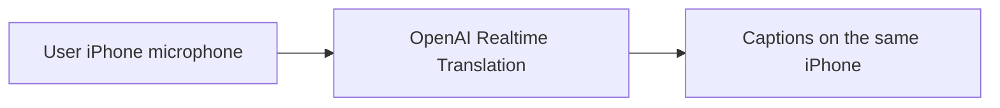
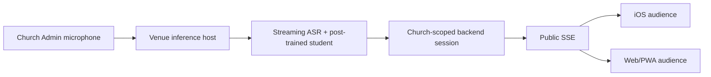
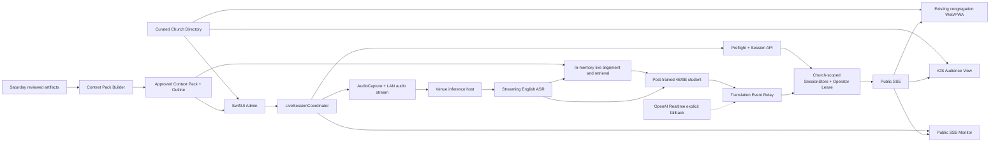
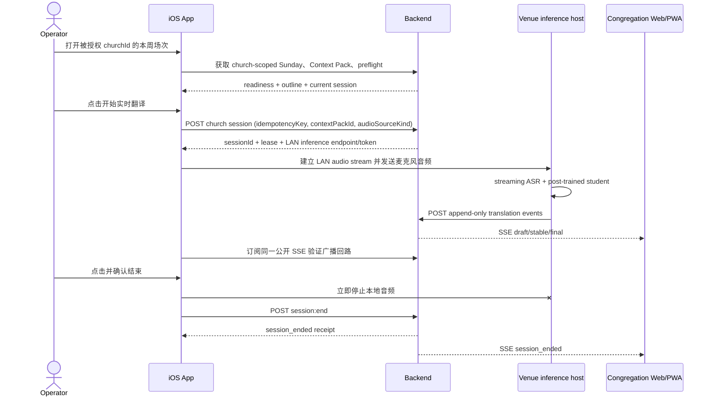
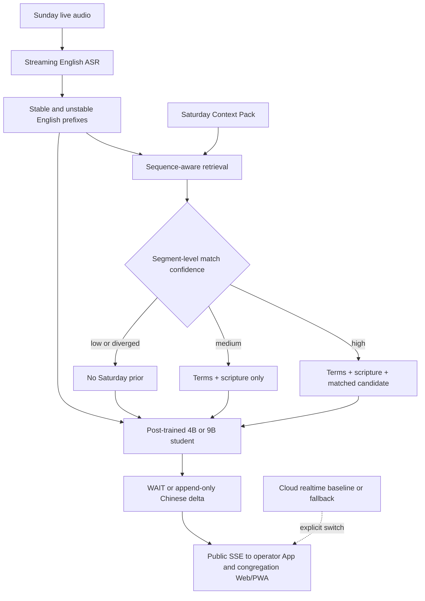
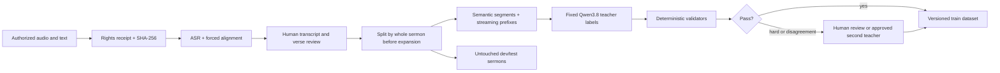

# 证道实时翻译 iOS App 设计

状态：Design proposal

日期：2026-08-30

分支：`design/sermon-live-translation-ios`

方案：**C — 固定教会列表，中心采集，统一分发**

模型、训练、数据与许可的专题设计见[证道实时翻译后训练文档集](./live-translation-post-training/README.zh.md)。如果本综合稿与专题文档冲突，以专题文档对应部分为准。

## 1. 结论

本文件正式定义 **方案 C：固定教会列表，中心采集，统一分发**。第一版是一个双角色 iOS App，与现有 Web 保持相同的产品边界：会众从受控教会列表选择教会并观看统一字幕；通过鉴权后进入该教会的 Admin 操作，负责周日现场检查、启动/停止实时翻译和查看周六大纲。

推荐的目标架构：

- 登录后加载本周已审核的 `Sermon Context Pack` 和周六大纲。
- 在一个“周日准备”页面完成网络、后端、麦克风、音频路由、音量和 Context Pack 状态检查。
- 点击一个醒目的“开始实时翻译”按钮，建立唯一的 Sunday realtime session。
- POC 默认使用 operator iPhone 麦克风作为受控音源；音频优先送到教会局域网内的推理主机，长期可切换为调音台或授权直播音轨。
- 周日主路径采用流式英文 ASR + 后训练小型学生模型，直接产生 append-only 中文增量；`gpt-realtime-translate` 保留为质量/延时对照和显式故障回退，不作为默认生产依赖。
- 运行中显示录音、局域网推理主机、ASR、学生模型、字幕稳定器和公开 SSE 的真实状态，并允许随时查看周六大纲。
- 点击“结束实时翻译”后立即停止音频输入，关闭 session，并留下可验证的结束状态。
- iOS 会众端和现有 Web/PWA 都接收后端广播的同一份 SSE 字幕；Admin 页面也订阅这条公开流，用它验证真实分发结果。
- 一个教会一场证道只建立一个 active translation session；不同教会可以并行运行，所有 session、Context Pack、权限和观测数据都必须按 `churchId` 隔离。

两个角色共享字幕模型与组件，但权限和任务必须分离：会众端不能看到 token、麦克风或生产控制；Admin 端不能另外生成一份只在本机可见的字幕。周日开始操作必须简单、可观察、可停止，周六准备成果必须能被利用但不能覆盖现场事实。无论两个版本多么接近，**周日实时英文始终是字幕事实来源**。

后训练的目标不是让 4B/9B 学生模型复制教师的全部通用能力，而是把任务收窄为“英文证道流式前缀 -> 忠实、稳定、低延时的简体中文字幕”。教师只在离线制数、评审和回归分析中使用；默认数据教师是固定 revision 的 `Qwen/Qwen3.8-27B`。`gpt-5.6-sol` 在取得 OpenAI 对外部 Qwen 学生制数的书面授权前，不得进入训练集。两者都不在周日关键路径上。

## 2. 产品边界

### 2.1 目标用户

第一类用户是中文会众：

- 打开 App 后无需登录即可进入当前场次。
- 主要查看大字号简体中文字幕，可选择中英双语和回看最近字幕。
- 需要明确区分正在直播、重连、字幕停滞和本场结束。
- 与 Web/PWA 接收完全相同的 `draft -> stable -> final` 事件，不能出现两个公开版本。

第二类用户是负责周日实时翻译的现场 operator。operator 通常：

- 在证道开始前几分钟打开 App，需要快速知道“现在能不能安全开始”。
- 可能不是开发人员，不能依靠终端、Cloud Run 控制台或隐藏日志判断状态。
- 证道过程中还要兼顾现场，需要一眼看懂录音、网络、字幕和公开输出是否正常。
- 需要随时查看周六大纲确认方向，但不能误把大纲当作讲员已经说过的话。
- 结束时必须明确停止录音和翻译，不能依赖杀掉 App 或等待超时。

同一个安装包内，会众入口默认公开；Admin 入口必须鉴权，并支持只读观察员与 active operator 两种后台权限。只有持有 active operator lease 的设备可以采集麦克风或控制 session。

### 2.2 MVP 成功定义

会众打开 App 后最多一次操作即可看到当前字幕。operator 登录后能够加载本周周六资料、完成 preflight，并通过一次明确点击启动周日实时翻译。运行中不需要离开主页面即可判断音频是否进入、翻译是否产出、稳定字幕是否生成、会众端 SSE 是否有新鲜事件；周六大纲最多一次点击即可查看。

建议产品指标：

| 指标 | MVP 目标 |
|---|---:|
| 点击开始到 `session_started` | 正常网络 p95 <= 5 秒 |
| session 建立到首个音频帧被接收 | p95 <= 3 秒 |
| 讲员开始说话到首个有意义中文字符 TTFC | 目标 p50 <= 1.5 秒，p95 <= 3 秒 |
| 讲员开始说话到首个可读中文短语 | 目标 p50 <= 2 秒，p95 <= 3.5 秒 |
| 英文 stable prefix 到本地学生首个中文 token | 目标 p95 <= 500 ms |
| 对应语义单元结束到会众端 boundary stable | 目标 p95 <= 5 秒 |
| 首次可读短语之后的改写率 | 目标 <= 15% |
| 断线恢复或明确进入故障态 | <= 10 秒 |
| 音频或字幕停滞告警 | 15 秒内出现 |
| 点击结束到本地音频停止 | p95 <= 1 秒 |
| 现场 75 分钟持续演练 | 0 crash/OOM，且后半程仍满足延时门禁 |

启动和停止动作属于 App 与后台 session contract；字幕时延和新鲜度属于端到端系统，不能只凭 App 或后端单侧健康来判定。

### 2.3 非目标

MVP 不做：

- 让 iOS 会众端产生不同于 Web/PWA 的字幕版本。
- 多个 iPhone 同时成为同一场证道的 active audio source。
- App 内直播视频播放。
- AI 朗读中文字幕或同声传译音频。
- 在 App 内编辑周六大纲、人工改写字幕、做时间轴 review 或模型调参。
- 会后 PDF 生成或取代现有两份 canonical PDF 流程。
- 把 draft 字幕当成正式讲员原文或正式圣经译文。

### 2.4 方案 B 与方案 C

#### 方案 B：用户侧麦克风，用户侧生成字幕

每位会众在自己的 iPhone 上明确点击“个人实时翻译”，授权麦克风后，由本机把现场音频发送到云端 Realtime Translation，并只在本机显示生成的字幕。首版方案 B 不部署本地学生模型，避免每台会众设备的硬件、模型版本和热状态造成新的不一致。



方案 B 的特点：

- 优点：不需要教会 Admin 预先启动；从模型 delta 到本机渲染少一次 backend/SSE 中继。
- 缺点：每位用户的座位、距离、回声和谈话噪声不同，字幕质量与内容可能不一致。
- 每位用户都建立独立 realtime session，成本与并发量随用户数近似线性增长。
- 每台设备都需要麦克风许可；原始现场音频分别从每位用户设备上传。
- 周六 Context Pack 可以按所选教会加载为提示/校正资料，但无法保证所有用户采用同一版本或同时收到同一修正。
- 字幕默认只保留在本机，不写入教会公共 SSE，也不能作为统一直播事实来源。

方案 B 适合作为没有 Admin、没有中心音源时的个人能力。它不能在方案 C 断线时自动开启；必须由用户主动进入、理解隐私提示并授权麦克风。标准 API key 仍只在服务端，用户设备只能取得短期 client secret。OpenAI 提供专用 Translation client-secret endpoint，并建议 mobile client 通过 WebRTC 连接。参考 [Create translation client secret](https://developers.openai.com/api/reference/resources/realtime/subresources/translations/subresources/client_secrets/methods/create) 和 [Realtime WebRTC](https://developers.openai.com/api/docs/guides/realtime-webrtc)。

#### 方案 C：固定教会列表，中心采集，统一分发

每间已接入教会由一台持有 operator lease 的 Admin 设备采集一次、翻译一次；后端将同一组 `draft -> stable -> final` 字幕发布给该教会的全部 iOS/Web 会众。



| 维度 | 方案 B：每位用户独立 | 方案 C：每间教会统一 |
|---|---|---|
| 启动者 | 每位会众 | 该教会 Admin |
| 麦克风 | 每台会众设备 | 一台受控设备/专业音源 |
| 公开字幕 | 没有统一版本 | iOS/Web 同一 event stream |
| 首个可读短语延时目标 | 良好网络约 1.5–3.5 秒 | 后训练主路径 p50 <= 2 秒、p95 <= 3.5 秒，需现场验证 |
| 音质 | 随座位和设备变化 | 可固定摆位并现场检查 |
| 周六资料 | 每设备独立使用 | 后端统一检索、校正和审计 |
| 成本与并发 | 近似随会众数增长 | 本地推理成本近似随 active church session 数增长；云端仅在显式回退时增加 |
| 隐私 | 每位用户都上传现场音频 | 只有明确的中心采集设备上传 |
| 故障影响 | 单个用户 | 当前教会全部会众，因此需要监控/备机 |

本项目推荐方案 C 作为固定教会的正式服务；方案 B 可以作为后续明确标注的个人模式，但不与方案 C 的公共字幕混合。

## 3. 核心体验

### 3.1 信息架构

MVP 有两个角色空间：

1. **教会列表**：由服务端集中维护的固定目录，显示教会、城市/时区和 `直播中 / 即将开始 / 未直播`。
2. **会众观看**（默认）：所选教会的当前字幕、最近字幕、经文和显示设置。
3. **Admin**（鉴权后）：被授权教会的周日准备、实时运行和周六大纲。

“固定列表”表示只有平台审核并启用的教会能出现在目录中，不允许用户输入任意 backend URL 或自行创建教会。列表由 backend 返回并带 `churchListVersion`/ETag，App 保存 last-known-good 缓存；不要硬编码在 app bundle，否则每次增加或停用教会都必须重新发版。App 记住 `lastChurchId`，但启动时仍刷新该教会是否 active。

最小公开目录 schema：

```json
{
  "churchListVersion": "2026-08-30T18:00:00Z",
  "churches": [
    {
      "id": "irvine-community",
      "displayName": "Irvine Community Church",
      "city": "Irvine",
      "timeZone": "America/Los_Angeles",
      "sortOrder": 10,
      "status": "live",
      "nextServiceAt": "2026-08-30T11:30:00-07:00"
    }
  ]
}
```

目录不返回 API origin、Admin identity、token、Context Pack 路径或内部诊断；所有教会继续使用同一受控 API origin，通过 `churchId` 路径隔离。

会众端进入教会后使用单一观看页，不暴露 Admin 控件。Admin 通过设置页或受保护的入口进入，使用独立 `NavigationStack`；周六大纲从准备页或 Live 页以 sheet 打开。不能只靠隐藏按钮保护 Admin。

### 3.2 主界面线框

固定教会列表：

```text
┌──────────────────────────────┐
│  选择教会                     │
├──────────────────────────────┤
│  ● Irvine Community Church   │
│    Irvine · 直播中          > │
├──────────────────────────────┤
│  ○ Grace Church              │
│    Los Angeles · 11:30     > │
├──────────────────────────────┤
│  ○ 示例华人教会               │
│    San Diego · 本周未开始   > │
└──────────────────────────────┘
```

使用 SwiftUI `List` + `NavigationStack`，状态文字与图形同时表达；“直播中”教会排在最前，其余保持后台配置顺序。教会可提供二维码/deep link 直接打开固定 `churchId`，但 App 仍要验证它存在于当前目录。

会众观看页：

```text
┌──────────────────────────────┐
│  11:30 现场           ● 已连接 │
│  Misplaced Fear               │
├──────────────────────────────┤
│                              │
│     神的百姓正站在应许之      │
│     地的边缘，那片土地就      │
│     在他们眼前。              │
│                              │
│  正在翻译…                    │
├──────────────────────────────┤
│  民数记 13–14        查看经文  │
├──────────────────────────────┤
│      回看上一段    Aa          │
└──────────────────────────────┘
```

Admin 准备页：

```text
┌──────────────────────────────┐
│  周日实时翻译          准备就绪 │
│  2026-08-30                    │
├──────────────────────────────┤
│  周六预备大纲                  │
│  Misplaced Fear · 民数记 13–14 │
│  已审核                 查看 > │
├──────────────────────────────┤
│  ✓ 后端与模型可用              │
│  ✓ 麦克风已授权                │
│  ✓ iPhone 麦克风 · 音量正常    │
│  ✓ 会众字幕流可用              │
├──────────────────────────────┤
│       [ 开始实时翻译 ]         │
└──────────────────────────────┘
```

运行页：

```text
┌──────────────────────────────┐
│  ● 正在录音            18:42  │
│  iPhone 麦克风  ▂▄▆▃          │
├──────────────────────────────┤
│  实时翻译   正常               │
│  稳定字幕   2 秒前              │
│  会众字幕流 1 秒前              │
├──────────────────────────────┤
│  如今，那些在基督耶稣里       │
│  的人就不被定罪了。            │
│  正在翻译下一句…               │
├──────────────────────────────┤
│  当前大纲：3. 活在圣灵中  查看  │
├──────────────────────────────┤
│       [ 结束实时翻译 ]         │
└──────────────────────────────┘
```

共同视觉与操作原则：

- 使用 SwiftUI 系统语义色、Dynamic Type、SF Symbols 和标准 safe area。
- 会众端以字幕为唯一主任务；Admin 健康信息不能混入会众页面。
- “开始”是准备页唯一 primary action；preflight 有硬失败时禁用，并明确说明修复方法。
- 运行页始终显示系统录音指示、音频电平、session 时长和字幕新鲜度。
- “结束”使用破坏性样式并二次确认；确认后先停本地音频，再关闭远端 session。
- 当前 stable/final 中文字幕用于 operator 监控；draft 降低颜色对比并用“正在翻译”标识。
- 状态用文字加图形表达，不能只靠红/绿颜色。
- Live 期间默认保持屏幕常亮；结束后立即恢复系统行为。
- 周六大纲顶部持续显示“预备资料；周日现场可能调整”。

### 3.3 状态设计

会众端：

| 状态 | 会众看到什么 | App 行为 |
|---|---|---|
| 等待直播 | “字幕尚未开始”与本周场次 | 低频检查 current session |
| 连接中 | skeleton 或最近 snapshot | snapshot 后以 cursor 连接 SSE |
| 实时 draft | 较弱颜色字幕与“正在翻译” | 原位增量更新，可被 stable/final 替换 |
| stable/final | 高对比主字幕 | 加入最近字幕历史 |
| 重连中 | 保留最后字幕并显示断线时间 | 自动重连，但不把旧字幕伪装成现场 |
| 已结束 | “本场已结束” | 停止高频重试，允许只读回看 |

Admin 端：

| 状态 | operator 看到什么 | App 行为 |
|---|---|---|
| 未准备 | 缺失项与修复动作 | 禁止开始，不创建 session |
| 准备就绪 | 全部检查通过 | 启用唯一 primary action |
| 启动中 | “正在建立安全连接”与可取消状态 | 幂等创建 session、激活音频、建立 realtime 连接 |
| 实时运行 | 录音、电平、计时、字幕与各链路健康 | 持续发送音频和 event，监测 heartbeat/freshness |
| 重连中 | 保留最后 stable 字幕并显示断点时间 | 本地音频按策略暂停或缓冲，带 session lease 重连 |
| 音频中断 | “录音已中断：来电/路由变化” | 立即停止发送并要求 operator 确认恢复 |
| 停止中 | “正在停止录音与会众字幕” | 先停 input，再关闭远端 session，等待结束回执 |
| 已结束 | 开始/结束时间和最后状态 | 不再采集；允许查看本场摘要和周六大纲 |

### 3.4 可访问性

- 支持所有 Dynamic Type 档位；最大字号下隐藏次要元数据，不能截断主字幕。
- VoiceOver 不自动逐字播报 draft；健康状态变化和 destructive confirmation 有明确 label。
- 支持“减少动态效果”；字幕替换使用淡入而不是位移动画。
- 支持竖屏和横屏；横屏保持开始/结束控件和健康状态可见。
- 深色模式使用接近纯黑的背景和低亮度状态色，减少现场干扰。
- 最小触控目标和状态文案适合紧张现场操作，不用仅靠手势触发关键动作。

## 4. 技术架构

### 4.1 推荐技术栈

- SwiftUI + `NavigationStack`。
- Swift Concurrency；UI state 由 `@MainActor` view model 管理。
- `AVAudioApplication` 处理录音许可，`AVAudioSession` 表达录音意图并监测中断和路由变化。
- 局域网音频 client 发送唯一 operator 音源到现场推理主机；云端回退才建立 WebRTC/Realtime connection；`URLSession.AsyncBytes` 读取后台 SSE 作为广播回路验证。
- `actor` 分别负责 realtime 连接和 SSE 连接的生命周期、去重、cursor、退避与取消。
- 状态机严格表达 `notReady -> ready -> starting -> live -> stopping -> ended/failed`，避免重复创建 session。
- 只保存 session receipt、健康指标和 Context Pack 元数据；默认不保存原始音频、API key 或短期 token。

Apple 的 `URLSession` 支持以 `AsyncSequence` 方式在传输过程中读取 bytes，适合原生实现 SSE 客户端。参考 [URLSession](https://developer.apple.com/documentation/foundation/urlsession) 和 [bytes(from:delegate:)](https://developer.apple.com/documentation/foundation/urlsession/bytes(from:delegate:))。

### 4.2 组件关系



建议的 Xcode 模块边界：

```text
ios/SermonLive/
  App/
  Features/ChurchDirectory/
  Features/AudienceLiveCaption/
  Features/SundayReady/
  Features/LiveOperator/
  Features/SaturdayOutline/
  Core/Audio/
  Core/Inference/
  Core/Realtime/
  Core/Networking/
  Core/Models/
  Core/Storage/
  DesignSystem/
  Tests/
```

先保持单一 app target 和内部模块目录，不在 POC 阶段引入复杂 package 拆分。

### 4.3 复用现有后端

当前仓库已经具备：

- `GET /api/sundays/current`：当前 Sunday/manifest 信息。
- `POST /api/admin/realtime/sessions`：创建 session，并返回 `sessionId`、event token、model、`audioSourceKind` 和短期 client secret。
- `POST /api/realtime/sessions/{id}/events`：把 realtime translation deltas 写回统一 session store。
- `GET /api/realtime/sessions/current/events`：公开 SSE 字幕流。
- SSE event `id`、`sessionId`、`createdAt`。
- `session_started`、`caption_delta`、`caption_stable`、`caption_final`、英文 sidecar 事件。
- query string `cursor` 重连入口。

因此公开分发层不需要发明第二套协议：会众端继续镜像现有 Web public SSE contract，iOS 与 Web 的公开字幕都只来自后端 sanitize 后的唯一 SSE 流。需要替换的是上游 translation producer：Admin 把音频发给现场推理主机；主机把 ASR prefix 和学生模型增量写回同一个 church-scoped event ingest。现有 Realtime Translation producer 保留为 feature flag 下的 baseline/fallback adapter，不能与本地 producer 同时写同一 session。

但当前 API 使用全局 `current Sunday/current session`，只能表达单教会。方案 C 必须把现有 contract 扩展为 church-scoped；旧路径可暂时映射到默认教会以保持 Web 向后兼容，但新 iOS App 不应依赖全局 current。

### 4.4 开始与结束时序



开始请求必须带 idempotency key；后台对每个 `(churchId, sunday)` 只允许一个 active operator lease 和一个 active translation producer。重复点击、网络重试或第二台设备不能意外创建第二个 session；不同 church 可以并行。停止采用“本地优先”：即使后台暂时不可达，也要先停止麦克风和局域网音频发送，再重试远端结束并显示未确认状态。

### 4.5 监控字幕 reducer 规则

对每个 `(churchId, sessionId, segmentId)`：

1. 丢弃 `id <= lastAppliedEventId` 的重复事件。
2. `caption_delta` 只更新 draft buffer，不写历史。
3. `caption_stable` 替换同 segment 的 draft，并进入历史。
4. `caption_final` 覆盖 stable；如果 source 是 stable correction，保留修正标记供 operator 诊断。
5. 新 `sessionId` 出现时先处理 `session_started`，再重置 event cursor；不能把不同 session 的相同数字 id 当成重复。
6. 未识别的新 event type 安全忽略并记录计数，不能让流解析失败。

字幕优先级：`final > stable > draft`。同一优先级只接受更大的 event id。

### 4.6 后端契约需要补齐的缺口

现有 session 创建、event ingest 和 SSE 足够做单教会原型，但方案 C production 前必须补齐一个向后兼容的 church-scoped contract v1：

1. `GET /api/churches`
   - 返回受控公开目录、`churchListVersion`、显示顺序、时区和 live summary；不返回 Admin 信息。
2. `GET /api/churches/{churchId}/sundays/current`
   - 返回该教会当前 Sunday、场次、标题和 public session 状态。
3. `GET /api/admin/churches/{churchId}/sundays/{date}/realtime-preflight`
   - 返回 backend、现场推理主机、ASR/student artifact receipts、Context Pack、公开 SSE、active session、operator lease 和推荐音源状态。
4. `POST /api/admin/churches/{churchId}/realtime/sessions`
   - 接受 `sunday`、`idempotencyKey`、`contextPackId`、`audioSourceKind`、`producerProfile` 和 `operatorDeviceId`；返回有限期 lease 与绑定 session 的 producer token。
5. `POST /api/admin/churches/{churchId}/realtime/sessions/{id}:end`
   - 幂等结束 session，并返回 `endedAt`、最后 event id、event archive 和公开流结束回执。
6. `POST /api/admin/churches/{churchId}/realtime/sessions/{id}:heartbeat`
   - 续租并上报匿名音频/连接新鲜度；lease 失效后禁止新的 event ingest。
7. `POST /api/churches/{churchId}/realtime/sessions/{id}/events`
   - 接收该 session 的 translation events；event token 必须同时绑定 `churchId` 和 `sessionId`。
8. `GET /api/churches/{churchId}/realtime/sessions/current/snapshot`
   - 返回当前 `sessionId`、`streamEpoch`、最新 event id、最近 20 条 stable/final 字幕和 session 状态。
   - App 首屏先 snapshot，随后从 `cursor=latestEventId` 接 SSE，避免启动空白和竞态。
9. `GET /api/churches/{churchId}/realtime/sessions/current/events`
   - church-scoped public SSE，同时支持 `Last-Event-ID` header 和 `cursor` query。
10. 增加 `session_ended`、`heartbeat` 和 `stream_reset` 事件；cursor 超出内存窗口或服务重启时显式 reset。
11. 增加 `producer_ready`、`producer_changed` 和 `producer_failed` 事件；每个 session 同时只能有一个 writer，并保存 ASR/student artifact hash、量化、runtime 和 fallback 原因。

`churchId + streamEpoch + sessionId + eventId` 才是完整 cursor。只保存 event id 会在教会/session 切换或服务重启后误判。

## 5. 用周六内容增强周日实时翻译

### 5.1 问题定义

实际情况不是“周六稿等于周日稿”，而是：

- 主要方向通常一致。
- 核心经文通常一致。
- 人名、书卷名、神学术语和关键例证有较高复用价值。
- 具体措辞、段落顺序、开场、临场发挥、故事细节和结束呼召可能不同。

因此周六版本既不是可直接播放的字幕，也不是无关资料。它更适合作为一个**可撤销、可追踪、按片段检索的先验**。

### 5.2 设计原则

1. **Live source of truth**：任何最终字幕都必须能由周日实时英文支持。
2. **Prior may suggest, never assert**：周六内容可以建议译法，不能补写现场未出现的事实。
3. **片段级匹配**：不能因为整篇主题相同就宣布“版本一致”；每个 rolling window 独立判断，同时利用段落顺序。
4. **匹配随时可撤销**：讲员一旦偏离周六结构，当前片段立即退回无先验翻译。
5. **先验预计算**：周六检索结果、术语和经文候选在 session 前加载；运行中只做小窗口匹配，不能把远程检索或大模型请求放进第一条 draft 的关键路径。
6. **一个公开输出**：匹配、检索和校正在后端完成，Admin 监控、iOS 会众端与 Web/PWA 检查同一份字幕。
7. **保留来源证据**：每次先验辅助都记录 pack、候选片段和分数，便于回放和审计。

### 5.3 周六 Sermon Context Pack

周六完成视频提取、转写和翻译后，增加一个只读构建步骤，生成版本化 Context Pack：

```json
{
  "contextPackId": "ctx_2026-08-30_sha256prefix",
  "churchId": "irvine-community",
  "sourceVersion": "saturday-video",
  "sourceSha256": "...",
  "intendedSunday": "2026-08-30",
  "status": "reviewed",
  "sermon": {
    "title": "...",
    "speaker": "...",
    "themeSummaryZh": "...",
    "primaryScriptures": ["Romans 8:1-17"]
  },
  "outline": [
    {
      "id": "outline_03",
      "order": 3,
      "titleZh": "活在圣灵中",
      "summaryZh": "预备摘要；不是周日逐字稿",
      "anchorId": "anchor_03"
    }
  ],
  "terms": [
    {
      "en": "adoption",
      "preferredZh": "得儿子的名分",
      "aliases": ["sonship"],
      "evidenceSegmentIds": ["sat_0042"]
    }
  ],
  "anchors": [
    {
      "id": "anchor_03",
      "order": 3,
      "summaryEn": "Life in the Spirit rather than condemnation",
      "scriptureRefs": ["Romans 8:1-4"],
      "keywords": ["condemnation", "Spirit", "flesh"],
      "segmentIds": ["sat_0071", "sat_0072"]
    }
  ],
  "segments": [
    {
      "id": "sat_0071",
      "en": "...",
      "approvedZh": "...",
      "anchorId": "anchor_03"
    }
  ]
}
```

Pack 中可以包含：

- 已人工确认的主经文和相关经文。
- 人名、地名、书卷名、神学术语及首选中文。
- 面向 operator 的只读中文大纲，以及与之关联的有序语义锚点。
- 可检索的短英文片段及已审校中文。
- 讲员、系列名和教会常用表达。
- 原始 artifact hash、生成版本、review 状态和时间。

Pack 不应包含：

- “下一句一定是什么”的预测指令。
- 没有英文证据即可输出的预制中文字幕。
- 未经允许的整本圣经译文或其他受限内容。
- API key、client secret、管理 token 或原始音频。

### 5.4 周日本地主路径



#### 快通道

- 音频先由现场主机做流式英文 ASR；学生模型持续接收新增 prefix，而不是等待完整句子。
- 每次只允许输出 `WAIT` 或追加新的中文 `delta`，已经 commit 的中文默认不可重写。
- Context Pack 的短术语表、当前经文候选和附近 anchor 在内存中预热；如果 pack 不可用，学生仍以纯 live English 工作。
- 现场解码使用 non-thinking、低 temperature、短输出和持久 KV cache；所有慢速教师请求都在周日前离线完成。

#### 先验通道

- 英文 sidecar transcript 形成最近 8–15 秒 rolling window。
- 用英文语义、经文命中、关键词和上一 anchor 位置检索 Context Pack。
- 检索必须考虑顺序，优先当前 anchor 附近的候选，而不是每句都在整篇中自由跳转。
- 输出 `high / medium / low / diverged`，而不是简单 yes/no。

#### 学生模型输入合同

每个 prefix 样本和线上请求包含：

- 前一小段 live English、当前新增 source prefix 和 ASR 稳定度。
- 已经 commit 的中文，防止重复与回写。
- 当前术语表和经文 canonical wording。
- 最多 1–2 个周六候选片段及其 match score。
- 上一段已确认 anchor，帮助保持顺序。

输出使用结构化 schema：

```json
{
  "segmentId": "live_0123",
  "action": "WRITE",
  "deltaZh": "如今，那些在基督耶稣里的人",
  "commitBoundary": false,
  "priorAssist": "matched_segment",
  "contextPackId": "ctx_2026-08-30_sha256prefix",
  "matchedPriorSegmentIds": ["sat_0071"],
  "matchConfidence": 0.91,
  "liveEvidenceCoverage": 1.0,
  "divergenceReason": null
}
```

学生训练与线上解码的硬规则：

> 只翻译 live English 中实际出现的内容。周六候选只用于术语、经文和表达选择。若候选与 live English 冲突、增加细节或顺序不符，忽略候选。不得为了贴合周六版本而补齐现场未说出的句子。

### 5.5 匹配与降级策略

建议使用三层门禁，而不是单一 embedding 分数：

| 门禁 | 信号 | 失败时行为 |
|---|---|---|
| 主题/经文门禁 | 主经文、书卷、主题关键词 | 仅保留通用术语表 |
| 片段语义门禁 | live English 与周六候选语义相似度 | 不使用 matched segment |
| 忠实度门禁 | stable 输出的每个实质信息能否回指 live English | 拒绝修正，保留无先验版本 |

还要加入顺序约束：

- 已匹配到 `anchor_03` 后，优先检索 `anchor_02–05`。
- 只有强证据才允许大幅向前或向后跳转。
- 连续 2–3 个窗口低置信时进入 `diverged`。
- `diverged` 后仍使用经文/术语表，但停止使用周六具体句子。
- 后续重新出现明确经文或高置信语义锚点时可以恢复匹配。

### 5.6 哪些内容可以安全复用

| 周六资产 | 周日用法 | 风险等级 |
|---|---|---|
| 主经文与书卷名 | 预加载、ASR/翻译术语提示、即时经文卡 | 低 |
| 人名与神学术语 | 术语表和拼写/译名纠正 | 低 |
| 主题与大纲 | 缩小检索范围、预测可能 anchor | 中 |
| 已审校中文短片段 | 仅在 live English 高置信匹配后作为译法候选 | 中高 |
| 完整周六中文字幕 | 只做检索库和 A/B 评估，不直接播放 | 高 |
| 周六音频时间轴 | 不映射到周日现场时间轴 | 禁止直接复用 |

### 5.7 “加速”的准确含义

Context Pack 本身不会让模型算得更快；错误地加入大段上下文反而会增加 prefill。后训练的“加速”来自更小的学生、短输入合同、KV cache、prefix 级 `WAIT/WRITE` 学习和本地网络；Context Pack 主要减少歧义与反复改写。这里追求的是：

- 经文、人名、神学术语更早正确。
- stable correction 少一次或少几次来回修改。
- Scripture card 可以在现场提到时立即显示。
- operator 更早知道当前证道是否沿用周六结构。
- 低置信或偏离时更快退回安全基线。

因此必须同时看 **speech-start-to-first-readable-phrase**、**time-to-correct-stable-caption** 和首次可读短语后的改写率，不能只看模型 tokens/s。

### 5.8 周六大纲与 operator UI

周六大纲是 App 的辅助功能，不是第二份现场字幕：

- 准备页显示标题、主经文、审核状态和更新时间；一次点击打开完整大纲。
- Live 页保留“查看周六大纲”入口；打开 sheet 不暂停音频或 event 发送。
- 大纲只读，始终标注“周六预备资料；周日现场可能调整”。
- 当连续 rolling windows 高置信匹配同一 anchor 时，可高亮相应大纲项。
- `medium / low / diverged` 时取消高亮，不通过自动滚动暗示讲员正在按周六顺序进行。
- operator 可以手动浏览，但手动选中大纲项不影响检索、翻译或公开字幕。

Live 主页面还显示：

- `Context Pack 已加载 / 未加载 / 未审核`。
- 当前匹配模式：`matched / terms-only / diverged / unavailable`。
- 当前 anchor、match confidence、prior-assisted coverage。
- 音频输入、Realtime connection、stable correction 和 public SSE freshness。
- “关闭具体片段复用，只保留经文和术语”的一键降级。

App 本地可以预下载大纲、经文卡和术语表以便现场查看，但断网时绝不能把周六内容滚动并标记为“现场”。

### 5.9 云端 realtime 的新定位

截至本设计日期，官方 OpenAI Docs 显示 `gpt-realtime-translate` 可持续接收音频并输出翻译 transcript deltas。它适合做未训练 baseline、方案 B 和方案 C 的显式故障回退；不要假设可以把整篇周六稿直接注入 translation session。参考 [GPT-Realtime-Translate](https://developers.openai.com/api/docs/models/gpt-realtime-translate) 和 [Create translation client secret](https://developers.openai.com/api/reference/resources/realtime/subresources/translations/subresources/client_secrets/methods/create)。

官方模型说明同时表明 `gpt-transcribe` 支持 unstructured context、keyword hints 和 language hints，可用于提高领域术语、多语言和 code-switching 转写质量。具体能否通过当前 Realtime Translation 内嵌 transcription 配置传递这些 hints，必须用当前 API schema 和真实请求验证；在验证前，设计上把它视为独立 English sidecar 能力。参考 [GPT-Transcribe](https://developers.openai.com/api/docs/models/gpt-transcribe)。

当前仓库已有 delayed stable correction 层，但它不应继续成为目标架构的质量主路径。迁移方式是：

1. 先保留现有 Realtime + stabilizer，形成可重复的基线回放。
2. 增加本地 `translation producer` adapter，输出同一 event schema。
3. 在本地主机预加载 Context Pack，并让后训练学生直接产生 draft/stable。
4. 保留旧 delayed correction 作为离线审计或可关闭的实验组，不覆盖已经播出的 live caption。
5. 只有本地推理健康门禁失败时，operator 才显式切换云端 producer，并产生 `producer_changed` 事件。

另外，当前 `backend/realtime.py` 使用 general realtime client-secret payload 和 `instructions`；production 实施前应把它与当前专用 `/v1/realtime/translations/client_secrets` schema 做一次兼容性 preflight，不能只依据历史 smoke 结果推断当前接口仍一致。

### 5.10 数据与 API 建议

建议新增：

| Method | Path | 用途 |
|---|---|---|
| `POST` | `/api/admin/churches/{churchId}/sundays/{date}/context-pack:build` | 从该教会已验证周六 artifacts 构建 pack |
| `GET` | `/api/admin/churches/{churchId}/sundays/{date}/context-pack` | 查看 hash、review 和覆盖状态 |
| `POST` | `/api/admin/churches/{churchId}/sundays/{date}/context-pack:approve` | 人工确认经文、术语和使用范围 |
| `GET` | `/api/admin/churches/{churchId}/sundays/{date}/operator-brief` | 返回已审核大纲、经文和 Context Pack 摘要 |
| `POST` | `/api/admin/churches/{churchId}/realtime/sessions` | 增加可选 `contextPackId` |
| `GET` | `/api/admin/churches/{churchId}/realtime/sessions/{id}/context-status` | 查看匹配、偏离和辅助覆盖 |

Context Pack 必须绑定：

- churchId；不得跨教会复用未审核术语、讲员或周六片段。
- intended Sunday。
- 周六 source URL 与 SHA-256。
- transcript/translation artifact hashes。
- builder 版本。
- reviewer、review time 和批准范围。

### 5.11 A/B 评估与硬门禁

使用相同的周日现场录音回放五条路线：

1. 云端 realtime + 现有 stabilizer 基线。
2. 未训练本地学生。
3. 领域 SFT 学生。
4. prefix distillation 学生。
5. prefix distillation + Context Pack 学生。

比较：

- 经文、人名、神学术语准确率。
- speech-start-to-first-readable 与 time-to-correct-stable-caption。
- stable caption revision 次数。
- 周六先验实际覆盖率。
- 讲员偏离周六版本后的降级时间。
- prior-induced addition：live English 没说、但字幕因周六内容而加入的信息。

硬门禁：

- `prior-induced addition` 必须为 0。
- Context Pack 路线不能恶化同一学生的 first-readable p95。
- 低置信和 diverged 窗口必须与 baseline 等价。
- 所有 prior-assisted final caption 必须保留 live English evidence 和 pack provenance。

## 6. 后训练与本地学生模型

本节保留系统级摘要；规范性训练设计、checkpoint 快照、数据 schema、DGX runbook、评估与许可门禁见[后训练文档集](./live-translation-post-training/README.zh.md)。

### 6.1 可行性结论与模型分工

这个方向可行，但前提是把问题定义为**领域内的流式增量翻译**，而不是要求小模型成为通用同传大模型。证道语言的经文、术语、句式和讲员风格有较强重复性；周六资料又能提供当周的受控先验。4B/9B 学生有机会在这个窄任务上超过未经适配的同规模通用模型，并接近商业实时翻译的首字延时。最终是否达标只能由未见过的完整周日回放和现场 75 分钟测试决定。

| 角色 | 建议模型 | 用途 | 不用于 |
|---|---|---|---|
| 默认数据教师 | `Qwen/Qwen3.8-27B` 的固定 revision | 离线翻译候选、prefix `WAIT/WRITE` 标签、困难样本解释 | 用移动的 `Qwen3.8` 家族名制数、与其他来源无 provenance 混合 |
| 受限商业参考 | `gpt-5.6-sol` | 不进入训练集的少量质量参考 | 未获书面授权时为外部 Qwen 学生批量制数或自动打分训练 |
| Mac 学生候选 | Qwen3.5 4B 级 text model | M1 Max 64GB 的低延时主模型 | 未经 benchmark 直接承诺生产延时 |
| DGX 学生候选 | Qwen3.5 9B 级 text model | DGX Spark 的质量主模型和 4B 对照 | 把 27B 教师直接当低延时主模型 |
| iPhone 学生 | 1B–3B 量级，后续研究 | 方案 B 或断网实验 | 方案 C 首版生产主路径 |

OpenAI 官方模型页显示 GPT‑5.6 Sol 支持文本输入/输出、Structured Outputs、Responses 和 Batch，但不支持音频输入，也不支持 fine-tuning。技术上它可生成 sequence-level 标签；合同上，OpenAI 当前 Services Agreement 对使用 Output 开发外部 AI 模型设有限制。因此未取得针对本用途的书面授权前，GPT‑5.6 Sol 只作为与训练集隔离的参考，不作为外部学生数据教师。参考 [GPT‑5.6 Sol 官方模型页](https://developers.openai.com/api/docs/models/gpt-5.6-sol)、[OpenAI Services Agreement](https://openai.com/en-GB/policies/services-agreement/) 和[许可专题](./live-translation-post-training/licensing-and-data-governance.zh.md)。

默认教师固定为官方 [Qwen/Qwen3.8-27B](https://huggingface.co/Qwen/Qwen3.8-27B)，而不是参数更大的 Flash-Next；27B 更适合在单台 DGX Spark 上做可重复的离线补制。每次数据发布仍须记录精确 model revision/commit、权重格式、量化方式、chat template 和 decoding 参数，并在训练前重新确认该 revision 的许可证。模型卡当前标示 Apache-2.0，但不能把今天的页面状态当成未来所有 revision 的永久授权结论。

### 6.2 把任务训练成“等待或追加”，而不是整句重译

普通平行语料只教会模型“完整英文 -> 完整中文”，无法解决实时字幕最难的等待策略和反复改写。学生的训练单位应是有状态 prefix：

```text
输入 = 过去英文上下文
     + 当前新增英文 prefix / ASR 稳定度
     + 已 commit 中文
     + 当前经文、术语、最多两个周六候选

输出 = WAIT
   或 WRITE(deltaZh, commitBoundary)
```

核心约束：

- 英文证据不足时学习 `WAIT`，不要猜句尾。
- 一旦 `WRITE`，只追加最短、自然且有证据的中文；默认不能改写已 commit 内容。
- 允许 UI 内尚未 commit 的最后短片段被替换，但 replacement window 必须有严格字数和时间上限。
- 经文只有在 live English 足以判定为精确引用时才使用指定 canonical wording；释义和提及不能伪装成逐字经文。
- 周六候选只影响译名和表达选择，不能生成 live prefix 尚未支持的信息。

同一完整句要采样多个到达时刻，例如 300–800 ms 或按 ASR token 边界形成 3–8 个 prefix。教师分别给出 `WAIT/WRITE` 与增量文本，学生才会学到 latency-quality tradeoff。

### 6.3 语料收集范围

按可信度和用途分层，不把所有文本混成一个训练池：

1. **Gold Sunday paired corpus**
   - 有授权的周日原始音频、时间戳英文转写和人工审校中文字幕。
   - 这是唯一能同时训练/评估现场事实、ASR 噪声和真实改口的数据。
   - 记录教会、讲员、日期、音源、语言、圣经版本、审核者、授权范围和 source SHA-256；敏感 ID 可假名化。
2. **Saturday prior corpus**
   - 周六视频、英文稿、中文稿、大纲、预计经文和术语。
   - 只生成 Context Pack、matched/mismatched 对和困难负样本；不能把周六中文直接当周日目标。
3. **Bible corpus**
   - 使用明确选定且允许相应用途的中英文版本，建立 verse-level 对齐、书卷别名、引用/释义标签。
   - 精确经文最好由 deterministic resolver 返回；模型只负责识别引用及其范围。
   - 对受版权限制的译本，先确认训练、内部存储和向会众分发三种权利，不因“教会用途”自动假设允许。
4. **获授权的历史证道与术语资料**
   - 教会历史周日字幕、讲员词汇表、系列标题、神学课程和人工翻译记忆。
   - 第三方视频或网络字幕只有在权利与来源可证明时进入训练；无法证明的内容只可用于人工研究，不进入可发布数据集。
5. **Hard negatives**
   - 周六有而周日没说、周日改序/换例证、精确引用与释义、口误/自我修正、ASR 同音错词、姓名和书卷名混淆。
   - 目标不是增加语料量，而是专门训练“不补写、不抢跑、偏离时退回 live-only”。

音频只在训练 ASR 或评估端到端链路时需要；翻译学生训练使用经过对齐的英文 prefix。ASR 与翻译必须各有指标，否则 ASR 错误会被错误归因给学生模型。

### 6.4 语料准备流水线



具体步骤：

1. **入库与权利回执**：保存 source hash、许可人/许可文本、允许用途、保留期和删除请求映射；没有 receipt 的样本不能进入训练发布。
2. **转写与对齐**：保存 word/segment timestamp、ASR confidence、人工修正和经文边界；不要只保留润色后的整段文本。
3. **先切分再扩增**：按完整 sermon/date/speaker 划分 train/dev/test，再生成 prefix 和教师标签，防止同一篇讲章片段泄漏到测试集。
4. **语义切段**：以自然短语、标点、停顿和经文引用为边界；同时保留原始连续时间轴，不能把小段随机打乱。
5. **生成 prefix**：从真实 ASR 增量重放，而不是只截人工完美 transcript；保存 unstable -> stable 的变化。
6. **教师制数**：固定 revision 的 Qwen3.8-27B 先给 full-segment reference，再按 prefix 给 `WAIT/WRITE/delta`、经文模式、术语使用和 evidence span；GPT 输出未获外部蒸馏书面授权前不得进入 dataset。
7. **确定性验证**：检查 JSON schema、语言、append-only、长度、经文映射、Saturday-only addition、source coverage 和重复输出。
8. **分歧处理**：validator 失败或困难样本进入双语人工审核；如未来引入另一个已批准的开放权重教师，必须保存独立 provenance，不能用多数投票掩盖问题。
9. **不可变发布**：输出 train/dev/test manifest、数据版本、教师 receipt、过滤统计和可删除索引；后续修正发布新版本，不原地覆写。

### 6.5 教师合同与可复现性

Qwen3.8-27B 的固定 system rubric 至少包含：忠实翻译、简体中文、经文版本、`WAIT/WRITE` 定义、append-only 规则、周六先验限制和 JSON schema。使用固定 chat template 与 decoding 参数做离线批量制数；模型升级必须重跑 calibration set。

每个教师输出必须附带：

- `teacherProvider`、精确 `teacherModel`、可用时的 snapshot/revision。
- `teacherPromptVersion`、schema version、decoding mode、temperature 和生成时间。
- input hash、Context Pack hash、Saturday prior 是否实际使用。
- validator 结果、第二教师结果、人工 review 状态和 rejection reason。

如果未来 GPT 外部制数获得书面授权，它也必须运行相同的逻辑合同，并保持独立 provenance；不能与 Qwen/人工输出静默拼接。训练 loader 必须能按 teacher provenance 过滤和做消融实验。

### 6.6 训练样本 schema

建议的最小 JSONL：

```json
{
  "exampleId": "sermon_20260830_prefix_0042_03",
  "churchId": "church_pseudonym_01",
  "sermonId": "sermon_20260830",
  "speakerId": "speaker_pseudonym_04",
  "audioStartMs": 184220,
  "audioEndMs": 187640,
  "sourceTranscript": "There is therefore now no condemnation...",
  "sourcePrefix": "There is therefore now no",
  "sourceStability": 0.93,
  "committedZh": "所以如今，",
  "action": "WRITE",
  "deltaZh": "那些在基督耶稣里的人",
  "finalZh": "所以如今，那些在基督耶稣里的人就不被定罪了。",
  "scriptureRef": "Romans 8:1",
  "quoteMode": "exact_quote",
  "contextPackId": "ctx_sha256prefix",
  "saturdayPriorUsed": true,
  "teacherModel": "Qwen/Qwen3.8-27B",
  "teacherPromptVersion": "sermon-simul-v1",
  "reviewStatus": "human_approved",
  "sourceSha256": "...",
  "licenseReceiptId": "rights_..."
}
```

正文不进入一般遥测；训练数据仓库与线上日志分开。删除某个来源时，可通过 `sourceSha256/licenseReceiptId` 找到所有衍生 prefix 和教师样本并重建数据版本。

### 6.7 分阶段训练

1. **Stage 0 — 未训练基线**
   - 相同 ASR、相同 Context Pack、相同解码设置下评估 4B/9B 原模型、`gpt-realtime-translate` 和现有 pipeline。
2. **Stage 1 — 领域 SFT**
   - 用人工或已审核 full-segment 平行语料学习证道译法、经文、人名和简洁字幕风格。
3. **Stage 2 — Prefix sequence distillation**
   - 用教师的 `WAIT/WRITE/delta` 样本训练有状态流式输出；高质量人工样本权重大于纯 synthetic。
4. **Stage 3 — 忠实度与偏好训练**
   - 对 `正确等待 vs 抢跑`、`live-only vs Saturday addition`、`append vs rewrite` 建 accepted/rejected pair；框架稳定后再评估 DPO，不能跳过 SFT 直接做偏好训练。
5. **Stage 4 — 量化与部署适配**
   - 分别测试 8/6/4-bit；每种量化都重新做经文、专名、幻觉和延时评估。量化体积更小不等于更快或更准。
6. **Stage 5 — Replay 与 rehearsal**
   - 先跑未见周日完整回放，再跑 75 分钟现场演练；只有端到端门禁通过才 promotion。

首轮容量是规划值，不是质量保证：

- 人工 gold：先取得 5,000–10,000 个语义段，逐步扩至 20,000+。
- 教师 full-segment synthetic：50,000–200,000 段；每段 3–8 个 prefix。
- untouched test：至少 10–20 篇完整周日证道，并包含未见讲员/教会子集。
- 所有 test 目标必须人工审核；不能用主教师自己生成的答案证明学生达到教师质量。

### 6.8 评估矩阵与硬门禁

固定五路 replay：

1. 商业/云端 realtime baseline。
2. 未训练本地学生。
3. 领域 SFT 学生。
4. prefix distillation 学生。
5. distillation + Context Pack 学生。

分开报告：

- 延时：speech start -> first meaningful Chinese char、first readable phrase、semantic end -> stable，均报告 p50/p95/p99。
- 质量：人工 adequacy/faithfulness/fluency、经文 exact-match、专名/术语准确率；COMET/chrF 等自动分数只做辅助。
- 稳定性：首次可读短语后的 revision rate、每分钟 rewrite 次数、错误 commit 无法恢复率。
- 真实性：unsupported addition、Saturday-only addition、错误精确经文引用。
- 系统：ASR WER/专名 recall、real-time factor、tokens/s、首 token、峰值内存、温度/功耗和 75 分钟延时漂移。

建议 promotion gate：

- golden set 的 `Saturday-only addition = 0`；任何 unsupported material 都必须逐例处理。
- 质量不低于云端 realtime baseline，并在经文/专名/神学术语上有统计与人工都可见的提升。
- 会众端 first readable phrase 达到 p50 <= 2 秒、p95 <= 3.5 秒；英文 stable prefix 到学生首 token p95 <= 500 ms。
- 首次可读短语后的 revision rate <= 15%，semantic end -> stable p95 <= 5 秒。
- 4B/9B 均完成 75 分钟持续回放；不因热状态、内存增长或 KV cache 失控超过门槛。
- Context Pack 关闭、缺失或 diverged 时，输出至少等价于同一个学生的 live-only baseline。

### 6.9 现场部署形态

首版把模型跑在教会现场主机，不要求 iPhone 承担持续 LLM 推理：

| Profile | 硬件 | 学生 | 目标用途 |
|---|---|---|---|
| `sermon-live-4b` | MacBook M1 Max 64GB | 4B 级、量化后常驻 | 便携低延时主路径 |
| `sermon-live-9b` | DGX Spark | 9B 级、量化/半精度择优 | 质量主路径与 4B 对照 |
| `sermon-teacher-qwen38` | DGX Spark | Qwen3.8-27B 固定 revision | 周六/离线补制，不参与现场关键路径 |

Apple 公布的 M1 Max 可配置至 64GB unified memory；DGX Spark 官方硬件文档列出 128GB coherent unified memory。它们说明模型有装载空间，不证明实时性能；最终 profile 由实际 runtime、量化和 p95 端到端测量决定。参考 [Apple M1 Max](https://www.apple.com/au/newsroom/2021/10/introducing-m1-pro-and-m1-max-the-most-powerful-chips-apple-has-ever-built/) 和 [NVIDIA DGX Spark hardware](https://docs.nvidia.com/dgx/dgx-spark/hardware.html)。

现场主机启动后先验证 artifact hash、模型/Tokenizer revision、Context Pack hash、可用内存、温度和短音频 smoke，再对外宣告 ready。ASR 与学生预热、固定最大上下文、滑动窗口、持久 KV cache、non-thinking 解码和短 `max_new_tokens` 都是低延时条件。Mac 与 DGX 使用同一输入/输出合同和 event schema，模型切换必须生成 receipt，不能静默改变公开字幕来源。

### 6.10 主要风险

- **ASR 成为瓶颈**：学生再快也无法修复迟到或错误的英文 prefix；必须先测 ASR first stable prefix 和专名 recall。
- **synthetic 语言过于书面**：保留真实人工字幕、口语碎片和短句，并对教师 verbosity 做确定性长度门禁。
- **训练泄漏**：同一讲章的周六、周日、切片和 synthetic 衍生物必须在同一 split。
- **灾难性遗忘**：保留通用讲道/日常英文验证集，混入小比例高质量通用翻译，避免只会背熟悉经文。
- **教师漂移**：锁定模型标识、prompt 和 receipt；升级教师必须重跑 calibration set，不直接追加到旧版本。
- **许可和隐私**：未经许可的音频、字幕或圣经版本不能因为“只用于训练”而绕过权利审查；向云端教师发送正文前还要确认组织的数据控制和保留策略。
- **现场单点故障**：Mac/DGX 不可用时，operator 显式切换到云端 realtime baseline；自动双写会产生两个版本，禁止。

## 7. 方案 C 现场音频与云端边界

### 7.1 MVP 音源假设

当前 POC 的工作假设是：**一台已登录的 operator iPhone 使用自身麦克风，成为唯一 active audio source；同一教会一台 MacBook M1 Max 或 DGX Spark 成为唯一 active translation producer**。这是为了最快验证完整闭环，不代表长期生产音质最优。

- preflight 显示当前 input route 和实时音量，让 operator 在开始前确认摆位。
- ASR 的降噪、VAD、chunk 和稳定策略先通过现场录音 A/B，不能凭感觉硬编码。
- 如果以后可取得调音台 feed 或授权直播音轨，新增 `authorized_audio` adapter；App 仍负责开始/停止和监控，但不再发送本机麦克风。
- 同一 session 只允许一个 active audio source；切换音源必须先结束或显式 handoff。

### 7.2 开始流程

1. operator 登录并选择/确认当天 Sunday。
2. App 拉取已审核 Context Pack、周六大纲和 server preflight。
3. 对 `operator_audio` 检查麦克风许可、input route、音量、网络和 active session 冲突。
4. 点击开始后，App 用 idempotency key 创建 session，后台签发 operator lease 和绑定该 session 的短期 LAN inference token。
5. App 配置并激活录音 audio session，连接已经通过 model/hash/preflight 的现场推理主机。
6. 第一帧音频成功发送，现场主机收到音频且后端收到首个 event 后，状态才从“启动中”变为“实时运行”。
7. App 同时订阅 public SSE；只有看到同一 session 的新事件，才能将“会众字幕流”标为正常。

本地主路径不需要 OpenAI key。只有 operator 明确切换云端 fallback 时，服务端才通过官方 Translation client-secret endpoint 签发短期 token；OpenAI 标准 API key 只存在服务端，绝不能嵌入 App、现场主机 artifact 或日志。参考 [Create translation client secret](https://developers.openai.com/api/reference/resources/realtime/subresources/translations/subresources/client_secrets/methods/create) 和 [GPT-Realtime-Translate](https://developers.openai.com/api/docs/models/gpt-realtime-translate)。

### 7.3 停止、中断与前后台

- operator 点击结束并确认后，App 先停止本地 audio track、LAN stream 和音频 session，再调用后台 end endpoint。
- 如果 end endpoint 失败，界面显示“本地录音已停止，服务器结束待确认”，并以同一 idempotency key 重试。
- 来电、Siri、路由断开或系统 audio interruption 发生时，不静默继续：立即进入“音频中断”，停止发送，并要求 operator 确认恢复。
- 第一版要求 App 保持前台并保持屏幕常亮。进入后台时暂停输入并产生显式告警；不在没有完成隐私、功耗和系统行为验证前启用 background recording。
- App crash 或 lease heartbeat 消失时，后台把 session 标为 `operator_lost` 并停止接受新事件；不能把后台 HTTP 存活误报为音频仍在工作。

Apple 的默认 audio session 不允许录音，因此 App 必须先获得录音许可并配置录音类别；还要观察 interruption 和 route-change 通知。参考 [AVAudioApplication](https://developer.apple.com/documentation/avfaudio/avaudioapplication)、[AVAudioSession](https://developer.apple.com/documentation/avfaudio/avaudiosession)、[audio interruption](https://developer.apple.com/documentation/avfaudio/avaudiosession/interruptionnotification) 和 [route change](https://developer.apple.com/documentation/avfaudio/avaudiosession/routechangenotification)。

### 7.4 Admin 麦克风到会众屏幕的延时预算

同时保留两种测量口径：以讲员开始说话为 `t0` 测 TTFC/first readable phrase，回答“会众感觉落后多少”；以讲员说完对应语义单元为 `t0` 测 trailing latency，回答“系统处理完成边界要多久”。两者不能混用。

本地主路径仍有两次传输，但第一段只走教会 LAN：Admin iPhone 把音频送到现场主机；主机收到学生中文增量后 POST 到项目后端，再由 SSE 发给所有会众。

| 阶段 | 良好 Wi-Fi 工程预算 | 说明 |
|---|---:|---|
| iPhone 采音、系统 buffer、LAN packetize | 30–120 ms | 与 audio buffer、route 和设备负载有关 |
| Admin iPhone -> venue host | 10–80 ms | 同一受控 LAN；拥塞和 AP 隔离仍会恶化 |
| streaming ASR 产出可用英文 prefix | 250–900 ms | 最大变量之一；要分 stable/unstable 观测 |
| 4B/9B 学生首 token | 80–500 ms | 目标范围，取决于硬件、量化、上下文和预热 |
| venue host -> backend event ingest | 80–300 ms | 互联网第二次上行 |
| backend sanitize/store -> SSE flush | 20–200 ms | 不应等待 GCS mirror 或 stable correction |
| SSE -> iOS/Web 会众端渲染 | 50–300 ms | 包括下行、事件解析和主线程更新 |
| **工程和语义等待后的首个可读短语** | **目标 p50 <= 2 秒、p95 <= 3.5 秒** | 是待验证 gate，不是模型或硬件 SLA |

`gpt-realtime-translate` 的现场回放结果保留为对照，但本地学生的门禁不能由 tokens/s 推算；实际值必须用现场麦克风、教会网络、真实讲员语速和会众设备测量。

建议对会众明确呈现三个层级，而不是都叫“实时字幕”：

| 层级 | 会众预计落后讲员 | 含义 |
|---|---:|---|
| `draft` | 目标 p50 <= 2 秒、p95 <= 3.5 秒 | 学生 append-only 增量；最后短窗口可有限替换 |
| `boundary stable` | 目标 p95 <= 5 秒 | 学生在语义边界 commit 的现场字幕 |
| `reviewed final` | 会后生成 | 更强模型/人工审核结果，不追赶覆盖已经播出的现场字幕 |

当前代码的 `RealtimeCaptionStabilizer` 在检测到标点或 final 时立即产生 `caption_stable`；`stable_delay_ms = 1200` 目前只是写入 latency metadata，并没有真的等待 1.2 秒。因此现有 stable 只能作为 baseline 的“适合显示边界”，不能证明经过本地学生或额外校正。

真正的 AI 修正 loop 当前默认 `min-age-seconds = 4`、`interval-seconds = 6`：候选仅排队就会等待约 4–10 秒，再叠加第二模型请求、event POST 和 SSE 分发。以首个 draft 已落后 2–4 秒计算，**当前实现的高质量修正版合理预估是 9–18 秒**。这条历史路径保留为基线证据，不再承担新目标。

新主路径改为事件驱动：

1. 每个可用 ASR prefix 到达时立即触发学生 `WAIT/WRITE`，不等轮询。
2. 周六 anchor/术语在 session 前预热，运行时只做短列表匹配。
3. 只携带当前短窗口、已 commit 中文和有限先验，保持 KV cache 可控。
4. 超过 deadline 的推理丢弃，不能让旧字幕追赶现场；连续超时则进入显式 fallback。

这样才有机会达到 first readable phrase **p50 <= 2 秒、p95 <= 3.5 秒**。这是待验证目标，不是供应商 SLA。

### 7.5 延时观测点

每个 segment 至少记录以下单调时钟时间戳，才能知道慢在哪里：

- `audioCapturedAt`：Admin 端采到对应 audio frame。
- `firstAsrPrefixAt` / `firstStableAsrPrefixAt`：现场主机得到首个不稳定/稳定英文 prefix。
- `studentFirstTokenAt`：学生开始输出第一个中文 token。
- `backendAcceptedAt`：后端接受该 event。
- `sseEmittedAt`：后端写入公开 SSE。
- `viewerRenderedAt`：iOS/Web 会众端完成渲染。
- `boundaryCommittedAt`：学生提交当前语义边界。

跨设备绝对时钟可能漂移，因此 Admin、venue host、backend、viewer 分别记录 monotonic duration，并用 server receive time 和音频 marker 做关联；不要只依靠 `Date()` 相减宣称毫秒级端到端结果。Dashboard 分开报告 `speech-start-to-first-readable`、`capture-to-ASR-prefix`、`ASR-prefix-to-student-token`、`relay-to-viewer` 和 `semantic-end-to-stable` 的 p50/p95/p99。

## 8. 安全、隐私与数据

- 教会目录可公开读取，但只能由平台后台审核、启用、排序和停用；客户端不能写入目录。
- 会众观看不需要 Admin token，且只能访问 public Sunday/snapshot/SSE contract。
- Admin token 必须包含允许的 `churchIds`/role；后端不能因为 URL 中存在某个 `churchId` 就授权跨教会操作。
- Admin 路由、视图和网络 client 与会众端分层；界面隐藏不是授权，所有控制操作必须由服务端验证身份、church scope 和 operator lease。
- 只有已鉴权 operator 的“开始实时翻译”流程申请麦克风权限；大纲浏览不触发权限请求。
- 不在 App bundle、Keychain、日志或 crash report 中放 OpenAI API key。
- LAN producer token 和云端 fallback client secret 只在内存中存活；结束、过期、登出或 App 重启时清除。
- 现场推理 endpoint 不能因为处于教会 Wi-Fi 就匿名开放；token 同时绑定 `churchId/sessionId/operator lease`，拒绝跨 session 音频和 event 写入。
- 原始音频默认只流式传输，不写本地文件，也不进入后端 event archive。
- 公共字幕 API 只返回 sanitize 后的字幕和 session 状态；operator lease、event token 和诊断细节只走 admin API。
- 本地只缓存本周只读大纲、Context Pack 元数据、session receipt 和显示设置。
- telemetry 使用随机匿名 install id；不采集姓名、精确位置、通讯录、原始麦克风内容或广告标识符。
- 日志中只记录 event type、延迟、cursor、HTTP 状态和匿名 session id；正文默认不进入远程诊断日志。
- 训练数据与线上 telemetry 分仓；每个训练来源有 rights receipt、保留期和可追踪删除索引，原始音频与衍生 prefix 使用相同删除边界。
- 向任何云端教师发送正文前确认组织级数据控制、保留策略、允许发送的范围和外部学生训练权；GPT‑5.6 Sol 外部制数未获书面授权时保持禁用，敏感教会/讲员标识先假名化。
- 学生模型 artifact 必须有训练数据版本、base revision、adapter/merge、量化、评估报告和 SHA-256；现场只加载已 promotion 的不可变 artifact。
- AI 字幕提示保持简洁可见：“AI 辅助字幕，可能有延迟或错误；以讲员原文和正式圣经译本为准。”

## 9. 失败与降级

| 故障 | App 降级行为 |
|---|---|
| 教会目录暂时不可用 | 使用带版本号的 last-known-good 列表并标注离线；从未成功加载过则不给出虚构教会 |
| 所选教会已停用 | 停止连接该教会的 current session，返回目录并显示说明 |
| event 的 churchId/session 不匹配 | 拒绝事件并记录安全告警，绝不串到另一教会会众流 |
| 会众端没有 active session | 显示等待页，不请求麦克风、不循环弹错误 |
| 会众端 SSE 断开 | 保留最后 stable 字幕并标注断线时间，自动从 cursor 恢复 |
| 没有 approved Context Pack | 明确提示；经 operator 确认后允许 baseline 模式开始，不使用周六先验 |
| 麦克风权限被拒绝 | 禁止 `operator_audio` 开始并给出设置入口；若已配置授权后端音源，可切换音源 |
| 检测到已有 active session | 显示设备/开始时间；禁止另建 session，只允许只读监控或经授权 handoff |
| 重复点击开始/网络重试 | 使用同一 idempotency key 返回同一 session，不重复计费或录音 |
| 现场推理主机 preflight 失败 | 不进入本地主路径；显示具体的 ASR/model/hash/资源故障，允许 operator 明确选择云端 baseline |
| LAN audio stream 建立失败 | 不进入 Live；停用 audio session 并撤销/结束未成功 session |
| ASR 连续迟到或错误率告警 | 停止学生 commit，标红 source freshness；达到门槛后提示显式切换云端 producer |
| 学生模型超时/OOM/进程退出 | 冻结最后 stable 字幕并发布 `producer_failed`；不得自动双写，operator 确认后单写云端 fallback |
| producer artifact/hash 不匹配 | preflight 硬失败，不允许以“能启动”为由跳过 |
| 音频 route 断开或来电 | 立即进入中断态并停止发送；operator 确认后才恢复 |
| event ingest 失败 | 显示“翻译有输出但尚未对外发布”，有限缓冲并重试；超限则停止 session |
| public SSE 断开 | 翻译可继续，但会众发布标红并保留最后 event 时间，不能显示“全部正常” |
| cursor 失效 | 拉 snapshot，显示一次轻量“已恢复到现场” |
| Context Pack matcher 失败 | 学生继续 live-only；标记先验不可用，不能把后端健康误报为 context-assisted |
| App 进入后台 | 第一版暂停 input 并告警；回到前台需要 operator 确认恢复 |
| App crash / lease 超时 | 后台标记 `operator_lost`；重新打开后提供恢复或安全结束，不自动新建 |
| 结束 API 暂时失败 | 本地录音仍立即停止；后台结束保持待确认并幂等重试 |

## 10. 验证计划

### 10.1 自动化

- session 状态机：重复开始、取消启动、停止失败、第二设备冲突和 crash recovery。
- church isolation：两个教会同时直播、相同 event id、切换教会、停用教会和跨教会 token 拒绝。
- role boundary：会众无 token 可正常观看，但无法调用任何 Admin endpoint；登出立即撤销 Admin UI/state。
- preflight：权限、音频 route/level、Context Pack、backend/model、active lease 和 public SSE。
- audio：第一帧确认、interruption、route change、前后台切换和本地优先停止。
- secret：不持久化、不记录，过期/结束后不可复用。
- SSE monitor：多行 data、UTF-8、重复/乱序、cursor reset 和 snapshot race。
- SwiftUI snapshot：准备、启动、Live、中断、停止、深色模式和超大 Dynamic Type。
- VoiceOver：开始/结束确认、故障和健康状态有清楚 label。
- Context Pack：hash 绑定、未审核拒绝、跨 Sunday 拒绝和 schema 兼容。
- retrieval：有序 anchor、低置信降级、重新匹配和 prior provenance。
- faithfulness gate：周六存在但周日没说的内容绝不进入 final caption。
- dataset：按完整 sermon split、同源衍生样本不跨 split、rights receipt 完整、删除索引可重建。
- teacher：Qwen3.8 输出 schema、model/prompt provenance、失败恢复和困难样本人工 review；loader 拒绝未授权 GPT provenance。
- student：`WAIT/WRITE`、append-only、有限 replacement window、deadline cancellation、KV cache reset 和 Context Pack off 等价性。
- artifact：base/adapter/quantization/hash receipt 一致；未 promotion 或 hash 不符拒绝 ready。

### 10.2 现场验收

至少在真实 iPhone 上完成一次完整证道时长演练，并分别验证：

- operator 在 2 分钟内完成 preflight、打开周六大纲并成功开始。
- iPhone 在实际摆位下的音量、回声、环境噪声和 ASR 降噪/VAD A/B。
- 教会 Wi-Fi、蜂窝网络和两者切换；10 秒网络中断后的行为。
- 来电、Siri、锁屏、切后台、拔掉外接麦克风和低电量模式。
- 重复点击开始、第二台设备尝试开始、App 强制退出和重新打开。
- 点击结束后 1 秒内本地 audio level 归零，并收到 session_ended/public SSE 回执。
- iOS 会众端与 Web/PWA 实际收到相同 session、event id 和 draft/stable/final。
- 用音频水印或人工 marker 测量 speech start -> first meaningful char/readable phrase 和 semantic end -> stable，分别报告 iOS 与 Web 的 p50/p95/p99。
- 分别在 MacBook M1 Max 4B profile 与 DGX Spark 8B profile 跑完整 75 分钟，记录 ASR prefix、学生首 token、内存、温度和延时漂移。
- 对相同音频比较云端 realtime、未训练学生、SFT、prefix distillation、distillation + Context Pack 五路结果。
- 周六/周日版本一致片段的术语质量提升，以及偏离片段的自动降级。
- 周六大纲可在 Live 中打开；低置信/偏离时不错误高亮。
- 后端进程重启或 session 切换后不会显示假实时旧字幕或假健康。
- Dynamic Type 最大档和 VoiceOver。

Cloud Run health、SSE smoke 和 simulator 测试都不能替代这次物理设备现场验收。

## 11. 分阶段实施

### Phase 0：数据权利、基线与教师 calibration

- 选定有明确授权的周六/周日 paired corpus 和圣经版本，建立 rights receipt、hash 与 sermon-level split。
- 固化数据 schema、Context Pack schema、`WAIT/WRITE` teacher contract、validator 和人工审核 rubric。
- 在小型 calibration set 上校准固定 revision Qwen3.8-27B 与人工 gold，锁定 prompt/model receipt；GPT 只在取得外部制数书面授权后另立隔离实验。
- 用现有 pipeline、云端 realtime 和未训练 4B/9B 建立质量/延时基线。

### Phase 1：学生模型 POC 与端到端音频 spike

- 完成领域 SFT、prefix sequence distillation 和 hard-negative 训练；发布可重现的 4B/9B candidate artifacts。
- 在 MacBook M1 Max 与 DGX Spark 完成量化 bake-off、完整周日回放和 75 分钟持续测试。
- 固化 session create/end/lease/preflight contract v1、producer receipt 和 fixture JSONL。
- 用真机完成麦克风 -> venue host ASR/student -> event ingest -> public SSE 的最小技术 spike。
- 同时保留云端 realtime adapter，验证显式单写 fallback，不做自动双写。

### Phase 2：方案 C App MVP

- 接入固定教会目录、last-known-good 缓存、`lastChurchId` 和 church-scoped public routes。
- 接入 operator 登录、Sunday bootstrap、preflight、session lease、开始/结束和 SSE loopback monitor。
- 完成 iOS 会众观看页，并与 Web 共用 public snapshot/SSE contract 和 fixture tests。
- 默认支持单一 iPhone 麦克风音源，处理录音许可、音频 route、电平、中断和前台约束。
- 展示只读周六大纲；Live 中只在高置信时高亮当前 anchor。
- 后端接入 approved Context Pack、sequence-aware retrieval 和有 provenance 的 local producer。
- TestFlight 小范围 operator 与会众 rehearsal；Web/PWA 继续作为并行公开入口和对照组。

### Phase 3：可靠性与发布

- 加入 stream epoch、operator heartbeat、crash recovery 和真实 production observability。
- 完成隐私说明、App Store 元数据、支持页和崩溃诊断边界。
- 通过一场完整 rehearsal 和一场真实 service 后再扩大使用。

### Phase 4：专业音源与冗余

- 接入调音台或授权直播音轨，增加显式 audio-source handoff。
- 评估专用备机、只读观察员和故障切换，不允许隐式双重采集。
- 只有完成隐私、功耗和系统行为验收后才评估 background recording。

### Phase 5：可选方案 B 个人模式

- 用户主动进入“个人实时翻译”后才请求麦克风权限并创建个人短期 session。
- 个人字幕只在本机显示，UI 明确标注“个人模式；不等于教会统一字幕”。
- 加入每用户/session 限额、成本防护、隐私说明和本地停止/清除。
- 不把方案 B 自动作为方案 C 的后台 fallback，也不把个人结果写入 church public SSE。

## 12. 实施前需要确认的决策

这些问题不阻碍设计分支，但会影响开始写 App：

1. 部署最低版本暂定 **iOS 17+**；实施前用 operator 实际设备验证。
2. 会众端需要怎样分发：首轮 TestFlight、公开 App Store，或教会内设备；Admin 权限与分发方式不能绑定。
3. 首批固定教会的 `churchId`、显示名称、时区、排序和负责 Admin；由谁有权增删目录。
4. POC 先使用 Admin iPhone 麦克风；长期 production 是否能取得调音台或授权直播音轨。
5. 哪一组周六/周日视频可以作为首个 paired replay golden set。
6. 哪些历史音频/字幕有训练授权、保留期和删除流程；指定哪一套中英文圣经版本及其训练/分发权利。
7. 学生 base model 的最终 4B/9B checkpoint、许可证与 runtime；本设计先 bake-off，不把候选名写成已决定。
8. Qwen3.8-27B 默认教师的精确 revision、权重格式和量化；是否取得 GPT‑5.6 Sol 外部制数的书面授权。
9. Context Pack 中哪些字段必须人工确认：建议至少确认标题、主经文、大纲、人名和首选术语。
10. Context Pack 缺失时是否允许 operator 明确确认后以 local live-only 模式开始；本设计建议允许，但必须留下 receipt。
11. 现场主机首版选 MacBook M1 Max、DGX Spark 还是两者；本设计建议同时 benchmark，先 promotion 达标 profile。
12. 第一版是否只允许前台运行；本设计建议是，避免尚未验证的隐蔽后台录音。
13. 方案 B 是否进入首版；本设计建议首版只交付方案 C，B 在 church-scoped 分发稳定后单独评估。

## 13. 建议的下一步

先建立方案 C 的单教会闭环，再验证多教会隔离；不直接同时实现方案 B。最小、可验证的下一步是：

1. 选定一组有授权的真实周六/周日材料和圣经版本，建立 live-English 对齐的 golden set、rights receipts 与完整 sermon split。
2. 固化 `WAIT/WRITE` schema、教师 prompt、validator 和人工 rubric；用 200–500 个样本校准固定 revision Qwen3.8-27B 与人工 gold。
3. 先训练 4B/9B 小规模 LoRA candidate，跑五路离线 replay；没有质量收益就先修数据，不直接扩大 synthetic 规模。
4. 在 M1 Max 与 DGX Spark 上测相同 artifact 的首 token、端到端 p50/p95/p99 和 75 分钟漂移，选出 promotion profile。
5. 定义首批固定教会 fixture、`GET /api/churches`、producer receipt 和 church-scoped session contract。
6. 给 Sunday、Context Pack、session、event archive、SSE 和 Admin auth 全部加入 `churchId` scope。
7. 新建 SwiftUI fixture prototype，完成教会列表、会众观看页、Admin 准备页、周六大纲、Live 状态机和结束确认。
8. 做方案 C 真机 spike：Admin iPhone -> venue host ASR/student -> church event ingest -> public SSE -> iOS/Web；另外验证一次显式云端 fallback。
9. 加入第二间模拟教会并发 session，证明 event、cursor、Context Pack、producer 和 Admin token 不串教会。
10. 只有 `Saturday-only addition = 0`、本地学生质量不低于云端 baseline、延时/持续运行门禁通过，且 iOS/Web loopback 有证据后，才进入完整 Sunday rehearsal。

相关现有文档：

- [系统设计](./system-design.zh.md)
- [周日 live test runbook](./sunday-live-test-runbook.zh.md)
- [Admin 工作流](./admin-workflow.zh.md)
- [观测与日志](./observability.zh.md)
