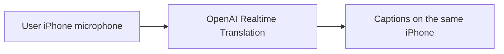
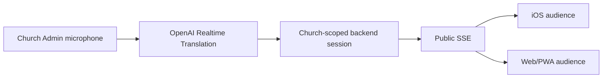
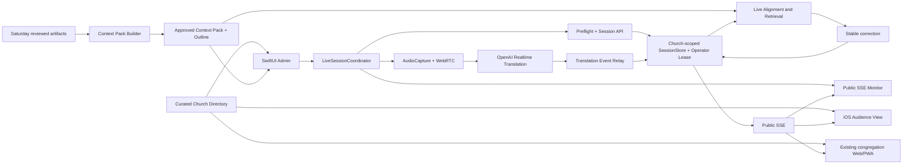
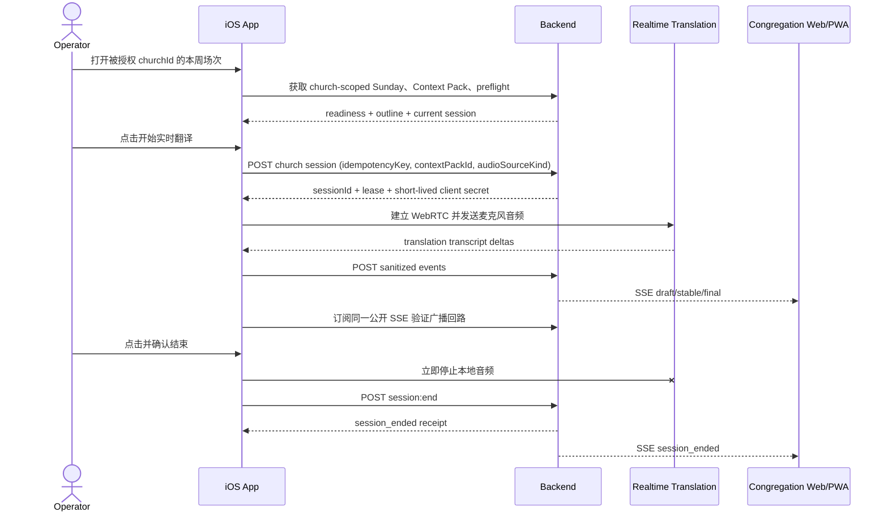
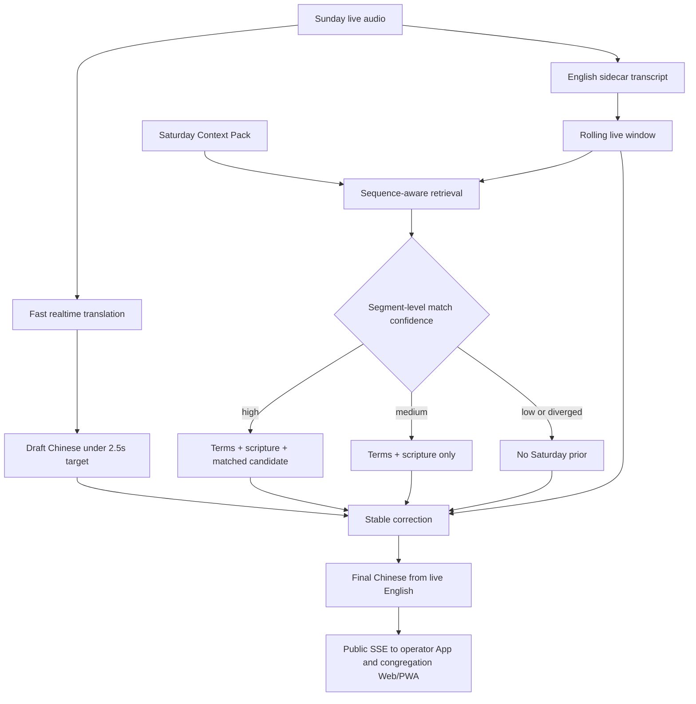

# 证道实时翻译 iOS App 设计

状态：Design proposal

日期：2026-08-30

分支：`design/sermon-live-translation-ios`

方案：**C — 固定教会列表，中心采集，统一分发**

## 1. 结论

本文件正式定义 **方案 C：固定教会列表，中心采集，统一分发**。第一版是一个双角色 iOS App，与现有 Web 保持相同的产品边界：会众从受控教会列表选择教会并观看统一字幕；通过鉴权后进入该教会的 Admin 操作，负责周日现场检查、启动/停止实时翻译和查看周六大纲。

推荐的 MVP：

- 登录后加载本周已审核的 `Sermon Context Pack` 和周六大纲。
- 在一个“周日准备”页面完成网络、后端、麦克风、音频路由、音量和 Context Pack 状态检查。
- 点击一个醒目的“开始实时翻译”按钮，建立唯一的 Sunday realtime session。
- POC 默认使用 operator iPhone 麦克风作为受控音源；若以后接入调音台或授权直播音轨，同一入口切换为后端音源。
- 运行中显示录音、连接、模型、字幕稳定器和公开 SSE 的真实状态，并允许随时查看周六大纲。
- 点击“结束实时翻译”后立即停止音频输入，关闭 session，并留下可验证的结束状态。
- iOS 会众端和现有 Web/PWA 都接收后端广播的同一份 SSE 字幕；Admin 页面也订阅这条公开流，用它验证真实分发结果。
- 一个教会一场证道只建立一个 active translation session；不同教会可以并行运行，所有 session、Context Pack、权限和观测数据都必须按 `churchId` 隔离。

两个角色共享字幕模型与组件，但权限和任务必须分离：会众端不能看到 token、麦克风或生产控制；Admin 端不能另外生成一份只在本机可见的字幕。周日开始操作必须简单、可观察、可停止，周六准备成果必须能被利用但不能覆盖现场事实。无论两个版本多么接近，**周日实时英文始终是字幕事实来源**。

## 2. 产品边界

### 2.1 目标用户

第一类用户是中文会众：

- 打开 App 后无需登录即可进入当前场次。
- 主要查看大字号简体中文字幕，可选择中英双语和回看最近字幕。
- 需要明确区分正在直播、重连、字幕停滞和本场结束。
- 与 Web/PWA 接收完全相同的 `draft -> stable -> final` 事件，不能出现两个公开版本。

第二类用户是负责周日实时翻译的现场 operator。operator 通常：

- 在证道开始前几分钟打开 App，需要快速知道“现在能不能安全开始”。
- 可能不是开发人员，不能依靠终端、Cloud Run 控制台或隐藏日志判断状态。
- 证道过程中还要兼顾现场，需要一眼看懂录音、网络、字幕和公开输出是否正常。
- 需要随时查看周六大纲确认方向，但不能误把大纲当作讲员已经说过的话。
- 结束时必须明确停止录音和翻译，不能依赖杀掉 App 或等待超时。

同一个安装包内，会众入口默认公开；Admin 入口必须鉴权，并支持只读观察员与 active operator 两种后台权限。只有持有 active operator lease 的设备可以采集麦克风或控制 session。

### 2.2 MVP 成功定义

会众打开 App 后最多一次操作即可看到当前字幕。operator 登录后能够加载本周周六资料、完成 preflight，并通过一次明确点击启动周日实时翻译。运行中不需要离开主页面即可判断音频是否进入、翻译是否产出、稳定字幕是否生成、会众端 SSE 是否有新鲜事件；周六大纲最多一次点击即可查看。

建议产品指标：

| 指标 | MVP 目标 |
|---|---:|
| 点击开始到 `session_started` | 正常网络 p95 <= 5 秒 |
| session 建立到首个音频帧被接收 | p95 <= 3 秒 |
| 对应语义单元结束到会众端首个中文 draft | 目标 p50 <= 2 秒，p95 <= 3.5 秒 |
| 边界 stable（未经过第二模型校正） | 目标 p95 <= 5 秒 |
| Context Pack + 第二模型修正版 | 优化后目标 p50 <= 6 秒，p95 <= 8 秒 |
| 断线恢复或明确进入故障态 | <= 10 秒 |
| 音频或字幕停滞告警 | 15 秒内出现 |
| 点击结束到本地音频停止 | p95 <= 1 秒 |
| 现场 45 分钟 crash-free session | >= 99.5% |

启动和停止动作属于 App 与后台 session contract；字幕时延和新鲜度属于端到端系统，不能只凭 App 或后端单侧健康来判定。

### 2.3 非目标

MVP 不做：

- 让 iOS 会众端产生不同于 Web/PWA 的字幕版本。
- 多个 iPhone 同时成为同一场证道的 active audio source。
- App 内直播视频播放。
- AI 朗读中文字幕或同声传译音频。
- 在 App 内编辑周六大纲、人工改写字幕、做时间轴 review 或模型调参。
- 会后 PDF 生成或取代现有两份 canonical PDF 流程。
- 把 draft 字幕当成正式讲员原文或正式圣经译文。

### 2.4 方案 B 与方案 C

#### 方案 B：用户侧麦克风，用户侧生成字幕

每位会众在自己的 iPhone 上明确点击“个人实时翻译”，授权麦克风后，由本机把现场音频发送到 Realtime Translation，并只在本机显示生成的字幕。



方案 B 的特点：

- 优点：不需要教会 Admin 预先启动；从模型 delta 到本机渲染少一次 backend/SSE 中继。
- 缺点：每位用户的座位、距离、回声和谈话噪声不同，字幕质量与内容可能不一致。
- 每位用户都建立独立 realtime session，成本与并发量随用户数近似线性增长。
- 每台设备都需要麦克风许可；原始现场音频分别从每位用户设备上传。
- 周六 Context Pack 可以按所选教会加载为提示/校正资料，但无法保证所有用户采用同一版本或同时收到同一修正。
- 字幕默认只保留在本机，不写入教会公共 SSE，也不能作为统一直播事实来源。

方案 B 适合作为没有 Admin、没有中心音源时的个人能力。它不能在方案 C 断线时自动开启；必须由用户主动进入、理解隐私提示并授权麦克风。标准 API key 仍只在服务端，用户设备只能取得短期 client secret。OpenAI 提供专用 Translation client-secret endpoint，并建议 mobile client 通过 WebRTC 连接。参考 [Create translation client secret](https://developers.openai.com/api/reference/resources/realtime/subresources/translations/subresources/client_secrets/methods/create) 和 [Realtime WebRTC](https://developers.openai.com/api/docs/guides/realtime-webrtc)。

#### 方案 C：固定教会列表，中心采集，统一分发

每间已接入教会由一台持有 operator lease 的 Admin 设备采集一次、翻译一次；后端将同一组 `draft -> stable -> final` 字幕发布给该教会的全部 iOS/Web 会众。



| 维度 | 方案 B：每位用户独立 | 方案 C：每间教会统一 |
|---|---|---|
| 启动者 | 每位会众 | 该教会 Admin |
| 麦克风 | 每台会众设备 | 一台受控设备/专业音源 |
| 公开字幕 | 没有统一版本 | iOS/Web 同一 event stream |
| draft 延时预估 | 良好网络约 1.5–3.5 秒 | 良好网络约 2–4 秒 |
| 音质 | 随座位和设备变化 | 可固定摆位并现场检查 |
| 周六资料 | 每设备独立使用 | 后端统一检索、校正和审计 |
| 成本与并发 | 近似随会众数增长 | 近似随 active church session 数增长 |
| 隐私 | 每位用户都上传现场音频 | 只有明确的中心采集设备上传 |
| 故障影响 | 单个用户 | 当前教会全部会众，因此需要监控/备机 |

本项目推荐方案 C 作为固定教会的正式服务；方案 B 可以作为后续明确标注的个人模式，但不与方案 C 的公共字幕混合。

## 3. 核心体验

### 3.1 信息架构

MVP 有两个角色空间：

1. **教会列表**：由服务端集中维护的固定目录，显示教会、城市/时区和 `直播中 / 即将开始 / 未直播`。
2. **会众观看**（默认）：所选教会的当前字幕、最近字幕、经文和显示设置。
3. **Admin**（鉴权后）：被授权教会的周日准备、实时运行和周六大纲。

“固定列表”表示只有平台审核并启用的教会能出现在目录中，不允许用户输入任意 backend URL 或自行创建教会。列表由 backend 返回并带 `churchListVersion`/ETag，App 保存 last-known-good 缓存；不要硬编码在 app bundle，否则每次增加或停用教会都必须重新发版。App 记住 `lastChurchId`，但启动时仍刷新该教会是否 active。

最小公开目录 schema：

```json
{
  "churchListVersion": "2026-08-30T18:00:00Z",
  "churches": [
    {
      "id": "irvine-community",
      "displayName": "Irvine Community Church",
      "city": "Irvine",
      "timeZone": "America/Los_Angeles",
      "sortOrder": 10,
      "status": "live",
      "nextServiceAt": "2026-08-30T11:30:00-07:00"
    }
  ]
}
```

目录不返回 API origin、Admin identity、token、Context Pack 路径或内部诊断；所有教会继续使用同一受控 API origin，通过 `churchId` 路径隔离。

会众端进入教会后使用单一观看页，不暴露 Admin 控件。Admin 通过设置页或受保护的入口进入，使用独立 `NavigationStack`；周六大纲从准备页或 Live 页以 sheet 打开。不能只靠隐藏按钮保护 Admin。

### 3.2 主界面线框

固定教会列表：

```text
┌──────────────────────────────┐
│  选择教会                     │
├──────────────────────────────┤
│  ● Irvine Community Church   │
│    Irvine · 直播中          > │
├──────────────────────────────┤
│  ○ Grace Church              │
│    Los Angeles · 11:30     > │
├──────────────────────────────┤
│  ○ 示例华人教会               │
│    San Diego · 本周未开始   > │
└──────────────────────────────┘
```

使用 SwiftUI `List` + `NavigationStack`，状态文字与图形同时表达；“直播中”教会排在最前，其余保持后台配置顺序。教会可提供二维码/deep link 直接打开固定 `churchId`，但 App 仍要验证它存在于当前目录。

会众观看页：

```text
┌──────────────────────────────┐
│  11:30 现场           ● 已连接 │
│  Misplaced Fear               │
├──────────────────────────────┤
│                              │
│     神的百姓正站在应许之      │
│     地的边缘，那片土地就      │
│     在他们眼前。              │
│                              │
│  正在翻译…                    │
├──────────────────────────────┤
│  民数记 13–14        查看经文  │
├──────────────────────────────┤
│      回看上一段    Aa          │
└──────────────────────────────┘
```

Admin 准备页：

```text
┌──────────────────────────────┐
│  周日实时翻译          准备就绪 │
│  2026-08-30                    │
├──────────────────────────────┤
│  周六预备大纲                  │
│  Misplaced Fear · 民数记 13–14 │
│  已审核                 查看 > │
├──────────────────────────────┤
│  ✓ 后端与模型可用              │
│  ✓ 麦克风已授权                │
│  ✓ iPhone 麦克风 · 音量正常    │
│  ✓ 会众字幕流可用              │
├──────────────────────────────┤
│       [ 开始实时翻译 ]         │
└──────────────────────────────┘
```

运行页：

```text
┌──────────────────────────────┐
│  ● 正在录音            18:42  │
│  iPhone 麦克风  ▂▄▆▃          │
├──────────────────────────────┤
│  实时翻译   正常               │
│  稳定字幕   2 秒前              │
│  会众字幕流 1 秒前              │
├──────────────────────────────┤
│  如今，那些在基督耶稣里       │
│  的人就不被定罪了。            │
│  正在翻译下一句…               │
├──────────────────────────────┤
│  当前大纲：3. 活在圣灵中  查看  │
├──────────────────────────────┤
│       [ 结束实时翻译 ]         │
└──────────────────────────────┘
```

共同视觉与操作原则：

- 使用 SwiftUI 系统语义色、Dynamic Type、SF Symbols 和标准 safe area。
- 会众端以字幕为唯一主任务；Admin 健康信息不能混入会众页面。
- “开始”是准备页唯一 primary action；preflight 有硬失败时禁用，并明确说明修复方法。
- 运行页始终显示系统录音指示、音频电平、session 时长和字幕新鲜度。
- “结束”使用破坏性样式并二次确认；确认后先停本地音频，再关闭远端 session。
- 当前 stable/final 中文字幕用于 operator 监控；draft 降低颜色对比并用“正在翻译”标识。
- 状态用文字加图形表达，不能只靠红/绿颜色。
- Live 期间默认保持屏幕常亮；结束后立即恢复系统行为。
- 周六大纲顶部持续显示“预备资料；周日现场可能调整”。

### 3.3 状态设计

会众端：

| 状态 | 会众看到什么 | App 行为 |
|---|---|---|
| 等待直播 | “字幕尚未开始”与本周场次 | 低频检查 current session |
| 连接中 | skeleton 或最近 snapshot | snapshot 后以 cursor 连接 SSE |
| 实时 draft | 较弱颜色字幕与“正在翻译” | 原位增量更新，可被 stable/final 替换 |
| stable/final | 高对比主字幕 | 加入最近字幕历史 |
| 重连中 | 保留最后字幕并显示断线时间 | 自动重连，但不把旧字幕伪装成现场 |
| 已结束 | “本场已结束” | 停止高频重试，允许只读回看 |

Admin 端：

| 状态 | operator 看到什么 | App 行为 |
|---|---|---|
| 未准备 | 缺失项与修复动作 | 禁止开始，不创建 session |
| 准备就绪 | 全部检查通过 | 启用唯一 primary action |
| 启动中 | “正在建立安全连接”与可取消状态 | 幂等创建 session、激活音频、建立 realtime 连接 |
| 实时运行 | 录音、电平、计时、字幕与各链路健康 | 持续发送音频和 event，监测 heartbeat/freshness |
| 重连中 | 保留最后 stable 字幕并显示断点时间 | 本地音频按策略暂停或缓冲，带 session lease 重连 |
| 音频中断 | “录音已中断：来电/路由变化” | 立即停止发送并要求 operator 确认恢复 |
| 停止中 | “正在停止录音与会众字幕” | 先停 input，再关闭远端 session，等待结束回执 |
| 已结束 | 开始/结束时间和最后状态 | 不再采集；允许查看本场摘要和周六大纲 |

### 3.4 可访问性

- 支持所有 Dynamic Type 档位；最大字号下隐藏次要元数据，不能截断主字幕。
- VoiceOver 不自动逐字播报 draft；健康状态变化和 destructive confirmation 有明确 label。
- 支持“减少动态效果”；字幕替换使用淡入而不是位移动画。
- 支持竖屏和横屏；横屏保持开始/结束控件和健康状态可见。
- 深色模式使用接近纯黑的背景和低亮度状态色，减少现场干扰。
- 最小触控目标和状态文案适合紧张现场操作，不用仅靠手势触发关键动作。

## 4. 技术架构

### 4.1 推荐技术栈

- SwiftUI + `NavigationStack`。
- Swift Concurrency；UI state 由 `@MainActor` view model 管理。
- `AVAudioApplication` 处理录音许可，`AVAudioSession` 表达录音意图并监测中断和路由变化。
- WebRTC/Realtime client 发送唯一 operator 音源；`URLSession.AsyncBytes` 读取后台 SSE 作为广播回路验证。
- `actor` 分别负责 realtime 连接和 SSE 连接的生命周期、去重、cursor、退避与取消。
- 状态机严格表达 `notReady -> ready -> starting -> live -> stopping -> ended/failed`，避免重复创建 session。
- 只保存 session receipt、健康指标和 Context Pack 元数据；默认不保存原始音频、API key 或短期 token。

Apple 的 `URLSession` 支持以 `AsyncSequence` 方式在传输过程中读取 bytes，适合原生实现 SSE 客户端。参考 [URLSession](https://developer.apple.com/documentation/foundation/urlsession) 和 [bytes(from:delegate:)](https://developer.apple.com/documentation/foundation/urlsession/bytes(from:delegate:))。

### 4.2 组件关系



建议的 Xcode 模块边界：

```text
ios/SermonLive/
  App/
  Features/ChurchDirectory/
  Features/AudienceLiveCaption/
  Features/SundayReady/
  Features/LiveOperator/
  Features/SaturdayOutline/
  Core/Audio/
  Core/Realtime/
  Core/Networking/
  Core/Models/
  Core/Storage/
  DesignSystem/
  Tests/
```

先保持单一 app target 和内部模块目录，不在 POC 阶段引入复杂 package 拆分。

### 4.3 复用现有后端

当前仓库已经具备：

- `GET /api/sundays/current`：当前 Sunday/manifest 信息。
- `POST /api/admin/realtime/sessions`：创建 session，并返回 `sessionId`、event token、model、`audioSourceKind` 和短期 client secret。
- `POST /api/realtime/sessions/{id}/events`：把 realtime translation deltas 写回统一 session store。
- `GET /api/realtime/sessions/current/events`：公开 SSE 字幕流。
- SSE event `id`、`sessionId`、`createdAt`。
- `session_started`、`caption_delta`、`caption_stable`、`caption_final`、英文 sidecar 事件。
- query string `cursor` 重连入口。

因此 App 不需要发明第二套协议：Admin 端镜像现有 Web operator 的 session/event contract，使用后台签发的短期 client secret 连接 Realtime Translation，再把 translation deltas 写回后端；会众端镜像现有 Web public SSE contract。OpenAI 标准 API key 始终只存在服务端。iOS 与 Web 的公开字幕都只来自后端 sanitize 后的唯一 SSE 流。

但当前 API 使用全局 `current Sunday/current session`，只能表达单教会。方案 C 必须把现有 contract 扩展为 church-scoped；旧路径可暂时映射到默认教会以保持 Web 向后兼容，但新 iOS App 不应依赖全局 current。

### 4.4 开始与结束时序



开始请求必须带 idempotency key；后台对每个 `(churchId, sunday)` 只允许一个 active operator lease。重复点击、网络重试或第二台设备不能意外创建第二个付费 session；不同 church 可以并行。停止采用“本地优先”：即使后台暂时不可达，也要先停止麦克风和 realtime 发送，再重试远端结束并显示未确认状态。

### 4.5 监控字幕 reducer 规则

对每个 `(churchId, sessionId, segmentId)`：

1. 丢弃 `id <= lastAppliedEventId` 的重复事件。
2. `caption_delta` 只更新 draft buffer，不写历史。
3. `caption_stable` 替换同 segment 的 draft，并进入历史。
4. `caption_final` 覆盖 stable；如果 source 是 stable correction，保留修正标记供 operator 诊断。
5. 新 `sessionId` 出现时先处理 `session_started`，再重置 event cursor；不能把不同 session 的相同数字 id 当成重复。
6. 未识别的新 event type 安全忽略并记录计数，不能让流解析失败。

字幕优先级：`final > stable > draft`。同一优先级只接受更大的 event id。

### 4.6 后端契约需要补齐的缺口

现有 session 创建、event ingest 和 SSE 足够做单教会原型，但方案 C production 前必须补齐一个向后兼容的 church-scoped contract v1：

1. `GET /api/churches`
   - 返回受控公开目录、`churchListVersion`、显示顺序、时区和 live summary；不返回 Admin 信息。
2. `GET /api/churches/{churchId}/sundays/current`
   - 返回该教会当前 Sunday、场次、标题和 public session 状态。
3. `GET /api/admin/churches/{churchId}/sundays/{date}/realtime-preflight`
   - 返回 backend/model、Context Pack、公开 SSE、active session、operator lease 和推荐音源状态。
4. `POST /api/admin/churches/{churchId}/realtime/sessions`
   - 接受 `sunday`、`idempotencyKey`、`contextPackId`、`audioSourceKind` 和 `operatorDeviceId`；返回有限期 lease。
5. `POST /api/admin/churches/{churchId}/realtime/sessions/{id}:end`
   - 幂等结束 session，并返回 `endedAt`、最后 event id、event archive 和公开流结束回执。
6. `POST /api/admin/churches/{churchId}/realtime/sessions/{id}:heartbeat`
   - 续租并上报匿名音频/连接新鲜度；lease 失效后禁止新的 event ingest。
7. `POST /api/churches/{churchId}/realtime/sessions/{id}/events`
   - 接收该 session 的 translation events；event token 必须同时绑定 `churchId` 和 `sessionId`。
8. `GET /api/churches/{churchId}/realtime/sessions/current/snapshot`
   - 返回当前 `sessionId`、`streamEpoch`、最新 event id、最近 20 条 stable/final 字幕和 session 状态。
   - App 首屏先 snapshot，随后从 `cursor=latestEventId` 接 SSE，避免启动空白和竞态。
9. `GET /api/churches/{churchId}/realtime/sessions/current/events`
   - church-scoped public SSE，同时支持 `Last-Event-ID` header 和 `cursor` query。
10. 增加 `session_ended`、`heartbeat` 和 `stream_reset` 事件；cursor 超出内存窗口或服务重启时显式 reset。

`churchId + streamEpoch + sessionId + eventId` 才是完整 cursor。只保存 event id 会在教会/session 切换或服务重启后误判。

## 5. 用周六内容增强周日实时翻译

### 5.1 问题定义

实际情况不是“周六稿等于周日稿”，而是：

- 主要方向通常一致。
- 核心经文通常一致。
- 人名、书卷名、神学术语和关键例证有较高复用价值。
- 具体措辞、段落顺序、开场、临场发挥、故事细节和结束呼召可能不同。

因此周六版本既不是可直接播放的字幕，也不是无关资料。它更适合作为一个**可撤销、可追踪、按片段检索的先验**。

### 5.2 设计原则

1. **Live source of truth**：任何最终字幕都必须能由周日实时英文支持。
2. **Prior may suggest, never assert**：周六内容可以建议译法，不能补写现场未出现的事实。
3. **片段级匹配**：不能因为整篇主题相同就宣布“版本一致”；每个 rolling window 独立判断，同时利用段落顺序。
4. **匹配随时可撤销**：讲员一旦偏离周六结构，当前片段立即退回无先验翻译。
5. **快慢通道分离**：周六检索不能阻塞第一条 draft；它主要提高 stable caption 的速度与质量。
6. **一个公开输出**：匹配、检索和校正在后端完成，Admin 监控、iOS 会众端与 Web/PWA 检查同一份字幕。
7. **保留来源证据**：每次先验辅助都记录 pack、候选片段和分数，便于回放和审计。

### 5.3 周六 Sermon Context Pack

周六完成视频提取、转写和翻译后，增加一个只读构建步骤，生成版本化 Context Pack：

```json
{
  "contextPackId": "ctx_2026-08-30_sha256prefix",
  "churchId": "irvine-community",
  "sourceVersion": "saturday-video",
  "sourceSha256": "...",
  "intendedSunday": "2026-08-30",
  "status": "reviewed",
  "sermon": {
    "title": "...",
    "speaker": "...",
    "themeSummaryZh": "...",
    "primaryScriptures": ["Romans 8:1-17"]
  },
  "outline": [
    {
      "id": "outline_03",
      "order": 3,
      "titleZh": "活在圣灵中",
      "summaryZh": "预备摘要；不是周日逐字稿",
      "anchorId": "anchor_03"
    }
  ],
  "terms": [
    {
      "en": "adoption",
      "preferredZh": "得儿子的名分",
      "aliases": ["sonship"],
      "evidenceSegmentIds": ["sat_0042"]
    }
  ],
  "anchors": [
    {
      "id": "anchor_03",
      "order": 3,
      "summaryEn": "Life in the Spirit rather than condemnation",
      "scriptureRefs": ["Romans 8:1-4"],
      "keywords": ["condemnation", "Spirit", "flesh"],
      "segmentIds": ["sat_0071", "sat_0072"]
    }
  ],
  "segments": [
    {
      "id": "sat_0071",
      "en": "...",
      "approvedZh": "...",
      "anchorId": "anchor_03"
    }
  ]
}
```

Pack 中可以包含：

- 已人工确认的主经文和相关经文。
- 人名、地名、书卷名、神学术语及首选中文。
- 面向 operator 的只读中文大纲，以及与之关联的有序语义锚点。
- 可检索的短英文片段及已审校中文。
- 讲员、系列名和教会常用表达。
- 原始 artifact hash、生成版本、review 状态和时间。

Pack 不应包含：

- “下一句一定是什么”的预测指令。
- 没有英文证据即可输出的预制中文字幕。
- 未经允许的整本圣经译文或其他受限内容。
- API key、client secret、管理 token 或原始音频。

### 5.4 周日双通道流水线



#### 快通道

- 音频持续进入 `gpt-realtime-translate`，尽快输出 draft。
- 不等待向量检索、Context Pack 或较慢的 stable model。
- 如果 Context Pack 不可用，快通道仍然完整工作。

#### 先验通道

- 英文 sidecar transcript 形成最近 8–15 秒 rolling window。
- 用英文语义、经文命中、关键词和上一 anchor 位置检索 Context Pack。
- 检索必须考虑顺序，优先当前 anchor 附近的候选，而不是每句都在整篇中自由跳转。
- 输出 `high / medium / low / diverged`，而不是简单 yes/no。

#### 稳定修正通道

stable correction 的输入包括：

- 周日 live English window，唯一事实来源。
- realtime draft Chinese。
- 当前术语表和经文 canonical wording。
- 最多 2–3 个周六候选片段及其 match score。
- 上一段已确认 anchor，帮助保持顺序。

输出使用结构化 schema：

```json
{
  "segmentId": "live_0123",
  "zh": "如今，那些在基督耶稣里的人就不被定罪了。",
  "priorAssist": "matched_segment",
  "contextPackId": "ctx_2026-08-30_sha256prefix",
  "matchedPriorSegmentIds": ["sat_0071"],
  "matchConfidence": 0.91,
  "liveEvidenceCoverage": 1.0,
  "divergenceReason": null
}
```

修正提示的硬规则：

> 只翻译 live English 中实际出现的内容。周六候选只用于术语、经文和表达选择。若候选与 live English 冲突、增加细节或顺序不符，忽略候选。不得为了贴合周六版本而补齐现场未说出的句子。

### 5.5 匹配与降级策略

建议使用三层门禁，而不是单一 embedding 分数：

| 门禁 | 信号 | 失败时行为 |
|---|---|---|
| 主题/经文门禁 | 主经文、书卷、主题关键词 | 仅保留通用术语表 |
| 片段语义门禁 | live English 与周六候选语义相似度 | 不使用 matched segment |
| 忠实度门禁 | stable 输出的每个实质信息能否回指 live English | 拒绝修正，保留无先验版本 |

还要加入顺序约束：

- 已匹配到 `anchor_03` 后，优先检索 `anchor_02–05`。
- 只有强证据才允许大幅向前或向后跳转。
- 连续 2–3 个窗口低置信时进入 `diverged`。
- `diverged` 后仍使用经文/术语表，但停止使用周六具体句子。
- 后续重新出现明确经文或高置信语义锚点时可以恢复匹配。

### 5.6 哪些内容可以安全复用

| 周六资产 | 周日用法 | 风险等级 |
|---|---|---|
| 主经文与书卷名 | 预加载、ASR/翻译术语提示、即时经文卡 | 低 |
| 人名与神学术语 | 术语表和拼写/译名纠正 | 低 |
| 主题与大纲 | 缩小检索范围、预测可能 anchor | 中 |
| 已审校中文短片段 | 仅在 live English 高置信匹配后作为译法候选 | 中高 |
| 完整周六中文字幕 | 只做检索库和 A/B 评估，不直接播放 | 高 |
| 周六音频时间轴 | 不映射到周日现场时间轴 | 禁止直接复用 |

### 5.7 “加速”的准确含义

Context Pack 不一定让 realtime 模型的网络响应更快；错误地加入大段上下文反而可能增加处理成本。这里追求的是：

- 经文、人名、神学术语更早正确。
- stable correction 少一次或少几次来回修改。
- Scripture card 可以在现场提到时立即显示。
- operator 更早知道当前证道是否沿用周六结构。
- 低置信或偏离时更快退回安全基线。

因此核心指标应是 **time-to-correct-stable-caption**，而不只是 first draft latency。

### 5.8 周六大纲与 operator UI

周六大纲是 App 的辅助功能，不是第二份现场字幕：

- 准备页显示标题、主经文、审核状态和更新时间；一次点击打开完整大纲。
- Live 页保留“查看周六大纲”入口；打开 sheet 不暂停音频或 event 发送。
- 大纲只读，始终标注“周六预备资料；周日现场可能调整”。
- 当连续 rolling windows 高置信匹配同一 anchor 时，可高亮相应大纲项。
- `medium / low / diverged` 时取消高亮，不通过自动滚动暗示讲员正在按周六顺序进行。
- operator 可以手动浏览，但手动选中大纲项不影响检索、翻译或公开字幕。

Live 主页面还显示：

- `Context Pack 已加载 / 未加载 / 未审核`。
- 当前匹配模式：`matched / terms-only / diverged / unavailable`。
- 当前 anchor、match confidence、prior-assisted coverage。
- 音频输入、Realtime connection、stable correction 和 public SSE freshness。
- “关闭具体片段复用，只保留经文和术语”的一键降级。

App 本地可以预下载大纲、经文卡和术语表以便现场查看，但断网时绝不能把周六内容滚动并标记为“现场”。

### 5.9 OpenAI API 落点

截至本设计日期，官方 OpenAI Docs 显示 `gpt-realtime-translate` 通过专用 Realtime Translation endpoint 持续接收音频并输出翻译 audio/transcript deltas；创建 translation session 的公开配置主要是 model、input transcription/noise reduction 和 output language。不要假设可以把整篇周六稿直接注入这个 translation session。参考 [GPT-Realtime-Translate](https://developers.openai.com/api/docs/models/gpt-realtime-translate) 和 [Create translation client secret](https://developers.openai.com/api/reference/resources/realtime/subresources/translations/subresources/client_secrets/methods/create)。

官方模型说明同时表明 `gpt-transcribe` 支持 unstructured context、keyword hints 和 language hints，可用于提高领域术语、多语言和 code-switching 转写质量。具体能否通过当前 Realtime Translation 内嵌 transcription 配置传递这些 hints，必须用当前 API schema 和真实请求验证；在验证前，设计上把它视为独立 English sidecar 能力。参考 [GPT-Transcribe](https://developers.openai.com/api/docs/models/gpt-transcribe)。

当前仓库已有 delayed stable correction 层，最小实现路径是先扩展这一层：

1. 为 stabilizer 加载 Context Pack。
2. 在每个 English window 上做检索和匹配。
3. 把候选片段作为受限 hint 送入 stable correction。
4. 记录 prior provenance 和拒绝原因。
5. 保持现有 realtime draft 完全不依赖 Context Pack。

另外，当前 `backend/realtime.py` 使用 general realtime client-secret payload 和 `instructions`；production 实施前应把它与当前专用 `/v1/realtime/translations/client_secrets` schema 做一次兼容性 preflight，不能只依据历史 smoke 结果推断当前接口仍一致。

### 5.10 数据与 API 建议

建议新增：

| Method | Path | 用途 |
|---|---|---|
| `POST` | `/api/admin/churches/{churchId}/sundays/{date}/context-pack:build` | 从该教会已验证周六 artifacts 构建 pack |
| `GET` | `/api/admin/churches/{churchId}/sundays/{date}/context-pack` | 查看 hash、review 和覆盖状态 |
| `POST` | `/api/admin/churches/{churchId}/sundays/{date}/context-pack:approve` | 人工确认经文、术语和使用范围 |
| `GET` | `/api/admin/churches/{churchId}/sundays/{date}/operator-brief` | 返回已审核大纲、经文和 Context Pack 摘要 |
| `POST` | `/api/admin/churches/{churchId}/realtime/sessions` | 增加可选 `contextPackId` |
| `GET` | `/api/admin/churches/{churchId}/realtime/sessions/{id}/context-status` | 查看匹配、偏离和辅助覆盖 |

Context Pack 必须绑定：

- churchId；不得跨教会复用未审核术语、讲员或周六片段。
- intended Sunday。
- 周六 source URL 与 SHA-256。
- transcript/translation artifact hashes。
- builder 版本。
- reviewer、review time 和批准范围。

### 5.11 A/B 评估与硬门禁

使用相同的周日现场录音回放三条路线：

1. baseline：纯 realtime + 现有 stabilizer。
2. glossary：只使用经文和术语。
3. contextual retrieval：术语 + 有序片段检索。

比较：

- 经文、人名、神学术语准确率。
- time-to-correct-stable-caption。
- stable caption revision 次数。
- 周六先验实际覆盖率。
- 讲员偏离周六版本后的降级时间。
- prior-induced addition：live English 没说、但字幕因周六内容而加入的信息。

硬门禁：

- `prior-induced addition` 必须为 0。
- contextual retrieval 不能恶化 first draft latency。
- 低置信和 diverged 窗口必须与 baseline 等价。
- 所有 prior-assisted final caption 必须保留 live English evidence 和 pack provenance。

## 6. 方案 C 现场音频与 OpenAI 边界

### 6.1 MVP 音源假设

当前 POC 的工作假设是：**一台已登录的 operator iPhone 使用自身麦克风，成为唯一 active audio source**。这是为了最快验证完整闭环，不代表长期生产音质最优。

- preflight 显示当前 input route 和实时音量，让 operator 在开始前确认摆位。
- Realtime Translation 的 input noise reduction 先通过现场录音 A/B 选择 `near_field` 或 `far_field`，不在代码中凭感觉硬编码。
- 如果以后可取得调音台 feed 或授权直播音轨，新增 `authorized_audio` adapter；App 仍负责开始/停止和监控，但不再发送本机麦克风。
- 同一 session 只允许一个 active audio source；切换音源必须先结束或显式 handoff。

### 6.2 开始流程

1. operator 登录并选择/确认当天 Sunday。
2. App 拉取已审核 Context Pack、周六大纲和 server preflight。
3. 对 `operator_audio` 检查麦克风许可、input route、音量、网络和 active session 冲突。
4. 点击开始后，App 用 idempotency key 创建 session，后台签发短期 client secret 和 operator lease。
5. App 配置并激活录音 audio session，建立 Realtime Translation WebRTC 连接。
6. 第一帧音频成功发送且后端收到首个 event 后，状态才从“启动中”变为“实时运行”。
7. App 同时订阅 public SSE；只有看到同一 session 的新事件，才能将“会众字幕流”标为正常。

OpenAI 标准 API key 只存在服务端，绝不能嵌入 App。官方专用 Translation client-secret endpoint 可创建传给 mobile client 的短期 token；App 不持久化它，也不写入日志。参考 [Create translation client secret](https://developers.openai.com/api/reference/resources/realtime/subresources/translations/subresources/client_secrets/methods/create) 和 [GPT-Realtime-Translate](https://developers.openai.com/api/docs/models/gpt-realtime-translate)。

### 6.3 停止、中断与前后台

- operator 点击结束并确认后，App 先停止本地 audio track 和音频 session，再调用后台 end endpoint。
- 如果 end endpoint 失败，界面显示“本地录音已停止，服务器结束待确认”，并以同一 idempotency key 重试。
- 来电、Siri、路由断开或系统 audio interruption 发生时，不静默继续：立即进入“音频中断”，停止发送，并要求 operator 确认恢复。
- 第一版要求 App 保持前台并保持屏幕常亮。进入后台时暂停输入并产生显式告警；不在没有完成隐私、功耗和系统行为验证前启用 background recording。
- App crash 或 lease heartbeat 消失时，后台把 session 标为 `operator_lost` 并停止接受新事件；不能把后台 HTTP 存活误报为音频仍在工作。

Apple 的默认 audio session 不允许录音，因此 App 必须先获得录音许可并配置录音类别；还要观察 interruption 和 route-change 通知。参考 [AVAudioApplication](https://developer.apple.com/documentation/avfaudio/avaudioapplication)、[AVAudioSession](https://developer.apple.com/documentation/avfaudio/avaudiosession)、[audio interruption](https://developer.apple.com/documentation/avfaudio/avaudiosession/interruptionnotification) 和 [route change](https://developer.apple.com/documentation/avfaudio/avaudiosession/routechangenotification)。

### 6.4 Admin 麦克风到会众屏幕的延时预算

先固定测量口径：以讲员说完“对应中文语义单元”的最后一个音节为 `t0`，以 iOS/Web 会众端把该中文 delta 绘制出来为 `t1`。`t1 - t0` 是 trailing latency。若从一句话开头计时，还必须加上讲员说完这句话本身的时间，不适合比较系统性能。

当前方案有两次网络中继：Admin iPhone 把音频发给 OpenAI；收到中文 delta 后，再 POST 到项目后端，由后端通过 SSE 发给所有会众。

| 阶段 | 良好 Wi-Fi 工程预算 | 说明 |
|---|---:|---|
| iPhone 采音、系统 buffer、WebRTC packetize | 30–120 ms | 与 audio buffer、route 和设备负载有关 |
| Admin iPhone -> OpenAI | 50–250 ms | WebRTC 网络传输；抖动时明显上升 |
| Realtime 模型积累语义并产出首个中文 delta | 800–2,000 ms | 最大变量；官方没有固定毫秒 SLA |
| Admin App -> backend event ingest | 80–300 ms | 当前设计中的第二次上行 |
| backend sanitize/store -> SSE flush | 20–200 ms | 不应等待 GCS mirror 或 stable correction |
| SSE -> iOS/Web 会众端渲染 | 50–300 ms | 包括下行、事件解析和主线程更新 |
| **合计：首个可读 draft** | **约 1.0–3.2 秒** | 再考虑语义分段和现场抖动，产品预期写成 **2–4 秒** 更诚实 |

OpenAI 官方说明 `gpt-realtime-translate` 会在源音频仍在进入时返回 transcript deltas，因此不必等整句或整个 turn 结束；官方也建议 mobile client 使用 WebRTC 以获得更一致的性能。但官方没有承诺固定端到端延时，实际值必须用现场麦克风、教会网络和真实讲员语速测量。参考 [GPT-Realtime-Translate](https://developers.openai.com/api/docs/models/gpt-realtime-translate) 和 [Realtime WebRTC](https://developers.openai.com/api/docs/guides/realtime-webrtc)。

建议对会众明确呈现三个层级，而不是都叫“实时字幕”：

| 层级 | 会众预计落后讲员 | 含义 |
|---|---:|---|
| `draft` | 良好网络通常 2–4 秒；较差网络可能 5–10 秒 | Realtime 流式结果，可原位修改 |
| `boundary stable` | 通常 3–5 秒 | Realtime 文本到达标点/完成边界后的提交；不是第二模型校正 |
| `context corrected` | 按当前默认 loop 约 9–18 秒 | 周六 Context Pack + 第二模型的高质量修正版 |

当前代码的 `RealtimeCaptionStabilizer` 在检测到标点或 final 时立即产生 `caption_stable`；`stable_delay_ms = 1200` 目前只是写入 latency metadata，并没有真的等待 1.2 秒。因此它只能表示“适合稳定显示的边界”，不能证明文本已经经过额外模型校正。

真正的 AI 修正 loop 当前默认 `min-age-seconds = 4`、`interval-seconds = 6`：候选仅排队就会等待约 4–10 秒，再叠加第二模型请求、event POST 和 SSE 分发。以首个 draft 已落后 2–4 秒计算，**当前实现的高质量修正版合理预估是 9–18 秒，而不是 3–6 秒**。仓库文档中的 stable p95 3–6 秒只能作为未来目标，不能视为现有链路已经达到的事实。

若希望修正版也接近现场，建议改为事件驱动：

1. Realtime 完整语义边界到达时立即触发，不再等 6 秒轮询。
2. 周六 anchor/术语检索与 Realtime 输出并行进行，不占用 critical path。
3. 只把当前 1 个短窗口送给第二模型，避免批量等待。
4. correction 超过 8 秒直接放弃该窗口，保留 draft/boundary stable，防止旧字幕追赶现场。

这样可以把 `context corrected` 的设计目标设为 **p50 5–6 秒、p95 <= 8 秒**。这是待验证目标，不是供应商 SLA。

### 6.5 延时观测点

每个 segment 至少记录以下单调时钟时间戳，才能知道慢在哪里：

- `audioCapturedAt`：Admin 端采到对应 audio frame。
- `firstRealtimeDeltaAt`：Admin 收到首个中文 delta。
- `backendAcceptedAt`：后端接受该 event。
- `sseEmittedAt`：后端写入公开 SSE。
- `viewerRenderedAt`：iOS/Web 会众端完成渲染。
- `correctedAt`：Context Pack 修正版发布。

跨设备绝对时钟可能漂移，因此 Admin、backend、viewer 分别记录 monotonic duration，并用 server receive time 做关联；不要只依靠 `Date()` 相减宣称毫秒级端到端结果。Dashboard 分开报告 `capture-to-draft`、`relay-to-viewer` 和 `draft-to-corrected` 的 p50/p95。

## 7. 安全、隐私与数据

- 教会目录可公开读取，但只能由平台后台审核、启用、排序和停用；客户端不能写入目录。
- 会众观看不需要 Admin token，且只能访问 public Sunday/snapshot/SSE contract。
- Admin token 必须包含允许的 `churchIds`/role；后端不能因为 URL 中存在某个 `churchId` 就授权跨教会操作。
- Admin 路由、视图和网络 client 与会众端分层；界面隐藏不是授权，所有控制操作必须由服务端验证身份、church scope 和 operator lease。
- 只有已鉴权 operator 的“开始实时翻译”流程申请麦克风权限；大纲浏览不触发权限请求。
- 不在 App bundle、Keychain、日志或 crash report 中放 OpenAI API key。
- 短期 client secret 只在内存中存活；结束、过期、登出或 App 重启时清除。
- 原始音频默认只流式传输，不写本地文件，也不进入后端 event archive。
- 公共字幕 API 只返回 sanitize 后的字幕和 session 状态；operator lease、event token 和诊断细节只走 admin API。
- 本地只缓存本周只读大纲、Context Pack 元数据、session receipt 和显示设置。
- telemetry 使用随机匿名 install id；不采集姓名、精确位置、通讯录、原始麦克风内容或广告标识符。
- 日志中只记录 event type、延迟、cursor、HTTP 状态和匿名 session id；正文默认不进入远程诊断日志。
- AI 字幕提示保持简洁可见：“AI 辅助字幕，可能有延迟或错误；以讲员原文和正式圣经译本为准。”

## 8. 失败与降级

| 故障 | App 降级行为 |
|---|---|
| 教会目录暂时不可用 | 使用带版本号的 last-known-good 列表并标注离线；从未成功加载过则不给出虚构教会 |
| 所选教会已停用 | 停止连接该教会的 current session，返回目录并显示说明 |
| event 的 churchId/session 不匹配 | 拒绝事件并记录安全告警，绝不串到另一教会会众流 |
| 会众端没有 active session | 显示等待页，不请求麦克风、不循环弹错误 |
| 会众端 SSE 断开 | 保留最后 stable 字幕并标注断线时间，自动从 cursor 恢复 |
| 没有 approved Context Pack | 明确提示；经 operator 确认后允许 baseline 模式开始，不使用周六先验 |
| 麦克风权限被拒绝 | 禁止 `operator_audio` 开始并给出设置入口；若已配置授权后端音源，可切换音源 |
| 检测到已有 active session | 显示设备/开始时间；禁止另建 session，只允许只读监控或经授权 handoff |
| 重复点击开始/网络重试 | 使用同一 idempotency key 返回同一 session，不重复计费或录音 |
| Realtime 建立失败 | 不进入 Live；停用 audio session 并撤销/结束未成功 session |
| 音频 route 断开或来电 | 立即进入中断态并停止发送；operator 确认后才恢复 |
| event ingest 失败 | 显示“翻译有输出但尚未对外发布”，有限缓冲并重试；超限则停止 session |
| public SSE 断开 | 翻译可继续，但会众发布标红并保留最后 event 时间，不能显示“全部正常” |
| cursor 失效 | 拉 snapshot，显示一次轻量“已恢复到现场” |
| stabilizer 失败 | 继续显示 draft；不能把后端健康误报为 stable 可用 |
| App 进入后台 | 第一版暂停 input 并告警；回到前台需要 operator 确认恢复 |
| App crash / lease 超时 | 后台标记 `operator_lost`；重新打开后提供恢复或安全结束，不自动新建 |
| 结束 API 暂时失败 | 本地录音仍立即停止；后台结束保持待确认并幂等重试 |

## 9. 验证计划

### 9.1 自动化

- session 状态机：重复开始、取消启动、停止失败、第二设备冲突和 crash recovery。
- church isolation：两个教会同时直播、相同 event id、切换教会、停用教会和跨教会 token 拒绝。
- role boundary：会众无 token 可正常观看，但无法调用任何 Admin endpoint；登出立即撤销 Admin UI/state。
- preflight：权限、音频 route/level、Context Pack、backend/model、active lease 和 public SSE。
- audio：第一帧确认、interruption、route change、前后台切换和本地优先停止。
- secret：不持久化、不记录，过期/结束后不可复用。
- SSE monitor：多行 data、UTF-8、重复/乱序、cursor reset 和 snapshot race。
- SwiftUI snapshot：准备、启动、Live、中断、停止、深色模式和超大 Dynamic Type。
- VoiceOver：开始/结束确认、故障和健康状态有清楚 label。
- Context Pack：hash 绑定、未审核拒绝、跨 Sunday 拒绝和 schema 兼容。
- retrieval：有序 anchor、低置信降级、重新匹配和 prior provenance。
- faithfulness gate：周六存在但周日没说的内容绝不进入 final caption。

### 9.2 现场验收

至少在真实 iPhone 上完成一次完整证道时长演练，并分别验证：

- operator 在 2 分钟内完成 preflight、打开周六大纲并成功开始。
- iPhone 在实际摆位下的音量、回声、环境噪声和 `near_field/far_field` A/B。
- 教会 Wi-Fi、蜂窝网络和两者切换；10 秒网络中断后的行为。
- 来电、Siri、锁屏、切后台、拔掉外接麦克风和低电量模式。
- 重复点击开始、第二台设备尝试开始、App 强制退出和重新打开。
- 点击结束后 1 秒内本地 audio level 归零，并收到 session_ended/public SSE 回执。
- iOS 会众端与 Web/PWA 实际收到相同 session、event id 和 draft/stable/final。
- 用音频水印或人工 marker 测量 `audioCapturedAt -> viewerRenderedAt`，分别报告 iOS 与 Web 的 p50/p95。
- 周六/周日版本一致片段的术语质量提升，以及偏离片段的自动降级。
- 周六大纲可在 Live 中打开；低置信/偏离时不错误高亮。
- 后端进程重启或 session 切换后不会显示假实时旧字幕或假健康。
- Dynamic Type 最大档和 VoiceOver。

Cloud Run health、SSE smoke 和 simulator 测试都不能替代这次物理设备现场验收。

## 10. 分阶段实施

### Phase 0：契约、音频 spike 与可点击原型

- 固化 session create/end/lease/preflight contract v1 和 fixture JSONL。
- 固化 Context Pack schema，并从一组已验证周六 artifacts 生成 fixture。
- 使用真实的周六/周日成对录音完成 baseline、glossary、contextual retrieval 三路回放。
- 用 SwiftUI 做会众观看、Admin 准备、启动、Live、中断、停止和大纲 sheet 的本地 fixture 原型。
- 用真机完成麦克风 -> Realtime -> event ingest -> public SSE 的最小技术 spike。

### Phase 1：方案 C MVP

- 接入固定教会目录、last-known-good 缓存、`lastChurchId` 和 church-scoped public routes。
- 接入 operator 登录、Sunday bootstrap、preflight、session lease、开始/结束和 SSE loopback monitor。
- 完成 iOS 会众观看页，并与 Web 共用 public snapshot/SSE contract 和 fixture tests。
- 默认支持单一 iPhone 麦克风音源，处理录音许可、音频 route、电平、中断和前台约束。
- 展示只读周六大纲；Live 中只在高置信时高亮当前 anchor。
- 后端接入 approved Context Pack、sequence-aware retrieval 和有 provenance 的 stable correction。
- TestFlight 小范围 operator 与会众 rehearsal；Web/PWA 继续作为并行公开入口和对照组。

### Phase 2：可靠性与发布

- 加入 stream epoch、operator heartbeat、crash recovery 和真实 production observability。
- 完成隐私说明、App Store 元数据、支持页和崩溃诊断边界。
- 通过一场完整 rehearsal 和一场真实 service 后再扩大使用。

### Phase 3：专业音源与冗余

- 接入调音台或授权直播音轨，增加显式 audio-source handoff。
- 评估专用备机、只读观察员和故障切换，不允许隐式双重采集。
- 只有完成隐私、功耗和系统行为验收后才评估 background recording。

### Phase 4：可选方案 B 个人模式

- 用户主动进入“个人实时翻译”后才请求麦克风权限并创建个人短期 session。
- 个人字幕只在本机显示，UI 明确标注“个人模式；不等于教会统一字幕”。
- 加入每用户/session 限额、成本防护、隐私说明和本地停止/清除。
- 不把方案 B 自动作为方案 C 的后台 fallback，也不把个人结果写入 church public SSE。

## 11. 实施前需要确认的决策

这些问题不阻碍设计分支，但会影响开始写 App：

1. 部署最低版本暂定 **iOS 17+**；实施前用 operator 实际设备验证。
2. 会众端需要怎样分发：首轮 TestFlight、公开 App Store，或教会内设备；Admin 权限与分发方式不能绑定。
3. 首批固定教会的 `churchId`、显示名称、时区、排序和负责 Admin；由谁有权增删目录。
4. POC 先使用 Admin iPhone 麦克风；长期 production 是否能取得调音台或授权直播音轨。
5. 哪一组周六/周日视频可以作为首个 paired replay golden set。
6. Context Pack 中哪些字段必须人工确认：建议至少确认标题、主经文、大纲、人名和首选术语。
7. Context Pack 缺失时是否允许 operator 明确确认后以 baseline 模式开始；本设计建议允许，但必须留下 receipt。
8. 第一版是否只允许前台运行；本设计建议是，避免尚未验证的隐蔽后台录音。
9. 方案 B 是否进入首版；本设计建议首版只交付方案 C，B 在 church-scoped 分发稳定后单独评估。

## 12. 建议的下一步

先建立方案 C 的单教会闭环，再验证多教会隔离；不直接同时实现方案 B。最小、可验证的下一步是：

1. 定义首批固定教会 fixture 和 `GET /api/churches` contract。
2. 选定其中一间教会的一组真实周六/周日成对材料，建立 live-English 对齐的 golden set。
3. 给 Sunday、Context Pack、session、event archive、SSE 和 Admin auth 全部加入 `churchId` scope。
4. 补齐 session preflight、idempotent create/end、operator lease 和 `session_ended` contract。
5. 新建 SwiftUI fixture prototype，完成教会列表、会众观看页、Admin 准备页、周六大纲、Live 状态机和结束确认。
6. 做一个方案 C 真机音频 spike：Admin iPhone 麦克风 -> Realtime Translation -> church event ingest -> public SSE -> iOS/Web 会众端。
7. 加入第二间模拟教会并发 session，证明 event、cursor、Context Pack 和 Admin token 不串教会。
8. 扩展 stabilizer，完成 baseline、glossary、contextual retrieval 三路离线回放。
9. 以真实网络测量 draft、boundary stable、context corrected 三组 p50/p95；只有 `prior-induced addition = 0`、开始/停止/中断门禁通过，且 iOS/Web 会众端 loopback 有证据后，才进入完整 Sunday rehearsal。

相关现有文档：

- [系统设计](./system-design.zh.md)
- [周日 live test runbook](./sunday-live-test-runbook.zh.md)
- [Admin 工作流](./admin-workflow.zh.md)
- [观测与日志](./observability.zh.md)
