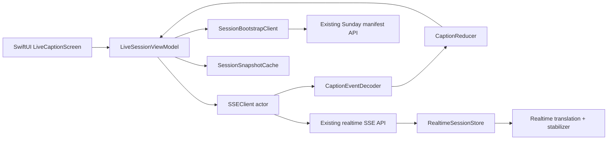

# 证道实时翻译 iOS App 设计

状态：Design proposal

日期：2026-08-30

分支：`design/sermon-live-translation-ios`

## 1. 结论

第一版应做成一个 **会众端原生字幕接收器**，而不是让每一台 iPhone 各自录音、各自调用模型翻译。

推荐的 MVP：

- 复用当前后端已经生成的实时字幕和 stable correction。
- App 通过公开 SSE 流接收 `draft -> stable -> final` 事件。
- 默认只显示大字号中文；英文原文、经文和历史字幕按需展开。
- App 不保存音频、不包含 OpenAI API key，也不默认申请麦克风权限。
- 音频采集作为后续独立的 operator/fallback 能力，不进入会众端第一版。

这让 App 聚焦于现场真正的问题：弱网络下仍能快速、安静、清楚地跟上证道，而不是在每台设备上重复一套不一致的翻译流水线。

## 2. 产品边界

### 2.1 目标用户

主要用户是身处英文证道现场、希望阅读简体中文字幕的中文会众。用户通常：

- 单手持有 iPhone，注意力主要在讲员而不是 App。
- 不愿学习复杂控制，也不应看到 operator 日志和生产状态。
- 可能使用教会 Wi-Fi，也可能使用蜂窝网络。
- 需要大字、低干扰、低亮度和可靠的断线恢复。

次要用户是现场 operator。operator 需要音频源、模型状态、重连和发布控制，但这些能力应放在独立入口或后续独立 target 中，不能混入会众主界面。

### 2.2 MVP 成功定义

会众打开 App 后，不需要登录或配置直播链接，在 2 次点击以内看到当前中文字幕；网络短暂中断后能自动恢复，并清楚知道当前看到的是现场内容、正在重连，还是旧字幕。

建议产品指标：

| 指标 | MVP 目标 |
|---|---:|
| 打开 App 到显示已有现场字幕 | 正常网络 p95 <= 1.5 秒 |
| 新事件收到后 UI 更新时间 | p95 <= 100 ms |
| 首个中文 draft | 沿用后端目标 p50 <= 2.5 秒 |
| stable caption | 沿用后端目标 p95 <= 6 秒 |
| 断线恢复 | <= 10 秒 |
| 无新事件的冻结告警 | 15 秒内出现 |
| 现场 45 分钟 crash-free session | >= 99.5% |

前两个指标属于 App；其余指标涉及端到端系统，不能只凭 App 或后端单侧健康来判定。

### 2.3 非目标

MVP 不做：

- 每个会众设备独立录音和翻译。
- App 内直播视频播放。
- AI 朗读中文字幕或同声传译音频。
- 人工编辑、发布、时间轴 review 和模型调参。
- 会后 PDF 生成或取代现有两份 canonical PDF 流程。
- 把 draft 字幕当成正式讲员原文或正式圣经译文。

## 3. 核心体验

### 3.1 信息架构

MVP 只有三个一级界面：

1. **正在听道**：当前中文字幕，是 App 默认入口。
2. **经文与原文**：从底部 sheet 展开，不打断主字幕。
3. **显示设置**：字号、中文/双语、深色模式、自动跟随。

不使用底部 Tab Bar。现场任务只有一个，Tab Bar 会增加不必要的导航和误触。

### 3.2 主界面线框

```text
┌──────────────────────────────┐
│  11:30 现场           ● 已连接 │
│  Misplaced Fear               │
├──────────────────────────────┤
│                              │
│     神的百姓正站在应许之      │
│     地的边缘，那片土地就      │
│     在他们眼前。              │
│                              │
│  正在翻译…                    │  <- 仅 draft 时低调显示
│                              │
├──────────────────────────────┤
│  民数记 13–14        查看经文  │
├──────────────────────────────┤
│      回看上一段    Aa          │
└──────────────────────────────┘
```

视觉原则：

- 使用 SwiftUI 系统语义色、Dynamic Type、SF Symbols 和标准 safe area。
- 当前 stable/final 中文字幕占据主要视觉面积。
- draft 可实时更新，但降低颜色对比，并用“正在翻译”标识；stable 到达后原位替换，避免页面跳动。
- 状态用文字加图形表达，不能只靠红/绿颜色。
- 默认隐藏长免责声明，只在首次使用和信息页展示简短提示。
- 活跃字幕页面可以提供“保持屏幕常亮”开关；离开现场或 session 结束后自动恢复系统行为。

### 3.3 状态设计

| 状态 | 用户看到什么 | App 行为 |
|---|---|---|
| 等待直播 | “字幕尚未开始”与预计场次 | 保持低频重试，不显示错误页 |
| 连接中 | 当前已有字幕或 skeleton | 连接 SSE，读取 snapshot |
| 实时 draft | 较弱颜色的滚动中文 | 可被 stable 原位替换 |
| stable/final | 高对比主字幕 | 写入当前 session 的本地轻量缓存 |
| 用户回看 | 历史列表与“回到现场”浮动按钮 | 继续接收事件，但不强制滚动 |
| 重连中 | 保留最后字幕，加“正在重连” | 指数退避并携带 cursor |
| 字幕停滞 | “字幕可能已暂停 · 15 秒前” | 不把旧字幕伪装成现场内容 |
| session 切换 | 短暂显示新场次标题 | 清理旧 draft，保留上一场历史分隔线 |
| 已结束 | “本场已结束” | 停止重连，允许只读回看 |

### 3.4 可访问性

- 支持所有 Dynamic Type 档位；最大字号下隐藏次要元数据，不能截断主字幕。
- VoiceOver 只在 stable/final 到达时播报，不逐字播报 draft delta。
- 支持“减少动态效果”；字幕替换使用淡入而不是位移动画。
- 支持竖屏和横屏。横屏仍以字幕为主，不增加 operator 控件。
- 深色模式使用接近纯黑的背景和低亮度状态色，减少现场干扰。
- 中英双语是可选项，中文永远保持主要层级。

## 4. 技术架构

### 4.1 推荐技术栈

- SwiftUI + `NavigationStack`。
- Swift Concurrency；UI state 由 `@MainActor` view model 管理。
- `URLSession.AsyncBytes` 逐行解析 SSE。
- 一个 `actor` 负责连接生命周期、去重、cursor 和退避。
- 一个纯函数 reducer 将网络事件折叠为稳定的字幕 view state。
- 只把当前 session 的少量 stable/final 字幕写入 Application Support；不保存音频或 token。

Apple 的 `URLSession` 支持以 `AsyncSequence` 方式在传输过程中读取 bytes，适合原生实现 SSE 客户端。参考 [URLSession](https://developer.apple.com/documentation/foundation/urlsession) 和 [bytes(from:delegate:)](https://developer.apple.com/documentation/foundation/urlsession/bytes(from:delegate:))。

### 4.2 组件关系



建议的 Xcode 模块边界：

```text
ios/SermonLive/
  App/
  Features/LiveCaption/
  Features/Scripture/
  Features/Settings/
  Core/Networking/
  Core/Models/
  Core/Storage/
  DesignSystem/
  Tests/
```

先保持单一 app target 和内部模块目录，不在 POC 阶段引入复杂 package 拆分。

### 4.3 复用现有后端

当前仓库已经具备：

- `GET /api/sundays/current`：当前 Sunday/manifest 信息。
- `GET /api/realtime/sessions/current/events`：公开 SSE 字幕流。
- SSE event `id`、`sessionId`、`createdAt`。
- `session_started`、`caption_delta`、`caption_stable`、`caption_final`、英文 sidecar 事件。
- query string `cursor` 重连入口。

因此 iOS MVP 不需要直接调用 OpenAI。App 只消费本项目后端已经 sanitize 的字幕事件。

### 4.4 iOS 事件 reducer 规则

对每个 `(sessionId, segmentId)`：

1. 丢弃 `id <= lastAppliedEventId` 的重复事件。
2. `caption_delta` 只更新 draft buffer，不写历史。
3. `caption_stable` 替换同 segment 的 draft，并进入历史。
4. `caption_final` 覆盖 stable；如果 source 是 stable correction，保留修正标记供诊断但不干扰会众。
5. 新 `sessionId` 出现时先处理 `session_started`，再重置 event cursor；不能把不同 session 的相同数字 id 当成重复。
6. 未识别的新 event type 安全忽略并记录计数，不能让流解析失败。

字幕优先级：`final > stable > draft`。同一优先级只接受更大的 event id。

### 4.5 后端契约需要补齐的缺口

现有 SSE 足够做原型，但 production iOS App 前建议增加一个向后兼容的 contract v1：

1. `GET /api/realtime/sessions/current/snapshot`
   - 返回当前 `sessionId`、`streamEpoch`、最新 event id、最近 20 条 stable/final 字幕和 session 状态。
   - App 首屏先 snapshot，随后从 `cursor=latestEventId` 接 SSE，避免启动空白和竞态。
2. SSE 同时支持 `Last-Event-ID` header 和现有 `cursor` query。
3. 增加 `session_ended`、`heartbeat` 和 `stream_reset` 事件。
4. heartbeat 包含 server time、当前 session 和 last event id，但不含 secret 或音频信息。
5. 当 cursor 已超出 500-event 内存窗口或服务重启时返回显式 `stream_reset`，让 App 重新拉 snapshot，不能静默漏字幕。

`streamEpoch + sessionId + eventId` 才是完整 cursor。只保存 event id 会在 session 切换或服务重启后误判。

## 5. 音频采集与 OpenAI 边界

### 5.1 为什么不进入会众 MVP

每台会众 iPhone 独立采集会带来：

- 距离讲员不同造成的声学质量差异。
- 扬声器回声、会众谈话和多设备结果不一致。
- 每台设备单独计费和限流。
- 麦克风隐私说明、录音授权和更复杂的 App Store 审核材料。
- 来电、锁屏、耳机切换和后台挂起造成的现场中断。

因此应保留一条受控、可观察的 operator 音频源，然后向所有会众广播同一份字幕。

### 5.2 operator capture 的后续方案

如果后续需要 iPhone 作为应急麦克风：

- 入口必须需要 operator 身份与 feature flag。
- OpenAI 标准 API key 只存在服务端，绝不能嵌入 App。官方文档明确要求 API key 不暴露在 browser 或 app 客户端；Realtime 支持 WebRTC/WebSocket/SIP。参考 [OpenAI API authentication](https://developers.openai.com/api/reference/overview#authentication) 和 [Realtime WebRTC call](https://developers.openai.com/api/reference/typescript/resources/realtime/subresources/calls/methods/create)。
- 后端按 session 签发短期 client secret；App 不持久化该 secret。
- 原生 WebRTC 需要经过评估的 iOS WebRTC dependency，不为了 POC 自行实现传输协议。
- 麦克风权限只在用户明确进入“应急采集”并点击开始时请求。
- 处理 audio interruption、route change、前后台切换和显式停止；界面持续显示录音指示。

Apple 要求录音必须获得用户许可，并由音频 session 表达录音意图；较新的 API 可通过 `AVAudioApplication` 管理录音许可。参考 [AVAudioApplication](https://developer.apple.com/documentation/avfaudio/avaudioapplication)、[AVAudioSession](https://developer.apple.com/documentation/avfaudio/avaudiosession) 和 [setActive(_:options:)](https://developer.apple.com/documentation/avfaudio/avaudiosession/setactive(_:options:))。

## 6. 安全、隐私与数据

- 会众 MVP 不申请麦克风权限。
- 不在 App bundle、Keychain、日志或 crash report 中放 OpenAI API key。
- 公共字幕 API 只返回 sanitize 后的字幕和 session 状态。
- 本地只缓存当前 session 的 stable/final 文本、cursor 和显示设置，并提供“清除本地字幕”入口。
- telemetry 使用随机匿名 install id；不采集姓名、精确位置、通讯录、麦克风或广告标识符。
- 日志中只记录 event type、延迟、cursor、HTTP 状态和匿名 session id；正文默认不进入远程诊断日志。
- AI 字幕提示保持简洁可见：“AI 辅助字幕，可能有延迟或错误；以讲员原文和正式圣经译本为准。”

## 7. 失败与降级

| 故障 | App 降级行为 |
|---|---|
| 没有 active session | 等待页，不循环弹错误 |
| SSE 断开 | 保留最后 stable 字幕，标注时间并自动重连 |
| cursor 失效 | 拉 snapshot，显示一次轻量“已恢复到现场” |
| 只有 draft | 显示 draft，但保持“正在翻译”状态 |
| stabilizer 失败 | 继续显示 draft；不能把后端健康误报为 stable 可用 |
| manifest 可用但 realtime 不可用 | 可选显示已发布的 post-live 字幕，并明确标注“非实时” |
| App 进入后台 | 保存 cursor；回到前台立即 snapshot + reconnect |
| session 已结束 | 停止高频重试，保留只读历史 |

## 8. 验证计划

### 8.1 自动化

- SSE parser：多行 data、comment、空行、UTF-8、分片边界和未知 event。
- reducer：draft/stable/final 覆盖、重复、乱序、跨 session 和 correction。
- reconnect：网络中断、HTTP 5xx、cursor reset 和前后台切换。
- snapshot/SSE race：snapshot 后到达的第一条事件不丢失也不重复。
- SwiftUI snapshot：小屏、横屏、深色模式、超大 Dynamic Type。
- VoiceOver：只播报 stable/final。

### 8.2 现场验收

至少在真实 iPhone 上完成一次完整证道时长演练，并分别验证：

- 教会 Wi-Fi、蜂窝网络和两者切换。
- 锁屏/解锁、切后台 1 分钟、低电量模式。
- 10 秒网络中断后的恢复。
- draft 到 stable correction 的原位替换。
- 用户回看时新字幕继续进入，点击“回到现场”正确定位。
- 后端进程重启或 session 切换后不会显示假实时旧字幕。
- Dynamic Type 最大档和 VoiceOver。

Cloud Run health、SSE smoke 和 simulator 测试都不能替代这次物理设备现场验收。

## 9. 分阶段实施

### Phase 0：契约与可点击原型

- 固化 mobile contract v1 和 fixture JSONL。
- 用 SwiftUI 做等待、实时、重连、回看四种状态的本地 fixture 原型。
- 在 iPhone 真机确认字号、低亮度和现场可读性。

### Phase 1：只读 MVP

- 接入 Sunday bootstrap、snapshot 和 SSE。
- 完成 reducer、缓存、重连、经文 sheet、显示设置与匿名 telemetry。
- TestFlight 小范围现场试用。

### Phase 2：可靠性与发布

- 加入 stream epoch、server heartbeat 和真实 production observability。
- 完成隐私说明、App Store 元数据、支持页和崩溃诊断边界。
- 通过一场完整 rehearsal 和一场真实 service 后再扩大使用。

### Phase 3：operator 应急采集

- 独立鉴权入口、短期 client secret、原生 WebRTC 音频链路。
- 音频中断、路由切换、后台行为和成本告警。
- 仍由后端汇总并广播唯一字幕流。

## 10. 实施前需要确认的决策

这些问题不阻碍设计分支，但会影响开始写 App：

1. 部署最低版本暂定 **iOS 17+**；实施前用实际会众设备范围验证。
2. App 是公开 App Store、TestFlight 邀请，还是教会内部分发。
3. 是否使用现有 Cloud Run 公网域名作为唯一 production API origin。
4. 会众是否需要繁体中文；MVP 当前只定义简体中文。
5. Scripture sheet 是否沿用当前 `cmn-cu89s` 内容和归属展示方式。
6. operator capture 是否确实需要进入同一 App，还是保持独立工具更安全。

## 11. 建议的下一步

先不要直接写完整 App。最小、可验证的下一步是：

1. 在后端补 snapshot、heartbeat、stream epoch 和 cursor reset contract。
2. 新建 SwiftUI fixture prototype，只实现四个状态和 SSE reducer。
3. 用现有 realtime JSONL 回放 45 分钟，在 iPhone 真机做阅读与断网测试。
4. 通过后再接 production SSE，并把 operator capture 留到 Phase 3。

相关现有文档：

- [系统设计](./system-design.zh.md)
- [周日 live test runbook](./sunday-live-test-runbook.zh.md)
- [Admin 工作流](./admin-workflow.zh.md)
- [观测与日志](./observability.zh.md)
