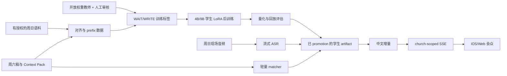

# 证道实时翻译后训练文档集

日期：2026-08-30

状态：设计基线，尚未开始训练或生产部署

分支：`design/sermon-live-translation-ios`

## 1. 一页结论

本项目采用**级联式实时翻译**：现场音频先由流式 ASR 产生英文增量，再由后训练的小型文本学生模型输出 `WAIT` 或 append-only 中文增量，最后通过 church-scoped backend 和同一条 public SSE 分发给 iOS 与 Web 会众端。

周日关键路径只运行 ASR、学生模型、轻量 Context Pack matcher 和分发服务。教师模型只在离线数据准备阶段使用；学生训练完成后，教师不需要跟随学生一起部署。

当前建议：

- 方案 C 是正式产品方向：固定教会列表，一间教会采集一次、翻译一次、统一分发。
- 方案 B 是后续个人模式：每位用户主动开麦并独立使用云端实时翻译，不写入教会公共字幕。
- 主学生候选：`Qwen/Qwen3.5-4B` 与 `Qwen/Qwen3.5-9B`；对应 Base checkpoint 作为训练对照，不把候选直接写成最终选型。
- 外部学生训练的默认教师：固定 revision 的开放权重 `Qwen/Qwen3.8-27B`，加人工审核与确定性 validator。
- `gpt-5.6-sol` 只能先作为不写入训练集的质量参考。把其输出系统性用于训练外部 Qwen 学生，当前列为 **BLOCKED**，等待 OpenAI 书面授权或合同确认。
- DGX Spark 首轮采用 BF16 LoRA；QLoRA 是显存或吞吐验证后的备选，full fine-tuning 不作为第一步。
- 周六资料只能提供术语、经文和段落候选，周日实时英文始终是事实来源；`Saturday-only addition` 的发布门禁为 0。
- 产品延时目标：讲员开始说话到首个可读中文短语 p50 不高于 2 秒、p95 不高于 3.5 秒；这是待实测目标，不是现有系统已达到的结果。

## 2. 教师、学生与运行时关系

要特别区分：

- **教师模型**参与离线制数、解释困难样本或评审，不是周日服务依赖。
- **学生模型**训练后可以直接做“英文 prefix -> 中文增量”的实时文本翻译，但它不是音频模型；仍需要流式 ASR、状态控制和字幕分发。
- **Context Pack**不是另一位事实来源，也不直接加速算力；它主要减少专名、经文和表达歧义。

## 3. 文档导航与权威边界

| 文档 | 回答的问题 | 权威范围 |
|---|---|---|
| [后训练设计](./post-training-design.zh.md) | 训练目标、教师/学生分工、阶段与输出是什么 | 训练方法总设计 |
| [模型选型](./model-selection.zh.md) | 4B/9B/27B 怎么选，Base 与 post-trained 怎么用 | checkpoint 候选与 bake-off |
| [后训练文本准备](./dataset-preparation.zh.md) | 语料怎样取得、对齐、切分、制成 prefix 数据 | 数据集与 schema |
| [DGX Spark 后训练运行方案](./dgx-spark-post-training-runbook.zh.md) | 如何隔离环境、跑 LoRA、保存和验证 artifact | 单机训练 runbook |
| [评估与模型晋级](./evaluation-and-promotion.zh.md) | 怎样证明质量与延时，什么情况下可以现场使用 | benchmark 与 promotion gate |
| [近三个月相关研究](./recent-research-review-2026-08.zh.md) | 最新论文采用了什么，对本项目有什么启发 | 研究证据与适用边界 |
| [许可与数据治理](./licensing-and-data-governance.zh.md) | 开源、开放权重、教师输出和语料权利怎样判断 | go/no-go 合规门禁 |
| [iOS App 综合设计](../ios-live-sermon-translation-app.zh.md) | 方案 B/C、Admin/会众、Context Pack、端到端架构 | 产品与系统设计 |

如果综合设计稿与本目录在模型、训练、数据或许可方面冲突，以本目录对应专题文档为准；产品和 iOS 行为仍以综合设计稿为准。

## 4. 当前决策状态

| 决策 | 状态 | 说明 |
|---|---|---|
| 方案 C 作为正式方向 | 已决定 | 一间教会单一 active producer，iOS/Web 同源 |
| 文本级级联，而非首版端到端音频学生 | 已决定 | 更容易利用现有 ASR、语料和本地硬件 |
| Prefix `WAIT/WRITE` 训练 | 已决定 | 直接训练延时与稳定性，不只训练整句翻译 |
| Qwen3.5 4B/9B bake-off | 设计决定 | 仍需同数据、同 runtime 实测 |
| Qwen3.8-27B 作为外部训练主教师 | 设计决定 | 运行前锁 revision、license、template 与 decoding receipt |
| GPT-5.6 Sol 为外部学生制数 | 阻塞 | 需要书面授权或合同确认，未确认前不得进入 dataset |
| ASR 最终模型 | 待实验 | 分开比较稳定 prefix、专名 recall 与端到端延时 |
| Mac 4B 与 DGX 9B 哪个生产 | 待实验 | 由完整回放与 75 分钟持续测试决定 |
| 经文版本及其训练/分发权 | 待确认 | 不能用“教会用途”代替授权 |

## 5. 最小可执行顺序

1. 完成语料权利清单，选 10–20 篇完整 untouched Sunday 作为测试集；在任何 prefix 扩增前按完整证道切分。
2. 建立 200–500 条人工审核 calibration set，锁定 `WAIT/WRITE` schema、Qwen 教师 prompt 和 validator。
3. 用 2,000–5,000 条 gold 语义段形成 POC 数据集；真实 ASR prefix 优先，synthetic 只补覆盖缺口。
4. 在 DGX Spark 分别跑 4B 与 9B BF16 LoRA smoke 和正式 candidate；不触碰现有 production service。
5. 固定五路 replay：云端基线、未训练学生、领域 SFT、prefix 学生、prefix + Context Pack。
6. 通过忠实度、延时、长时稳定和 artifact receipt 门禁后，才进入 iPhone -> DGX/Mac -> SSE 的方案 C rehearsal。

## 6. 尚未声称完成的事项

- 尚未下载或锁定训练用模型 artifact。
- 尚未确认 OpenAI 对外部模型蒸馏的书面许可。
- 尚未完成任何 DGX Spark 训练、Mac/DGX 推理 benchmark 或 75 分钟现场回放。
- 尚未确定本地 ASR、圣经版本和首批可训练证道语料。
- 论文结果来自不同语言、硬件与延时指标，不能当作本项目已达到的实测结果。
