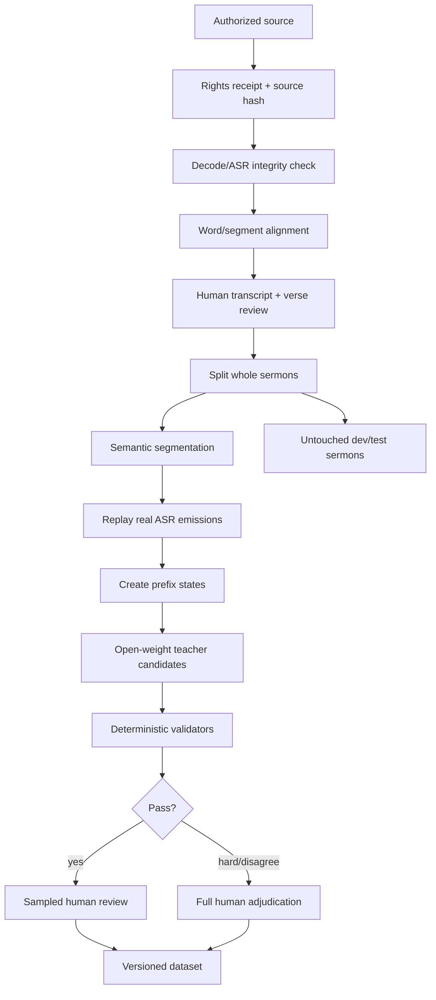

# 证道实时翻译后训练文本准备方案

日期：2026-08-30

状态：数据设计，尚未发布 dataset

## 1. 数据目标

训练数据不是普通的“英文整段 -> 中文整段”平行语料。它必须重建周日现场状态：英文从 ASR 一点点到达，学生在每个时刻决定等待还是追加中文，同时不能被周六相似稿诱导补写。

最终发布三个相互关联、但用途分开的数据层：

1. `segment-gold`：人工审核的完整英文语义段与中文参考。
2. `prefix-policy`：按真实 ASR 到达顺序展开的 `WAIT/WRITE` 样本。
3. `context-hard-negatives`：周六匹配、偏离、错序、漏讲和经文模式的正负例。

测试集目标必须人工审核；不能用教师自己生成的答案证明学生接近教师。

## 2. 来源分层

| 来源 | 主要用途 | 可以做什么 | 禁止做什么 |
|---|---|---|---|
| Gold Sunday paired corpus | 核心训练与评估 | 音频、时间轴英文、人工中文、真实 ASR prefix | 未授权内容进入发布数据集 |
| Saturday prior corpus | Context Pack 与 hard negative | 术语、经文、大纲、相似/偏离候选 | 直接把周六中文当周日答案 |
| Bible corpus | 引用识别与 canonical resolver | 书卷别名、verse ID、允许版本的对齐文本 | 默认假设所有译本可训练/分发 |
| 历史证道/翻译记忆 | 领域 SFT | 经授权字幕、讲员术语、系列名 | 来源不清的网络字幕混入训练 |
| 通用英中翻译 | 抗遗忘 | 小比例高质量公开/授权语料 | 让通用数据淹没流式证道行为 |
| Synthetic | 补 prefix 和困难覆盖 | 经固定教师、validator、抽审的数据 | 无 provenance 的大量自动生成 |

## 3. Rights receipt 先于文本处理

每个 source 在转写、切段或发给教师前必须有 receipt：

```json
{
  "rightsReceiptId": "rights_20260830_001",
  "sourceId": "source_sha256_prefix",
  "ownerOrLicensor": "pseudonym_or_org",
  "permissionEvidence": "path-or-record-id",
  "allowedUses": [
    "internal_transcription",
    "model_training",
    "internal_inference"
  ],
  "distributionScope": "internal-only",
  "bibleVersion": null,
  "retentionUntil": null,
  "deletionContact": "role-id",
  "approvedBy": "reviewer-id",
  "approvedAt": "2026-08-30T00:00:00Z"
}
```

权利必须分别回答：

- 能否保存原始音频。
- 能否转写和人工编辑。
- 能否发给云端服务。
- 能否用于本地模型训练。
- 能否分发 LoRA、merged 或量化权重。
- 能否把输出展示给会众。

没有 receipt 的来源进入 quarantine，只能人工研究，不能进入任何可训练 manifest。

## 4. 数据目录与不可变版本

建议的数据发布结构：

```text
datasets/sermon-simul/
  sources/
    source-manifest.jsonl
    rights-manifest.jsonl
  normalized/
    sermons.jsonl
    transcript-segments.jsonl
    saturday-context.jsonl
  aligned/
    word-timestamps.jsonl
    verse-alignments.jsonl
    asr-emissions.jsonl
  splits/
    split-manifest-v1.json
  examples/
    segment-gold.train.jsonl
    prefix-policy.train.jsonl
    context-hard-negatives.train.jsonl
    dev.jsonl
    test.jsonl
  receipts/
    teacher-jobs.jsonl
    validator-report.json
    human-review.jsonl
  dataset-card.md
  manifest.json
```

这只是逻辑结构；含音频和受限文本的数据仓库不应默认提交到 Git。Git 只保存 schema、去敏 fixture、代码和不含正文的 manifest 摘要。

每次发布新版本，不原地改写旧数据：

```text
sermon-simul-ds-v0-calibration
sermon-simul-ds-v1-poc
sermon-simul-ds-v2-expanded
```

## 5. 端到端准备流水线



### Step 1：来源与完整性

- 保存原始 URL/ID、文件 SHA-256、时长、codec、采集时间和权限 receipt。
- 音频必须用媒体工具验证可解码、实际时长和声道，不把网页可播放当作本地文件完整。
- 周六、周日、VOD 和衍生剪辑建立 lineage，避免同一内容被误当成独立来源。

### Step 2：转写与对齐

保留两份英文：

- `humanTranscript`：人工修正，用于 gold reference。
- `asrTranscript/asrEmissions`：真实模型在各时刻看到的 prefix，用于鲁棒训练与端到端 replay。

必须保存：

- word/segment timestamp。
- stable/unstable emission、revision 和置信度。
- 讲员停顿、自我修正、口头禅与未完成句。
- 经文引用边界、专名和审核标记。

不要只保存润色后的整段稿，否则无法训练等待策略。

### Step 3：先切分，再扩增

数据泄漏控制顺序：

1. 先按完整 `sermonId`、日期、讲员和教会归组。
2. 再确定 train/dev/test。
3. 最后生成语义段、prefix、synthetic 和 hard negatives。

同一证道的周六稿、周日稿、音频片段、教师翻译和所有 prefix 必须在同一个 split。

建议同时保留：

- `test_seen_speaker_new_sunday`：见过讲员但没见过该证道。
- `test_unseen_speaker_or_church`：测试跨讲员/教会泛化。
- `test_divergence`：周六/周日明显不一致。
- `test_long_form`：完整 45–75 分钟连续回放。

具体比例由可授权语料量决定；任何比例都不能牺牲完整 sermon 隔离。

### Step 4：语义切段

以自然短语、停顿、标点、经文引用和话题边界切段，同时保留连续时间轴：

- 目标 segment 通常适合 1–2 行手机字幕。
- 太短会失去英中重排证据，太长会放大延时。
- 不随机打乱相邻片段；保留 `previousSegmentId/nextSegmentId`。
- 明确标记 prayer、Bible quote、narrative、illustration、announcement 等内容类型。

### Step 5：生成真实 prefix

优先使用 ASR emission log，而不是固定字符截断：

```json
{
  "emissionAtMs": 184720,
  "text": "There is therefore",
  "stableChars": 9,
  "revisionOf": null
}
```

如果历史数据没有 emission log，可以用 300–800 ms 音频重放或 token/word 到达模拟补齐，但必须标记 `prefixOrigin=simulated`，不能和真实 prefix 静默混合。

每个完整段通常形成 3–8 个 prefix；实际数量由语言边界和 ASR 到达行为决定，不强行制造无意义的每-token 样本。

### Step 6：生成 Context Pack 对照

对每个 Sunday segment 构造：

- 正确的附近 Saturday candidate。
- 主题相似但事实不同的 candidate。
- 错序候选。
- 周六有、周日删除的内容。
- 同经文不同表达或不同 verse 的候选。
- `no_prior` 与 `diverged`。

这组数据专门训练“不抄周六稿”和匹配失败时退回 live-only。

### Step 7：教师制数

默认流程：

1. 固定 Qwen3.8-27B revision、chat template、decoding config 和 prompt version。
2. 先为 full segment 生成参考候选与 evidence span。
3. 再为每个 prefix 生成 `WAIT/WRITE/delta`。
4. 每个输出保存 input hash、teacher receipt 和 raw/normalized 结果。
5. GPT-5.6 Sol 未获外部蒸馏书面许可前，不得出现在训练 manifest 的 `teacherModel` 字段。

教师输出只是候选。人工 gold、确定性 validator 和拒绝统计必须保留。

### Step 8：确定性验证

自动 validator 至少检查：

- JSON schema 与字段枚举。
- 中文语言和长度。
- `deltaZh` 与 `committedZh` 是否 append-only、无重复。
- `WAIT` 时不得含字幕正文。
- source evidence 是否存在于当前 live prefix。
- 数字、人名和经文 reference 是否越界。
- Saturday-only entity/claim 是否被加入。
- quote mode 与 canonical verse 是否一致。
- 同一状态是否生成冲突 action。
- teacher output 是否包含系统提示、解释或 Markdown。

validator 不判断所有语义正确性；它只阻断可确定的坏样本。

### Step 9：人工审核

审核分三级：

- calibration set：100% 双语人工审核。
- 普通 synthetic：按来源、讲员、内容类型和 action 分层抽样。
- validator 失败、教师不确定、经文或 hard negative：100% 人工裁决或丢弃。

审核 rubric：忠实、简洁、可读、等待时机、经文模式、术语、周六新增、append-only。

## 6. 最小 JSONL schema

```json
{
  "schemaVersion": "sermon-simul-v1",
  "exampleId": "sermon_20260830_prefix_0042_03",
  "sermonId": "sermon_20260830",
  "churchId": "church_pseudonym_01",
  "speakerId": "speaker_pseudonym_04",
  "split": "train",
  "audioStartMs": 184220,
  "audioEndMs": 187640,
  "sourceTranscript": "There is therefore now no condemnation...",
  "sourcePrefix": "There is therefore now no",
  "sourceStability": 0.93,
  "prefixOrigin": "real_asr",
  "committedZh": "所以如今，",
  "action": "WRITE",
  "deltaZh": "那些在基督耶稣里的人",
  "finalZh": "所以如今，那些在基督耶稣里的人就不被定罪了。",
  "scriptureRef": "Romans 8:1",
  "quoteMode": "exact_quote",
  "contextPackId": "ctx_sha256prefix",
  "saturdayCandidateIds": ["sat_0071"],
  "saturdayPriorUsed": true,
  "teacherModel": "Qwen/Qwen3.8-27B",
  "teacherRevision": "pinned-revision",
  "teacherPromptVersion": "sermon-simul-teacher-v1",
  "validatorStatus": "pass",
  "reviewStatus": "human_approved",
  "sourceSha256": "...",
  "rightsReceiptId": "rights_..."
}
```

训练 loader 必须能按 `teacherModel`、`prefixOrigin`、`reviewStatus`、`contentType` 和 `rightsReceiptId` 做过滤与消融。

## 7. 数据规模规划

这些数字是实验起点，不是质量保证：

| 阶段 | 建议规模 | 目的 |
|---|---:|---|
| Calibration | 200–500 个 prefix/segment | 锁 schema、prompt、rubric 与 validator |
| POC gold | 2,000–5,000 个语义段 | 验证 4B/9B 是否有净收益 |
| 扩展 gold | 5,000–10,000，逐步到 20,000+ | 覆盖讲员、经文和长句 |
| Prefix expansion | 每段 3–8 个状态 | 训练等待/追加策略 |
| Synthetic | 只按覆盖缺口逐批扩大 | 不预设大规模自动制数 |
| Untouched test | 至少 10–20 篇完整 Sunday | 防止片段级泄漏和教师自证 |

每次扩大前都要比较 gold-only、gold+synthetic 和不同 teacher provenance，避免 synthetic 数量掩盖质量下降。

## 8. 质量报表

每个 dataset version 至少发布：

- source/sermon/speaker/church 数量，不包含敏感名称。
- 训练、dev、各 test 子集的完整 sermon 列表 hash。
- gold、synthetic、real-ASR、simulated-prefix 比例。
- `WAIT/WRITE`、经文模式、内容类型和 hard-negative 分布。
- validator rejection 原因与比例。
- 人工审核覆盖、分歧率和 adjudication 结果。
- rights receipt 完整率与 distribution scope。
- 删除索引覆盖率。
- 与上一版本的 added/removed/changed lineage。

## 9. 删除与重建

任何来源撤回授权时：

1. 通过 `sourceSha256` 和 `rightsReceiptId` 找到所有音频、转写、segment、prefix、teacher output 和 Context Pack 衍生物。
2. 标记旧 dataset/model artifact 为 `revoked-source-impact`，不再 promotion。
3. 从剩余来源重建新 dataset version。
4. 重训或评估受影响 adapter；不能只删除原始文件而保留训练衍生物。
5. 保留不含正文的审计 receipt，记录删除时间和影响范围。

## 10. POC 完成条件

文本准备阶段只有在以下条件都满足时才可交给 DGX 训练：

- rights receipt 完整率 100%。
- train/dev/test 已按完整 sermon 冻结，自动检查无 lineage 泄漏。
- calibration set 100% 人工审核。
- prefix schema、teacher receipt 和 validator 可重放。
- `Saturday-only addition` validator 与人工 rubric 已建立。
- test 目标不来自主教师自动生成。
- dataset manifest、hash、统计和删除索引已生成。
