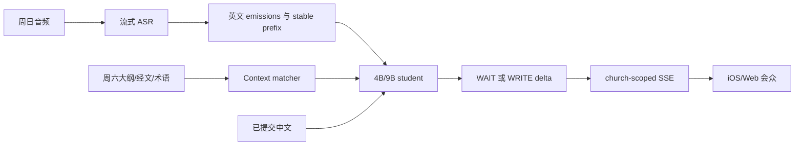

# 证道实时翻译论文框架（Draft 0）

日期：2026-08-30

状态：研究与写作框架；尚未开始正式实验，不包含任何已验证的性能提升结论

近期论文检索窗口：2026-05-30 至 2026-08-30

## 1. 论文定位

### 1.1 暂定标题

英文主标题：

> **SermonSimul: Context-Bounded Prefix Distillation for Faithful Long-Form English-to-Chinese Sermon Translation on Edge Hardware**

中文工作标题：

> **面向边缘设备的忠实长时英中证道实时翻译：受控上下文与前缀蒸馏**

可选标题：

- `FaithfulSimul: Mismatch-Safe Context Distillation for Long-Form Sermon Translation`
- `From Saturday Notes to Sunday Speech: Context-Bounded Simultaneous Sermon Translation`
- `Small Models, Long Sermons: Domain Post-Training for Low-Latency English-to-Chinese Translation`

### 1.2 一句话研究问题

在周日没有逐字稿、周六资料与现场表达可能不一致的条件下，能否通过证道领域 SFT、真实 ASR prefix、教师生成的 `WAIT/WRITE` 监督和 mismatch-safe Context Pack，使 4B/9B 文本学生模型在 M1 Max 64GB 或 DGX Spark 上取得接近通用实时翻译系统的延时，同时提高经文、专名和忠实度？

### 1.3 论文不应提前声称什么

当前只能提出方法和实验设计，不能声称：

- 后训练已经提高翻译质量。
- 4B/9B 已达到云端实时翻译水平。
- 首个可读中文短语已达到 p50 2 秒、p95 3.5 秒。
- Context Pack 已经做到 `Saturday-only addition = 0`。
- DGX Spark 或 M1 Max 已通过 75 分钟连续证道回放。

这些内容只有在冻结测试集、完成端到端实验和人工评审后，才能进入论文摘要与结论。

## 2. 我们要填补的研究空白

近期工作分别证明了以下组件可行：

- 级联 ASR + LoRA 翻译模型可以完成英中同时翻译。
- prefix-to-prefix 或 `<wait>` 数据可让模型学习何时等待、何时输出。
- ASR 噪声增强和稳定 prefix 对实时翻译质量重要。
- 检索、术语和预翻译上下文可以帮助领域翻译。
- 长语音会积累延时，短句 benchmark 不足以证明系统可用。

但检索到的工作没有同时覆盖我们的完整交集：

1. **证道领域**：经文引用、神学术语、专名、修辞、重复与即兴表达。
2. **周六/周日不一致**：上下文有帮助，但不能把周六讲过而周日没讲的内容补进字幕。
3. **小型本地学生**：目标是 4B/9B 文本模型，而不是 27B/30B 音频大模型或 H100-only 系统。
4. **长时现场链路**：从 Admin 麦克风、ASR、翻译、SSE 到 iOS/Web 会众渲染的真实 TTFC。
5. **事实与版本约束**：经文版本、逐字引用、专名与数字需要独立于平均 BLEU/COMET 的门禁。
6. **数据治理**：YouTube 自动字幕、教师标签、人工 Gold、来源授权和撤回 lineage 需要明确分层。

因此，论文的潜在创新不是“第一次用小模型翻译”，而是研究以下组合是否有效：

> **领域后训练 + 因果 prefix 决策 + 真实 ASR emissions + 错配上下文 hard negatives + 长时边缘端到端评估。**

这是待实验验证的创新假设。正式投稿前仍需把检索范围扩展到三个月以前的 simultaneous MT、context-aware MT、domain adaptation、knowledge distillation 和 hallucination control 文献，不能把当前近三个月综述当作完整 prior-art 检索。

## 3. 论文相关度排序方法

以下分数是针对本项目的**编辑性相关度**，不是论文质量评分。总分 10 分，综合考虑：

- 是否直接研究流式英中语音到文本翻译。
- 是否覆盖小模型后训练、prefix policy、ASR 噪声或蒸馏。
- 是否研究上下文、忠实度或错误新增。
- 是否覆盖长语音、边缘硬件或端到端延时。
- 方法能否形成我们的 baseline、ablation 或评估协议。

同一论文可以在“总体相关度”排名较低，但在某个子问题上最关键。例如 P2P 是最直接的训练标签参考，MLLP-VRAIN 是最直接的 Context Pack 参考。

## 4. 参考论文：按本用例相关度排序

### 4.1 第 1 名：Pinch-AST — 9.0/10

[Pinch-AST: Robust Cascaded Speech Translation System for the IWSLT 2026 Simultaneous Speech Translation Task](https://aclanthology.org/2026.iwslt-1.30/)

**文章做了什么**

- 覆盖 En→Zh，并采用 `ASR -> text translation` 级联架构。
- 使用 Qwen3-ASR-1.7B、Qwen3 ForcedAligner-0.6B 和按语言对 LoRA 的 Qwen3.5-4B。
- 用 ASR confusion 生成 lexical noise augmentation。
- 把对齐语料截成 30%/50%/70%/100% prefix，与完整句混合训练。
- 用 character-level longest common prefix 做 retranslation 和不可回退提交。
- 论文报告单张 H100 80GB 在 real-time budget 内运行，并覆盖较长输入。

**它没有覆盖什么**

- 没有证道或圣经领域训练。
- 没有周六资料、相关/错误上下文对照或 `Saturday-only addition` 门禁。
- 没有 M1 Max、DGX Spark 和 iOS/Web 会众端 TTFC。
- 没有教师生成 `WAIT/WRITE` 决策，也没有 Silver/Gold 与数据授权治理。

**在我们论文中的位置**

- 最强的直接系统 baseline。
- 支持“小型文本学生 + ASR 噪声 + prefix training + LCP commit”主路线。
- 我们需要证明 mismatch-safe context、证道数据和教师 P2P 在这个强 baseline 之上分别贡献什么。

### 4.2 第 2 名：CUHKSZ IWSLT 2026 — 8.5/10

[CUHKSZ Simultaneous Speech Translation System for IWSLT 2026](https://aclanthology.org/2026.iwslt-1.13/)

**文章做了什么**

- 以 Qwen3-Omni-30B-A3B 为音频文本模型，只对 LLM thinker 做 LoRA。
- 让 Qwen3-30B-Instruct 教师为英中数据生成 syntax-aware chunks、双语对齐、重排序和 `<wait>` 决策。
- 形成约 22 万条过滤后的 En→Zh chunk supervision。
- 运行时使用固定音频 chunk、bounded history 和 emission guard。
- 在 extra-context track 中注入实体或摘要等 contextual prior。
- 在官方 dev 上报告 En→Zh 低延时设置 40.5 BLEU/1.95 秒，高延时设置 42.1 BLEU/2.16 秒。

**它没有覆盖什么**

- 30B 多模态模型和 A800 运行条件不是我们的 4B/9B 文本学生场景。
- 上下文是相关的科学报告资料，没有系统测试“看似相关但当天未说”的错误上下文。
- 没有证道经文、长达 45–75 分钟的现场产品链路和 viewer TTFC。
- 没有来源权利、人工 Gold 和 unsupported addition 的发布门禁。

**在我们论文中的位置**

- 教师合成 chunk alignment 和 `<wait>` 标签的主要先例。
- 支持把 policy 内化到模型，而不是完全依赖外部 controller。
- 它报告不同语言的 context 效果并不一致，正好说明我们的错配上下文实验不可省略。

### 4.3 第 3 名：NeMo@IWSLT 2026 — 8.0/10

[NeMo@IWSLT 2026: Cascaded System for Simultaneous Speech Translation](https://aclanthology.org/2026.iwslt-1.23/)

**文章做了什么**

- 使用 dual-mode Unified ASR Transducer 与 Qwen 系列翻译模型组成级联系统。
- 同时评估 4B、9B、27B 级别模型，并覆盖 En→Zh。
- 把 ASR partial transcript 的稳定性当作独立问题研究。
- 论文中的 En→Zh 结果显示参数量更大并不必然更好；模型选择需要按语言对和延时共同评估。
- context track 使用 ASR word biasing/customization，并观察到较小但一致的收益。

**它没有覆盖什么**

- 重点是系统与模型选择，不是面向证道语料的教师蒸馏方案。
- 没有 `WAIT/WRITE` 教师数据、Saturday mismatch hard negatives 或经文逐字门禁。
- 没有从 Admin 麦克风到会众设备的端到端延时和长期热状态测试。

**在我们论文中的位置**

- 支持同时保留 4B 与 9B bake-off，而不是先假设 9B 一定胜出。
- 支持把 ASR stability、专名 recall 与学生翻译分别报告。
- 是“学生不应替 ASR 擦掉所有错误”的系统设计依据。

### 4.4 第 4 名：Prefix-to-Prefix Data Driven Approach — 7.5/10

[Do LLMs Need Architectural Changes for Simultaneous Speech Translation? A Prefix-to-Prefix Data Driven Approach](https://arxiv.org/abs/2607.13158)

**文章做了什么**

- 用固定音频 chunk、cumulative decoding 和 committed-prefix rewind 构造流式输入。
- 教师看到完整序列用于规划，但只为当前因果 prefix 标注可提交译文或等待。
- 用 bounded wait（论文设置上限为 3）避免模型无限等待。
- 学生使用标准 token-level cross entropy 学习 `speech prefix -> target prefix`，不要求改模型架构。
- 在内部对话数据上报告相对 streaming baseline 的 +1.54 COMETKiwi，Average Lagging 增加 0.15 秒。

**它没有覆盖什么**

- 主要语言不是 En→Zh，数据为内部对话语音。
- 没有证道、经文、周六 Context Pack、长时演讲或边缘硬件。
- 结论依赖教师质量以及 chunk、rewind、wait 参数，不能直接外推到我们的语料。

**在我们论文中的位置**

- 是 `WAIT/WRITE` 教师标签和 prefix distillation 的最直接方法参考。
- 在“训练方法相关度”上排第 1。
- 我们的贡献应检验 P2P 从短对话迁移到英中长时证道时，是否仍能改善质量—延时—稳定性三者。

### 4.5 第 5 名：MLLP-VRAIN UPV IWSLT 2026 — 7.0/10

[MLLP-VRAIN UPV System for the IWSLT 2026 Simultaneous Speech Translation Task](https://aclanthology.org/2026.iwslt-1.24/)

**文章做了什么**

- 使用 Parakeet ASR + Qwen3.5 级联系统，评估 4B/9B/27B，并将模型量化到消费级 GPU 条件。
- 使用 adaptive black-box policy 和带少量 rewrite buffer 的 speculative LCP。
- context track 同时使用 ASR phrase boosting、离线预翻译 sentence memory 和 lexical RAG。
- 论文报告 ASR word error rate 从 7.2 降到 6.4，context processing 带来整体 +1.03 的增益。

**它没有覆盖什么**

- 它没有后训练 Qwen3.5；改进主要来自运行时 policy 和 context processing。
- 最终系统使用量化 27B，不等同于我们的 4B/9B 后训练目标。
- 默认上下文与音频相关，没有错误周六稿、错序段落或未说事实的 hard-negative 设计。
- 没有证道忠实度、经文版本与 viewer TTFC。

**在我们论文中的位置**

- 在“Context Pack 相关度”上排第 1。
- 形成 `no context / matched context / mismatched context / adversarial same-topic context` 四路实验的直接动机。
- 它必须被列为 runtime-context baseline，不能被误写成 post-training baseline。

### 4.6 第 6 名：Long-Form Evaluation — 5.5/10

[A Practical Evaluation Method for Long-Form Simultaneous Speech-to-Speech Translation](https://aclanthology.org/2026.iwslt-1.3/)

**文章做了什么**

- 提出用 ASR、forced alignment、sentence embedding、YAAL/xCOMET 评估长时同步语音翻译。
- 在约 10 分钟长语音中观察到部分系统的 ending offset 持续增长，显示延时会累积。

**它没有覆盖什么**

- 研究对象主要是 speech-to-speech 评估，不提供我们的训练方法。
- 没有 75 分钟证道、iOS/Web 首屏、经文或上下文安全指标。

**在我们论文中的位置**

- 支持把 long-form latency drift 设为正式实验，而不是工程附录。
- 用于设计前 10 分钟与后 10 分钟的延时、内存和稳定性对照。

### 4.7 第 7 名：Test-Time Adaptation — 5.0/10

[Test-Time Adaptation of an Offline Multimodal Foundation Model for Simultaneous Speech Translation](https://aclanthology.org/2026.iwslt-1.27/)

**文章做了什么**

- 不重新训练模型，而是在推理时用 pause/VAD segmentation、wait-policy、多轮上下文、response prefill 和 KV cache 改造离线多模态模型。
- 展示质量与延时可能相互交换，并明确讨论多轮误差累积和无限流 KV cache 未解决问题。

**它没有覆盖什么**

- 没有小模型领域后训练或教师蒸馏。
- 没有周六资料的错误新增风险、证道领域和本地小模型验证。

**在我们论文中的位置**

- 是“只改 controller、不后训练”的必要 baseline。
- 如果后训练学生无法显著超过该 baseline，就不能把收益归因于复杂训练流程。

### 4.8 第 8 名：AlignAtt4LLM — 4.5/10

[AlignAtt4LLM: Fast AlignAtt for Decoder-Only LLMs at IWSLT 2026 Simultaneous Speech Translation Task](https://aclanthology.org/2026.iwslt-1.32/)

**文章做了什么**

- 使用 Qwen3-ASR、forced alignment 和 decoder-only LLM。
- 通过 attention-based emission policy 决定何时输出，并适配 decoder-only replay。
- 在部分欧洲语言上表现良好，但 En→Zh 结果较混合。

**它没有覆盖什么**

- 没有证道领域后训练、上下文安全、小模型边缘部署和产品延时。
- policy 依赖模型内部 attention，工程复杂度高于黑盒 `WAIT/WRITE`。

**在我们论文中的位置**

- 作为 future work 或高级 policy baseline。
- 第一篇论文不应为了覆盖它而改变当前简单、可审计的架构。

### 4.9 第 9 名：Automatic Metric Hurdles — 3.5/10

[Hurdles of Automatic Metric for Speech Translation Evaluation](https://aclanthology.org/2026.iwslt-1.34/)

**文章做了什么**

- 探索 audio-infused COMET 和 speech-LLM metric。
- 发现受音频噪声、audio/transcript mismatch 和评估集限制影响，这些方法未能稳定优于文本指标。

**它没有覆盖什么**

- 不提供实时翻译系统或后训练方法。
- 不处理经文、术语、unsupported addition 和会众体验。

**在我们论文中的位置**

- 说明不能只报一个自动分数。
- 支持加入双语人工忠实度、经文/数字/专名定向指标和错误新增审计。

### 4.10 方法锚点：Streaming SpeechLLM — 3.5/10

[Streaming Speech-to-Text Translation with a SpeechLLM](https://arxiv.org/abs/2605.14766)

该文于 2026-05-14 提交，早于本次严格三个月窗口，因此作为方法锚点，不计入“近三个月核心论文”。

**文章做了什么**

- 从自动 speech-output alignment 构造监督，让 SpeechLLM 学习等待和流式输出。
- 研究约 1–2 秒逻辑延时，并讨论静音和电话音频能量问题。

**它没有覆盖什么**

- 主要方向为英法、英韩等，没有 En→Zh。
- 使用四张 H100 训练，不是 4B/9B 文本级联学生。
- 没有证道、Context Pack、长时字幕和数据治理。

**在我们论文中的位置**

- 用于说明“从对齐数据学习等待”并非只存在于文本级 P2P。
- 可放在 related work，不作为主要实验复现对象。

## 5. 覆盖矩阵

图例：`✓` 直接覆盖；`△` 部分覆盖或可间接借鉴；`—` 未覆盖。最后一行是我们的计划，不代表已经取得结果。

| 工作 | En→Zh | 4B/9B 文本学生 | 后训练/蒸馏 | Prefix 时机 | 真实 ASR/噪声 | Context | 错配安全 | 长时评估 | 产品 TTFC | 证道/圣经 |
|---|---:|---:|---:|---:|---:|---:|---:|---:|---:|---:|
| Pinch-AST | ✓ | ✓ | ✓ | ✓ | ✓ | — | — | △ | — | — |
| CUHKSZ | ✓ | — | ✓ | ✓ | △ | ✓ | — | — | — | — |
| NeMo | ✓ | ✓ | △ | △ | ✓ | △ | — | △ | — | — |
| P2P | — | △ | ✓ | ✓ | △ | — | — | — | — | — |
| MLLP-VRAIN | ✓ | △ | — | ✓ | ✓ | ✓ | — | △ | — | — |
| Long-form evaluation | △ | — | — | — | △ | — | — | ✓ | — | — |
| Test-time adaptation | ✓ | — | — | ✓ | △ | — | — | △ | — | — |
| AlignAtt4LLM | ✓ | △ | — | ✓ | ✓ | — | — | △ | — | — |
| Metric hurdles | △ | — | — | — | △ | — | — | △ | — | — |
| **SermonSimul（计划）** | **✓** | **✓** | **✓** | **✓** | **✓** | **✓** | **✓** | **✓** | **✓** | **✓** |

覆盖矩阵显示，最值得形成论文贡献的不是某个单独组件，而是三条交叉线：

1. **P2P/WAIT-WRITE × 真实 ASR × 小型英中学生。**
2. **领域 Context Pack × mismatch hard negatives × unsupported-addition gate。**
3. **模型指标 × 75 分钟长时回放 × iOS/Web viewer TTFC。**

## 6. 研究问题与假设

### RQ1：领域后训练能否让更小模型在证道翻译上超过通用模型？

比较未训练 4B/9B、完整句领域 SFT 和大模型/云端参考。重点不是平均流畅度，而是经文、专名、数字、遗漏与无依据新增。

**H1**：领域 SFT 会显著改善经文、专名和术语，但仅靠完整句 SFT 不会充分改善实时稳定性。

### RQ2：教师生成的 prefix `WAIT/WRITE` 监督能否改善质量—延时—稳定性？

比较随机/固定截断、Pinch-style prefix mixture 和教师 P2P labels。

**H2**：P2P 会降低过早提交和首次可读后的大幅改写，在首个可读短语延时小幅增加或持平时，提高 stable caption 忠实度。

### RQ3：真实 ASR emissions 是否优于 clean transcript 的合成 prefix？

保留 ASR 的逐次增量、revision、时间戳和错误，而不是只随机截断人工英文。

**H3**：真实 ASR replay 与噪声增强会提高现场鲁棒性，尤其是经文书卷、人名、数字和不完整句，但 clean-text 指标可能不一定同步提升。

### RQ4：周六 Context Pack 何时有帮助，何时会伤害忠实度？

比较无上下文、正确上下文、同主题错段、周六独有事实和随机上下文。

**H4**：正确 Context Pack 会提高术语和经文准确率；若不加入 hard negatives 和 live-evidence gate，则会增加错误新增。受控训练应保留大部分增益，同时把 `Saturday-only addition` 降到 0。

### RQ5：4B/9B 在边缘硬件上的质量—延时 Pareto 前沿是什么？

在 M1 Max 64GB 与 DGX Spark 上，以相同 replay、runtime 约束和量化方案比较 4B/9B；H100/A800 论文结果只作参考，不直接类比。

**H5**：4B 可能在 M1 的 TTFC 上占优，9B 可能在 DGX 的忠实度上占优；最终模型应由 Pareto frontier 而不是参数量决定。

### RQ6：短片段合格的系统能否在 75 分钟证道中保持可用？

**H6**：若没有 bounded history、commit policy 和缓存治理，后半程延时、内存或 revision rate 会显著恶化。

## 7. 计划中的论文贡献

在实验完成前，以下只能写作“计划贡献”：

1. **证道领域、来源可追溯的英中实时翻译语料流程**：把公开自动字幕、人工校正、教师候选和人工 Gold 分层，并按完整证道隔离 split。
2. **Context-bounded prefix distillation**：在 P2P `WAIT/WRITE` 数据中加入经文/术语 Context Pack，同时通过周六/周日 mismatch hard negatives 训练不新增事实。
3. **真实 ASR emission curriculum**：从完整语义段、合成 prefix、真实 emissions 到现场噪声逐步训练，而不是把干净整句翻译直接当作实时模型。
4. **面向边缘硬件的英中小模型实证**：同一数据和 runtime 下比较 4B/9B 在 M1 Max 64GB 与 DGX Spark 的质量、延时、内存和长时漂移。
5. **面向会众的端到端评估协议**：把标准 AL/LAAL/COMET 与 speech onset 到 viewer first-readable/stable caption、revision 和 unsupported addition 一起报告。

如果某项没有通过 ablation 或统计检验，它应作为负结果或限制报告，不能继续写作“贡献”。

## 8. 数据设计

### 8.1 当前可用来源与证据边界

- 已提取并验证 **180/180** 个 Mariners Church 独立主证道 VOD 的 YouTube 自动英文字幕。
- 另有 **10** 个独立证道 VOD 没有英文字幕，目前只保存元数据；媒体下载与 ASR 需要单独授权。
- 180 份字幕全部是 `unreviewed_raw`，包含开场、主持或结尾的可能性，不能直接视为 sermon boundary、人工 transcript、平行语料或 Gold。
- 没有人工上传英文字幕的独立主证道 VOD。
- 圣经中英文本、周六大纲、证道音视频和教师输出都要各自通过 rights receipt，公开可访问不自动等于可用于训练。

### 8.2 数据等级

| 等级 | 内容 | 可以做什么 | 不可以做什么 |
|---|---|---|---|
| Raw | YouTube 自动英文 cues、公开元数据 | 清点、边界发现、ASR 错误分析 | 直接当 Gold 或公开训练集 |
| Bronze | 自动边界、英文清理、机器中文候选 | pipeline smoke、错误挖掘 | 核心结果或人工质量结论 |
| Silver | 人工确认边界与英文；教师中文通过 validator/抽检 | 主要 SFT/P2P 训练 | 代替独立人工 test reference |
| Gold | 双语人工确认、经文/专名/数字标注、完整 provenance | calibration、dev、test、关键训练样本 | 与 train 片段泄漏或由教师自评 |

### 8.3 切分原则

在任何切段、翻译、prefix 扩增和教师制数之前，按完整证道分组切分：

- 暂定 `train/dev/test = 140/20/20` 个带自动英文字幕的完整 VOD。
- 同一证道的不同场次、剪辑、重发或近重复版本必须在同一 split。
- 按讲员、系列、日期与主要经文分层，避免测试集只包含容易讲员。
- 3 篇 POC 证道从 train/dev 中选择，不触碰最终 test。
- test split 一经登记就保持 untouched；教师、prompt 选择和阈值不能看 test reference。

`140/20/20` 是待数据审计确认的初始方案。若 rights-approved 数量不足，应减少 train，而不是把 test 拆成片段重复使用。

### 8.4 单条训练样本

```json
{
  "sourceId": "sermon-vod-id",
  "split": "train",
  "rightsScope": "internal-training-approved",
  "sourceStartMs": 123400,
  "sourceEndMs": 127900,
  "cleanEnglish": "...",
  "asrEmissions": [
    {"atMs": 123900, "text": "...", "stableChars": 12}
  ],
  "committedChinese": "...",
  "contextPack": {
    "type": "matched|same-topic-mismatched|random|none",
    "scriptureCandidates": [],
    "terms": [],
    "outlineAnchors": []
  },
  "decision": "WAIT|WRITE",
  "deltaZh": "...",
  "commitBoundary": 0,
  "unsupportedAddition": false,
  "saturdayOnlyAddition": false,
  "teacherProvenance": "human|terra-sol-isolated|qwen3.8-27b-fallback",
  "reviewStatus": "raw|bronze|silver|gold"
}
```

### 8.5 教师与人工分工

- 当前候选生产线是 `gpt-5.6-terra` 初译、`gpt-5.6-sol` 独立复审；在外部学生训练授权解除前保持隔离。
- 固定 revision 的 `Qwen/Qwen3.8-27B` 是备用教师实验臂，不再是默认生产线。
- 获得授权后，Terra/Sol 与 Qwen3.8 应作为两个 provenance 清楚的实验臂，而不是静默混合；比较接受率、人工修改率、忠实度和学生最终效果。
- 教师负责生成候选完整译文、prefix alignment、`WAIT/WRITE` 和困难样本解释；人工负责 calibration、test reference、争议样本、经文和错误新增裁决。
- 教师不能给自己的输出打分后直接宣布为 Gold。

## 9. 后训练方法

### 9.1 总体架构



学生是实时文本翻译模型，不直接接收音频。教师只用于离线制数和评审，不在周日关键路径中。

### 9.2 训练课程

| 阶段 | 输入 | 监督 | 目的 |
|---|---|---|---|
| T0 Base/untuned | clean English | 无后训练 | 冻结基线 |
| T1 Domain SFT | 完整证道语义段 | 人工/Silver 中文 | 学习领域表达、经文、专名 |
| T2 Prefix SFT | 30/50/70/100% 等合成 prefix | 对齐 target prefix | 建立 Pinch-style baseline |
| T3 ASR robustness | 真实 ASR emissions、revision、噪声 | 忠实 target prefix | 适应现场错误与不完整句 |
| T4 P2P policy | source history、new prefix、已提交中文 | `WAIT/WRITE(delta)` | 学习何时等待和提交 |
| T5 Context safety | matched/mismatched Context Pack | 输出 + no-addition labels | 获得上下文增益但不补写事实 |
| T6 Preference/correction | 高风险、人工修正 pairs | chosen/rejected 或 correction SFT | 处理经文、专名、数字和 hallucination |

首篇论文优先完成 T1–T5。T6 只有在 SFT/P2P 已建立可靠 baseline、且数据量足以支撑时才加入，避免方法变量过多。

### 9.3 受控上下文原则

Context Pack 只能影响候选词与消歧，不能改变事实来源：

```text
live English evidence > committed Chinese state > matched scripture/term hints > Saturday outline
```

训练与运行均执行：

- 只检索当前附近 anchor，不把完整周六稿塞入 prompt。
- 置信度低、顺序偏离或语义不匹配时退回 live-only。
- 周六独有实体、例子、数字和结论进入 hard-negative set。
- 经文候选由模型识别，canonical verse text 由有许可的 deterministic resolver 返回。
- 输出必须 append-only；必要修正只允许在短 rewrite window 内发生并单独计数。

## 10. 实验矩阵

### 10.1 主系统对照

| ID | 系统 | 回答的问题 |
|---|---|---|
| B0 | 云端 realtime 或强大模型参考 | 通用系统当前上限与产品基线是什么 |
| B1 | 未后训练 Qwen3.5-4B/9B | 开放权重小模型原始能力是什么 |
| B2 | B1 + 完整句 Domain SFT | 领域语料本身贡献多少 |
| B3 | B2 + Pinch-style synthetic prefix | 简单 prefix mixture 是否足够 |
| B4 | B2 + 真实 ASR/noise + P2P `WAIT/WRITE` | 教师 prefix policy 的净贡献是什么 |
| B5 | B4 + matched Context Pack，无 mismatch 训练 | 只有正向 context 会带来多少收益和风险 |
| B6 | B4 + mismatch-safe Context Pack | 完整方案能否保留收益且消除错误新增 |
| B7 | test-time controller，无领域后训练 | 复杂训练是否优于只改 runtime policy |
| B8 | 大教师离线整句翻译 | 非实时质量上限与知识差距是什么 |

4B 与 9B 对 B1–B6 使用同一 split、样本、训练 token budget 和评估 replay。若算力不允许全矩阵，先在 4B 做 ablation，再把 B1/B4/B6 扩展到 9B。

### 10.2 Context Pack 四路压力测试

每个测试片段至少构造：

1. `none`：没有周六资料。
2. `matched`：同一主题、经文和附近段落。
3. `same-topic-mismatched`：主题相似，但事实、例子或段落来自周六未在周日说出的内容。
4. `random/adversarial`：其他证道或故意冲突的经文/实体。

论文必须同时报告 context uplift 与 context harm，不能只在 matched context 上报平均提升。

### 10.3 教师对照

在授权允许的前提下：

| 教师臂 | 用途 | 比较指标 |
|---|---|---|
| Human | calibration 与 Gold | 一致率、时间、成本 |
| Terra 初译 + Sol 复审 | 当前候选生产线；获书面授权后才可训练 | validator pass、人工修改率、学生效果 |
| Qwen3.8-27B | 备用可训练教师 | 同上；另报与默认生产线的差异 |
| Qwen + Terra/Sol agreement | 可选高置信 Silver | 覆盖率、冲突率、是否真正优于单教师 |

如果 GPT 授权未解除，GPT 行只能保留为隔离参考，不得进入 B2–B6 的训练数据。

### 10.4 硬件对照

- M1 Max 64GB：4B 主测，9B 在同 runtime 下评估是否仍满足 TTFT 和持续内存门禁。
- DGX Spark：4B/9B 主测；固定 quantization、batch、context length、KV cache 和功耗设置。
- 训练从 DGX Spark BF16 LoRA 开始；QLoRA 为显存/吞吐备选，full fine-tuning 不作为首轮。
- H100/A800 论文结果只作为外部参考；不把其 latency 与本地端到端 TTFC 放在同一列直接比较。

## 11. 评估协议

### 11.1 翻译质量

- COMET/XCOMET、BLEU、chrF：用于与研究基线对照，不作为唯一结论。
- 双语人工忠实度与可读性：盲评，分开评分。
- omission、unsupported addition、meaning-changing error。
- scripture reference accuracy、canonical quotation exactness。
- named-entity F1、term accuracy、number accuracy。
- `Saturday-only addition` count/rate；promotion gate 为 0。

### 11.2 实时性

同时报告研究指标与产品指标：

- Average Lagging、LAAL/CU-LongYAAL（在适用时）。
- speech onset -> first meaningful Chinese character。
- speech onset -> first readable Chinese phrase。
- semantic unit end -> stable caption。
- stable English prefix -> student first token。
- p50/p95/p99，不能只报平均数。

产品目标是待验证的门禁：

- first readable phrase：p50 ≤ 2 秒，p95 ≤ 3.5 秒。
- student TTFT：p95 ≤ 500 ms。
- semantic unit end -> stable：p95 ≤ 5 秒。

### 11.3 稳定性与长时运行

- Normalized Erasure 或同类 revision 指标。
- `revision_rate_after_first_readable`。
- WAIT ratio、平均连续等待次数、forced-write 次数。
- RTF、tokens/s、内存/统一内存、KV cache、温度与功耗。
- 完整 45–75 分钟 replay；比较前 10 分钟与后 10 分钟的 p95、内存和 revision。
- 断网、SSE 重连、App 前后台和 producer handoff 可作为系统附录实验。

### 11.4 统计与人工评审

- 对同一 test sermon 做 paired comparison；按完整 sermon bootstrap，避免把大量相关 prefix 当作独立样本。
- 报告 95% confidence interval 和 effect size，不只报单点分数。
- 人工评审至少两名中英双语 reviewer；先建立 200–500 条 calibration set 并报告一致率。
- 按讲员、系列、经文密度、ASR WER 和上下文 mismatch 类型分层分析。
- 所有阈值在 dev 上确定，test 只运行冻结配置。

## 12. 论文结果表占位

以下表格在实验完成前只保留字段，所有数值写 `TBD`。

### 表 1：主结果

| 系统 | 参数/量化 | XCOMET | 人工忠实度 | Unsupported addition | 经文准确率 | First-readable p50/p95 | Stable p95 | Revision | RTF |
|---|---|---:|---:|---:|---:|---:|---:|---:|---:|
| B1 untuned 4B | TBD | TBD | TBD | TBD | TBD | TBD | TBD | TBD | TBD |
| B2 domain SFT | TBD | TBD | TBD | TBD | TBD | TBD | TBD | TBD | TBD |
| B4 P2P | TBD | TBD | TBD | TBD | TBD | TBD | TBD | TBD | TBD |
| B6 full method | TBD | TBD | TBD | TBD | TBD | TBD | TBD | TBD | TBD |

### 表 2：Context Pack

| Context 条件 | 术语/经文增益 | Unsupported addition | Saturday-only addition | First-readable p95 | 退回 live-only 比例 |
|---|---:|---:|---:|---:|---:|
| None | TBD | TBD | TBD | TBD | TBD |
| Matched | TBD | TBD | TBD | TBD | TBD |
| Same-topic mismatched | TBD | TBD | TBD | TBD | TBD |
| Random/adversarial | TBD | TBD | TBD | TBD | TBD |

### 表 3：硬件与长时运行

| 模型 | 硬件 | TTFT p95 | 75-min RTF | 前/后 10-min latency drift | Peak memory | Crash/OOM |
|---|---|---:|---:|---:|---:|---:|
| 4B | M1 Max 64GB | TBD | TBD | TBD | TBD | TBD |
| 9B | M1 Max 64GB | TBD | TBD | TBD | TBD | TBD |
| 4B | DGX Spark | TBD | TBD | TBD | TBD | TBD |
| 9B | DGX Spark | TBD | TBD | TBD | TBD | TBD |

## 13. 论文结构

### Abstract

问题、方法、数据规模、主要实验结果、质量—延时结论和限制。没有完整 test 结果前不写具体 improvement 数字。

### 1. Introduction

- 周日没有实际逐字稿，周六资料只有方向和经文大致一致。
- 通用实时翻译在专名、经文、现场 ASR 和长时稳定性上的不足。
- 研究问题与计划贡献。

### 2. Related Work

- Cascaded simultaneous speech translation。
- Prefix-to-prefix、wait policy、retranslation 与 stability。
- Context-aware/domain-adapted translation。
- Teacher-generated supervision 与小模型 post-training。
- Long-form simultaneous translation evaluation。
- Faithfulness、hallucination 和 metric limitations。

### 3. Task Definition and Threat Model

- 输入输出和实时状态定义。
- 周六/周日 mismatch threat model。
- 事实来源优先级、append-only 与隐私/授权边界。
- 产品 TTFC 与研究 latency 的区别。

### 4. Corpus and Annotation

- Mariners VOD inventory 与 rights filter。
- sermon boundary、ASR emissions、英中配对。
- Bronze/Silver/Gold、完整 sermon split 和 data statement。
- 经文、专名、数字、unsupported addition 标注。

### 5. Method

- 级联架构与学生接口。
- Domain SFT、ASR-noise curriculum。
- Teacher-labeled P2P `WAIT/WRITE`。
- Context matcher、hard negatives 和 deterministic scripture resolver。
- 训练配置与 artifact provenance。

### 6. Experimental Setup

- Baselines、ablations、教师臂。
- M1 Max/DGX Spark runtime。
- 标准和产品指标、人工评审、统计方法。

### 7. Results

- 翻译质量—延时 Pareto frontier。
- 4B/9B、P2P、ASR noise 和 context ablation。
- 75 分钟长时运行。

### 8. Error Analysis

- 经文、专名、数字、即兴表达、ASR revision。
- 正确与错误 Context Pack。
- 过早输出、过度等待、遗漏和错误新增。

### 9. Ethics, Licensing, and Data Governance

- 语料、圣经版本、教师输出与模型权重许可。
- 数据撤回 lineage、隐私、会众提示和模型适用范围。

### 10. Limitations

- 单一教会/讲员分布、英中方向、公开 VOD 与现场声学差异。
- 教师依赖、人工 Gold 规模和开放数据限制。
- 结果不能外推到其他语言、教会或硬件。

### 11. Conclusion

只总结经过 test 验证的发现，并明确下一步是更广泛教会、现场 rehearsal 或端到端音频模型。

## 14. 从工程方案推进到论文的门槛

### Stage P0：框架

- 本文档完成。
- 参考论文、研究问题、baseline 和数据治理边界明确。
- 不出现未经实验支持的结果句。

### Stage P1：预注册式实验协议

- 冻结 rights-approved inventory 与完整 sermon split。
- 冻结 annotation guide、指标、门禁、模型 revision、prompt 和 runtime。
- 建立 200–500 条人工 calibration set。

### Stage P2：三篇证道 POC / Technical Report

- 跑通从真实 ASR emissions 到 4B student 的 B1/B2/B4/B6。
- 验证数据 schema、人工 rubric、TTFC instrumentation 与错误上下文测试。
- 只报告 POC，不把小样本结果写成普遍结论。

### Stage P3：完整实验

- 完成冻结 test set、4B/9B、主要 ablation 和两种硬件。
- 完成至少一篇 75 分钟连续 replay 和现场链路 rehearsal。
- 完成双语人工盲评、置信区间与失败分析。

### Stage P4：投稿稿件

- 扩大 prior-art 检索，不限近三个月。
- 只保留得到实验支持的贡献。
- 公开可发布的 code、schema、prompt、去敏 fixtures、data/model cards 和 reproducibility receipt。
- 受授权限制的音视频、完整字幕和权重只报告访问条件，不擅自公开。

潜在投稿方向可在结果成熟后再匹配 IWSLT、ACL/EMNLP Findings 或 speech/NLP workshop；当前不应先按 venue 截止日期倒逼跳过数据与现场验证。

## 15. 下一批论文工作

1. 建立 `references.bib`，锁定论文版本、DOI/arXiv revision 和引用键。
2. 把 180 份 raw captions 的 rights 状态、speaker、series、日期、经文密度和近重复关系做成 corpus card。
3. 冻结 3 篇 POC 样本，完成人工 sermon boundary 和英文校正。
4. 写 Gold annotation guideline，加入经文、专名、数字、遗漏、unsupported addition 和 Saturday-only addition 示例。
5. 定义 P2P teacher prompt、bounded wait、commit/rewrite 规则和 deterministic validators。
6. 用 Terra 初译、Sol 独立复审生成受控 Silver；在外部蒸馏授权解除前保持隔离，Qwen3.8-27B 只跑备用实验臂。
7. 实现统一 replay harness，使 B1–B8 共用音频、ASR emissions、时间戳和 viewer telemetry。
8. 先产生空白 result tables 与实验 manifest，再开始训练，防止选择性汇报。

## 16. 写作纪律

- `planned`、`implemented`、`measured`、`passed` 四种状态必须分开。
- 外部论文的 1.95 秒、2.16 秒等 latency 不能改写为我们的 TTFC。
- 自动字幕数量不等于可训练配对数量，机器译文不等于 Gold。
- 论文中的“实时”必须写清延时起点、终点、统计分位数和是否包含计算时间。
- 任何提升都必须写明相对哪个 baseline、在哪个 split、哪种硬件和置信区间。
- 负结果必须保留，尤其是 context harm、长时漂移和 9B 未必优于 4B。
- 研究结论与产品 promotion 分开：论文分数提高不自动允许周日上线。
