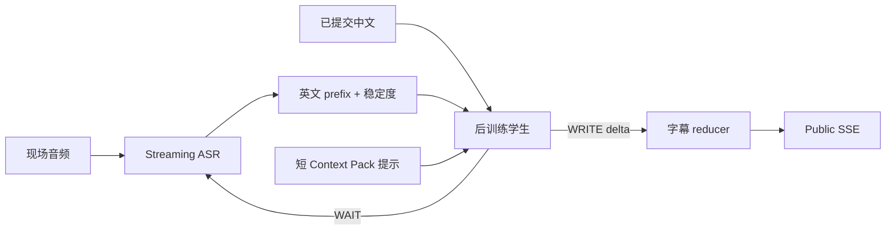

# 证道实时翻译后训练设计

日期：2026-08-30

状态：实验设计，未开始训练

## 1. 目标

用一个 4B/9B 级学生模型完成窄领域任务：

> 根据不断到达的英文证道转写、已经提交的中文、经文/术语提示和有限的周六候选，决定继续等待，或追加一段忠实、简洁、适合手机阅读的简体中文字幕。

后训练要同时优化三件事：

1. **质量**：经文、人名、地名、神学术语和讲员惯用表达比通用小模型更准确。
2. **延时**：英文证据充分时尽早写出，不等待完整长句；证据不足时用 `WAIT` 避免抢跑。
3. **稳定**：写出的内容尽量 append-only，降低会众已经读到的字幕被反复改写。

这不是训练通用大模型，也不是让学生背诵周六稿。周日 live English 是唯一事实来源。

## 2. 后训练后，学生是否能直接做实时翻译

可以，但要准确理解“直接”：

- 训练后的学生可以直接接收**流式英文文本 prefix**并输出中文增量。
- 它不能直接听麦克风，除非另选并训练音频/多模态模型；首版不走这条更复杂的路线。
- 完整现场系统仍需要流式 ASR、prefix controller、Context Pack matcher、字幕 reducer 和 SSE 分发。
- 教师只在训练数据制作阶段使用。现场加载的是学生 artifact，不需要同时调用教师。



## 3. 为什么选择级联文本学生

首版选择 `streaming ASR -> text student`，而不是直接后训练音频到中文模型：

- 当前证道资产主要是英文/中文文本、字幕、大纲和经文，文本监督更容易构造和审核。
- ASR 错误与翻译错误可以分开测量，不会把所有失败归给一个黑盒模型。
- 4B/9B 文本模型更容易在 M1 Max 与 DGX Spark 上做 LoRA、量化和运行时对照。
- 最近 IWSLT 2026 的多个系统仍采用级联结构，并明确强调稳定 ASR、ASR 噪声增强和上下文检索。
- 将来可以把相同 `WAIT/WRITE` 数据迁移到音频模型，但不让首版同时承担 ASR、翻译和流式策略三个训练风险。

## 4. 教师与学生分工

| 阶段 | 教师 | 学生 |
|---|---|---|
| 数据准备 | 生成 full-segment 参考、prefix `WAIT/WRITE` 候选、困难样本解释 | 不参与 |
| 后训练 | 可选生成 label；开放 logits 时也可做 KD | 学习 gold/teacher 数据并更新权重或 LoRA |
| 离线评估 | 可作为参考候选，但测试目标必须人工审核 | 与基线比较 |
| 周日现场 | 不在关键路径 | 直接执行 prefix 翻译 |

本项目做的是 **sequence-level distillation + SFT**：教师生成离散文本标签，学生学习这些输入输出。不会宣称使用 GPT 的完整 token 概率，因为普通 API 不提供完整 logits。

当前候选数据生产线固定为 `gpt-5.6-terra` 初译、`gpt-5.6-sol` 独立复审。两者产物先停留在 Silver Candidate；只有在 OpenAI 书面确认可将输出用于外部轻量学生训练、且人工审核通过后，才可成为 trainable Gold。固定 revision 的 `Qwen/Qwen3.8-27B` 保留为开放权重备用教师实验臂，不再是默认生产线。详细边界见[Terra/Sol 数据集准备方案](./terra-sol-dataset-preparation-plan.zh.md)与[许可与数据治理](./licensing-and-data-governance.zh.md)。

## 5. 学生输入与输出合同

### 5.1 输入状态

每次推理只发送短状态，不重发整篇证道：

```json
{
  "schemaVersion": "sermon-simul-v1",
  "sourceHistory": "...previous stable English...",
  "sourcePrefix": "There is therefore now no",
  "sourceStability": 0.93,
  "committedZh": "所以如今，",
  "scriptureCandidates": [
    {"ref": "Romans 8:1", "mode": "possible_quote"}
  ],
  "terms": [
    {"source": "condemnation", "target": "定罪"}
  ],
  "saturdayCandidates": [
    {"id": "sat_0071", "score": 0.91, "text": "..."}
  ]
}
```

运行时限制：

- `sourceHistory` 使用固定滑动窗口。
- `committedZh` 只保留足够防重复的尾部，不把整场中文塞入 prompt。
- 周六候选最多 1–2 个；低置信或 `diverged` 时为空。
- 经文 canonical wording 由 deterministic resolver 管理，学生只判断引用模式与选择时机。

### 5.2 输出动作

```json
{
  "action": "WRITE",
  "deltaZh": "那些在基督耶稣里的人",
  "commitBoundary": false,
  "sourceEvidence": "There is therefore now no",
  "priorAssist": "terms_only"
}
```

仅允许：

- `WAIT`：英文证据不足，不输出中文。
- `WRITE`：追加最短、自然、有 source evidence 的中文。

默认禁止：

- 改写已 commit 中文。
- 根据周六内容补齐周日尚未说出的信息。
- 把 paraphrase 标成逐字经文。
- 输出推理过程、解释或 Markdown。

UI 可以允许一个很短的未 commit replacement window，但该窗口必须有字数和时间上限，并作为独立系统策略测试。

## 6. 训练目标

学生 loss 不只学习译文，还要学习输出时机和格式：

```text
L = w_text * L_next_token
  + w_action * L_WAIT_WRITE
  + w_format * L_schema
  + w_faith * L_unsupported_addition
```

第一版不需要实现新的复杂 loss；可先把 `WAIT`、`WRITE` 和 JSON 字段编码为普通监督 token，用样本权重和 hard-negative oversampling 表达优先级。只有基线证明 next-token SFT 无法满足门禁后，才增加自定义 loss。

训练样本必须覆盖：

- 正确等待 vs 过早猜测。
- 只追加 vs 重写历史。
- 周六高度匹配、低匹配和主动偏离。
- 经文精确引用、释义、模糊提及和错误 ASR。
- 英文自我修正、停顿、口头禅和未完成句。
- 专名、系列名与教会特有术语。

## 7. 分阶段后训练

### Stage 0：冻结基线

同一 ASR、同一数据和同一解码合同下保存：

- 云端 realtime baseline。
- Qwen3.5 4B/9B 未训练 checkpoint。
- 现有字幕 pipeline。

没有 Stage 0 就无法证明后训练带来净收益。

### Stage 1：领域 SFT

目标是先学会：

- 英文证道到简洁中文的基本映射。
- 经文、人名、神学术语的一致译法。
- 严格 JSON 与短字幕风格。

主要数据为人工审核 full-segment 与真实字幕；此阶段仍可用完整语义段，不强求每个 prefix 都有标签。

### Stage 2：Prefix sequence distillation

把每个语义段按真实 ASR 到达顺序展开成多个状态：

```text
t0: source="There is"                         -> WAIT
t1: source="There is therefore now"           -> WRITE("所以如今，")
t2: source="There is therefore now no"        -> WAIT
t3: source="... no condemnation for those"    -> WRITE("那些……就不被定罪")
```

教师给候选，确定性 validator 检查 append-only、source coverage、经文模式和周六新增，困难样本进入人工审核。

### Stage 3：忠实度与偏好训练

构造 accepted/rejected pair：

- `WAIT` 胜过无依据抢跑。
- live-only 忠实输出胜过复制周六稿。
- 短 append 胜过大面积 rewrite。
- 正确经文模式胜过把释义冒充逐字引用。

只有 SFT/P2P 稳定后再评估 DPO；它不是 POC 前置条件。

### Stage 4：量化与运行时适配

每个合格 LoRA candidate 分别导出 BF16/8-bit/6-bit/4-bit 运行形态。每种量化重新跑完整门禁；模型更小不能被当作质量和延时自动更好。

### Stage 5：Replay 与 rehearsal

先跑未见过的完整周日录音，再跑 75 分钟持续演练。模型级 TTFT 合格但端到端失败时，不能 promotion。

## 8. 训练数据配比原则

首轮用数据质量而不是数量驱动：

- 人工 gold 是最高权重。
- 已通过 validator 和抽样审核的开放权重教师数据补足 prefix 覆盖。
- Bible 数据重点训练引用识别与术语，不让模型死记受限译本全文。
- 通用高质量英中翻译保留小比例，降低灾难性遗忘。
- hard negatives 必须单独统计，不能被大量容易样本淹没。

建议从 200–500 条 calibration、2,000–5,000 条 gold 语义段和每段 3–8 个 prefix 开始。扩大 synthetic 数据前，必须先证明小规模训练在 held-out sermons 上有效。

## 9. 解码与低延时设计

后训练只解决模型行为的一部分。现场还需要：

- 模型、Tokenizer 与 Context Pack 在开始前预加载并预热。
- non-thinking、低 temperature、短 `max_new_tokens`。
- 固定滑动窗口与持久 KV cache。
- 对每个 prefix 设 deadline；迟到输出必须丢弃，不能追写过期状态。
- 单一 active writer；本地学生与云端 fallback 不能同时写一条公共流。
- 记录 ASR stable prefix、student request、first token、commit 与 viewer render 时间。

Context Pack 主要减少歧义和返工，不应把远程检索或大段周六稿放进首字关键路径。

## 10. 失败判定

出现任一情况，先回到数据或系统设计，不继续盲目扩大训练：

- 4B/9B 在 clean text 上有提升，但真实 ASR prefix 上退化。
- `Saturday-only addition` 非 0。
- 经文 exact-match 提升来自测试集泄漏。
- first-readable 变快但首次显示后的 revision rate 明显上升。
- 短样本合格，完整证道出现延时累积或 KV cache 漂移。
- 量化后专名、数字、经文引用或 `WAIT` 行为显著退化。
- 模型输出合格，但 ASR stable prefix 已消耗全部延时预算。

## 11. 训练产物

每个 candidate 不是一个孤立权重文件，而是一组不可变 receipt：

- base model ID、revision 与文件 SHA-256。
- adapter、merged/quantized artifact 与 SHA-256。
- dataset manifest、rights snapshot 和 split manifest。
- 训练代码 commit、容器 digest、配置、seed 与 runtime 版本。
- teacher/prompt provenance 与过滤统计。
- 离线 replay、长时测试和人工审核报告。
- promotion 或 rejection 决策及原因。

只有 receipt 完整且通过[评估与模型晋级](./evaluation-and-promotion.zh.md)的 artifact，现场 preflight 才能报告 ready。
