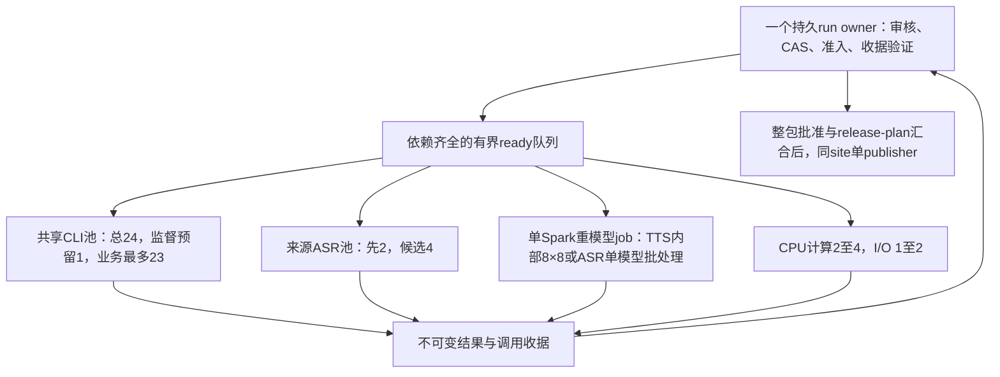

# 实际生产的并发扩展设计

2026-10-05，PR #248；核对基线 `f7afa0a5`（模型接线实现 `17f7d026`）。状态：**设计，未启用、未跑新的模型测试**。本页细化[并发与自动接续设计](production-concurrency-scheduler-design.zh.md)，复用原 owner、broker、包、审核和恢复协议；不另外建设一套调度器。[Quota fallback 设计](codex-quota-api-fallback-design.zh.md)由独立工作提交，本页不修改它、不启用备用认证或付费通道。

## 1. 生产上的优先选择

最先扩展 **L2 单语言组并发及同 run 的独立分支执行**，随后是来源 ASR、L1 分批机器复核、回转写批大小和 CPU 保存。单 Spark 正式 TTS 先保持 8×8；监督、整包准入、同站发布保持单一控制者。

扩大任务数量与缩短关键路径分别验收：同一总池下同时翻译三种语言主要改善公平性与首次交付时间，不自动提高总吞吐；GPU 正在做中文时继续韩语 L2，才可能直接消掉机器阶段空等。人审阻塞自己的分支，不占推理槽，也不让无关已就绪分支全部停下。

最新[模型策略](production-model-runtime-policy.zh.md)固定 Sol 6.1 high fast 初译／原 Astra 文字角色、Sol 6.1 medium fast 独立复核、Luna medium fast API 监督；新开发和生产先使用 OpenAI API。以下 CLI 容量数字是历史试验目标，不能作为新 API Project 的 RPM／TPM 或并发预算；容量试验不同时改变模型、reasoning、tier 或文字分组。

真实测试及页面制作还需[整轮 Spark 独占会话](spark-exclusive-development-session.zh.md)：开始前排空竞争负载，整个开发窗口保持独占，结束后恢复原服务。该控制已实现并通过[两轮实机无推理验收](reports/20261005-spark-exclusive-control-verification.zh.md)；每次实际开跑仍需建立新的 exclusive_ready 会话，音频 job 锁或夹具 ready 不代替主机准入。

## 2. 可增加数量的步骤及候选边界

所有目标都是待实现／待实测的能力，不是修改现有数字就能生效的配置。候选并发不能超过实际 ready 任务数、预算、资源和现行 adapter 的门禁。

| 步骤 | 现状 | 第一阶段 → 后续候选 | 收益来源与必要改造 | 优先级 |
|---|---|---|---|---|
| L2 组译审 | 默认1；canonical上限16；诊断1 | 4 → 8 → 16 → 23业务，或24纯业务试验 | 真正减少长队列 wall；补诊断入口、全局受管池、unknown占槽、等待队列，升上限版本化 | P0 |
| 同 run 跨层／独立分支 | owner 同步执行一个 adapter | 先同时2个 adapter，再最多4个 ready adapter | L2＋L3；之后加大纲、默想。owner 状态写入仍1，业务在durable子任务执行，不等待整个adapter返回才选下一步 | P0/P1 |
| L1 来源 ASR | 180秒块串行，账本也强制旧请求全部returned | 2 → 4个请求 | 新来源独立块并行；每块保留请求身份／绝对窗口／原始返回，有序join后一次MFA。先升级预算账本，否则正常在途会被误判unknown | P1 |
| L1 英文机器judge | canonical1；standalone线程池支持1–8 | 2 → 4 → 8个批worker | 完整句子和前后上下文冻结，按批独立判定、按源顺序join；新CLI预算接线和合同适配先完成 | P1 |
| L1 英文纠错／解释提案 | 有角色策略，未证明完整分块CLI并发链 | 2 → 4，8只在长队列实测后考虑 | 不重叠完整句／段的提案可并行；同一冻结全文／术语上下文，冲突裁定、应用patch、重建anchors和整包批准仍有序 | P2 |
| 多语言 L2 job | 每run最多1个active locale | 2语言×2组 → 3语言×4组；最终共享23动态分配 | 每locale独立任务／租约及输出，单run owner统一派发，所有文字角色共池。未知owner不能通过新增controller绕过 | P2 |
| 大纲与默想 | 独立文字输入可用；owner仍同步，bounded生成入口仍有CLI预算缺口 | 每locale两条产品分支，总产品CLI在途先2、再4 | 依赖已批准译文；与TTS并行，分别审核。局部材料并行准备，全文论证／统一最终稿不盲目拆成多个互不知情生成器 | P1/P2 |
| 正式回转写ASR | 1个模型；正式batch1，Dev4，允许1/2/4/8 | 1模型 batch4 → batch8 | 先增加批处理，不先复制模型。完整render／track gate不变；长短音频尾延迟、质量、内存均比较 | P1 |
| CPU保存／解码／hash／媒体预检 | 正式父进程有序保存；GPU已有有限重叠，legacy另有CPU helper | 独立计算worker2 → 4，I/O worker1 → 2 | 完成结果可乱序，parent单一有序commit。限制WAV字节量及队列深度，避免磁盘竞争；旧helper不能直接当正式已接入 | P1/P2 |
| MFA内部并行 | 一个alignment任务，内部num_jobs2 | 首轮保持2；再独测4，8仅在足够语料和CPU预算下 | 增加一个任务内部并行，不开多个全片MFA或拼多个独立时间线；需把参数纳入实现／运行身份及质量验收 | P2 |
| L4独立构建／校验／HTTP | 无统一worker池；同site发布1 | 构建／校验2 → 4；发布仍1 | 按locale隔离临时目录；snapshot／catalog及发布join有序。新增HTTP并发只优化读回，不能计为模型生成提速 | P2 |

### 数量要用真正的生产单位

- 605.500007秒：**4个来源ASR请求、114句、136锚点、46翻译组**。judge若batch15为**8批**，开到8已耗尽可用批数；正式TTS若最终仍46组，batch8为**6窗**，8个副本也填不满。
- 上周[实际数量](../data/benchmarks/local-layer-latency/2026-10-01/weekly-20260927-projection.json)：来源1891.677333秒、**366英文句、420锚点**、三语419／420／420组。180秒ASR为**11请求**；若judge按366句且batch15，为**25批**，不是把420锚点当420句得到28批。正式三语TTS每语53窗，共159窗；回转写batch4为105＋105＋105＝315批，batch8为53×3＝159批。
- 这批1259组的基础译审仍为2518次调用；队列拆分、多locale或增并发不减少基础调用次数。修订、监督及产品生成另计。

## 3. 一个控制者、多条资源通道

资源通道相互独立，但同一CLI业务池包括来源文字复核、翻译、独立审核、学习产品和其他文字任务，不为每个角色再各设23。监督通道保留1；纯24业务试验期间不额外启动监督。CLI上限是受管程序拟用容量，不是已知账号服务端最大并发。

当前 `resources.py` 支持容量不等于各入口已接入。未来同一协调主机的所有受管调用共用一个brokerRoot；GPU按host准入，不让两个locale各建8副本pool。其他主机及直接脚本仍须明确标记unmanaged；跨机共享许可需要独立实现，不能从本设计推导自动生效。

owner需将当前同步 `executor(...)` 改为**派发durable任务后返回pump**：记录既有job identity、reservation、dispatch intent、任务句柄；每个tick先对账返回，再从所有ready分支选多个任务。worker只提交自己的结果，不能改全run状态、批准内容或自行启动下一层。实现新能力版本和旧单任务模式兼容，不在旧manifest静默放开。

保留当前unknown阻断范围和reservation。若要允许同run另一分支在异常时继续，必须在对应adapter与manifest中先版本化故障域、验证独立性；首版不能为了保持GPU忙而擅自缩小unknown的阻断范围。不同已知任务失败不覆盖成功邻居，能恢复的工作从收据续跑。

## 4. 译审队列与多语言如何共享

先保留组worker，验证4/8/16/23确有收益；**之后**再做角色队列，避免第一轮同时改变两项。每组初译结果保存并验证后，产生该组复核任务；复核依赖该次译稿hash与原冻结英文，独立CLI会话，不读其他并发进程未落盘的文件。

角色调度的对照起点可用T4＋R4、T8＋R8，但这只是总8／16的分配示例，不是每个角色永久保留这些槽。测得平均服务时间 `tT/tR` 后，用 `cT/tT ≈ cR/tR` 找平衡；总在途始终≤业务容量。空闲角色槽可借用，优先消化待审稿，同时保留翻译进展。新medium复核尚无匹配实测，不预设固定11译＋12审最好。

对待审稿设高水位，初始候选为8组；达到后停止增加新初译，继续消化复核。另外限制在途输入量、待处理结果字节和queued groups，避免总调用数有限而全文上下文／结果内存无限增长。这些是容量保护，不是CLI费用硬上限；strict预算缺口仍需单独解决。

多locale的选择要围绕交付目标：

1. **优先最早形成中文音轨**：中文优先取得业务槽；全文译文获批后立即进TTS，业务槽转向下一语言。尚未实现多locale时，也能先通过owner跨层执行减少空等。
2. **三语共同发布且需减少人审空档**：升级controller后，对`run/locale/role`公平轮询与任务老化，允许各语有限保底并借空槽。中文优先级仍可较高，不能僵硬平均分成8/8/7导致第一语更晚获批。
3. **多个生产run**：仍共享同一容量；配置run优先级和最大份额。新增run不创造新的23槽，未知也占原池。

在总容量相同且单locale队列足够长时，三语言并行不应承诺三倍提速；其价值需要用第一语candidate／audio时间、多语汇合时间以及人审等待来衡量。

## 5. 本地模型先改善利用率

**TTS先不从8加到16。** [实际Spark试验](reports/20261003-spark-production-8x8.zh.md)中16×4的并发加载及分批加载后warmup都触发内存保护，无有效速度结果；8×8完成了有限样本测量。不能称16绝对不可能，也不能把失败配置作为生产扩容起点。

优先改这四项：

- **消掉长窗口阻塞**：当前窗口结果按源顺序取，慢首窗可能让已完成的后续副本等待。设计独立完成事件／已验证窗口缓冲，任一窗口完成后，在结果数量及字节背压允许时补发待处理窗；正式产物仍按源顺序commit。固定窗口成员与seed不改，重做边界保持整窗。先量实际闲置，再判断收益。
- **CPU验收与GPU计算重叠**：正式已有补窗后父进程处理的有限重叠；进一步用2个CPU验证worker接收完整窗口，单一parent提交，队列先以2窗并配字节上限，满则背压。不得重复提交、让乱序时间线写入正式track，或用64个CPU资源单位当64进程。
- **减少模型重复加载**：同checkpoint／设备／实现身份的相邻合法job可设计驻留session，但每个job独立gate和收据，session持有GPU许可直到模型卸载。job身份不合并；缺voice／审批的任务不能借热模型越过准入。旧进程退出／跨主机不迁移未核验缓存。
- **让下一语言文字和产品与GPU阶段重叠**：在线CLI与本地GPU不共用推理硬件，符合自身预算与批准后可并行；这是比同时启动两套8×8 pool更优先的方向。

回转写先用1模型batch4/8，CPU可提前解码已commit的WAV。**按单元提前ASR**需新增只读单元cache adapter，消费正式unit commit、WAV hash、冻结文字和模型身份；现有最终screen仍等待完整render、整轨及全覆盖join。

在同一Spark上，初期仍TTS与ASR重模型job互斥。不为了提前ASR频繁卸载8个TTS副本／重载模型，那可能更慢。真正TTS＋ASR同时驻留需另测可用内存、带宽及总wall，并与互斥基线比较；第二台已授权计算host可以独立评估，但不自动改变Spark默认或旧job后端。

## 6. 保持单一处理的边界

保持一个run owner、一次完整Source包join与正式人审、同locale候选准入、最终音轨时间线组装、同site发布。人审不会变成模型worker；可以同时准备不同语言的审核材料，但每个真实批准仍绑定对应完整证据。来源变更继续使所有locale下游失效，单locale改变只失效该locale；最终多语release join保持原计划。

正常确定性交接由程序执行，不给每个worker再配一个Luna监督。Luna在固定检查点及异常时输出建议；状态对账、任务派发、plugin与hash校验不靠额外模型turn。增加监督数不会直接增加制作吞吐，反而占CLI容量及额度。

## 7. 开发和验证次序

| 增量 | 先交付的能力 | 测量／验收 |
|---|---|---|
| A：所有调用共池 | 现有owner／broker接入leaf与监督，持久unknown、等待／背压、冻结容量 | mock双owner、崩溃、满池、恢复；无重复dispatch，无绕池，真实调用0 |
| B：L2扩容 | 完整诊断入口1/4/8/16，再23或纯24；新能力版本 | 按[605秒方案](reports/20261005-605s-new-model-concurrency-plan.zh.md)固定46组；每档92基础调用，新译稿→本组复核→插件→候选，质量、usage、p95与wall |
| C：同run跨层 | owner非阻塞durable dispatch，先L2＋L3两分支，再学习产品；真实批准独立 | mock证明第一语获批才能TTS，下一语L2不必等TTS；错误／unknown仍按合同阻断；生产关键路径与闲置时间 |
| D：局部池优化 | 来源ASR账本v2及2/4；judge2/4/8；ASR batch4/8；TTS完成队列与CPU2 | 每次只变一种参数；完整媒体、句界、经文、术语、音质、同步与内存检查，无损有序join |
| E：多locale及驻留 | controller多locale能力、公平队列，角色拆队列、session级GPU许可 | 上周419/420/420长队列；首次音轨、多语汇合、返修、缓存与加载次数，验证并发没有增加整层重做 |

将剩余CLI strict预算适配、605秒经文／术语绑定、通用音频适配及已观察的CI policy schema失败作为对应真实路径的前置事项；不能用并发设计覆盖这些缺口。旧run按原身份恢复，新增容量只在新建或明确接续且能力匹配的run中生效。

每轮保留分层wall、关键路径、resource queue/hold、实际在途时间积分、GPU空闲／加载、失败与unknown、返修范围、人审等待、token／cache／credit来源。设置重复实验的候选升档阈值：例如相对前档wall改善不足5%且p95／内存／错误变差就停止升档；该阈值是拟议调优规则，不是已测性能保证。正式验收要求质量与同步门禁通过，最终选择达到接近最佳时间的较低容量。

本次仅交付设计与代码边界核对，未修改schema、worker数量或生产默认值；新增吞吐及时间收益均待实测。

## 2026-10-05 实施记录

用户指定 23 业务槽、4 分支、来源4／英文judge8、三语言、双学习产品分支、ASR batch8 和 CPU4 后，已实现显式能力版本与诊断路径，准备阶段实际模型调用0；详见[代码、mock和真实测试准备](reports/20261005-next-concurrency-test-preparation.zh.md)。上述公平队列、正式CLI硬预算与长期驻留等设计仍按该报告的未完成边界记录，未因短片段mock宣称生产验收。
