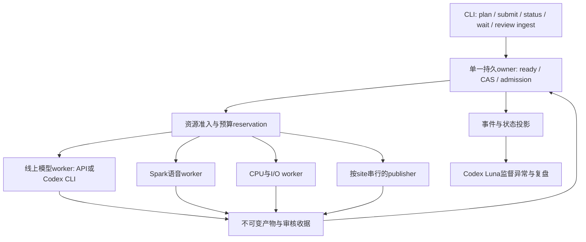

# 制作并发与自动接续设计

设计日期：2026-10-05。状态：**待实现的设计增补**。复用[统一CLI与持久执行设计](unified-cli-pipeline.zh.md)、[统一协议](unified-cli-protocol.zh.md)及现有durable jobs；本文不引入第二套运行身份、审批或发布合同。既有脚本能力、已测吞吐与待开发目标分开记录。本文不自动提高任何运行的并发、预算或发布权限。

## 1. 目标与完成范围

降低从冻结来源到约定发布目标完成的墙钟时间，减少重复计算、阶段交接空档与人审期间的全局停顿。机器吞吐、人工等待、质量、成本、HTTP与设备验收分别衡量。

正常流程由CLI提交一次意图、持久owner自动推进。Codex Luna负责监督、异常解释与复盘；线上Astra初译、Sol独立复核及冻结plugin保持不变。Spark承担已授权本地语音模型计算，Mac按现有fallback策略处理。确定性状态转移不调用监督模型。

本设计不改变正式整包人审、声音授权、自然语速、完整听审、release plan多语汇合及双端验收。不同语言可以错峰进入下一层，但完成仍按manifest的scope派生。新schema、资源配置与adapter必须先版本化、验证并显式启用。

## 2. 基线与需要补齐的能力

| 部分 | 当前实现 | 本设计目标 |
|---|---|---|
| owner | canonical L2固定adapter、legacy page controller有限接入；统一常驻pump未完成 | 同一run一个owner，跨层ready推进，不重复派发 |
| L2 | policy workers1；canonical允许1–16、一个active locale/run；正式API | 先接CLI正式adapter，再分级测8／16／24；多locale准入另设能力开关 |
| Codex transport | 三分钟单worker测试及独立24路调用已验证 | 正式门禁、plugin、candidate admission、全局资源与恢复完整接入 |
| source | unified ASR串行、judge1；账本要求先前请求returned | 保持基线；后续独立版本支持有限在途reservation |
| TTS | 单讲员Spark8副本×batch8，单pool有界窗口与GPU/CPU重叠 | 增加跨jobGPU准入，与线上L2错峰；先不提高副本数 |
| ASR | 单驻留模型、batch1／2／4／8、完整render后screen | 先优化驻留／缓存；后续单元cache与完整join |
| preview | 完整机器candidate后逐组preview，正式只复用batch1且无spokenText覆盖 | 后续匹配正式batch8的窗口预生成与准入 |
| 学习产品 | 独立分支在协议中设计，独立批准schema未完成 | 大纲／默想与TTS重叠，分别批准，避免绑定不必要的音轨依赖 |

分析与实测依据：[各层模型／数量限制](reports/20261005-layer-model-control-worker-concurrency.zh.md)、[流水分析](reports/20261005-production-pipeline-concurrency-analysis.zh.md)、[CLI24实测](reports/20261005-codex-cli-concurrency-24.zh.md)。

## 3. 组件与职责



- **CLI**只解析、提交、查询和接收真实审核收据；客户端退出不停止已提交worker。
- **owner**使用既有durable store与任务身份；唯一修改run状态，按stateRevision/CAS与租约取得派发权。状态转移串行，业务worker可并行。
- **broker**原子校验资源与预算，再写reservation。近期与owner同进程，同一持久账本；GPU admission agent只报告／执行已签定的host任务，不成为第二个run owner。
- **worker adapter**只执行白名单操作，独立输出目录，返回真实收据；不能批准内容或派发另一个owner。
- **Luna**订阅版本化、脱敏状态／异常包，输出可校验proposal。没有通用shell、批准写入或预算覆盖权；确定性正常接续不经模型决策。未来监督模型可替换，角色／provider／model计量不写死为Codex。

一个run只归一个owner；跨run共享的broker配置在同协调主机生效。使用不同broker目录、其他主机或外部直接CLI调用不会自动受控，必须标为unmanaged，不能宣称账号级强制限额。跨机broker需以后独立实施。

## 4. 依赖DAG与自动接续

正式stageId与包名沿用统一协议，以下细分节点是adapter内部工作单元，不直接新增正式包版本。

| 节点／分支 | 必需依赖与gate | 自动后继／可并行分支 |
|---|---|---|
| media_verify／window_review | 媒体身份、窗口真实批准 | ASR；原声指纹、CPU预检可并行 |
| english_source | 完整ASR→MFA→锚点→judge；英文人工审核 | ready_for_translation后L2；缺审只准备合法shadow材料 |
| layer2_group.translator | 正式源、冻结policy、group及上下文、预算 | 本组校验通过立即reviewer，其他组继续translator |
| layer2_group.reviewer | 本组翻译完整返回、绑定相同源 | plugin／coverage检查；全组join候选与审核页 |
| translation_review | 完整机器candidate与全文真实批准 | layer3_prepare；大纲与默想分别生成；下一语L2可继续 |
| layer3_unit／assembly | 完整批准candidate、speech job、voice授权、GPU准入 | TTS窗口与CPU保存重叠；全部commit及排程形成整轨 |
| layer3_screen | 完整正式render、单元与整轨hash | 驻留ASR批处理、疑点材料、整轨听审 |
| listen_review | 完整ASR覆盖、疑点裁决及全文听审／同步批准 | Audio Package→同locale Release Package |
| study_product | 对应locale批准文字及冻结产品输入 | outline与reflection独立审核；无需等WAV生成；schema缺失时blocked |
| publish_endpoint | release plan所需locale／产品／页面批准全部齐全、目标授权 | 目标部署→HTTP／Range／reader读回；设备另记录 |

**自动接续规则**：触发事件只唤醒owner；owner重读并验证当前收据、执行身份、gate与预算后再准入，不能仅信任事件载荷或worker退出码。依赖齐全无人工门时直接推进，不询问“继续吗”。真实人审未到时挂起本分支，其他ready分支继续。

**并行优先路径**：第一语L2完整获批即TTS；GPU工作期间继续下一语线上L2与学习产品／CPU任务。不新增“三语译文全部齐全才准入第一语L3”的屏障。最终多语发布join仍保持。

保留当前整包门禁：单组审核不能直接形成正式speech job；部分TTS不能传入现有screen；部分locale完成不能替代整个run完成。各locale批准独立不等于当前controller已允许同时跑多个locale。

## 5. 资源预算与准入

参数下列名称是**拟议配置语义**，不是当前CLI参数。实施时纳入版本化manifest能力绑定与planHash；不向旧schema静默添加字段。每个资源有physical在途、reserved容量、unknown预留三个计数，分开显示。

| 资源 | 基线／候选目标 | 规则 |
|---|---|---|
| managed Codex CLI sessions | 默认沿用canary1；候选总容量24 | 仅控制受管CLI子进程。监督保留1时业务最多23；独立业务24测试需监督保留0并单列配置。不声称24业务＋额外监督已验证 |
| online API | 原L2 job-root槽24保持；新broker上限须明确配置 | 各project/backend预算隔离；接管后旧路径必须参加同准入或禁止加入该run，不叠加两套池提高容量 |
| locale group workers | 默认1，当前canonical最多16 | CLI24组上限由新能力版本放行后才使用。translator／reviewer共用组容量，不各占一份24 |
| active L2 locale jobs | 当前1/run | 首阶段保持1，先获得跨层重叠；后续多locale受全局调用预算和独立输出控制 |
| Spark heavy TTS jobs | 候选保守上限1/host，内部8×8 | 新host-level准入；不是当前已存在的全局锁。保持内存保留保护，不让两个pool自动各建8副本 |
| Spark ASR | 一个驻留模型，batch按冻结配置 | 初期与heavy TTS互斥；TTS＋ASR重叠需独立容量实验后开启 |
| CPU／I/O | 每host显式配置小池与有界队列 | 参数由实测CPU／磁盘／内存决定；不把MFA内部num_jobs2等同两个来源job |
| publisher | 一个active/site | 复用远端generation-fenced lease与snapshot锁；独立site仍需各自授权与预算 |

业务吞吐同时受ready group、worker、provider限流与资源池限制。物理worker未启动前不持GPU许可；等待人工审核不占推理slot。线上未知结果保留逻辑reservation，进程退出或flock释放不证明远端调用未发生。

容量准入以唯一reservation ID的集合计数：`capacityUsed = count(held reservations)`，含已预留待派发、在途和unknown；physicalRunning和unknown是其观测／状态子集，不能将三者相加重复扣槽。GPU不提前为排队任务占permit，仅在准备派发时预留。确认终态后释放计算容量；付费／额度账本保留已用请求及实际usage，释放worker槽不退回已消耗预算，费用未知不填写0。

调度使用可配置locale priority与有界公平轮转，优先尽早形成第一条可听音轨；不将24平均分三语当成再快3倍。同locale待复核组可优先于新翻译，限制待复核积压；不固定分配24 translator加24 reviewer。监督容量仅供受管监督调用，其他角色不能冒充监督。

GPU正式已批准任务优先于preview；CPU队列满时背压，禁止无界积压WAV或重复加载。内存不足先停止新GPU准入并保留收据；不自动改声音、批次或跨机拼轨。

## 6. owner状态机与派发事务

下列状态映射到既有process/artifact/review/publication维度；新增持久状态或event字段时须版本化与迁移，不覆盖旧历史。

```text
pending_dependencies → ready → reserved → dispatch_intent → running
  → response_saved → artifact_verified → human_pending／succeeded
  → waiting_reconciliation／failed／blocked／cancelled
```

每次tick执行：

1. 取得owner权限，读取run revision与当前状态；重验冻结代码／schema能力。
2. 处理已返回收据和真实审核入库，验证hash／覆盖／上下文，派生ready集合。
3. 按公平性与资源优先级选择节点；原子预留额度及容量并持久化intent，再启动worker。
4. worker完成先持久化原始返回／CLI终态、usage与产物，再提交可校验结果。只有owner验证后成功，释放已确认终态的许可并唤醒后继。
5. 尚无ready任务时事件等待，辅以低频健康校验；等待不新增模型调用。activeScope完成后关闭新派发并冻结完成投影。

intent与spawn之间崩溃不能自动推断“未调用”。使用现有durable job的进程／调用证据对账；无法证明未发出则unknown。CAS失败重新读取状态，不再次启动。一个owner租约过期不能让第二个owner盲目重派。

审核等待不需要续占计算资源。未知资源/调用占reservation直到对账；`cancel`停止新调度并请求取消在途，不代表线上取消确认。`drain`等待known任务结束，unknown保持单列，代码升级不能清除它。

## 7. 身份、缓存与恢复

沿用既有run/job/operation身份和固定jobRoot，不用新目录、CLI别名或worker重启买新尝试。来源与内容修订按现行失效规则形成新revision，保留可验证旧证据。执行代码变化冻结新准入，旧实现的已完成产物保留；不在运行中篡改hash重绑定。

CLI execution identity绑定实际binary／wrapper、adapter、schema、prompt、requested model／effort／tier、auth mode和timeout。API／CLI缓存不能共用fingerprint；CLI跨run复用当前未放行，正式迁移须新增验证规则，不能以历史API稿冒称新CLI结果。

失败处理：

| 情况 | 处理 |
|---|---|
| 预检／批准／预算缺失 | blocked，新增调用0；修正后重验原run，不替换凭据绕过 |
| 语义／plugin失败 | 保留失败证据，创建受影响组新revision，重走规定链；不无界重试 |
| 429或明确系统性provider拒绝 | 暂停受影响backend/lane新准入，记录原因；已在途结束／unknown分别保存，不自动转付费API |
| timeout／断链／CLI缺终态 | waiting_reconciliation，不重发；未知角色／组占相应reservation |
| 完整响应已返回而候选缺失 | cache-only重建→独立对账，新增线上调用0 |
| GPU内存保护／已确认基础设施失败 | 保存单元commit，恢复仍重验原backend/cache身份；按现有compute policy处理，不借内容失败切机 |
| 发布结果未知 | 保留site lease／attempt，读回对账；不重跑L1–L3 |

未知结果阻塞范围沿用该adapter现行合同，owner不得缩小。无关联run能否继续由共享预算与故障域决定，不能让其他成功节点掩盖缺失收据。

## 8. 两个后续adapter

**batch8 preview**：新preview版本与正式窗口成员、seed、checkpoint、dtype／设备、音色、文字和实现身份一致，按完整窗口保存不可变收据。依然需要完整machine-pass candidate；不同声音身份不复用。人工批准后正式job验证全部gate，再准入未变窗口；改一单元可能重做整窗，整轨与听审重新生成。不得直接删除现有batch1保护或把preview发布。先做真实音频对照与续跑验证再启用。

**单元ASR cache**：独立worker消费正式单元commit＋WAV hash＋完整解码＋冻结文字／模型，写不可变结果。最终screened manifest等待完整render／track及全单元覆盖join；现有screen命令保持完整输入合同。初期GPU互斥；若实验表明TTS／ASR重叠更快，再配置容量，不以CLI24结果推断GPU并发。

## 9. 模型调用与关键路径日志

记录provider/backend、角色（supervisor／translator／reviewer／asr／tts）、requested与server模型身份、auth/billing scope、host、run/revision/job/attempt、依赖span和执行身份。API key只记录逻辑环境／project标识，值不得进入日志；CLI不伪造API request ID、server model或invoice。

时间分开：ready、queue、reservation、dispatch、process start/end、load、推理、写入、传输、gate、human_wait与收据交接。未测prefill／decode保持null，generation TPS不能用整个CLI进程耗时替代。每次调用记录usage来源、输入／缓存／输出／reasoning，未知token保持null；reasoning不重复加入provider output。

输出三种指标：单调用process TPS；按并行区间并集计算的系统输出token/s与组/分钟；按依赖边计算的完整run关键路径。worker时间之和不冒充墙钟。TTS优先记录audio-seconds/s、RTF、load与单位合成耗时，不猜测本地token数。

handoff目标沿用统一设计：100次已具备前置条件的确定性转移，p95≤2秒；这不包含模型执行、人审或发布网络延迟。日志分开真实新调用、cache recovery与provider缓存，复盘显示每层耗时及最大等待原因。

## 10. 实施与验收

映射既有统一设计A–J与backlog，不再建立另一套互相竞争的owner工程。每阶段先fixture、再显式开关、再授权真实路径；并发升档与其他变量分开。

| 阶段 | 对应单元 | 交付／验收 |
|---|---|---|
| S0 身份与能力 | A/B/H | 版本化resource policy与DAG capability proposal，错源／旧批准／预算缺失首调用前拒绝；只读status零写入 |
| S1 owner与broker | C/D/I | CAS、reservation、事件pump、drain／reconcile；双owner、崩溃各窗口、取消、unknown、队列公平与容量不超限 |
| S2 正式CLI L2 | E/H/I | 完整源→Astra→Sol→plugin→candidate准入→人审边界；测试与正式缓存隔离，未知不重试；先1再8／16／24，改变上限须新版能力 |
| S3 跨层交错 | F/G/I | 第一语获批触发TTS，下一语L2继续；GPU全局准入；学习产品独立批准schema；发布仍等待manifest全部产品 |
| S4 preview／ASR增量 | F/I | batch8身份一致性、坏缓存拒绝、改文整窗失效、ASR全覆盖join；对照质量、返工、内存与墙钟 |
| S5 整篇与运维 | G/H，J以后 | 固定3分钟→10分钟→上周整篇→第二周；Dev/Beta、人工审核与读回分列，重启不重复计算；Temporal迁移只保留一个owner |

真实性能实验使用上周419／420／420原组和上下文，记录每档实际利用率、稳态组/分钟、p50/p95、role token、限流与unknown。同输入多轮交错顺序；正式完整片段数量是1259组、基础2518调用，返修另计。不得仅比较24项短批次决定长任务最优并发。

上周数量的情景代理：16路L2三语约34–40分钟，24路约22–32分钟；CLI启动／上下文、语言、分组粒度与provider负载均影响结果，不设为承诺SLA。先消除“三语文字全齐才TTS”的屏障可能省约14分钟机器阶段等待，仍是未含人审／ASR／发布的敏感度示例。完整制作窗口沿用周六19:00至周日10:00及manifest完成范围，按实际日期时区换算。

回退条件：重复dispatch、错源／错批准、预算风险、unknown自动重试、缓存误复用、质量退化、发布基线／reader异常。回退先drain并核对旧入口共用原账本，不能同时启用新旧owner。已完成正式产物与真实批准保留。

## 11. 文档与实现交付边界

本次交付为设计：未增加schema字段、owner服务、CLI正式producer、线上槽位或GPU并发。实现PR应逐阶段列明代码、fixture、真实模型／媒体收据、运行部署及人工批准状态。全四层可自动推进、24路长期吞吐、preview8×8复用、逐单元ASR均须各自验收后才能写已完成。

参考：[四层门禁](multilingual-production-interfaces.zh.md)、[统一backlog](backlog.zh.md#pr242-remaining-backlog)、[L2 controller](canonical-layer2-controller.zh.md)、[层内解耦](multilingual-intralayer-review-decoupling.zh.md)、[compute policy](local-production-compute-policy.zh.md)、[正式TTS](formal-layer3-renderer.zh.md)。
