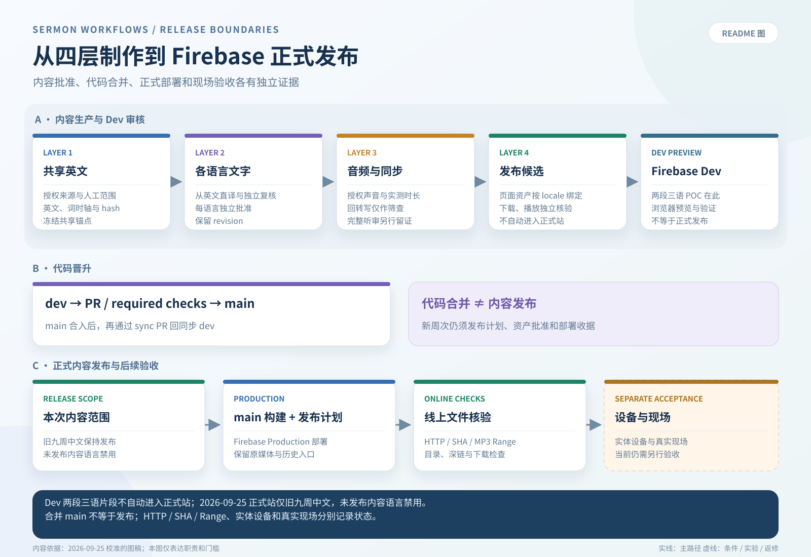
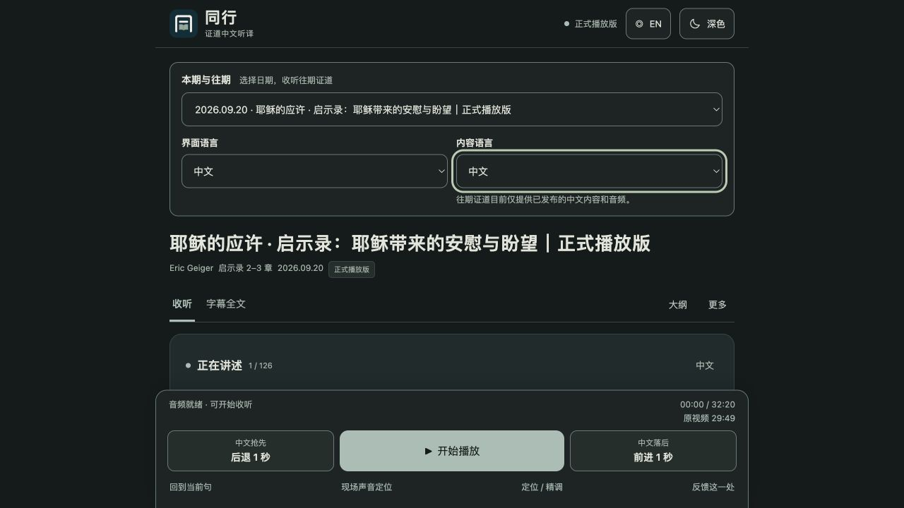
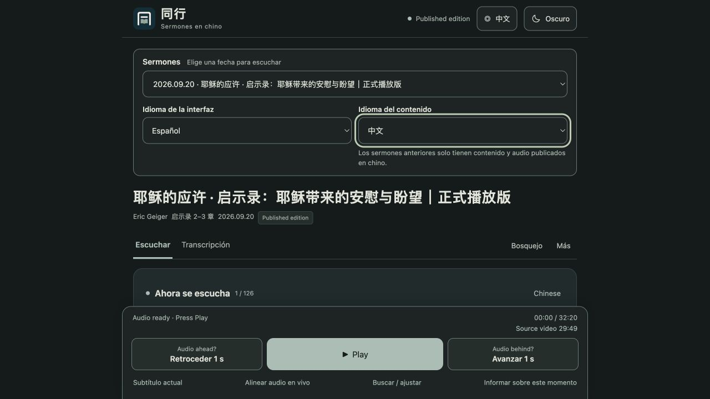
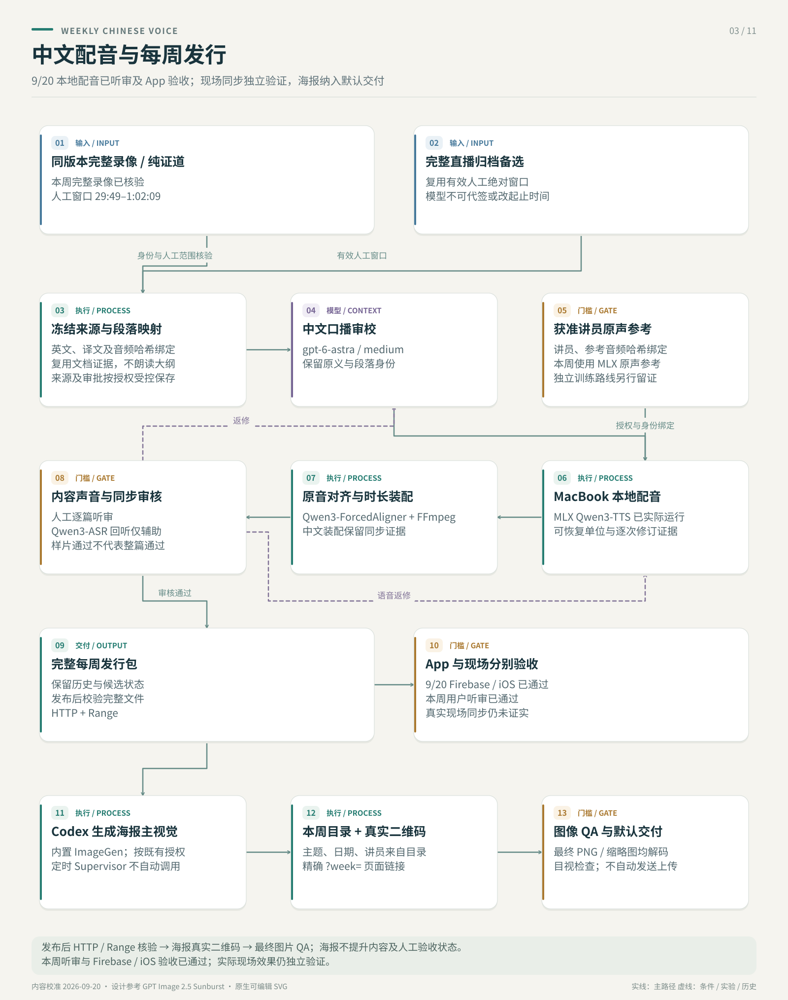
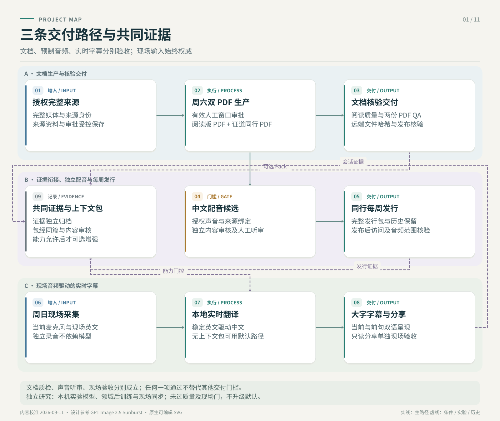
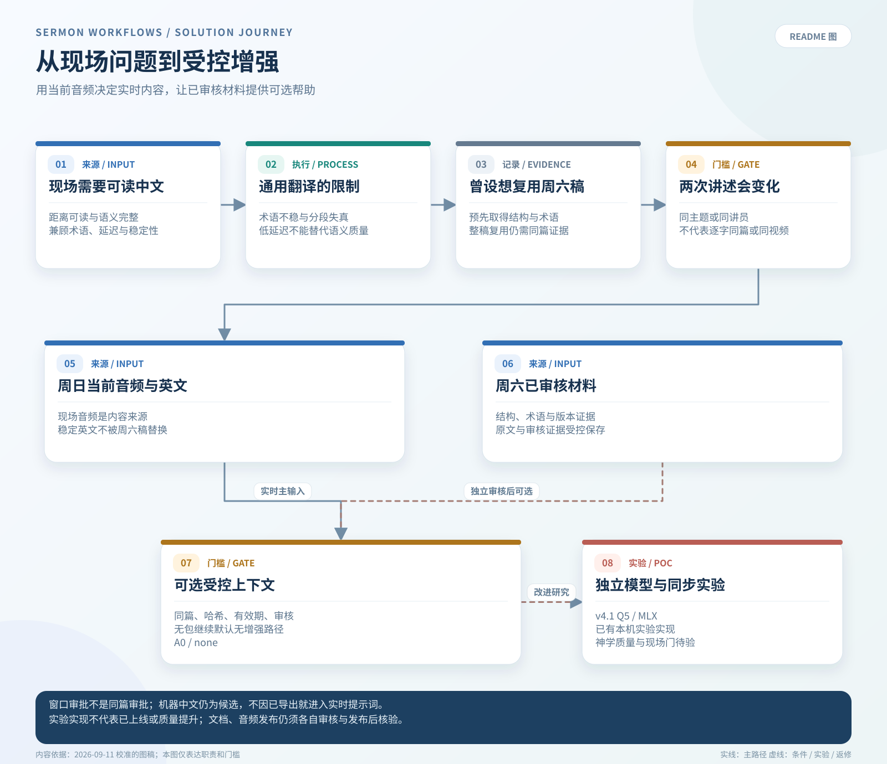
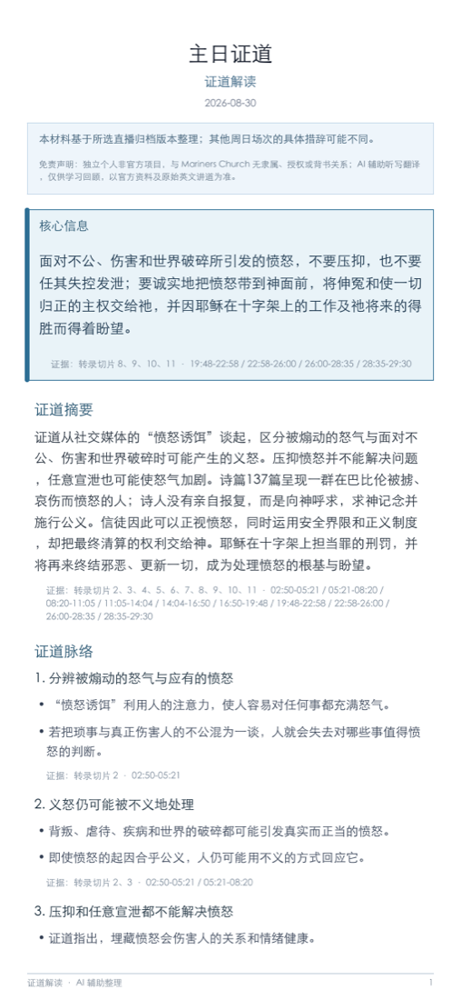
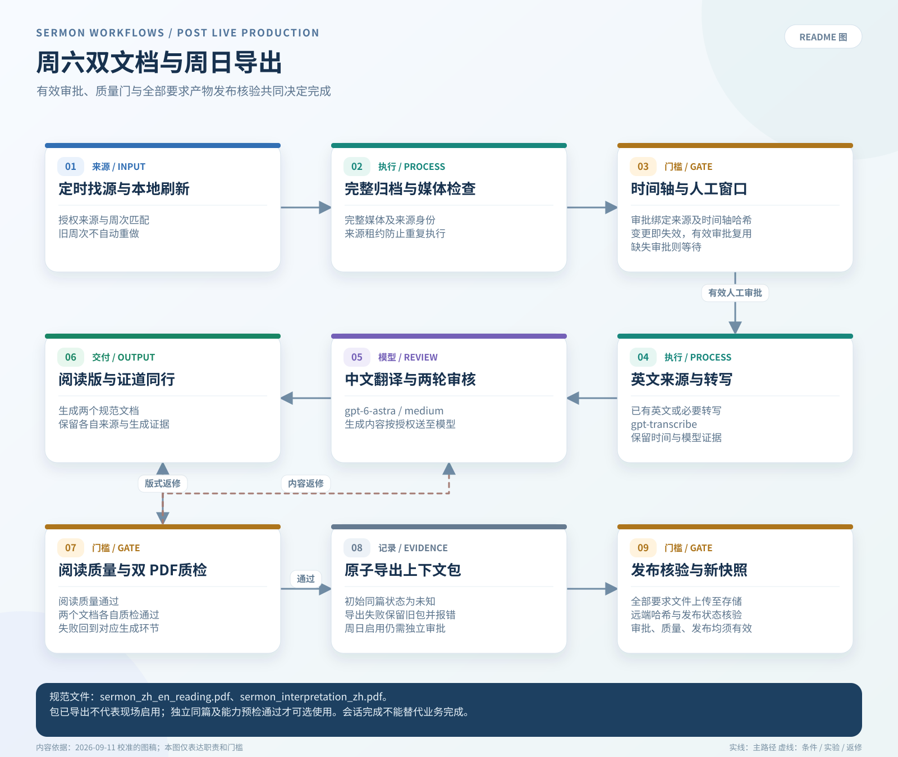
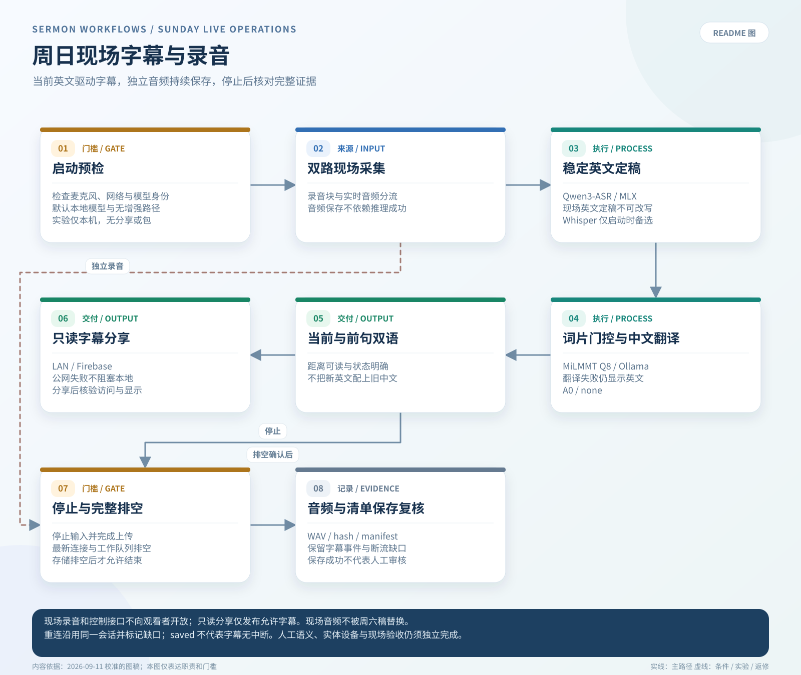
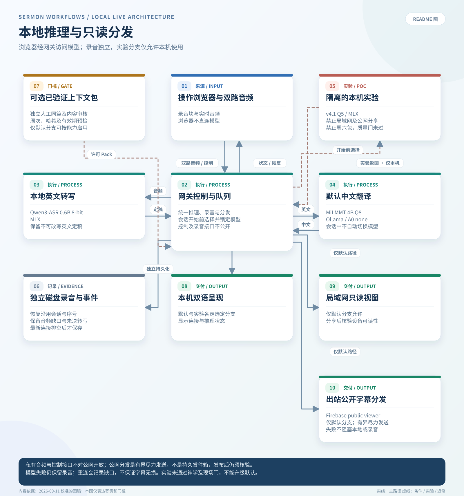

# 项目技术导览

[Project introduction](../README.md) · [项目介绍](../README.zh.md) · [Other language](project-technical-overview.md)

本页保留于 **2026-10-01** 从根 README 迁出的架构、实现说明、流程图和实验摘要，迁移基线为 `dev@d25d58d`。这是一份带日期的文档快照，没有重新核验部署或设备状态。下文日期、旧 PR 与模型状态保留历史范围；当前要求以[四层合同](multilingual-production-interfaces.zh.md)、[工作流总览](workflows/README.zh.md)、[后端设计](backend-workflow-system-design.zh-en.md)和[实验索引](experiment-directions.zh.md)为准。9 月 20 日记录还包含后续现场质量未通过的反馈；先前试听通过不能代表现场成功。

> **历史发布快照：2026-09-25。** [Firebase 听译 App](https://ai-for-god-sermon-audio.web.app/) 已更新界面：可独立选择中文、英文、韩文、西文界面；正式内容仍为九个已发布的中文周次，英／韩／西内容选项显示“未发布”且不可选。9 月 20 日两段已审核的三语 POC 仍只在 Dev，不在正式站。此次为界面更新，旧媒体保持原字节；发布后的逐文件 HTTP／SHA 和 MP3 Range 检查通过，设备与真实现场验收仍未运行。详见 [Firebase release 记录与 backlog](multilingual-firebase-release-backlog-2026-09-24.zh.md)。完整媒体、音频和 PDF 保存在 Git 之外。

## 架构与设计导航

产品方向为 **iOS 原生主端、Firebase Web 辅端**；优先级不等于原生功能齐备、完成分发或现场验收。四类设计相互链接，并继续引用已有 UI、生产合同和实验报告：

| 类别 | 当前入口 | 范围 |
|---|---|---|
| App 设计 | [客户端系统设计](app-system-design.zh.md) → [原生 UI 设计](../apps/tongxing-ios/DESIGN.zh.md) | 播放、阅读、缓存、语言及验收边界 |
| 后端工作流 | [中英双语 DAG 与实现地图](backend-workflow-system-design.zh-en.md) | 三语独立四层、只读审核计划、确定性 gate 与有界新修订 |
| 执行环境 | [本地／云端／CI 设计](execution-environment-design.zh.md) | MacBook、可选 Spark、模型 API、存储与发布边界 |
| 实验方向 | [问题、范围、状态、证据及退出门槛](experiment-directions.zh.md) | 已有实验与未运行提案分别标记 |

2026-09-30 仓库核查：[9 月 27 日记录](sep27-full-video-app-layer4.zh.md)已记录中韩西三语发布，[9 月 28 日记录](reports/20260928-full-video-bucket-migration.zh.md)记录完整视频 bucket 迁移；上方 9 月 25 日说明及下方截图保留为历史快照。本次未重查线上或设备状态。[英文 DAG 在 README 直接渲染](project-technical-overview.md#four-layer-production-architecture-shared-english-source-to-multilingual-playback)，[中英对应 DAG 在后端设计直接渲染](backend-workflow-system-design.zh-en.md#四层业务-dag--four-layer-business-dag)。所有 locale 都必须经过 L3，纯文字也要显式 `audio_unavailable` 包；不从 L2 跳到 L4。PR164 strict-verifier 和自动返工属于计划，不能当成现有 reviewer-editor 已完成的能力。

## 四层生产架构：从共享英文事实与锚点到多语言发布与播放

生产流程统一分为四层：**共享英文事实与锚点 → 目标语言文字 → 目标语言音频与同步 → 多语言发布与播放**。这是一条逐层交付、逐层验收的链路；上一层通过，不代表下一层已经通过。9 月 27 日记录已包含三语发布；今后的正式周次仍须按各语言独立完成文字、音频和发布验收。业务 DAG 描述必须遵守的包依赖，不表示通用 controller 已自动执行全链。

| 层 | 核心职责 | 模型与程序分工 | 交付物与验收门槛 |
|---|---|---|---|
| 1. 共享英文事实与锚点 | 锁定来源、证道范围和完整英文；把字词与原音时间轴对齐，再按句号、逗号、语义分句和停顿建立稳定锚点 | `gpt-transcribe` 或可信原稿提供文字；MFA、Qwen ForcedAligner 等候选负责声学字词定位；LLM 可校对文字、标点和断句，但不能凭语言判断伪造时间戳 | `English Source Package`：不可变英文锚点、字词时间、来源/hash、模型身份和覆盖率 |
| 2. 目标语言文字 | 从英文锚点直接翻译，完整表达每句意思，并检查否定、因果、经文、专名、数字和术语 | 当前 Layer 2 policy 使用 Astra 初译和独立 Sol reviewer-editor 请求；语言插件与人审保持独立，计划中的只读 reviewer 尚不是现有 runner | `Target-Language Candidate`：每个译文单元关联英文锚点 ID，语义和语言审核独立留证 |
| 3. 目标语言音频与同步 | 用已批准译文生成自然语速语音，测量真实时长，并利用英文停顿和分句安排滚动播放 | Qwen3-TTS 等语音模型负责合成；Qwen3-ASR 等回转写只做机器筛查；确定性调度器负责时长、间隔和时间轴，最终仍需人工完整听审 | `Target-Language Audio Package`：音频、字幕、调度时间轴、筛查和听审状态 |
| 4. 多语言发布与播放 | 把正确的视频、文字、音频、字幕、页面和语言入口绑定在一起，完成部署、下载和端上播放 | 页面构建器、FFmpeg、Firebase、Web/iOS 客户端和验证程序负责交付；Supervisor/Agent 只编排状态，不能替代内容事实或人工验收 | `Target-Language Release Package`：按语言隔离的发布包、hash、HTTP/下载检查和播放器验证 |

[9 月 25 日四层模型／处理概览（历史 SVG）](diagrams/four-layer-production-workflow.svg)；当前依赖与实施状态见[中英后端 DAG](backend-workflow-system-design.zh-en.md)。

下图把**内容审核、Git 晋升和 Firebase 发布**分开：Dev 上通过的片段不会自动进入正式站；代码合入 `main` 也不会自动发布新周次。正式内容须按发布计划单独构建、部署和验证。



### 正式站界面截图

以下为 2026-09-25 从正式 URL 截取的同一中文周次。右图切换了西语**界面**，内容语言仍为中文；未发布的语言选项不可选。截图是浏览器显示证据，不代表实体设备或现场验收。

**中文界面，中文内容**



**西语界面，中文内容**



多语言扩展遵循以下契约：

- 共享英文事实与锚点层只生成一套共享、冻结的锚点；中文、韩语、西班牙语等都从英文直接分叉，不以中文译文作为其他语言的翻译源。
- 每种目标语言分别保存 `locale`、英文锚点 hash、翻译/审核模型、语音模型或 checkpoint、时间轴和人工审核状态；一种语言失败时，不自动阻塞或批准其他语言。
- 模型可以在层内替换和 A/B 测试，但不得跨层覆盖责任：Forced Aligner 不判断语义完整，翻译模型不决定声学时间，回转写不等于人工听审，部署成功也不等于现场验收。
- 句级锚定和 clause-stable 拆分位于 Layer 1 与 Layer 2 的接口：先稳定“原文说了什么、何时说”，再让目标语言尽早、完整、自然地表达。

四层的唯一正式命名、输入输出 schema 和失效规则见[多语言生产四层接口](multilingual-production-interfaces.zh.md)；当前实现另见[工作流总览](workflows/README.zh.md)、[句级锚定与滚动同传设计](sentence-aligned-interpretation.zh.md)和[系统设计与模型选择](sermon-dubbing-system-design.zh.md)。

今后所有预制多语言生产都按这四层留证和放行。现有双 PDF、中文配音和页面工具在迁移期作为明确范围的 legacy adapter；它们各自的 `complete` 不等于四层全流程已完成。周日实时字幕仍是独立的低延迟路径；若之后把录音做成可持久发布内容，须从 Layer 1 重新进入。

## 周日运行：准备页面与创建本场字幕会话

[运行白皮书](sunday-live-operations-whitepaper.zh.md) · [Agent 直接执行入口](sunday-live-agent-runbook.zh.md)

复用现有应用打开操作页，开始录音后自动建立本场 session 和手机观看链接；每周无需重新部署网页。入口文档包含预检、音频与分享范围、恢复和保存核验。“准备页面”停在待机，不自动录音。

把下面指令交给 Agent 即可开始：

```text
读取 docs/sunday-live-agent-runbook.zh.md，准备本周日实时字幕操作页。
复用本机已安装环境，先检查现有录音；打开页面后停在待机。
返回页面、有效模型、预检结果和还需要我处理的事项。
```

## 1. 优先展示：英文证道视频 → 讲员音色中文配音

[打开中文听译 App](https://ai-for-god-sermon-audio.web.app) · [系统设计与模型选择](sermon-dubbing-system-design.zh.md) · [操作 Runbook](../experiments/sermon-dubbing-poc/SATURDAY_AUDIO_RUNBOOK.zh.md) · [9 月 20 日制作记录](production-2026-09-20.zh.md)



**按来源身份选择播放方式。** 9 月 20 日版采用用户确认的完整礼拜录像，完整片长 **1:16:07**，证道范围 **29:49–1:02:09**。同版本视频入口支持完整录像中的已批准范围，也支持核验后的纯证道整片。归档入口继续保留；同一篇信息的另一场录制不自动视为同版本视频。

| 阶段 | 当前实现 |
|---|---|
| 视频英文转写 | `gpt-transcribe`；已有可信英文可复用，疑难原声单独复查 |
| 中文口播修订与审核 | 本对话 `gpt-6-astra`；完整语义、否定、经文、专名及引文边界分别核对 |
| 讲员音色 | 9 月 20 日已使用 MacBook 本地 MLX Qwen3-TTS 与获准原声参考；Spark 训练保留为独立路径 |
| 语音检查与时间定位 | 本地 Qwen3-ASR 回转写、ForcedAligner 声学定位；自然语音时长逐段核验 |
| 试听交付 | 独立 Firebase App；按周选择、MP3 下载、字幕、大纲、时间跳转与微调 |

**9 月 20 日版本记录：** [9 月 20 日《耶稣的应许》](https://ai-for-god-sermon-audio.web.app/?week=2026-09-20-same_video-7c193fd4-bc90-4f3b-aa00-37dfe8423aa0)，讲员 Eric Geiger，经文《启示录》2–3 章。完成来源绑定、中文与和合本引文审校、本地配音、真实时长核验及发音修复；用户已确认听审与 Firebase／iOS 播放通过。[9 月 20 日制作记录](production-2026-09-20.zh.md)保留阶段时间、Token 统计与证据边界。

**每周默认海报：** 内容发布并通过 HTTP 核验后，由 Codex 生成 ImageGen 主视觉，合成目录文字与精确指向本周页面的真实二维码，完成最终 PNG 和分享缩略图解码与目视 QA。无需用户每周重复要求；这不表示定时 Supervisor 自动调用 ImageGen，也不自动上传或发送海报。详见[每周发行流程](tongxing-weekly-release.zh.md#每周海报交付)。

**当前边界：** 用户听审及 Firebase／iOS 播放通过不等于真实现场同步通过。原视频时间轴对齐、同录制声音定位与现场效果分别留证；另一场现场讲述不能直接沿用预制时间轴。[8 月 30 日候选记录](sermon-dubbing-astra-review-2026-09-05.zh.md)保留为历史证据。

## 为什么保留双 PDF 与实时字幕



周日现场目前没有可靠的中文字幕。通用实时语音翻译可以生成初稿，但对经文出处、圣经人名、逐字引用和教会特定术语的处理不够稳定；分段抖动和端到端延迟也会让本来正确的文字难以在现场阅读。

当周日是重新现场讲述而不是播放同一个视频时，不能直接套用预制配音。此前的实时字幕设想，是提取并翻译周六公开直播中的证道，再把内容用于周日。实测发现了一个关键边界：周六和周日可能共享同一篇信息的框架，但不能假定两次讲述逐字一致；措辞、顺序、例子和现场新增内容都可能变化。因此，周六转写适合做准备资料，却不能成为周日字幕的事实来源。

当前架构支持可选的受控混合方案，已测周日默认仍为 `contextPolicy=none`：周日现场音频及由它识别出的当下英文始终具有最高优先级；公开或已获授权的周六材料，只提供受控的结构、术语、经文出处和经过审核的例句。领域后训练继续独立评估，v4.1 候选已可在本机试用。质量和延迟改善必须通过冻结评估证明；完成接入不代表候选已获准升级。



## 2. 其他独立工作流

### A. 周六：从直播/归档生成两个经过审核的 PDF

周六工作流负责发现或接收公开直播链接、保存完整 post-live 媒体、由 operator 确认证道时间窗、生成英文转写与中文阅读稿，最后在周日前形成两个 canonical 交付物：

1. `sermon_zh_en_reading.pdf`：中英翻译稿 / 阅读版。
2. `sermon_interpretation_zh.pdf`：中文“证道同行”/证道大纲，只保留与证道直接相关的辅助信息。

<table>
  <tr>
    <th>中英对照阅读版</th>
    <th>中文证道同行</th>
  </tr>
  <tr>
    <td></td>
    <td></td>
  </tr>
</table>

_图片来自 2026-08-30 真实运行的第一页；两份 PDF 各自的 QA 都为 `pass`，完整运行产物仍保持在 Git 之外。来源和校验信息见[示例 provenance](assets/pdf-examples/README.md)。_



每周 Supervisor 使用 Astra Medium 完成翻译、两轮阅读稿审核和证道同行，并在 PDF QA 后启用 Context Pack 导出。同篇身份初始为 `unknown`；自动导出不等于人工批准。

这是当前更成熟的 post-live 路径。只有 source、人工批准的时间窗、阅读稿 QA、两个 PDF 以及两个 PDF QA 都存在并通过，才算完成。

关键文档：

- [稳定的 post-live 阅读版 PDF 工作流](stable-post-live-reading-pdf-workflow.zh.md)
- [Codex 本地周末生产 runbook](codex-local-production-runbook.zh.md)
- [证道生产 Supervisor Agent](sermon-production-supervisor-agent.zh.md)

### B. 周日：从本地麦克风生成实时中文字幕

周日工作流在 MacBook 本地运行：浏览器麦克风采集、录音和事件持久化、本地英文 ASR、MiLMMT 英译中，以及单页大字号中文字幕。



当前默认实现采用独立 MediaRecorder 恢复录音、16 kHz PCM WebSocket、Qwen3-ASR/MLX 与 Ollama 上的 MiLMMT Q8。不可变英文 final 先经过孤立虚词门控，再即时翻译；`readable_chunks` 保留前一句完整双语字幕。Firebase Hosting/Realtime Database 提供公网只读观看，LAN/SSE 作为独立退路。Gateway 重启可恢复同一 session、录音及观看身份，但字幕缺口会明确记录。

合并版本完成了 **60 分钟浏览器 WAV 回放**（20 分钟唯一音频循环三轮）：**1,287 个 ASR final → 1,287 次翻译 → 1,287 条操作页可读显示**。可读首显 P95 从音频段结束计算为 **1.776 秒**，从段开始计算为 **4.763 秒**。这是链路交付证据，不是翻译准确率、物理麦克风/手机或现场验收。详见[当前验收报告](../experiments/local-live-poc/benchmarks/SUNDAY_READINESS_20260904.zh.md)。

**v4.1 可选试用：** 先用 [Sunday Live Captions.command](../experiments/local-live-poc/Sunday%20Live%20Captions.command) 启动 POC，再于录音前选择 **v4.1 Q5 · 实验候选**。本机已有冻结模型包时，可从网页启动独立 MLX 服务。该候选尚未通过神学质量门，实验会话仅在本机显示与保存，LAN/Firebase 分享关闭。详见[安装条件、操作与恢复说明](../experiments/local-live-poc/MILMMT_V41_LOCAL.zh.md)。



关键文档：

- [周六/周日完整工作流与延迟预算](workflows/README.zh.md)
- [本地实时字幕 POC](../experiments/local-live-poc/README.md)
- [本地实时字幕设计](../experiments/local-live-poc/DESIGN.zh.md)

## 3. Discovery、缺口与下一步

[同行 iOS 原生客户端](../apps/tongxing-ios/README.zh.md)已合入 `main`，仍属开发验证客户端；它复用已发布目录、音频和字幕，覆盖离线收听、系统音频控制、双语全文与短时麦克风听音定位。代码合入或开发构建不代表真机、TestFlight、现场或 App Store 验收。

### 已经证明的能力

| 方向 | 当前证据 |
|---|---|
| 周六 PDF 生产 | 工作流代码、测试、带日期的 QA 证据、人工确认证道时间窗和可恢复状态；生成 PDF 保持本地且被忽略 |
| 周日 live POC | 真实模型浏览器 WAV 回放、可读显示回执、恢复录音校验、手机视口与重连检查；现场门槛未闭合 |
| 周六到周日 context | exporter、builder/retriever、readiness、Gateway capability 上限已实现；Supervisor 在 PDF QA 后导出，同篇身份初始为 `unknown` |
| Replay 与 A/B | 冻结输入和 hash；真实 3 秒/6 秒 ASR 与有界翻译单位比较；候选均未升级默认 |
| v4.1 后训练接入 | POC 可选 Q5/MLX；45 秒原声文件回放得到 17 条英文和 17 条中文 final；网页录音及保存另行验证；质量门仍未通过 |
| 运行维护 | 一键启动/停止、运行身份、当前连接 drain、同会话恢复、有界公网发布器与 LAN 退路 |

### 正在探索和仍需补齐的门槛

- **周六生产桥接：** Supervisor 在双 PDF QA 后启用 `--export-sunday-context`。导出不代表允许现场注入；同篇确认、hash、有效期和审核状态共同决定 readiness。English-only 仅用于对齐，不改变冻结 A0 prompt。详见[Context Pack 契约](saturday-to-sunday-context-pack-plan.zh.md)。
- **语义忠实度：** 专名、断句、否定、因果和经文关系仍需听音及人工双语校对。ASR Gold 门保持 fail-closed；本机已准备八组诊断听审材料，机器审核不等于 human Gold。
- **分段选择：** 保留 3 秒窗口、`translationUnitPolicy=legacy`、`content_words` 孤立虚词门控和 `contextPolicy=none`。加长窗口及有界语义合并都有改善与退化；后者只作为显式启用的评估代码。
- **故障恢复：** 实际 Gateway 重启测试保住独立录音，但有 1.6 秒 PCM gap、一个未结算在途 ASR 任务，以及 7.234 秒的新字幕更新间隔。恢复不等于字幕无损。
- **现场验收：** 实际麦克风/调音台、非讲话声音、实体手机 Wi-Fi/蜂窝网络和手机真实显示延迟仍需验证。公网标签页重连、横竖屏浏览器检查不能代替这些门槛。
- **资源上限：** 最新回放的 357 个录音窗口样本中 swap 为 0，起始和末尾缺测区间已单列。翻译进程 RSS 从 5,863.719 增至 9,664.609 MiB，最后十分钟仍增长；尚未证明平台或连续多场运行上限。
- **可选增强：** 真实每周 Pack 收益、其他本地 serving 和领域后训练继续独立评估；无 Pack 的 A0 主路径必须保持可用。

### 后训练方案

v4.1 候选已可在本地 POC 中选择；独立运行时保留录音恢复，并将模型身份绑定到每次会话。[接入验证报告](../experiments/local-live-poc/benchmarks/MILMMT_V41_POC_INTEGRATION_20260905.zh.md) 分别记录文件回放与安静环境的网页录音检查；本轮没有验证语音翻译在浏览器中的实际显示、真实声学输入或现场可用性。

训练和质量验收继续与操作流程分开推进：

1. 从既有字幕、周六/周日经过审核的译文、术语修订和选定音频证据构建保留 provenance 的平行语料。
2. 按整篇 sermon 固定 train/dev/test，防止 segment 泄漏；只有人工批准的 `Gold` 数据可以进入 promotion 集合。
3. 用强 teacher 生成初译，再做独立双语 review；仅对高风险片段和固定抽样进行音频核验。
4. 对较小 student model 做 SFT/LoRA，并与 MiLMMT A0 比较术语、经文名称、忠实度、幻觉率和延迟。
5. 只有 frozen evaluation gate 通过才允许 promotion。Ollama 模型使用 `LOCAL_LIVE_OLLAMA_MODEL`；v4.1 MLX 实验模型通过独立固定适配器接入，在录音前显式选择。启动成功或代码合并都不改变默认模型。

其他架构、provider 对比、Cloud 实验、历史 realtime prototype 和部署笔记统一放在[文档索引](README.zh.md)，不再挤进项目首页。

## 4. 已做实验与 A/B：不同方向的边界探索

[实验方向索引：问题、范围、状态、证据与退出门槛](experiment-directions.zh.md)补充导航；下表保留原有中文实测摘要。

下表只列已实际运行的比较或 POC。它们使用的音频、文本、设备和评价方式不同，不能合并成一张“最佳模型”排行榜。机器参考、模型裁判、文件回放、浏览器事件和人工听审分别是不同等级的证据。

| 探索方向与方法 | 已观察到的结果 | 当前边界与选择 | 证据 |
|---|---|---|---|
| 本地翻译模型，四模型同源文本比较 | 239 个冻结英文段均完成；Qwen3.5 9B 自动参考 BLEU `43.25` 最高，Hy-MT2 1.8B 的请求 P95 `1.627s` 最短。 | 量化格式不同，且缺独立语义人审和 ASR／字幕共存验证；不凭自动分数替换周日默认模型。 | [翻译榜单](../data/benchmarks/live-sermon-translation-v1/runs/macbook-text-baselines/translation-only-leaderboard-20260903.md) |
| 英文 ASR，同音频 Qwen 与 Whisper 对照 | 10 分钟 1 倍速回放给出 Qwen3-ASR 与 `small.en` 的暂定质量／资源比较；Qwen 后续完成 MiLMMT 共存和浏览器长测。 | 参考文本仍是模型审核层，且两条流式延迟口径不同；没有人工逐字 Gold 或现场麦克风验收。 | [本地 ASR 基准](local-asr-benchmark.zh.md) |
| 实时 ASR 最长窗口，3 秒／6 秒 A/B | 90 秒同源回放中，6 秒减少部分碎片，却仍截断关键关系并出现增译；从音频段开始到首条字幕事件的 P95 从 `4.790s` 升至 `7.910s`。 | 保留 3 秒默认；字幕事件不是屏幕呈现，单一开发片段也不能证明总体准确率。 | [窗口 A/B](../experiments/local-live-poc/benchmarks/asr-window-ab-20260904.md) |
| 翻译单元，原始 final／有界合并 A/B | 对 42 个发生变化的单元完成 126 次 MiLMMT 请求；合并修复部分断句，也在否定、因果和经文关系上产生严重退化。 | `legacy` 保持默认；少一次请求不等于端到端更快或语义更准。 | [单元 A/B](../experiments/local-live-poc/benchmarks/translation-unit-ab-20260904.md) |
| Layer 1 英文词对齐，Qwen／MFA 同输入对照 | 同一 60 秒音频与 191 词上，两者都保留词序；Qwen 有 3 个零时长词，MFA 没有。 | MFA 只通过本轮结构门槛；无人工逐词 Gold，不能宣称其边界更准确。 | [对齐器对照](../experiments/english-word-timeline-poc/ALIGNER-COMPARISON-2026-09-20.zh.md) |
| Layer 2 韩语，Astra／Sol 初译与复核 A/B，Gemini 裁判 | 14 单元小样本里，Astra 与 Sol reviewer 均检出 6/6 植入错误；扩至 45 单元／44 组时，Sol 的逐组发现促使 Gemini 定向裁决确认 2 处需修订，而 Gemini 全文扫描曾报告 0 问题。 | 当前生产选择 Astra 初译、Sol 逐组独立复核；实验支持逐组复核的作用，尚不能比较 Sol 与 Astra 的复核优劣，也不能证明单模型初译足够。仍须冻结 policy、语言插件与人工批准。模型会话缺成本／延迟收据，样本也非整篇证道。 | [A/B 证据摘要](reports/20260923-layer2-astra-sol-gemini-ab.zh.md) · [生产流程](target-language-astra-sol-production.zh.md) |
| GPT-6 Supervisor 与三语 Layer 2 影子实验 | 12 个状态中 Sol／Luna 的下一步动作均为 12/12 正确，但完整状态仅 7/12／6/12 通过校验。178 秒同源片段的 135 组／臂中，Astra→Sol 与 Sol→Sol 均完成 135 组；后者估算 token 费用低约 51%，机器双检通过 127 组，对照为 128 组；Luna→Sol 有 10 组结构失败。 | 保留确定性 Supervisor 校验和正式 Astra→Sol 政策。Sol→Sol 先做母语盲评；机器通过不等于人工批准，单片段结果不能外推整篇。 | [实验结果](reports/20260928-model-production-ab-results.zh.md) · [冻结输入](reports/20260928-model-production-ab-inputs.json) · [盲评说明](reports/20260928-model-production-ab-blind-review.zh.md) |
| Layer 2 中文初译提示词／模型 A/B，双机器裁判 | 首轮 8 条比较 A/B/C/D；第二轮 24 条比较现版 Astra medium 与改写版 Sol medium，两组结构均 24/24。Sol 组生成费用按公开未缓存费率估算低 71.8%，但 API 响应中位数慢 0.65 秒。 | 两裁判及反向顺序复判仅在 7/24 条形成稳定一致结论，不能证明质量非劣效；样本是未完成音频核对的文字诊断，且 A/C 同时改变提示词与模型。保留正式 Astra 初译 → Sol 复核策略。 | [首轮记录](../experiments/prompt-model-ab-20260928/README.zh.md) · [扩样与裁判结果](../experiments/prompt-model-ab-20260928/round2.zh.md) |
| Layer 3 语速／停顿，整句、pace 指令与短语装配对照 | 六句英文窗口 `40.88s`；复制句间停顿的韩语音轨为 `35.83s`，同模型 pace 指令后为 `35.59s`。中文句内拼接版虽接近总时长，用户听后指出语速与接缝不自然。 | 总时长和完整解码不能替代局部同步、源语声学停顿证据或目标语人耳自然度；完整句自然语速对照仍非同步达标。 | [多语言韵律 POC](multilingual-prosody-poc.zh.md) |
| 声音适配，Qwen Base／训练 speaker 同稿探针 | 固定中文稿的第二轮探针中，Base 出现较大片段重复和混杂，训练 speaker 的回转写只留下两处差异候选。 | 条件输入也从参考音频变为 speaker slot，不能把差异单独归因于训练；跨证道、音色相似度和人耳验收未完成。 | [授权声音试验](../experiments/sermon-dubbing-poc/AUTHORIZED_VOICE_REPORT_20260905.zh.md) |
| 周日模型后训练，v4.1 单路径集成 POC | 45 秒原声文件回放产生 17 条英文 final、17 条中文 final；网页录音与保存控制单独验证。 | 这不是与当前 Q8 的同条件质量 A/B；v4.1 神学质量门仍未通过，文件事件不等于现场或浏览器中文字幕验收。 | [v4.1 集成报告](../experiments/local-live-poc/benchmarks/MILMMT_V41_POC_INTEGRATION_20260905.zh.md) |

实验结论仅在其冻结输入与验证路径内成立。提升默认模型或生产资产时，仍需匹配的来源身份、独立质量审核、时延／资源与恢复证据，以及对应层的人审、听审和设备验收。媒体与完整模型响应保留在 Git ignored 的本地 `artifacts/`；README 链接的是可提交的紧凑报告。
