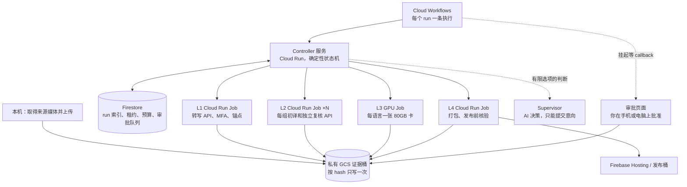

# 整条后端放到云端：AI 怎么调度，产物怎么保存

日期：2026-10-08。基线：`dev` @ `ca1a612`。接着 [10/7 云 GPU 资源与并发](20261007-cloud-gpu-resources-and-concurrency.zh.md) 和 [10/1 GCP 可行性](../gcp-production-feasibility-20261001.zh.md)。这是设计思考，没有建任何云资源；**标“估”的数字是推算，价格下单前要重新核对。**

## 先说结论

1. **不要让 AI 当调度器。** 谁先跑、谁等谁、失败了能不能重试，这些交给确定性的状态机（云端用 Cloud Workflows + 一个小 controller 服务）。AI（Supervisor、翻译、复核）只在三种地方出场：生成内容、做机器复核、在状态机给出的有限选项里做判断。这和仓库现有的方向一致：[Deterministic Engine → Bounded Decision Agent](../codex-orchestration-pipeline-design.zh.md)、Supervisor 没有 shell 也不能写批准（[Supervisor 合同](../sermon-production-supervisor-agent.md) L65-74）。
2. **产物以私有 Cloud Storage 为唯一证据来源，按内容 hash 存、只写一次。** Firestore 只做索引、租约和审批队列，可以从 GCS 重建；预算预留和“结果不明”这类花钱相关的状态例外，派发前必须先写进 GCS 不可变日志（见下）。发布（Firebase）从私有桶复制，不反过来。
3. **人工批准不让机器空等。** 每一层跑完就停，写收据，Workflows 挂起等待 callback；批准一到再启动下一层。GPU 只在 L3 渲染时开着。
4. **最大的阻碍不在算力，在三件事：** 本地文件锁和 fsync 换成云端租约；Supervisor 现在依赖 ChatGPT 登录的 Codex CLI，云端要改 API 认证，需要你决定和预算；YouTube 在云上会遇到 bot-check，来源下载仍建议本机做再上传。
5. **建议分阶段迁：** 先把产物镜像到 GCS，再做 L3 GPU 突发，再把 L2 worker 搬上云，最后才搬 controller 和 Supervisor。每一步都能单独停在那里用。

## 整体结构



## AI 怎么调度

### 分三层，各管各的

| 层 | 谁 | 管什么 | 不能做什么 |
|---|---|---|---|
| 流程编排 | Cloud Workflows | 一个 run 的长生命周期：L1 → 每语言 L2 → L3 → L4，挂起等审批，超时提醒 | 不判断内容；任务成功不等于包获准 |
| 调度和准入 | Controller（确定性代码，Cloud Run 服务） | 读当前证据、算下一步、拿租约、扣预算、派 Job、对账 | 不调用模型；状态不明时不重发 |
| 判断 | Supervisor（`gpt-6-luna`）和各层模型 | 失败分类、提出修订、在 controller 给的选项里选一个 | 没有 shell、不能写批准、不能直接派 Job，只能提交意向，由 controller 校验后执行 |

这样 AI 出错的代价是“提了一个被 controller 拒绝的意向”，不会是“重复花钱”或“绕过审批”。

### 一次 run 怎么走

1. 本机下载来源、算 SHA、上传到 `sources/`，调用 controller 开 run。
2. L1 Job 跑完写英文来源包和收据，Workflows 挂起等英文批准。
3. 批准后 controller **按语言并行**派 L2：每语言一个 locale job，组内多个 group worker（Cloud Run Job 的 task 并行）调 Sol 6.1 API。上限沿用现有规则：默认每 run 一个 active locale，execution-v2 最多 3 个（[controller 合同](../canonical-layer2-controller.zh.md)）。API 槽位改成 Firestore 里的全局计数，跨 Job 共享。所有付费 Job 设 `maxRetries=0`（Cloud Run Jobs 默认每个 task 自动重试 3 次，会在 controller 对账前重复调用 API）；task 超时显式设成大于一组初译加复核的最长耗时（默认 10 分钟不够，单次 API 调用就可能用到 300 秒），超时值写进冻结的执行策略，controller 的心跳和无进展上限照旧。
4. 某个语言文字批准一到，就给这个语言开 GPU 跑 L3，不等其他语言。
5. 听审／waiver 收据到了以后，L4 只做**准备**：打包、预检，然后停下。听审批准或 waiver 不等于发布授权；现有发布流程要求一份绑定这个已准备 release 和 Firebase 目标的单独授权（`scripts/sermon_release_workflow.py:282-288`）。Workflows 在这里再挂起一次，授权收据到了才部署，然后做 HTTP 核验，并按 release plan 的语言联动要求发布。
6. 任何一步结果不明（超时、断线、进程消失），controller 标 `reconciliation_required`，不自动重发，等 Supervisor 给出对账建议、你确认。这条是现有规则，上云后不放宽。

### 并发和预算放在哪里

- **租约**：仓库已经有 GCS generation precondition 租约（`backend/leases.py:129`），但它的过期判断用的是调用方自己的 `datetime.now()`（`backend/leases.py:46`、L154-157）。多台机器上，时钟偏快的一方可能抢走一个仍在工作的租约。所以云端不能原样复用：过期和接管要改用共享的服务端时间（例如 Firestore 事务里的服务端时间戳），并且每次有状态的写入都带上租约的 generation 做 fencing，旧 owner 一写就失败。需要查询和事务的（API 槽位、预算预留）也放 Firestore 事务。
- **心跳**：现在用本机单调时钟（[liveness](../canonical-layer2-liveness.zh.md)），跨机器不能比较。云端改为 worker 定期写 Firestore 服务端时间戳，controller 用服务端时间判超时。
- **预算**：现在的预算根是本地兄弟目录，跨主机不共享（[预算与迁移](../canonical-layer2-budget-and-migration.zh.md)）。云端用 Firestore 事务做并发准入，但**预留、结算、结果不明这三种转换在派发前先写成 GCS 不可变对象**（`runs/<pageId>/<runId>/budget/<attemptId>/<transition>.json`）。这样 Firestore 丢了也能从 GCS 恢复“有一笔调用可能已经花了钱”，不会把预算放回去再重复派发。仍然需要绑定人工批准收据。
- **GPU**：卡数上限 3，由 controller 计数，不需要通用 GPU 调度器。

### Supervisor 在云上的问题

Supervisor 现在走 ChatGPT 登录的 Codex CLI（`scripts/sermon_codex_transport.py:42`，要求 `auth_mode=chatgpt`），自动切 API 是禁用的。在云端无人值守地放一份 ChatGPT 登录凭据不合适，所以有两个选择：

- **A（建议）**：Supervisor 改走 OpenAI API（`tongxing-prod` 项目的 key 放 Secret Manager），按调用计费，派发前走预算门。这需要你改 [运行策略](../production-model-runtime-policy.zh.md)。Supervisor 只在决策点调用，每周调用次数少，费用估计每月几美元。
- **B**：Supervisor 留在本机，轮询云端状态、提交意向。云端照样跑，但你的 Mac 不在线时，决策点就停着。

## 生成物怎么保存

### 原则

- **一个私有证据桶，dev 和 prod 分开**（例如 `tongxing-dev-evidence`、`tongxing-prod-evidence`），和 OpenAI 的 dev／prod 项目一一对应。不公开，service account 按层授权。
- **大文件按内容存一次**：媒体、音频、包都放 `cas/sha256/<hash>`，用 `ifGenerationMatch=0` 写，写过就不能覆盖。
- **清单只引用 hash**：每个包和收据是一个小 JSON，记录上游 hash 和自己的产物 hash，这样“上游变了，下游失效”可以直接算出来，和四层合同的失效规则一致。
- **可变状态单独放**：run 状态、job 状态、租约用 generation precondition 更新；不和不可变证据混在一起。

### 目录结构（建议）

```text
gs://tongxing-prod-evidence/
  cas/sha256/ab/cd…                         # 媒体、音频、大文件，只写一次
  runs/<pageId>/<runId>/
    run.json                                # 冻结的 run 身份：来源、窗口、策略、代码 commit
    L1/english-source-package.json
    L2/<locale>/<revision>/candidate.json   # 每次修订一个目录，不覆盖
    L2/<locale>/<revision>/groups/<g>/attempts/<n>.json
    L3/<locale>/<renderId>/audio-package.json
    L4/<locale>/<releaseId>/release-package.json   # 准备好的包和 HTTP 核验后的包各是一个新 releaseId
    L4/<locale>/current.json                # 指向当前 releaseId，用 generation 条件更新
    receipts/<kind>/<id>.json               # 批准、waiver、预算授权，带被批准物的 hash
    accounting/<attemptId>/<eventId>.json   # 每个事件一个对象（开始、完成各一个），不追加同一个文件
    jobs/<jobId>/request.json               # 派发前只写一次；请求一变就换新 jobId
    jobs/<jobId>/state.json                 # 可变，用 generation 条件更新
  cache/layer2/<identityHash>.json          # 模型结果缓存，key 含来源、策略、prompt、代码身份
  models/                                   # 授权音色 checkpoint 等，单独桶更好，见下
```

`accounting/events.jsonl` 现在是本地追加文件；多个云 Job 同时追加同一个对象做不到，所以改成每个事件一个对象。一次 API 调用至少有两条记录：`api_attempt_started` 和完成记录（`scripts/sermon_accounting.py:624-657`），未完成调用的对账要靠两条都在（L994-1002），所以 key 必须是 `<attemptId>/<eventId>`，不能一次调用只占一个对象。现有 `sermon_accounting.py` 的读取、重放和完整性检查只认 `events.jsonl`（L329、L833），所以要加一个确定性的转换步骤：按固定顺序把这些对象拼回 `events.jsonl` 并校验，再交给汇总脚本生成 `summary.json` 和 `model-calls.csv`；或者把所有读取方改成新格式。以后需要做报表，再导入 BigQuery。

### 保留多久（建议，需你确认）

| 内容 | 保留 | 理由 |
|---|---|---|
| 收据、包清单、run 身份、发布包 | 长期，开对象版本和保留锁 | 证明发布内容从哪来、谁批准 |
| 最终音频、发布用文字 | 长期 | 可重新发布 |
| 来源媒体 | 90 天后转 Coldline，按授权要求删除 | 体积大，可重新取得 |
| 被现行包引用的单元音频 | 和引用它的包、release 一样长 | canonical 暂存会打开并完整解码每个引用的单元（`scripts/stage_formal_multilingual_dev.py:258-262`）；重新合成的 hash 不同，要走新修订和新审核，不能当作恢复 |
| 没有被任何现行包引用的中间产物（废弃修订的音频、临时文件） | 30 天删除 | 已经不在任何证据链上 |
| L2 模型缓存 | 随 run 身份保留到下一次大版本 | 保证重跑不重复花钱 |

体量估算：每周 1 小时证道，三语音频和中间文件约 2–5 GB，长期保存的部分约 0.5–1 GB。按 Standard 存储算，每月不到 $2（估）。

### 授权音色 checkpoint

你 10/8 已经同意放在云厂商。建议单独一个私有桶（或 GPU 厂商的私有卷），只给 L3 的 service account 读权限，开审计日志；上传前在授权记录写明厂商、账号、位置和保留／删除策略。GPU 选 Modal / RunPod 时，checkpoint 存在它们的私有卷里，就要在授权记录里写那个厂商。

### 发布

L4 从证据桶读发布包，复制到 Firebase Hosting／发布桶，再做 HTTP、SHA、Range 核验。私有桶永远不直接对外。

## 仓库里要改的地方

0. **包里的路径**：现在的英文来源包和 L3 包里记的是本机绝对路径（例如 `scripts/build_english_source_package.py:79-85` 的 `artifact()`），校验器用 `Path(...)` 直接打开。原样拷到 GCS，云端 worker 读到的路径仍指向本机，无法校验也无法使用。所以阶段 1 之前要先做一个有版本号的“云端定位”合同和迁移（路径改成相对 run 根或 `gs://` + hash），或者在云端 worker 里先把原目录结构还原出来，再校验原封不动的包。

1. **存储抽象**：约 30 个脚本用 `fcntl.flock`，持久性依赖目录 fsync（[durable job 证据](../durable-job-directory-evidence.zh.md)）。需要一层存储接口，有本地和 GCS 两种实现：不可变写用 `ifGenerationMatch=0`，可变状态用 generation 条件，锁用现有 GCS 租约。这是工作量最大的一项。
2. **心跳、预算、API 槽位**：从本机时钟和本地目录换到 Firestore 服务端时间和事务。
3. **Controller 服务**：把现有 L2 controller 的 `tick` 包成 Cloud Run 服务，再补上 L1、L3、L4 的派发（现在只有 L2，[controller 合同](../canonical-layer2-controller.zh.md) L63-67）。
4. **Workflows 定义**：每个 run 一条执行；审批用 callback。
5. **审批入口**：远程审批桥现在只有设计（[remote review bridge](../tracker-remote-review-bridge.zh.md)）。可以做成 admin 页面写收据，再调用 Workflows callback。
6. **镜像**：一个 CPU 镜像（API、MFA、FFmpeg），一个 linux/amd64 CUDA 镜像（TTS、ASR），见 10/7 报告。
7. **凭据**：`tongxing-dev-runtime`／`tongxing-prod-runtime` 放 Secret Manager，Job 按环境挂载；本地 `.env.openai` 启动器保留给本机。
8. **执行身份**：云端跑的 run 是新的执行身份；已有的本地 run 按冻结身份在本地跑完，不迁移到一半的 run。
9. **策略文档**：计算策略、运行策略和 `AGENTS.md` 加上云端选项，需要你决定。

## 分阶段（建议）

| 阶段 | 做什么 | 得到什么 | 风险 |
|---|---|---|---|
| 0 | 本地 run 结束后，把包、收据、最终音频按上面的结构上传到 GCS | 产物不再只在一台机器上 | 低，只是镜像；但这只是备份，云端还不能直接用（见下） |
| 1 | L3 按需 GPU（10/7 方案 A） | 渲染不占 Spark，三语可并行 | 中，新执行身份要验收 |
| 2 | L2 group worker 改成 Cloud Run Job，锁、预算、槽位换到云端 | Mac／Spark 不在线也能翻译 | 中高，要动存储层 |
| 3 | Controller + Workflows + 审批 callback | 整条线在云上推进，你在手机上批准 | 高 |
| 4 | Supervisor 上云（选 A 时） | 决策点也不依赖本机 | 需要策略改动和预算 |

费用（估，每月 4 篇）：GPU $15–40（见 10/7），Cloud Run／Workflows／Firestore 用量很小，约 $5 以内，存储约 $2，OpenAI API 和现在一样。主要成本是开发工作量，不是云账单。

## 需要你决定

- 做不做整体上云，还是先停在阶段 0–1？我倾向先做阶段 0 和 1：风险低，产物有统一存放处，L3 也能并行。
- Supervisor 在云上用 API（A），还是留在本机（B）？
- 保留期限按上表，还是有别的要求（特别是来源媒体）？
