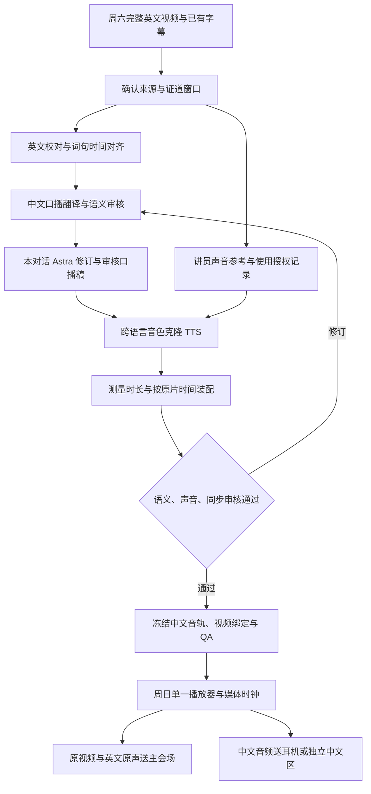

# 周六英文证道视频 → 周日原讲员音色中文语音：方案草案


最新进展（2026-09-05）：已完成周六配音桥接器及真实候选验证；定时任务应用更新未确认，口播修订和审核在本对话使用 GPT-6 Astra。未变音频与 ASR 缓存复用，弱边界模型审核单独留证。见[当前配音扩展 Runbook](../experiments/sermon-dubbing-poc/SATURDAY_AUDIO_RUNBOOK.zh.md)和[试听 App](https://ai-for-god-sermon-audio.web.app)。


状态：**Discovery / 可恢复的候选流程，现场验收未完成**。未来同版本纯证道视频为主路，尚待实际来源和接入器；当前直播归档作为并行 fallback，仍复用真实人工窗口批准，属于半自动。自动边界审核后续另建契约，不代签人工批准。下文保留方案设计与历史模型比较；当前操作以 Runbook 为准。

方案分支：`codex/saturday-sunday-chinese-voice-plan`，起点：`038bf2a`。模型信息来自 2026-09-04 至 09-05 查阅的一手资料；仓库现状来自代码与文档核对，实际生成证据另见 POC。

用户随后明确实施顺序：**先生成 MP3 并验证中文流畅度，再考虑 Firebase 发放；UI 提供开始播放和前后微调。** 当前播放器按此实现手动对齐的交互，不宣称已经自动跟随视频。下文的共同播放时钟是可控制现场播放器时的后续同步方案。

## 1. 建议先做什么

**首版做“提前制作、经过审核、与原视频同步的中文配音音轨”。最终音色以原讲员的跨语言音色克隆为目标。** 周六完成内容、声音和时间轴的处理，周日由播放器按照同一个媒体时钟播放视频与中文音频，会众获得接近同声传译的跟随体验。

目标为：**取得周日实际播放的同一份英文证道视频。该来源尚未交付。** 因此首版按证道内容、剪辑顺序及速度一致设计；后续需要确认的是现场播放器能否提供共同播放时钟。“同一主题”“同一讲员”“同一篇讲章”本身不满足同视频条件。

建议模型组合：

- 英文来源：已有字幕优先；缺失或疑难部分复用项目的 `gpt-transcribe` 路径。
- 精确时间轴：`Qwen/Qwen3-ForcedAligner-0.6B`。
- 中文口播翻译与独立审核轮次：沿用项目当前的 `gpt-6-astra / medium`，最后由真人确认。
- 原讲员音色：当前使用 `Qwen/Qwen3-TTS-12Hz-1.7B-Base` 的按讲员独立训练检查点；其他 TTS 比较保留为后续评估。
- 中文音频回听检查：当前用 `mlx-community/Qwen3-ASR-0.6B-8bit` 逐段转写找问题，加真人完整试听。
- 时间装配、音量处理和现场播放：确定性音频工具与播放器，无须生成模型。

以上是**原讲员音色实验的候选顺序**，尚不能称某个 TTS 已胜出。当前 MacBook 小样使用 Qwen3-TTS 的 MLX 8-bit Base 原声参考与 CustomVoice 预设两种入口，回转写用 `mlx-community/Qwen3-ASR-0.6B-8bit`；Spark 使用官方 1.7B Base 做单讲员训练试跑。已有生成、权重更新与解码证据；用户已认可首轮与扩充训练样片；其他讲员及本周整篇音频单独审核。

## 2. 三种现场条件必须分开

| 条件 | 实现方式 | 本方案范围 |
|---|---|---|
| 同一份视频，可以控制现场播放器 | 把预制中文音轨放进同一播放时间轴；视频暂停、跳转时音频同步响应 | 首版主路径 |
| 同一份视频，由另一套系统播放，无法取得其播放时钟 | 从播放器时间码/API取位置；没有接口时再评估英文线路输入的音频指纹跟随 | 第二阶段，需要独立同步实验 |
| 讲员周日重新现场讲相同内容，或视频临时改剪 | 现场英文 ASR 为事实来源；预制片段只在可靠匹配时可用，偏离内容必须停止套用 | 独立研究范围，不计入首版完成 |

同一文件由两台设备“同时按开始”仍有启动误差和时钟漂移，无法作为整场同步方案。若现场实际上属于后两类，需要调整现场播放模块；周六翻译、音色实验与分段语音资产仍可复用。

首版最小试验是：**90–120 秒真实证道片段 → 审定中文口播稿 → 原讲员音色中文 → 与该视频一起播放并试听。** 随后扩展到 10 分钟，再到整篇。

## 3. 与现有项目的关系

| 已有基础 | 本方案复用的内容 | 尚需新增的内容 |
|---|---|---|
| [周六生产 Runbook](./codex-local-production-runbook.zh.md)、[生产脚本](../scripts/run_post_live_subtitle_generation.py) | 来源、人工证道窗口、英文、翻译、模型与 QA 记录；当前默认 Astra Medium | 面向听觉的中文口播稿、时长预算与语音审核 |
| [Context Pack 方案](./saturday-to-sunday-context-pack-plan.zh.md)、[导出脚本](../scripts/export_saturday_live_context.py) | 稳定 segment ID、英文顺序、时间与内容来源 | 独立的 dubbing manifest；不把 Pack readiness 当成语音发布批准 |
| [周日实时字幕 POC](../experiments/local-live-poc/README.md) | 必要时单独提供字幕；后续研究现场偏离时可参考其 ASR/录音恢复契约 | 首版配音播放器、中文音频总线与接收端验收 |
| [历史 Voxtral TTS POC](../scripts/run_voxtral_tts_poc.py) | 可参考 SRT 读取、片段选取、manifest 与音色授权检查的实现 | 新 TTS adapter、按原片时间装配、整篇回听和现场路由 |

Voxtral 脚本保留着 2026-07-19 的语言支持限制说明；本次没有重新核实该供应商现状，不据此断言其现在仍不支持中文，也不把它视为已验证的中文配音能力。

中文阅读 PDF、证道同行/大纲和中文口播稿有不同用途。口播稿必须从**完整英文内容及其翻译**导出；不朗读证道同行中的解读、摘要或新增评论。已有 PDF QA、模型审核、`human Gold` 与语音发布批准各有自己的证据，不自动互相升级。

## 4. 端到端流程



图中的授权与人工审核属于计划中的原讲员声音生成、发布条件；预设音色工程小样已独立运行。周日首版运行时无需调用 ASR、翻译或 TTS 服务。

## 5. 每个节点的模型与交付物

| 节点 | 首选模型 / 工具 | 输入 → 输出 | 必须核验 |
|---|---|---|---|
| 1. 媒体获取与检查 | 已授权本地文件或现有获取流程；`ffprobe`、SHA-256；无模型 | 完整视频 → 来源与媒体清单 | 完整解码、音视频流、时长、原始时间基准；人工确认证道绝对窗口 |
| 2. 英文来源与校对 | 已有英文字幕优先；缺失/风险片段使用现有 `gpt-transcribe` provider；本地候选为 `Qwen3-ASR-1.7B` | 英文字幕/原音 → 可追溯的英文段落 | 经文、人名、数字、否定、引语；现有字幕也不自动视为逐字正确 |
| 3. 英文精确对齐 | `Qwen/Qwen3-ForcedAligner-0.6B`，加人工边界复核 | 校对英文 + 对应原音 → 词句时间戳 | 先对齐相同语言的文本与音频；不能将中文译文强制对齐英文原音 |
| 4. 中文口播初译 | `gpt-6-astra / medium`，复用当前 provider | 完整段落上下文 + 英文片段 + 审定术语/经文 → 逐片段中文口播候选 | 保留全部语义、逻辑关系和说话人；保持 segment 映射；输出长度只是时间预算候选 |
| 5. 内容与时间预算审核 | `gpt-6-astra / medium` 单独审核轮次，再由双语真人确认 | 原文 + 中文候选 + 目标秒数 → 修订稿与问题单 | 审核轮次不等于独立模型证据；不得为了赶时长删掉论点、否定或经文 |
| 6. 发音准备 | 人工确认的发音词典 + 确定性文本规范化；Astra 仅提出候选 | 经文、专名、数字缩写 → 显示文本与 TTS 输入文本 | 如经文章节号要转换为可听表达；拼音标注语法必须按选定 TTS adapter 实测 |
| 7. 声音参考准备 | 人工选干净英文原音 + FFmpeg；克隆模型内部提取音色 | 已确认讲员的参考片段与准确英文 → 冻结 voice profile | 单人、无音乐/掌声/串话；参考来源 hash；音色使用范围记录 |
| 8. 中文语音合成 | 首轮 `Qwen/Qwen3-TTS-12Hz-1.7B-Base`；对照 `IndexTeam/IndexTTS-2.5` | 已审中文 + 同一讲员参考 → 分段中文 WAV | 记录权重 revision、runtime、参考 hash、生成参数、seed（如支持）、重试次数 |
| 9. 时长装配 | 确定性调度；FFmpeg `atempo` / `apad` / 延时与重采样 | 分段 WAV + cue windows → 完整中文时间轴 | 无截词、叠音、缺句；每段按绝对位置放置；调整后重新回听 |
| 10. 语音内容 QA | `Qwen/Qwen3-ASR-1.7B` 回转写 + `Qwen3-ForcedAligner-0.6B` 中文对齐 + 真人试听 | 最终中文音频 + 审定中文 → 内容差异、发音与边界问题单 | ASR 找漏词/重复/幻觉；aligner 只定位，不能证明生成音频真的说了给定文本 |
| 11. 混音与发布审核 | FFmpeg `loudnorm` / `ffprobe` + 人工完整视频回看 | 全长中文音轨 → 冻结播放包与 QA | 听感、响度、真峰值、素材与审核 hash 一致；无模型审核替代真人批准 |
| 12. 周日播放与分发 | 单一媒体时钟的播放器 + 独立音频输出路由；无模型 | 已批准播放包 → 会众实际听到的中文 | 同步、暂停/跳转、音量、耳机/中文区终端、紧急静音及恢复 |

模型名中的 `gpt-6-astra`、`gpt-transcribe` 是当前项目配置，见[生产参数](../scripts/run_post_live_subtitle_generation.py)。本次未调用这些接口；后续先用既有 provider 做小样可用性验证，不假定其他账号或端点具有相同名称和权限。

Qwen 的官方实现提供英中 ASR 与词/字级 forced alignment；应分块后映射回全局时间轴，不能把整个证道一次塞入 aligner。[Qwen3-ASR 官方实现](https://github.com/QwenLM/Qwen3-ASR#forcedaligner-usage)

## 6. 如何保留原讲员音色

目标应表述为：**“经授权，以接近该讲员的音色合成中文译文。”** 中文是合成翻译，不能标成讲员原本说过的中文或教会官方中文录音。对听众采用一次清楚的播放前说明和播放器标识，无须在每个片段中插入提示。

### 6.1 第一轮模型选择

| 模型 | 一手资料确认的能力 | 本方案判断与待测部分 |
|---|---|---|
| `Qwen/Qwen3-TTS-12Hz-1.7B-Base` | 参考音频克隆、英中跨语言生成；可复用 reference prompt；模型卡标为 Apache-2.0 | 首轮基线。测试中文清晰度、讲员相似度与段间稳定性；不假定能精确生成指定秒数 |
| `IndexTeam/IndexTTS-2.5` | 跨语言音色迁移、音色情绪分离、`duration_factor`、中文拼音控制；模型卡为 Bilibili Model Use License | 必做对照。重点测专名发音和时长返工率；比例控制不等于逐毫秒精确时长 |
| `FunAudioLLM/Fun-CosyVoice3-0.5B-2512` | 跨语言零样本音色克隆及发音控制 | 前两者不能达标时的第三候选，避免首轮同时引入太多变量 |

依据：[Qwen 官方用法](https://github.com/QwenLM/Qwen3-TTS#voice-clone)、[Qwen 模型卡](https://huggingface.co/Qwen/Qwen3-TTS-12Hz-1.7B-Base)、[Index 官方实现](https://github.com/index-tts/index-tts)、[Index 模型卡](https://huggingface.co/IndexTeam/IndexTTS-2.5)、[CosyVoice 官方实现](https://github.com/QwenAudio/CosyVoice)。以上是供应商能力声明，不是本项目的试听结论；代码与权重许可应分别记录。

两个容易选错的地方：

- Qwen 的 `Base` 才是此处参考音频克隆入口；`CustomVoice` 是预设音色，`VoiceDesign` 是描述创建音色。不能把 `CustomVoice` 的指令控制直接当作 `Base` 克隆接口的能力。
- IndexTTS-2 的旧发布说明写明精确时长控制当时未启用；本日的 2.5 文档已提供 `duration_factor`。实现时必须锁定版本，不依赖旧论文标题推定接口可用。

### 6.2 参考声音与试听方法

先为每位讲员挑选约 3 段、每段 10–20 秒的干净英文，分别包含平静叙述、强调和温和劝勉；这些时长是**本项目拟定的采样设计**，不是模型硬性要求。逐段比较参考效果，再选定固定 profile，不随句子随机换参考。准确转写参考英文，保留原片位置。

TTS 用该英文参考与审定中文生成跨语言声音，不要求讲员先录完整中文。原声中的混响、音乐或失真会使参考质量难以判断，首选干净素材；首轮不引入人声分离模型或训练任务。

固定中文稿与候选列表，保留所有样本；试听者先看匿名编号。分别评价中文可懂度、讲员相似度、情感是否过度、连续听 10 分钟是否疲劳。熟悉讲员声音的人判断相似度，中文听众判断自然度，双语审核者核对内容；这些角色可以重叠。中文合成没有天然的“本人中文真值”，声纹分数只能辅助，不能代替试听。

参考音频克隆保留为基线。按用户希望开始训练的要求，本次另做一轮有界的微调工程试跑；这用于验证数据、CUDA、权重保存和中文推理链路。是否扩大正式训练，仍由固定中文对照、讲员相似度和更多独立证道的证据决定。

### 6.3 音色材料的使用范围

用户已在本会话确认“已获得授权，声音可以用于训练和配音”。本地授权记录绑定已盘点的 8 份素材 ID/hash，覆盖声音训练与中文配音；新素材应绑定相应来源记录。授权不改变受保护测试集的用途，也不代表生成质量已经通过审核。当前仅在 MacBook 与用户的 Spark 处理，未向外部托管平台上传或发布。

授权记录、参考音频与可复用声纹/clone prompt 仅存放在本地受控产物目录或获准存储；Git 只保留脱敏记录结构和必要 hash。最终原讲员音色仍需通过相似度与中文听感检查。

## 7. 中文口播与时间同步的核心设计

### 7.1 按语义组织，按原片定位

翻译时读完整段落及上下文；合成时按完整短句/语义单元切分，首轮尝试约 4–12 秒的源窗口，必要时保留更长单元。不能直接沿用字幕显示用的零碎 3 秒断句，也不能把几千字一次合成为长录音后逐段猜位置。

每个单元保留 `sourceSegmentIds`、`speakerId`、英文、中文、原片绝对开始/结束、目标播放窗口与关键语义锚点。英文先说条件后说结论时，中文不能为了凑时长抢先给出结论；笑点、经文与祷告尤其需要人工看视频核对。

口播译文可以调整中英文语序、把书面标号改成可听表达，但不可改写成讲道摘要。所有删改、缩句与发音替换都保存前后文本及审核结果。

### 7.2 时长不够时的处理顺序

定义一个片段的可用窗口为 `W` 秒，首次合成的有效语音长度为 `D` 秒。先实测 `D`，不要仅靠汉字数估计。

1. 保留原文意义，调整中文口播句式或合理重分段，重新审核。
2. 在选定模型实际支持的范围内调整语速并重新合成；重新测量输出。
3. 仅对小幅误差做保持音高的后处理。首轮把 `atempo` 的可接受范围设为 **0.90–1.10**，超过则回到前两步；这个范围需通过试听确定，不是质量保证。
4. 较短片段保留自然停顿，用静音补齐；较长片段只有经人工确认才能借用相邻空白，不能穿过下一说话人或关键语义边界。
5. 无法自然放入窗口的片段进入人工问题单，阻止发布；禁止直接裁掉结尾或让后续整篇不断后移。

若需要后处理速度，计算 `speed = D / W`；`speed > 1` 表示加快。Index 的 `duration_factor > 1` 则表示变慢，两者含义相反；比例参数仍需要生成后测量，不按数学倒数承诺输出恰好等长。

每个片段以**绝对媒体时间**独立定位，避免把几百个片段串接后累积误差。最终与获准播放视频使用同一时间原点；若从完整礼拜视频截取证道，记录 `sourceStartMs` 映射与输出 PTS 基准，保留必要的前后静音。

FFmpeg 的变速、补齐、延时、重采样与响度处理可组成确定性装配步骤；这些工具负责音频处理，翻译的语义边界仍由前面的审核决定。[FFmpeg 官方滤镜文档](https://ffmpeg.org/ffmpeg-filters.html)

### 7.3 输出和最小数据契约

拟新增独立产物目录 `artifacts/sermon-dubbing/<service-date>/<run-id>/`，沿用现有 ignored artifact 政策。下面是拟议文件，不表示已经生成：

| 文件 | 用途 |
|---|---|
| `source-manifest.json` | canonical URL、来源/目标日期、视频 hash、流信息、完整性与人工窗口记录 |
| `voice-profile.json` | 讲员 ID、参考 hash、受控授权证据引用、允许用途、冻结模型信息；不公开参考音频 |
| `segments.jsonl` | 英中对照、时间窗口、发音输入、音频 hash、逐段审核和未解决问题 |
| `segments/<id>.zh.wav` | 可单独重做的中文语音；保留原生采样率版本 |
| `sermon.zh-CN.wav` | **核心交付物**：与目标视频全长时间轴对应的中文语音母带；拟用 48 kHz / 24-bit PCM，重采样不代表提升模型原生音质 |
| `sermon.zh-CN.mp3` | 面向试听与后续 Firebase 发放的首选文件；由母带编码，记录独立 hash，并验证编码延迟与 seek |
| `playback-package/` | 与中文母带绑定的原视频或派生多通道母版、时钟与输出通道配置、操作说明 |
| `qa-report.json`、`release-manifest.json` | 内容/音色/同步/路由证据及各自状态；精确绑定最终文件 hash |

`segments.jsonl` 至少需要：

```json
{
  "schemaVersion": "sermon-dubbing-segment-v1",
  "segmentId": "seg-0001",
  "sourceSegmentIds": [],
  "speakerId": null,
  "sourceVideoSha256": null,
  "sourceStartMs": null,
  "sourceEndMs": null,
  "playbackStartMs": null,
  "playbackEndMs": null,
  "english": null,
  "chineseSpoken": null,
  "ttsInputText": null,
  "voiceProfileId": null,
  "ttsModel": null,
  "ttsRevision": null,
  "generationReceiptRef": null,
  "audioSha256": null,
  "generatedDurationMs": null,
  "postprocess": [],
  "humanReview": {"status": "pending", "reviewer": null, "reviewedAt": null},
  "status": "draft"
}
```

这是故意未填充的结构示意，**不得通过发布校验**。未来 validator 要拒绝缺失字段、零/负窗口、重叠、缺句、未解决问题、未批准声音、来源错配或 hash 变化。来源窗口中不配音的掌声、音乐、静默、非讲员内容也要有明确 disposition，不能从覆盖率分母中默默删去。

审定后任一文本、参考声音、TTS 输出或后处理变化，都使对应审核失效。复跑按输入与参数 hash 复用缓存，只重做受影响段；发布包通过全部门槛后原子切换到新版本，保留上一版。

## 8. 周日会众怎样听到中文

### 8.1 推荐的现场连接

同一房间同时服务英文与中文听众时：一个播放器在同一媒体时钟下输出视频、英文原声和中文音轨。英文进入主扩声，中文进入独立的耳机/同传接收系统。单独中文区可直接播放带中文音轨的视频。

**单个视频容器有两条可选音轨，不代表普通播放器会同时把两条音轨送到不同设备。** 双语现场需要支持同时解码与分通道输出的播放器，以及足够输出通道的音频接口；例如原声立体声占用输出 1/2，中文占用输出 3/4。实际软件与设备映射在 10 分钟验证阶段确定，整套链路测过才算完成。

中文首版用干声。若有获准的独立音乐/环境声素材，可另做轻混音；不要把含英文讲员声音的完整原声高音量混入中文耳机。英文继续在会场主扩声播放时，还要实听环境英文与耳机中文的重叠是否影响理解。

优先用已有的现场音频/同传设施验证。若只能靠手机接收，需另测完整的音频传输方案、网络容量、缓冲、锁屏与耳机延迟；现有 Firebase/SSE 字幕分享只能证明文字分发，不能据此宣称已经支持同步听中文。第一轮用有线耳机建立可控基线，再测真实接收端。

### 8.2 同步与故障行为

- 播放之前校验媒体身份、源→派生文件映射及全部 hash；同一标题/时长不够。重新剪辑、换版或不同倍速需要重新绑定时间轴。
- 单一 transport 控制开始、暂停、seek 和恢复。校准“播放器→屏幕”及“播放器→实际耳机”的不同输出延迟，并把偏移写入场地 profile。
- 现场只有中文音量、静音、状态及同步偏移等必要控制。紧急静音立即作用于中文输出，不影响英文原片。
- 对暂停、前后跳转、音频设备断开、重连和从中间开始逐项彩排；跳转时清除旧音频缓冲。恢复前校验设备映射与当前位置，不能让旧句在新画面下继续播放。
- 中文播放异常时静音并让操作员恢复；只有已经单独验证可用的字幕/人工支持可作为降级路径。不要在现场临时启动未验收的实时克隆配音。

无法控制主播放器时，先确认是否能得到稳定的时间码或播放位置接口。音频指纹跟随是后续备选，需要干净英文线路输入、唯一定位、漂移估计、锁定/丢锁状态与暂停/跳转检测；重复经文和静默不能当成可靠锚点。丢锁期间不继续盲播。整段英文语音识别不宜承担同一视频的精确播放时钟。

## 9. 验证标准与实施顺序

以下数值均为**提议的首轮验收目标**，不是已有成绩或行业标准。先用短片确定可接受范围，再冻结为本项目的正式门槛。

| 维度 | 拟议验收方式 |
|---|---|
| 内容完整 | 全部获准证道语义单元都有译文/音频或明确不配音原因；不能按“已合成片段”计算 100% 而忽略缺段 |
| 语义与发音 | 真人完成英中核对；关键经文、数字、否定、人物与归属错误为 0；中文音频整篇听过，问题全部关闭 |
| 音色与可懂度 | 匿名样本分别按 1–5 分评价；中文自然度与讲员相似度的中位数初定各 ≥4，保留每位试听者原始意见；样本不能只挑成功段 |
| 段间衔接 | 无听得出的截词、叠音、重复、突变音色；10 分钟连续听感与全篇回看均有记录 |
| 内容同步 | 人工标注语义锚点，目标与实际中文对应锚点的偏差 P95 初定 ≤0.5 秒；最大偏差 >1 秒的点逐一处置；不追求逐字或嘴型同步 |
| 播放同步 | 全篇开头、中段、结尾及暂停/seek 后测试声画与接收端偏移；补偿后相对固定偏移的额外漂移初定 ≤100 ms；包括终端，不能只读播放器时钟 |
| 声音电平 | 首轮拟用语音母带 -18 LUFS、true peak ≤-1.5 dBTP，再按实际接收系统试听定标；无削波与明显音量跳变 |
| 播放可靠性 | 实际影片与实际输出设备全长播放一次，外网断开仍可正常播放；故障可静音、可恢复；记录操作员与终端证据 |
| 时间预算 | 记录准备、推理、重试、审听与返工的实际工时，在发布截止时间前留出一次修订与整篇回放时间 |

机器回转写是筛查工具；中文 ASR 误差可能来自 TTS 也可能来自识别器，所以不拿单个 CER 数字替代人工检查。音色相似度不能补偿语义错误，信号同步也不能证明听众理解同步。

### 分阶段交付

| 阶段 | 工作与交付 | 通过后才能进入下一步 |
|---|---|---|
| P0：输入与现场条件 | 确定同视频/播放器控制条件、目标讲员、素材、音色使用范围、输出方式；冻结短片和人工口播稿 | 可追溯的英文与中文、可用参考、明确现场模式 |
| P1：90–120 秒音色实验 | Qwen Base 与 Index 2.5 使用固定稿和参考；保存完整样本、参数、生成时间与匿名试听表 | 中文准确清楚，至少一个候选的声音可接受 |
| P2：10 分钟同步实验 | 逐段合成、时长修订、绝对时间装配；实现播放器/多通道输出；跑暂停、seek 与恢复 | 语义同步、段间听感和实际耳机路由通过 |
| P3：整篇周六生产 | 增加缓存、重试上限、覆盖校验、完整 QA 和原子发布包；完成整篇审听 | 所有片段与发布文件绑定审核，处理工时可在周末窗口完成 |
| P4：周日场地彩排 | 用现场播放器、扩声、接收端和实际会众体验完整播放 | 全链路证据齐备，才可称现场可用 |

模型对照应固定运行环境。MacBook 已完成预设与原声参考合成；Spark 已在独立容器/venv 中完成官方 Base 单讲员训练，记录兼容性适配、有限 loss 与真实权重变化。MLX 与 Torch 输出单独保留，不能将跨运行时差异全部归因于微调。小规模结果也不能证明整篇训练或现场链路可用。

耗时估算使用：`总耗时 = 素材/翻译准备 + Σ(各次生成音频秒数 × 实测 RTF) + 审听/返工 + 打包/彩排`。例如 45 分钟音轨、RTF=1、一次完整合成加一次完整听审，单这两项就约 90 分钟；这里的 45 分钟和 RTF=1 是算例，非本机测量。再加翻译、重试、同步和现场验证，不能只据模型“首包延迟”承诺一夜完成。

现有实现已独立放到 `experiments/sermon-dubbing-poc/`，包含素材盘点、预设 TTS、两种分组对照、MP3 装配/机器筛查和本地播放器。下一步补讲员分离与数据审核、原讲员音色对照及真实视频时间轴，再做 Firebase 发放；当前 live Gateway 与每周 PDF 自动任务维持原工作流。

## 10. 当前结论与仍需确定的事项

“周六和周日播放同一视频”已由用户确认；现场共同播放时钟仍需在 P0 落实。这条路径工程上可拆成明确的离线生产与现场播放任务。**首先要用真实样本证明中文口播质量和原讲员音色可接受，再证明全篇同步与现场分发。** 现阶段不能承诺已经能以原讲员声音可靠完成整篇中文，更不能从字幕 POC 的延迟推算配音效果。

进入 P0/P1 时需确定的输入是：实际英文视频、讲员声音参考及允许用途、现场主播放器能否受控、中文通过耳机还是独立区域播放。方案先采用普通话、单讲员、无新增背景声的最小范围；若片中有其他说话人，独立标记并处理，不能自动全都克隆成主讲员。

若周日是现场重讲，则另立“现场 ASR → 内容匹配 → 片段调度 / 实时翻译与 TTS”的实验。预制中文只在当前英文内容得到确认后才可使用；遇到临时发挥、跳段、重讲、反问或 ASR 失败，不能把周六的整篇中文继续播给听众。这一扩展需要新的延迟与错误恢复门槛，本方案首版不承担该能力。
