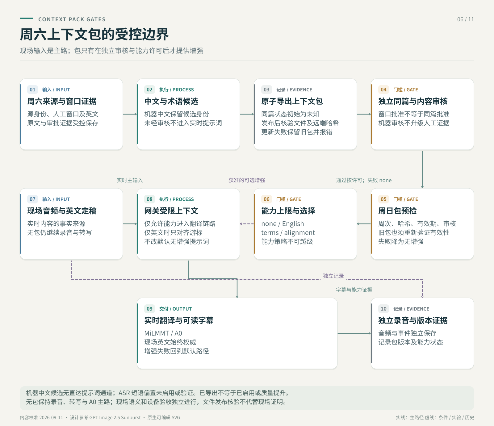

# 周六产物到周日实时字幕 Context Pack：方案审核、开发框架与实施计划

状态：**Reviewed design / Phase 0–2 initial implementation complete**

校准日期：**2026-09-04**

适用范围：周六 post-live 生产与 `experiments/local-live-poc/` 周日本地实时字幕之间的显式接口。



## 1. 结论

采用两层产物，而不是把周六整篇 transcript 或 PDF 直接放进周日 prompt：

1. **Saturday Evidence Bundle**：保存来源、音频、GPT 英文、中文候选、审核结果、模型与 QA 的完整证据链。
2. **Sunday Runtime Pack**：从 Evidence Bundle 投影出短期、轻量、可验证、可降级的现场上下文。

周日现场麦克风产生的稳定英文 `asr.final` 始终是唯一 source of truth。周六内容只能：

- 帮助识别当周专名、书卷、人名和地名；
- 帮助检索讲章的大致顺序；
- 提供已审核术语、经文和严格受控的翻译参考；
- 为会后 replay、A/B 和错误分析提供冻结输入。

周六 transcript 不能在周日 ASR 故障时冒充现场字幕。机器中文在任何模式下都不能自动进入现场翻译 prompt。

## 2. 方案审核

### 2.1 当前已经实现并验证的能力

#### 周六生产

稳定 post-live 主流程已经能够保存或生成：

- canonical source URL、source ID、Sunday slice 和媒体 metadata；
- 下载后的 `source_audio.*`；
- 人工确认证道绝对 start/end、审批人与绑定的 source hash；
- 规范化后的 `source_clip.m4a`；
- `gpt-transcribe` 原始或分块英文参考；
- `segments_timed_en_corrected.json`；
- `segments_timed_zh.json`；
- reading edition、证道解读、两个 PDF、QA、summary 和 run status。

当前自动主流程把下载音频作为必要媒体产物；完整视频文件不是周日 Runtime Pack 的必要依赖。视频 URL、ID、metadata 和媒体 hash 应保留在 provenance 中。

#### 周日 POC

当前 POC 已经具备：

- `saturday-sermon-segment-v1` JSONL schema；
- Weekly Pack builder、audio SHA-256 和有效期；
- ordered sermon map、cursor 邻近检索和全局 lexical fallback；
- `none`、`english_alignment_v1`、`weekly_terms_v1`、`saturday_alignment_v1` 四种 policy；
- 机器中文不可注入；
- reviewed exact match 可复用，相似 reviewed translation 只作为 reference；
- 冻结英文 replay/A-B 和 context provenance 日志；
- Pack 不存在或不满足基本来源条件时回落 `none`。

### 2.2 审核发现的实现缺口

| 缺口 | 影响 | 设计处理 |
|---|---|---|
| 没有 Saturday pipeline 到 `saturday-segments.jsonl` 的生产 exporter | builder 存在，但每周真实 Pack 仍需手工拼装 | 新增确定性 exporter，输入现有 production run root |
| 默认 `reading` 模式时间为 `synthetic_not_for_subtitles` | 不能把 reading block 的 start/end 宣称为精确字幕时间 | Pack 显式记录 `timingQuality`；只把它当 sequence map |
| launcher 只检查 active/source/hash/expiry 就自动选择 A2 | 没有区分英文地图、审核术语、reviewed examples 的就绪程度 | 新增 capability-based readiness 和选择报告 |
| `contextPolicy` 同时承担 retrieval 与 prompt 语义 | English-only Pack 难以准确表达 | 将 alignment capability 与 prompt injection capability 分开判断 |
| 现有 Pack 缺少 `targetSunday`、message identity 和 review coverage | 可能误用错周或错 message 的 Pack | v2 manifest 绑定目标周日、messageKey、审核与来源指纹 |
| ASR phrase bias 尚未接入当前 Qwen provider | 不能宣称周六专名已经提升现场 ASR | 先生成候选 phrase list，再做 provider capability spike 和 replay promotion |
| 未定义 session 中途更新规则 | 热更新可能造成同一场结果不可复现 | 每个 session 启动时冻结 packVersion，现场不自动热切换 |

### 2.3 本次审核对原方案的修正

1. **不把两份 PDF 当 Runtime Pack 输入。** PDF 是交付和人工审查产物；Runtime Pack 从结构化英文、中文、术语与审核记录生成。
2. **不把 reading timing 当精确时间轴。** 有来源字幕或经过验证的 segment timestamps 时才标记精确；否则只保留顺序与粗定位。
3. **English-only 是合法且有价值的降级层。** 它可以提供 sermon map 和候选专名，但不得让机器中文进入 prompt。
4. **Core Pack 与 Weekly Pack 分开。** 当周 Pack 过期后不能污染长期术语；只有经人工审核、来源授权且多场稳定的短语才可单向晋级 Core。
5. **Last-known-good 只允许同一目标周日和同一 message identity。** 不能用上一周整篇讲章作为当前周的 fallback。
6. **ASR 故障时不显示周六 transcript。** 继续录音并明确显示 ASR unavailable；翻译故障时可以显示现场英文并继续录音。

## 3. 目标架构

```text
Authorized Saturday source
  -> source state + metadata + operator sermon window
  -> downloaded source audio
  -> normalized sermon clip
  -> GPT English reference + optional timing source
  -> machine Chinese candidate + review evidence
  -> Saturday Evidence Bundle
  -> deterministic projection + fail-closed validation
  -> Sunday Runtime Pack

Sunday microphone PCM
  -> local ASR partial/final
  -> immutable asr.final
  -> optional Saturday English-map alignment
  -> approved terms/scripture/reviewed references only
  -> translate CURRENT live English
  -> caption partial/final + provenance events
```

### 3.1 Saturday Evidence Bundle

Evidence Bundle 是可恢复、可审计的完整生产目录，不进入实时 prompt。建议逻辑结构：

```text
saturday-evidence/
  manifest.json
  source/
    source.json
    operator-window-approval.json
    source_audio.m4a
    source_clip.m4a
  english/
    asr_reference.json
    asr_reference_chunks.json
    segments_timed_en_corrected.json
  translation/
    segments_timed_zh.json
    reading-edition-v2/
  review/
    reviewed-terms.json
    reviewed-scripture.json
    reviewed-examples.jsonl
  qa/
    summary.json
    run-status.json
    reading_quality_report.json
```

目录名是逻辑契约，不要求移动现有文件。首版 exporter 可以直接读取现有 run root，并在 manifest 中引用原路径与 SHA-256。

### 3.2 Sunday Runtime Pack

Runtime Pack 只保存现场需要的最小内容：

```text
sunday-runtime-pack/
  manifest.json
  message-identity-approval.json
  saturday-segments.jsonl
  asr-phrases.candidate.txt
  terms.reviewed.tsv
  scripture.reviewed.json
  exact-examples.reviewed.jsonl
  weekly-pack.json
  pack-readiness.json
```

建议新增 `weekly-context-pack-v2` manifest；v1 JSONL 保持向后兼容。示例：

```json
{
  "schemaVersion": "weekly-context-pack-v2",
  "packId": "weekly-2026-09-06-<content-hash>",
  "targetSunday": "2026-09-06",
  "messageIdentity": {
    "messageKey": "series-week-title",
    "matchStatus": "human_confirmed",
    "sourceServiceDate": "2026-09-05",
    "approval": {
      "sha256": "<sha256>",
      "approvedBy": "operator",
      "approvedAt": "2026-09-05T20:00:00-07:00"
    }
  },
  "provenance": {
    "sourceId": "<stable-source-id>",
    "sourceUrlHash": "<hash>",
    "sourceAudioSha256": "<sha256>",
    "sermonClipSha256": "<sha256>",
    "segmentSourceSha256": "<sha256>"
  },
  "capabilities": {
    "englishMapReady": true,
    "asrPhraseCandidatesReady": true,
    "approvedTermsReady": false,
    "verifiedScriptureReady": false,
    "reviewedExamplesReady": false
  },
  "timing": {
    "quality": "synthetic_sequence_only",
    "source": "gpt-transcribe-reading-layout"
  },
  "validity": {
    "notBefore": "2026-09-05T00:00:00-07:00",
    "validUntil": "2026-09-06T23:59:59-07:00",
    "timezone": "America/Los_Angeles"
  },
  "review": {
    "machineChineseInjectable": false,
    "reviewedTermCount": 0,
    "verifiedScriptureCount": 0,
    "reviewedExampleCount": 0
  }
}
```

### 3.3 时间轴来源优先级

Exporter 按下面的优先级选择 Saturday segment source：

1. 已授权来源中已有且通过完整性检查的英文字幕；
2. 经过真实响应验证的 `gpt-transcribe` segment timestamps；
3. subtitle-mode `whisper-1` 或经过验收的本地 ASR 时间轴，再由 GPT 英文参考校正文本；
4. reading-mode synthetic segment，仅用于 ordered map，标记 `synthetic_sequence_only`。

不能仅因为字段名包含 `start/end` 就将 synthetic reading layout 提升为同步字幕时间。

## 4. Runtime 能力与降级模型

把“是否进行 Saturday alignment”和“允许向 prompt 注入什么”分成两个判断。现有 `contextPolicy` 保持兼容，由 runtime selector 根据 capabilities 映射。

| Runtime mode | 必要条件 | Alignment | Prompt policy | 行为 |
|---|---|---|---|---|
| `full_alignment` | 同周同 message；英文地图有效；有审核术语/经文或 reviewed reference | enabled | `saturday_alignment_v1` | 使用顺序检索和受控 reviewed context |
| `terms_only` | 有审核术语/经文；没有可靠 aligned reference | optional | `weekly_terms_v1` | 只约束短术语与经文 |
| `english_map_only` | 只有有效英文地图和机器中文 | enabled | `english_alignment_v1` | 记录 cursor/match；prompt 保持冻结 A0，机器中文不进 prompt |
| `core_only` | 当周 Pack 不可用；长期 Core Pack 有效 | disabled | Core terms policy | 只使用长期审核短语 |
| `none` | 没有可靠 context | disabled | `none` | 冻结 MiLMMT A0 baseline |
| `translation_degraded` | ASR 正常，翻译不可用 | n/a | n/a | 显示英文和故障状态，录音继续 |
| `asr_degraded` | ASR 不可用 | n/a | n/a | 不显示周六 transcript；录音继续并明确告警 |

### 4.1 自动选择规则

启动前执行 fail-closed preflight：

1. 验证 schema、`targetSunday`、message identity、有效期和时区；
2. 验证 source audio、segment source 与 pack content hash；
3. 验证 segment ID 唯一、sequence 连续、文本非空、时间单调；
4. 分别统计机器候选、审核术语、审核经文和 reviewed examples；
5. 计算 capabilities，不从“文件存在”推断审核完成；
6. 选择 runtime mode，并把选择理由写入 `pack-readiness.json`；chosen policy 同时成为 gateway 的能力上限；
7. session start 将实际 policy、`packVersion` 和 Pack SHA-256 写入 session manifest；mode、capabilities 和代码 revision 后续继续补齐。

任何验证失败都回落到更低能力层，而不是放宽审核规则。

### 4.2 Sunday 早上的快速路径

如果周六没有完整产物，但周日早场已有同一篇 message：

1. operator 明确确认 same-message；
2. 保存授权来源和音频 hash；
3. 优先生成 English-only Pack；
4. 只审核少量高价值专名、书卷、人名与地名；
5. 未完成审核的中文保持 candidate；
6. 正式 session 启动前冻结可用 packVersion。

session 开始后不自动替换 Pack。较晚生成的 Pack 可用于下一场 session 或会后 replay；若未来支持人工切换，必须在 segment 边界原子切换并记录 event，目前不纳入首版。

## 5. ASR contextual bias 设计

行业 speech-to-text 系统通常用 phrase list、custom vocabulary 或 model adaptation 提高罕见专名和噪声场景的识别率，但过强权重会造成错误偏置。首版按以下门槛处理：

1. exporter 生成 `asr-phrases.candidate.txt`，内容只包括英文专名和短语；
2. candidate phrase 不等于已注入；
3. 先验证当前 Qwen3-ASR/MLX adapter 是否支持明确、可记录的 context 参数；
4. 不支持时不做字符串强制替换，也不改写已发出的 immutable final；
5. 支持时用同一冻结音频比较 bias on/off；
6. 只有专名准确率提高、普通 WER 不显著退化、幻觉不增加且延迟在预算内，才允许 promotion。

## 6. 开发框架

### 6.1 模块边界

| 模块 | 建议位置 | 职责 |
|---|---|---|
| Saturday exporter | `scripts/export_saturday_live_context.py` | 读取 production run，投影 v1 JSONL 和 v2 manifest |
| Schema | `experiments/local-live-poc/backend/schemas/` | 版本化 segment、manifest 和 readiness 合约 |
| Pack builder | `experiments/local-live-poc/backend/content_pack.py` | 保持机器中文隔离，构建 deterministic pack |
| Readiness evaluator | `experiments/local-live-poc/backend/pack_readiness.py` | 校验来源、时间、能力、审核覆盖与 fallback 原因 |
| Runtime selector | gateway/launcher adapter | 将 capabilities 映射到 runtime mode 和现有 policy |
| ASR context adapter | ASR provider adapter | 仅在 provider 支持且通过 replay 后使用短语提示 |
| Evidence logger | session/event storage | 记录 Pack 命中、是否注入、fallback、版本和延迟 |
| Operator CLI | exporter + `sunday-live.sh --check` | 输出人可读 readiness，不启动模型 |

Saturday exporter 是两个工作流之间唯一新增接口；不要让周日 POC 反向读取 PDF、GCS 私有状态或 Saturday pipeline 内部缓存。

### 6.2 数据状态

每类内容必须独立记录状态，不允许用一个总的 `reviewed=true` 覆盖全部字段：

- `transcriptStatus`: `machine_generated | corrected | reviewed | approved`
- `translationStatus`: `missing | machine_generated | corrected | reviewed | approved`
- `termStatus`: `candidate | machine_generated | corrected | reviewed | approved`
- `scriptureStatus`: `candidate | machine_generated | corrected | reviewed | approved`
- `timingQuality`: `source_captions | model_segment_timestamps | aligned_timestamps | synthetic_sequence_only`
- `messageMatchStatus`: `unknown | inferred | human_confirmed | rejected`

`human_confirmed` 不能只靠命令行字段自我声明；必须同时携带独立的 `saturday-message-identity-approval-v1` 人工审批文件，记录 `messageKey`、目标周日、来源日期、审核人和审核时间。sermon-window approval 只证明截取窗口，不等同于同篇讲道确认。

只有 `corrected/reviewed/approved` 的翻译、术语和经文可以成为注入候选；最终能否注入还要满足当前 live English 的 exact/term match 规则。

### 6.3 失败与幂等

- exporter 的输出由输入 hash、模型/prompt 和 review artifact 决定；同一输入重复运行产生相同内容 hash。
- 所有正式 JSON/JSONL 先写临时文件，验证通过后原子替换。
- 缺失必要 segment、hash、目标周日或 message identity 时 fail closed。
- 已有有效 Pack 不因失败刷新而被清空；保留旧文件供审计，但 selector 只使用仍满足同一 target/message/expiry 的版本。
- 不把 partial exporter 输出放到 launcher 默认路径。

## 7. 开发步骤

### Phase 0：冻结契约和测试夹具

交付：

- `weekly-context-pack-v2` schema；
- full、English-only、terms-only、expired、wrong-message、machine-Chinese-only fixtures；
- readiness 与 mode-selection decision table tests。

验收：

- 未实现任何 runtime 行为变更；
- fixtures 能表达每个 fallback 分支；
- v1 Pack 仍可读取。

### Phase 1：实现 Saturday exporter

交付：

- 从现有 post-live run root 读取 source/audio/English/Chinese/QA；
- 生成 `saturday-segments.jsonl`、manifest 和候选 phrase list；
- 明确映射 transcript/translation/timing status；
- 生成 hash 与输入 identity report。

验收：

- 不需要手工重写 segment JSONL；
- segment 数、ID、顺序、英文/中文对应关系通过 hard validation；
- reading-mode 输出固定标为 `synthetic_sequence_only`；
- 机器中文注入计数为 0。

### Phase 2：实现 readiness 和能力降级

交付：

- `pack_readiness.py`；
- capability-based runtime selector；
- `sunday-live.sh --check` 显示 mode、packVersion、过期时间和选择原因；
- session manifest 写入冻结 Pack 信息。

验收：

- Full、English-only、Core-only、None 分支可用 fixture 确定复现；
- wrong-message、expired、hash mismatch 自动降级；
- launcher 不再仅凭 Pack 文件存在就宣称 A2 ready。

### Phase 3：接入真实 Runtime Pack

交付：

- 用一场授权 Saturday run 生成真实 Pack；
- gateway 记录 alignment hit、cursor、confidence、实际注入字段和 fallback；
- 同一 Sunday session frozen-English replay A0/A1/A2。

验收：

- 当前 live English 始终写入 translation request 的 source；
- machine Chinese 从未出现在 prompt/event 的 injectable context；
- 无命中时和 context 检索失败时普通翻译继续；
- recording/event persistence 不依赖 Pack、ASR 或翻译成功。

### Phase 4：验证 ASR phrase bias

交付：

- provider capability report；
- bias on/off frozen replay；
- 专名、普通 WER、幻觉、延迟和资源报告。

验收：

- 不支持明确 context 参数时记录 `unsupported` 并保持关闭；
- 支持时也必须通过人工 Gold 或已批准 dev Gold；
- 不以 GPT reference 单独完成 production promotion。

### Phase 5：Sunday 早场 fallback 与现场门禁

交付：

- English-only fast path；
- Saturday missing、Sunday early-source available、无任何 source 三类 runbook；
- pre-service freeze、translation failure、ASR failure 演练；
- 会后 replay 与人工盲评报告。

验收：

- 每个 fallback 都有事件和 session manifest 证据；
- ASR failure 不显示周六文字；
- translation failure 继续显示英文且录音完整；
- venue rehearsal、音频路由和长时间运行仍作为独立 production gate。

## 8. 总体验收标准

### Hard gates

- `currentLiveEnglishIsSourceOfTruth=true`。
- 机器中文 prompt injection 数量恒为 0。
- wrong-message、expired、hash mismatch、缺失 segment 均 fail closed。
- 任何模型或 Pack 故障不破坏恢复录音和 append-only event log。
- 不使用上一周 Weekly Pack 代替当前周；Core Pack 只含长期审核短语。
- session 中 packVersion 不静默变化。

### Quality gates

- frozen replay 中 `unsupported_addition=0` 是硬门槛。
- Scripture、人名、地名和术语错误率不劣于 A0；改善需有人工标签支持。
- translation P95、audio-end-to-caption P95 和队列积压不超过已批准的现场预算。
- cursor drift、global fallback、no-match 和 context timeout 有可统计事件。
- 任何收益结论必须说明模型、量化、代码 revision、音频 hash 和 Pack version。

## 9. 当前不纳入首版

- embedding/vector database；
- 把完整周六 transcript 放进每次 translation prompt；
- 用机器中文自动生成 Core glossary；
- session 中自动热更新 Pack；
- ASR 失败时使用周六 transcript 代播；
- 因 Context Pack 改造周六 PDF 结构；
- 把公网 viewer、Firebase、后训练或 DGX 作为本接口的前置条件。

## 10. 需要通过 spike 回答的问题

这些问题不阻塞 Phase 0–2；首版都有安全默认值：

1. 当前 `gpt-transcribe` 对授权样本真实返回的 `verbose_json` / segment timestamp 契约是否足够稳定？默认仍把它当英文 reference。
2. 当前 Qwen3-ASR/MLX realtime adapter 是否支持可审计的 phrase/context 参数？默认关闭 ASR bias。
3. same-message 的 `messageKey` 首版由 operator 明确确认，还是能从 Saturday/Sunday source state 可靠生成？默认要求人工确认。
4. Core Pack 的最小初始词表如何批准？默认不从机器候选自动晋级。

## 11. 行业依据

- OpenAI Audio Transcriptions API 支持输入语言、`gpt-transcribe` keywords、prompt、VAD chunking 和时间戳相关参数；真实模型返回仍需按本项目授权样本验证：<https://developers.openai.com/api/reference/resources/audio/subresources/transcriptions/methods/create>
- Google Speech-to-Text model adaptation 把高频短语、罕见专名和噪声语音列为 contextual adaptation 的典型用途：<https://docs.cloud.google.com/speech-to-text/docs/v1/adaptation>
- Azure phrase list 文档明确说明 phrase weight 会影响识别偏置，应通过实际音频测试：<https://learn.microsoft.com/en-us/azure/ai-services/speech-service/improve-accuracy-phrase-list>
- Amazon Transcribe 区分不断修订的 partial 和完成的自然语音 segment，并说明稳定速度与准确率的取舍：<https://docs.aws.amazon.com/transcribe/latest/dg/streaming-partial-results.html>
- Google Translation 建议保存原始 glossary 文件，因为服务端 glossary 本身不提供版本回滚：<https://docs.cloud.google.com/translate/docs/advanced/glossary>
- AWS Well-Architected 建议依赖失败时保持核心功能并提供简单、可预测的 graceful degradation：<https://docs.aws.amazon.com/wellarchitected/latest/reliability-pillar/rel_mitigate_interaction_failure_graceful_degradation.html>
- W3C PROV-O 提供 entity、activity、agent 和 derivation 的 provenance 基础模型：<https://www.w3.org/TR/prov-o/>
- W3C live captions 强调实时文本与音频内容同步，并包含必要的说话人和重要声音信息；本项目将它作为质量维度参考，不因此宣称当前 POC 已满足完整 WCAG conformance：<https://www.w3.org/WAI/WCAG22/Understanding/captions-live>

## 12. 相关现有文档与代码

- [两条主工作流](./workflows/README.zh.md)
- [稳定 post-live 阅读版工作流](./stable-post-live-reading-pdf-workflow.zh.md)
- [离线字幕细节](./weekly-offline-subtitle-generation.zh.md)
- [本地 live POC README](../experiments/local-live-poc/README.md)
- [本地 live POC 设计](../experiments/local-live-poc/DESIGN.zh.md)
- [Saturday segment schema](../experiments/local-live-poc/backend/schemas/saturday-sermon-segment-v1.schema.json)
- [Weekly Pack builder](../experiments/local-live-poc/backend/build_weekly_pack.py)
- [Content Pack runtime](../experiments/local-live-poc/backend/content_pack.py)
- [Sunday launcher](../experiments/local-live-poc/scripts/sunday-live.sh)
