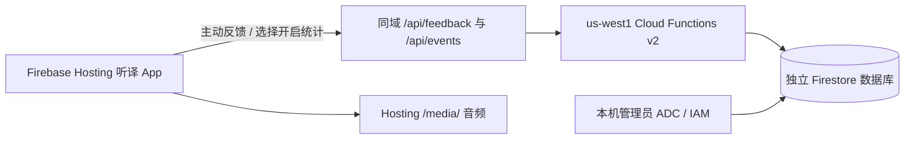

# 中文听译 App：反馈与匿名使用摘要

这个功能帮助维护者发现中文翻译、发音和播放体验问题。它与配音生产、人工试听验收独立；点赞不会让候选音频自动通过审核，使用统计也不能证明现场同步已验收。

## 听众如何使用

播放器下方询问“这份中文听译对你有帮助吗？”，提供“有帮助”“需要改进”与撤回。每个当前页面、每份音频版本保留一个总体评价；不把浏览器会话当成真实人数。点“需要改进”后，可继续选择具体原因，也可以关闭补充窗口，仅保留总体评价。

“反馈这一处”冻结点击瞬间的音频时间、字幕索引和证道块编号。后台根据同版本字幕重新校验时间和块关系。用户可选择翻译、发音、流畅度、音色、同步、音量、播放问题，添加不超过 1000 字符的说明，并选择现场或其他收听场景。每次问题独立保存，不覆盖总体评价或其他时间点的问题。页面提供撤回最近一次问题的入口。

凭据只在当前页面内存中保存，最长有效 24 小时，不放 Cookie、URL、localStorage 或 sessionStorage；复制标签页与刷新会建立独立会话。页面关闭或凭据过期后，旧反馈不能靠一个新会话撤回，仍按保留期限清理，管理员也可处理。网络失败或过期不得显示“已保存/已撤回”。

## 统计默认开启，可随时关闭

按维护者要求，首次访问默认开启统计；用户可在“隐私与匿名统计”中关闭，此前明确关闭的选择仍保留。[使用时间与按钮行为采集](sermon-app-usage.zh.md)继续使用 v2 偏好。开启后浏览器保存每天更换的随机标识，用于当天浏览器去重，不建立跨日回访标识。不启用统计仍可收听、下载和提交反馈。

开启后记录实际播放秒数、已播放区间、播放/暂停、跳转、微调、大纲查看、下载点击以及两种固定播放错误码。每 60 秒、暂停或页面隐藏时批量发送累计摘要；提交序号和数据库事务保证重复或乱序请求不重复计数。关闭统计立即停止采集，随后尝试撤回当前页面已上传的摘要及对应汇总贡献；撤回失败保留累计基线供重试，不把旧摘要误当已删除。

- 播放进度跳到结尾不代表听完。覆盖当前音轨至少 90% 才计入完成会话。
- 重复收听增加收听秒数，不重复增加覆盖区间。分散区间过多或页面长时间挂起时保守少计，不填补未播放部分。
- 下载点击不是下载成功；离线 MP3 播放不可见。
- 浏览器自报数据用于改进体验，不能证明真实人数或防止刻意伪造行为。

## 数据与部署位置



| 资源 | 位置与范围 |
|---|---|
| App 与 MP3 | `ai-for-god-sermon-audio.web.app`，Firebase Hosting 静态文件；本机 `artifacts/sermon-dubbing/` 保留来源成品和发布副本 |
| API | 项目 `ai-for-god-caption-dev`，函数 `sermon-feedback-api`，入口 `sermonFeedback`，区域 `us-west1` |
| 数据库 | `projects/ai-for-god-caption-dev/databases/sermon-dubbing-feedback`，与现有实时字幕 RTDB 独立 |
| 反馈 | `feedback`，最后更新后 365 天过期 |
| 使用摘要 | `listeningSessions`，最后更新后 30 天过期；Firestore 用 `{start,end}` 对象数组保存区间 |
| 操作时间线 | `usageSessions`，操作与可见心跳、每日浏览器哈希，最后更新后 30 天过期；见[行为采集说明](sermon-app-usage.zh.md) |
| 每周汇总 | `weeklyMetrics`，按周次、音轨 ID、音频 SHA-256 分开，长期保留汇总数字 |
| 短期控制记录 | `apiSessions` 24 小时；`feedbackSequences` 到会话到期后 24 小时；`rateLimits` 1–2 天 |
| 运行错误 | Cloud Logging，仅固定错误码；平台常规请求日志可能包含 IP/UA，项目 `_Default` 桶当前保留 30 天 |

过期字段均需配套 Firestore TTL 策略。TTL 为异步清理，不保证到期瞬间删除；到期删除不回减长期汇总，用户主动撤回则回减当前记录的贡献。业务记录不收集姓名、邮箱、IP 或设备指纹；自由文字可能含用户自行填写的信息，因此表单提醒避免联系方式。

普通浏览器不能直接读写 Firestore，数据库安全规则全部拒绝；只有 API 专用运行身份获得该命名库限定的数据权限。构建身份单独授权专用镜像仓库、源码桶对象和构建日志，不复用字幕发布身份，也不依赖默认账号的 Editor 权限。

API 校验来源、JSON 类型/大小、音频允许目录、字段和序号，设定单会话、全局分钟/日创建限额。Origin 检查不能证明真实用户，额外防滥用约束见 [API 合同](../experiments/sermon-dubbing-poc/feedback-api/README.zh.md)。最少实例数 0、最多 2；配额控制不等于账单上限。

## 发布、查看与回退

先按 [配音 App Runbook](../experiments/sermon-dubbing-poc/README.md) 的构建命令增加 `--feedback-enabled`，使用新的 `--out` 目录。构建同时产生公开 `engagement.json` 和不发布到 Hosting 的 `feedback-catalog.json`，后者哈希绑定同一构建报告。

```sh
.venv/bin/python experiments/sermon-dubbing-poc/deploy_feedback.py \
  --release artifacts/sermon-dubbing/NEW_APP_RELEASE \
  --out artifacts/sermon-dubbing/NEW_API_RELEASE --execute

.venv/bin/python experiments/sermon-dubbing-poc/deploy_firebase.py \
  --release artifacts/sermon-dubbing/NEW_APP_RELEASE \
  --project ai-for-god-caption-dev --site ai-for-god-sermon-audio --execute
```

API 必须先部署匹配的音频允许目录，再发布依赖它的页面。每次使用新目录，保留源码清单、构建报告与部署回执。`deploy_feedback.py` 固定目标项目、数据库、区域和两独立身份；没有 `--execute` 时只准备可检查的发布包。首次基础设施需预先创建，不能用脚本缺依赖为由扩大账号权限。

管理员在仓库根目录运行：

```sh
GOOGLE_CLOUD_PROJECT=ai-for-god-caption-dev node experiments/sermon-dubbing-poc/feedback-api/admin.mjs list 2026-08-30
GOOGLE_CLOUD_PROJECT=ai-for-god-caption-dev node experiments/sermon-dubbing-poc/feedback-api/admin.mjs metrics 2026-08-30
GOOGLE_CLOUD_PROJECT=ai-for-god-caption-dev node experiments/sermon-dubbing-poc/feedback-api/admin.mjs status RECORD_ID confirmed
GOOGLE_CLOUD_PROJECT=ai-for-god-caption-dev node experiments/sermon-dubbing-poc/feedback-api/admin.mjs status RECORD_ID fixed AUDIO_VERSION
```

需要本机 ADC/IAM 授权和 API 目录的已安装依赖，不提供公网管理路由。反馈列表一次最多 100 条；输出为私人审阅资料，不能提交 Git 或发布到 App。

关闭功能可重新构建时省略 `--feedback-enabled` 并发布新页面，或重新发布此前已验证的静态版本。回退页面不删除反馈数据库或 MP3。若仅发生 API 故障，播放器仍可使用，反馈明确显示保存失败。

## 验证

前端测试覆盖关闭统计时不采集、序号冲突、过期不伪撤回、撤回失败保留基线、实际收听区间与跳转；API 测试覆盖来源与字段拒绝、限流、赞踩替换、独立问题、统计去重与撤回，并拒绝 Firestore 不支持的嵌套数组。发布还需要真实 API→Firestore 回读、普通访问拒绝、TTL ACTIVE、桌面/窄屏浏览器提交与撤回证据。测试记录应明确标识，并撤回其业务记录与汇总贡献。

设计参考：[Hosting 与 Functions 同域重写](https://firebase.google.com/docs/hosting/functions)、[命名 Firestore 数据库与 IAM](https://firebase.google.com/docs/firestore/manage-databases)、[TTL 清理](https://firebase.google.com/docs/firestore/ttl)、[Cloud Run 请求日志](https://cloud.google.com/run/docs/logging)。

### 2026-09-05 发布验证

已发布 Hosting 包 `2026-09-05-weekly-app-v7-2-feedback` 和 API 修订 `sermon-feedback-api-00002-ziv`。25 个公开文件经 HTTP 下载与构建哈希逐一核对；MP3 与此前 v6 完全一致。五组 TTL 策略已观察为 ACTIVE，匿名 Firestore 直接访问被拒绝。

Chrome 桌面实际提交赞与 00:10 的发音问题；Firestore 回读对应音频、字幕、块编号及 365 天过期字段正确，统计未开启时使用摘要为零。开启后实际播放 19.91 秒、覆盖 19.89 秒，再跳至 29:00；后台只保留两个实际播放区间，完成会话数为零。390 像素窄屏验证了弹窗、改为负面评价、反馈撤回和统计关闭。该验证不代表手机系统后台播放或教会现场验收。

验证中修复了 Firestore 不接受嵌套数组，以及浏览器原生 `fetch` 被错误绑定调用的问题。前端 22 项、API 16 项、发布构建 11 项定向测试通过。HTTP、API 和 GUI 数据回读证据分别保存在本机发布目录和 `2026-09-05-feedback-api-v2` 目录；这些包含操作记录的产物不进入 Git。

测试赞、问题及使用摘要已通过页面撤回，并由 Firestore 回读确认消失；测试产生的零汇总在事务中确认无其他贡献后清理，短期控制记录保留到 TTL 清理。
