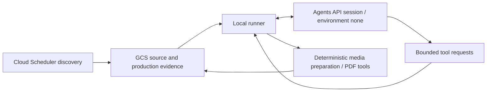

# Sermon Reading-PDF Production Supervisor Agent

Production code is installed and the installed default entry passed real read-only validation. Following explicit user authorization, the installed execute entry passed validation and the weekly heartbeat is ACTIVE. The current production decision is waiting_for_matching_sunday; no generation was attempted. See the [cutover receipt](agents-api-production-cutover-20260911.zh.md).

## Summary

The local runner now integrates **OpenAI Agents API**, with `--agent-backend agents-api` as its default and explicit `--agent-backend sdk` rollback to the existing Agents SDK / Responses path. This document describes the control-plane contract. Real API cases, local scheduling, and real production acceptance have separate evidence; a passing synthetic case does not establish a complete production cutover.

- Cloud Scheduler discovers the source; the local runner drives production. An active Codex schedule must be verified separately.
- Existing Python scripts are the deterministic execution layer; Cloud Run Jobs are retained as a compatibility/rollback path.
- GCS state, run-status, and QA JSON remain the source of truth.
- `Sermon Production Supervisor` reads evidence, selects the next safe action, and calls bounded tools.
- An operator must still confirm the absolute sermon start and end.

The agent does not implement downloading, clipping, transcription, translation, or PDF rendering. It invokes the existing tested and resumable workflow.

## Current operator entry

Use [the local production runbook](./codex-local-production-runbook.zh.md) and `scripts/run_codex_local_sermon_production.py`. Resume from current durable state and reuse valid approval. This document details the state/tool contract; the older Scheduler-to-Cloud-Run topology below is a rollback reference, not the default local execution path.

## Architecture



Agents API maintains the server-side session and control loop with `environment: none`. The local runner executes bounded tool requests and submits results. Downloading, ASR, translation, PDF rendering, QA, and publication remain in the deterministic Python layer. The supervisor now defaults to **`gpt-6-astra` with reasoning effort `medium`**. The model lookup for the former `gpt-5.6` returned HTTP 404 for this account, so it is not retained as an available default. Explicit SDK rollback uses the same Astra Medium model and changes only the control-plane transport. Translation, reading review, and companion generation remain Astra Medium, and ASR remains `gpt-transcribe`.

The local scheduler inspection did not find this production task. Consult the [local runbook](./codex-local-production-runbook.zh.md) for planned scheduling and current verification receipts; use the manual entry until actual scheduling and execution are verified. Cloud Job/Scheduler activation state also needs a live check.

In the retained Cloud Run topology, Cloud Scheduler does not pass one HTTP target's response into another target. That handoff uses durable state instead:

1. the discovery Scheduler job writes the canonical livestream URL to `LIVE_SOURCE_MONITOR_STATE_URI`
2. a separate Supervisor Scheduler job calls the production-supervisor endpoint
3. the endpoint starts the configured Cloud Run Job through the Cloud Run `jobs:run` API
4. the Agent reads the URL and all subsequent evidence from GCS

The polling interval determines when the next handoff can be observed, in addition to scheduling and execution delays. This legacy topology does not establish that a Supervisor schedule is currently enabled.

## Entrypoints

- Agent runner: `scripts/run_sermon_production_supervisor_agent.py`
- Deterministic state/tool contract: `scripts/sermon_production_supervisor.py`
- Source-media preparation (legacy filename): `scripts/run_post_live_timeline_job.py`
- Reading-PDF tool: `scripts/run_post_live_subtitle_generation.py`
- API: `POST /api/admin/sundays/<date>/production-supervisor`

The SDK rollback path retains this bounded Python dependency; it does not implement the Agents API server-side loop:

```text
openai-agents>=0.19.1,<0.20
```

## Modes

`shadow` exposes the read-only business tool `inspect_production_state` and `submit_supervisor_decision` for a structured conclusion. The latter cannot mutate production or establish completion. Use shadow mode to validate decisions without starting jobs.

`execute` additionally exposes:

- `run_timeline_probe` (legacy tool name: download, validate and hash source media; no ASR or boundary model)
- `run_approved_reading_pdf_generation`

Both mutation tools validate durable state before execution. Together with inspection, these are the only three business tools; structured decision submission is separate. The PDF tool reads times only from a valid human approval artifact; it has no model-controlled start/end parameters. No generic shell or approval-writing tool is exposed.

Local shadow example:

```bash
.venv/bin/python scripts/run_sermon_production_supervisor_agent.py \
  --sunday 2026-08-02 \
  --state-file artifacts/live-source-monitor/state.json \
  --work-root artifacts/post-live-runs \
  --gcs-bucket '' \
  --mode shadow
```

## Backend selection and recovery

The following parameters are integrated in the local runner. Check the verification receipts for account access and runtime prerequisites before use:

```bash
# Create a controlled session and persist its state and tool results.
.venv/bin/python scripts/run_codex_local_sermon_production.py \
  --mode shadow --agent-backend agents-api \
  --agent-run-dir artifacts/sermon-production-supervisor/api-shadow

# Resume that same session.
.venv/bin/python scripts/run_codex_local_sermon_production.py \
  --mode shadow --agent-backend agents-api \
  --agent-run-dir artifacts/sermon-production-supervisor/api-shadow \
  --resume-agent-session

# Explicit SDK / Responses rollback.
.venv/bin/python scripts/run_codex_local_sermon_production.py \
  --mode shadow --agent-backend sdk
```

`--agent-run-dir` is optional for a new session; resumption must use its original persistent directory. `--agent-timeout-seconds` defaults to `21600` and bounds the control loop, without forcibly killing an in-flight local tool. `--max-turns` limits tool calls for Agents API and retains the legacy turn limit for SDK.

If session creation has an unknown outcome, stop automatic creation and reconcile the durable record. Pending requests resume the same session. Automatic creation of another session requires a confirmed remote `completed`, `failed`, or `cancelled` state and no executing or unresolved tool call. A local timeout, budget stop, or cancellation ACK alone is insufficient and must not reset the stage-attempt ledger. Persist tool results before submitting them. A stage-attempt ledger prevents repeated production stages even if the model returns a new `call_id`. Timeout, submission failure, and interruption recovery retain source/approval checks, leases, and deterministic tool recovery.

## Manual boundaries and compatibility (2026-09-19)

Automatic model-based sermon-boundary discovery is retired. The source stage emits v2 media evidence (`source_media_verified`, `operator_supplied`, measured duration, audio SHA-256/size, and no models). The operator supplies the start/end times; approval creation and revalidation reject ranges beyond the verified duration. Content transcription and translation remain downstream of approval.

Existing tool/action names, lease keys and approval report-hash fields remain for stored-session compatibility. New media evidence uses `timeline/source-media-report.json`; legacy reports and valid approvals are preserved. The old standalone timeline builders fail with a retirement message, and the old HTTP `timeline-probe` route returns 410. Scheduler no longer offers model discovery configuration. Removing model configuration changes the session binding: automatic creation is blocked while another configuration's prior session or tool remains unresolved. Stop old runners before upgrading. These are local code changes, not a remote deployment receipt.

## Human window approval

After independently reviewing the completed livestream:

```bash
.venv/bin/python scripts/run_sermon_production_supervisor_agent.py \
  --sunday 2026-08-02 \
  --state-file 'gs://sermon-zh-artifacts-ai-for-god/sundays/live-source-monitor/backend-state.json' \
  --work-root /tmp/sermon-post-live-subtitles \
  --gcs-bucket sermon-zh-artifacts-ai-for-god \
  --api-key-secret 'projects/ai-for-god/secrets/openai-api-key/versions/latest' \
  --approve-window \
  --start-time 00:29:35 \
  --end-time 01:00:55 \
  --approved-by 'Jony' \
  --content-scope sermon_only \
  --mode execute
```

The approval binds the Sunday, source URL hash, approved times, approver, and current timeline-report SHA-256. A new source or timeline report invalidates the old approval.

## Legacy Scheduler / Cloud Run integration

These older API/Scheduler parameters do not demonstrate an Agents API integration on this path. For rollback, verify the container version and select the SDK backend explicitly. Configure the API trigger in shadow mode first:

```bash
python3 scripts/configure_live_source_scheduler.py \
  --project ai-for-god \
  --location us-west1 \
  --service-url 'https://sermon-zh-caption-web-...' \
  --job-id sermon-production-supervisor-shadow \
  --action production-supervisor \
  --sunday upcoming \
  --schedule '*/10 18-23 * * SAT' \
  --timezone America/Los_Angeles \
  --supervisor-mode shadow \
  --agent-model gpt-6-astra
```

When inline work is disabled and the following environment variables are configured, the endpoint dispatches a Cloud Run Job instead of executing the long workflow inside the web request:

```text
SERMON_SUPERVISOR_JOB_PROJECT=ai-for-god
SERMON_SUPERVISOR_JOB_LOCATION=us-west1
SERMON_SUPERVISOR_JOB_NAME=sermon-production-supervisor
SERMON_SUPERVISOR_JOB_TIMEOUT_SECONDS=14400
SERMON_SUPERVISOR_MODE=shadow
```

`SERMON_SUPERVISOR_JOB_CONTAINER` is optional and is needed only when the Job has multiple containers or a specifically named container override. The Cloud Run service identity needs `roles/run.developer` on the target Job to execute it with overrides; the Job service account separately needs access to GCS and Secret Manager. The Job container must be configured with `python` as its command; the API supplies the Agent runner and bounded arguments for each execution.

If Scheduler calls the endpoint without a configured Job and inline execution is disabled, the endpoint returns HTTP 503. This makes the missing dispatch visible and retryable instead of silently acknowledging a no-op.

## Completion rule

Use a fresh `snapshot.recommendedAction.action == "complete"` from [the deterministic supervisor](../scripts/sermon_production_supervisor.py). It requires completed generation, passing reading quality and both PDF QA reports, a valid source/timeline-bound human approval, and verified publication when configured. The [local runbook](./codex-local-production-runbook.zh.md#完成标准) describes the deployed delivery contract.

Respect `humanActionRequired` on waiting/blocked states; not every wait needs a new human decision. Inspect again after a mutation. Each mutation stage is attempted at most once per run; keep dependent actions sequential (disable parallel tool calls; SDK uses `parallel_tool_calls=False`) and resume on a later run from durable evidence. Parallelize independent audits, not duplicate production stages.

Partial output or a model's completion statement does not establish completion.

## Verification progress

The following local reports have been checked. Both synthetic cases call the real Agents API while using fixtures for all production state and operations.

| Receipt | Verified scope | Result |
|---|---|---|
| [live-synthetic-01](../artifacts/agents-api-production-development/live-synthetic-01/report.json) | Fully simulated missing-approval state | Session completed; 2 tool calls; no generation call; 0 real production mutations; usage returned |
| [live-synthetic-advance-01](../artifacts/agents-api-production-development/live-synthetic-advance-01/report.json) | Fully simulated approved generation path | Session completed; 4 tool calls; exactly 1 simulated generation call; 0 real production mutations |
| [live-real-shadow-minimal-01](../artifacts/agents-api-production-development/live-real-shadow-minimal-01/report.json) | Read-only inspection of actual production GCS state | Session completed; 2 tool calls; target date `2026-09-13`; `recommendedAction=waiting_for_matching_sunday`; 0 real production mutations |

Session completion means that the control loop ended. The real-state report has production status `observed`, not completed PDF production. These receipts are ignored local artifacts and do not establish that the production entry or schedule has been installed. Production cutover and scheduling receipts remain separate in the [local runbook](./codex-local-production-runbook.zh.md).

## Agents API outbound data boundary

Automatic approval review rejected sending the complete production snapshot to the API. The implementation now uses the fixed `remote_snapshot` allowlist. Apart from a fixed schema identifier, it sends only an ISO date, fixed action/reason enums, and booleans for source/timeline presence, required human action, approval validity, generation completion, QA/publication success, and active stage leases.

URLs, internal paths, configuration, hashes, sermon text, logs, identities, and approval details are excluded. The complete snapshot remains in the local report. `configFingerprint` stays local and checks configuration consistency during recovery. After a mutation, the tool returns only a fixed status enum, an optional integer return code, a fixed stage, and a fresh-inspection flag; subprocess output and commands stay local. A new inspection is required afterward, and a fresh local snapshot still establishes the final production state.

## Safety boundaries

- The agent has no tool that writes human approval.
- Scheduler/API payloads cannot supply sermon start/end to the agent.
- Shadow mode exposes no mutation tools.
- GCS access errors are recorded as `accessIssues`, not treated as missing files.
- The live-source state reader propagates GCS authentication and network failures.
- Once GCS is configured, only GCS evidence can establish production state; local files are execution cache.
- GCS generation preconditions provide one active timeline or PDF-generation lease per Sunday/source.
- The final Agent status is reconciled against a fresh deterministic snapshot; model output alone cannot establish completion.
- Raw secret material is excluded from reports, Agents API session inputs, and local persistence. The SDK rollback path disables sensitive trace data.
- Existing quality gates, caching, and resumability remain authoritative.
- Durable API sessions and stage-attempt records supplement recovery evidence; they do not replace GCS leases, human approval, or a fresh production snapshot.
