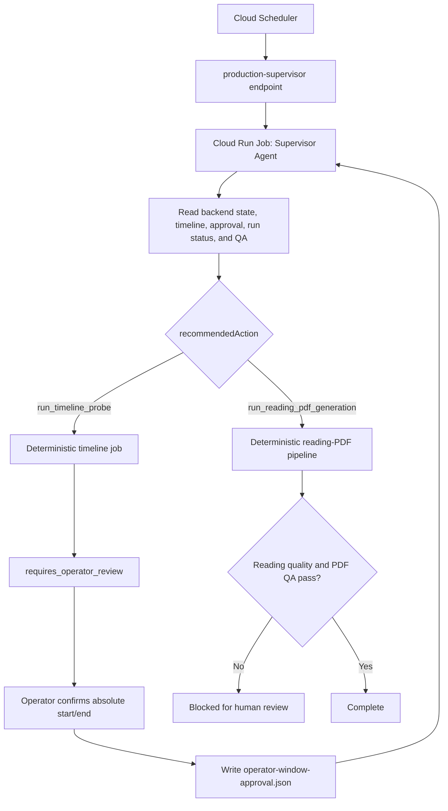

# Sermon Reading-PDF Production Supervisor Agent

## Summary

The post-live reading-PDF workflow now has one OpenAI Agents SDK supervisor:

- Cloud Scheduler still wakes the workflow.
- Existing Python scripts and Cloud Run Jobs remain the deterministic execution layer.
- GCS state, run-status, and QA JSON remain the source of truth.
- `Sermon Production Supervisor` reads evidence, selects the next safe action, and calls bounded tools.
- An operator must still confirm the absolute sermon start and end.

The agent does not implement downloading, clipping, transcription, translation, or PDF rendering. It invokes the existing tested and resumable workflow.

## Architecture



## Entrypoints

- Agent runner: `scripts/run_sermon_production_supervisor_agent.py`
- Deterministic state/tool contract: `scripts/sermon_production_supervisor.py`
- Timeline tool: `scripts/run_post_live_timeline_job.py`
- Reading-PDF tool: `scripts/run_post_live_subtitle_generation.py`
- API: `POST /api/admin/sundays/<date>/production-supervisor`

The Python dependency is bounded to:

```text
openai-agents>=0.19.1,<0.20
```

## Modes

`shadow` exposes only the read-only `inspect_production_state` tool. Use it to validate decisions without starting jobs.

`execute` additionally exposes:

- `run_timeline_probe`
- `run_approved_reading_pdf_generation`

Both mutation tools validate durable state before execution. The PDF tool reads times only from a valid human approval artifact; it has no model-controlled start/end parameters.

Local shadow example:

```bash
.venv/bin/python scripts/run_sermon_production_supervisor_agent.py \
  --sunday 2026-08-02 \
  --state-file artifacts/live-source-monitor/state.json \
  --work-root artifacts/post-live-runs \
  --gcs-bucket '' \
  --mode shadow
```

## Human window approval

After independently reviewing the completed livestream:

```bash
.venv/bin/python scripts/run_sermon_production_supervisor_agent.py \
  --sunday 2026-08-02 \
  --state-file 'gs://sermon-zh-artifacts-ai-for-god/sundays/live-source-monitor/backend-state.json' \
  --work-root /tmp/sermon-post-live-subtitles \
  --gcs-bucket sermon-zh-artifacts-ai-for-god \
  --api-key-secret 'projects/ai-for-god/secrets/openai-api-key/versions/latest' \
  --approve-window \
  --start-time 00:29:35 \
  --end-time 01:00:55 \
  --approved-by 'Jony' \
  --mode execute
```

The approval binds the Sunday, source URL hash, approved times, approver, and current timeline-report SHA-256. A new source or timeline report invalidates the old approval.

## Scheduler integration

Configure the API trigger in shadow mode first:

```bash
python3 scripts/configure_live_source_scheduler.py \
  --project ai-for-god \
  --location us-west1 \
  --service-url 'https://sermon-zh-caption-web-...' \
  --job-id sermon-production-supervisor-shadow \
  --action production-supervisor \
  --sunday upcoming \
  --schedule '*/10 18-23 * * SAT' \
  --timezone America/Los_Angeles \
  --supervisor-mode shadow \
  --agent-model gpt-5.6
```

When inline work is disabled, the endpoint returns a validated command for a Cloud Run Job instead of executing the long workflow inside the web request.

## Completion rule

The agent may return `complete` only when:

- the generation report is `completed`
- `reading-edition-v2/reading_quality_report.json` is `pass`
- `sermon_zh_en_reading.qa.json` is `pass`

Partial ASR, a standalone PDF file, or model judgment is not completion.

## Safety boundaries

- The agent has no tool that writes human approval.
- Scheduler/API payloads cannot supply sermon start/end to the agent.
- Shadow mode exposes no mutation tools.
- GCS access errors are recorded as `accessIssues`, not treated as missing files.
- Raw secret material is excluded from reports and sensitive trace data is disabled.
- Existing quality gates, caching, and resumability remain authoritative.
