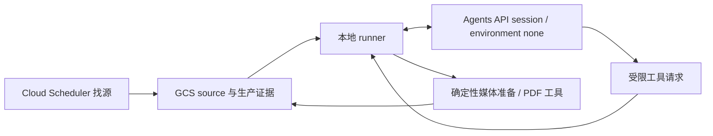

# 证道阅读版生产 Supervisor Agent

2026-09-11 安装与验收状态见 [Agents API 生产切换记录](agents-api-production-cutover-20260911.zh.md)：代码已安装，正式入口 shadow/execute 验收通过，每周调度已启用；当前等待目标周日匹配源。

## 结论

控制层已接入 **OpenAI Agents API**，本地 runner 默认值为 `--agent-backend agents-api`，原 OpenAI Agents SDK / Responses 路径保留为显式 `--agent-backend sdk` 回退。以下描述当前控制层契约；真实 API 用例、本机定时接入和真实生产验收分别记录。已通过的合成用例不等于完整生产切换。

- Cloud Scheduler 只负责轻量直播找源
- 本地 runner 负责推进生产 Supervisor；是否已有有效 Codex 定时任务以本机核验和 runbook 回执为准
- 现有 Python 脚本在本地负责确定性执行
- GCS state、run-status 和 QA JSON 仍是事实来源
- `Sermon Production Supervisor` 负责读取状态、选择下一步和调用受限工具
- operator 仍然必须人工确认证道开始和结束时间

Agent 不直接下载、裁剪、转录、翻译或渲染 PDF。它只能调用现有的、可测试和可恢复的工具层。

## 架构



Agents API 在服务端保存 session 并驱动控制循环，使用 `environment: none`；本地 runner 执行批准暴露的工具并提交结果。原有下载、ASR、翻译、PDF 渲染、QA 和发布仍在确定性 Python 层。Supervisor 默认模型改为 **`gpt-6-astra`，reasoning effort `medium`**；本账户查询旧 `gpt-5.6` 模型返回 404，不能把它作为可用默认值。显式 SDK 回退也使用同一 Astra Medium 模型，只切换控制层 transport。实际翻译/阅读审核/证道同行保持 Astra Medium，ASR 保持 `gpt-transcribe`。

Cloud Scheduler 不会把一个 HTTP target 的返回结果自动传给另一个 target。自动交接通过持久状态完成：

1. discovery Scheduler 把 canonical 直播链接写入 `LIVE_SOURCE_MONITOR_STATE_URI`
2. 手动或经核验的本地定时入口运行 `run_codex_local_sermon_production.py`
3. 本地 Supervisor Agent 从 GCS 读取直播链接以及后续 timeline、审批和 QA 证据
4. 本地确定性脚本完成下载、timeline、转写、阅读编辑、PDF 和 GCS 上传

因此 Scheduler 不需要保存或解析 discovery HTTP response。GCS state 是云端找源与本地生产之间唯一的交接契约。

## 代码入口

- Agent runner：`scripts/run_sermon_production_supervisor_agent.py`
- 确定性工具与状态契约：`scripts/sermon_production_supervisor.py`
- 来源媒体准备工具（保留历史文件名）：`scripts/run_post_live_timeline_job.py`
- 阅读版生成工具：`scripts/run_post_live_subtitle_generation.py`
- API 入口：`POST /api/admin/sundays/<date>/production-supervisor`

兼容回退路径仍保留以下 Python 依赖；它不是 Agents API 服务端控制循环：

```text
openai-agents>=0.19.1,<0.20
```

## 两种运行模式

### Shadow

Shadow 模式只暴露一个业务工具 `inspect_production_state`，另有 `submit_supervisor_decision` 提交结构化结论；结论工具不能执行生产动作或建立完成状态。

Agent 可以：

- 读取当前 production snapshot
- 解释 blocker
- 给出建议动作

Agent 不能：

- 启动来源媒体准备 job
- 启动 PDF generation
- 写人工审批

本地示例：

```bash
.venv/bin/python scripts/run_sermon_production_supervisor_agent.py \
  --sunday 2026-08-02 \
  --state-file artifacts/live-source-monitor/state.json \
  --work-root artifacts/post-live-runs \
  --gcs-bucket '' \
  --mode shadow \
  --out artifacts/sermon-production-supervisor/2026-08-02-shadow.json
```

### Execute

Execute 模式另外暴露两个受限工具：

- `run_timeline_probe`：保留历史工具名，现只下载、核验媒体和记录时长／哈希，不调用 ASR 或边界分类模型。
- `run_approved_reading_pdf_generation`

这两个工具内部仍会验证当前状态。加上 `inspect_production_state`，业务工具共三个；`submit_supervisor_decision` 只提交结构化结论。Agent 不能通过 prompt 强迫工具跳过状态门禁，也没有通用 shell 或写审批工具。

### 后端选择与恢复

本地入口默认使用 Agents API。以下参数已接入 runner；执行前仍需按验证回执核对账户与运行条件：

```bash
# 新建受控 session；目录内保存 session 状态、工具请求与结果。
.venv/bin/python scripts/run_codex_local_sermon_production.py \
  --mode shadow --agent-backend agents-api \
  --agent-run-dir artifacts/sermon-production-supervisor/api-shadow

# 恢复同一个 session，不重复创建或重跑已记录的阶段。
.venv/bin/python scripts/run_codex_local_sermon_production.py \
  --mode shadow --agent-backend agents-api \
  --agent-run-dir artifacts/sermon-production-supervisor/api-shadow \
  --resume-agent-session

# 显式切回既有 SDK / Responses 控制层。
.venv/bin/python scripts/run_codex_local_sermon_production.py \
  --mode shadow --agent-backend sdk
```

`--agent-run-dir` 可省略，由 runner 选择本地持久目录；恢复时必须指向原会话目录。`--agent-timeout-seconds` 默认 `21600`，是控制循环的时间边界，不会强杀正在执行的本地工具。`--max-turns` 在 Agents API 后端约束工具调用次数，在 SDK 后端保留原有 turn 限制。

Session 创建结果不明时停止自动创建，先核对持久记录；pending 请求继续原 session。只有远端 `completed` / `failed` / `cancelled` 已被确认，且不存在 executing 或结果未确认的工具调用时，才能自动创建新会话。本地 timeout、预算停止或取消请求的 ACK 均不能单独满足这一条件，也不能重置阶段尝试记录。工具结果先持久化，再提交服务端；阶段尝试记录避免同一阶段因重试或新 `call_id` 重复运行。超时、结果提交失败或中断后的恢复不能绕过 source/approval 校验、lease 与工具自身恢复机制。

本地生产入口会自动选择当前或下一个 Sunday，并把工作目录保存在仓库忽略的 `artifacts/` 下：

```bash
.venv/bin/python scripts/run_codex_local_sermon_production.py --mode execute
```

公开 YouTube 回放默认不使用 cookies。只有出现下载授权问题时，operator 才应显式提供授权导出的 Netscape `cookies.txt`：

```bash
SERMON_YOUTUBE_COOKIES_FILE=/absolute/path/youtube.cookies.txt \
  .venv/bin/python scripts/run_codex_local_sermon_production.py --mode execute
```

脚本不会把 cookie 内容或本地 cookie 路径写入公开报告。

生产示例：

```bash
.venv/bin/python scripts/run_sermon_production_supervisor_agent.py \
  --sunday 2026-08-02 \
  --state-file 'gs://sermon-zh-artifacts-ai-for-god/sundays/live-source-monitor/backend-state.json' \
  --work-root /tmp/sermon-post-live-subtitles \
  --gcs-bucket sermon-zh-artifacts-ai-for-god \
  --gcs-prefix sundays \
  --api-key-secret 'projects/ai-for-god/secrets/openai-api-key/versions/latest' \
  --youtube-api-key-secret 'projects/ai-for-god/secrets/youtube-api-key/versions/latest' \
  --mode execute \
  --out /tmp/sermon-post-live-subtitles/2026-08-02/production-supervisor-report.json
```

## 人工时间窗审批

2026-09-19 起，不再生成机器建议范围。操作员直接提供绝对起止时间；媒体准备报告 v2 记录实测时长、音频哈希及 `boundaryMethod=operator_supplied`。写入和恢复审批时检查范围未超出完整音频。旧报告和仍有效的审批保持兼容，字段及工具的旧名称仅用于恢复；详见[本地 runbook 的迁移说明](codex-local-production-runbook.zh.md#人工范围流程2026-09-19-代码更新)。

operator 独立观看完整录像后，使用同一个 runner 写审批：

```bash
.venv/bin/python scripts/run_sermon_production_supervisor_agent.py \
  --sunday 2026-08-02 \
  --state-file 'gs://sermon-zh-artifacts-ai-for-god/sundays/live-source-monitor/backend-state.json' \
  --work-root /tmp/sermon-post-live-subtitles \
  --gcs-bucket sermon-zh-artifacts-ai-for-god \
  --api-key-secret 'projects/ai-for-god/secrets/openai-api-key/versions/latest' \
  --approve-window \
  --start-time 00:29:35 \
  --end-time 01:00:55 \
  --approved-by 'Jony' \
  --content-scope sermon_only \
  --approval-note '独立观看完整录像后确认' \
  --mode execute
```

审批文件同时绑定：

- Sunday 日期
- canonical source URL hash
- start/end time
- operator identity
- 当前 timeline report SHA-256

如果 source 或 timeline report 改变，旧审批自动失效。Agent 工具不接受模型提供的 start/end 参数，只能读取有效的审批文件。

## 状态决策

| 当前证据 | Supervisor 动作 |
|---|---|
| 没有 persisted URL | `wait_for_source` |
| 有 URL、没有来源媒体证据（旧 timeline report 路径） | `run_timeline_probe` |
| 直播还未结束 | `waiting_for_post_live` |
| 云端下载授权失败 | `operator_download_handoff` |
| 媒体已核验、没有人工范围审批 | `request_window_approval` |
| 有有效审批 | `run_reading_pdf_generation` |
| 阅读质量或 PDF QA 失败 | `review_quality_failure` |
| GCS artifact 无法读取 | `restore_artifact_access` |
| 新读取的确定性 `recommendedAction.action` 为 `complete`（含有效审批、三项 QA 及配置发布证据） | `complete` |

`accessIssues` 与 “artifact missing” 分开记录。网络、凭据或 IAM 错误不会被误判为“尚未生成”。

## Codex 本地定时接入

2026-09-11 的初次检查未找到历史定时任务；同日后续已创建并回读核验 `pdf-context-pack`，回执和计划时段见 [本地 runbook](./codex-local-production-runbook.zh.md)。判断当前调度健康时重新读取任务及执行记录；不要据旧观察重复创建任务。手动入口用于明确请求的运行或恢复。每次运行只推进当前状态允许的阶段：

- 直播未结束：安全退出，等待下一次运行
- 可以下载：取得 GCS lease 后准备并核验来源媒体
- 媒体已核验：停止并通知 operator 提供范围
- 已存在有效人工审批：运行双 PDF pipeline
- QA 通过：执行配置发布并核验，再读取确定性完成状态

Cloud Run Job 和 post-live Cloud Scheduler 保留为兼容回退参考；其当前启停状态需单独查询。文档中的本地路径选择不证明云端已暂停或本地生产已通过。

## 旧 Cloud Scheduler / API 接入

下面的 Cloud Run Supervisor 方式保留为兼容回退参考。所示旧 API/Scheduler 参数没有证明 Agents API 已接入该路径；回滚时应核对容器版本并显式选择 SDK 后端。

Scheduler 配置脚本支持 `production-supervisor`：

```bash
python3 scripts/configure_live_source_scheduler.py \
  --project ai-for-god \
  --location us-west1 \
  --service-url 'https://sermon-zh-caption-web-...' \
  --job-id sermon-production-supervisor-shadow \
  --action production-supervisor \
  --sunday upcoming \
  --schedule '*/10 18-23 * * SAT' \
  --timezone America/Los_Angeles \
  --supervisor-mode shadow \
  --agent-model gpt-6-astra
```

对应 endpoint：

```text
POST /api/admin/sundays/upcoming/production-supervisor
```

建议生产部署先运行 shadow mode。验证多周决策与人工 operator 判断一致后，再把 Scheduler payload 改为：

```json
{
  "mode": "execute",
  "model": "gpt-6-astra",
  "maxTurns": 8
}
```

当 `ENABLE_INLINE_WORKER` 关闭且配置以下环境变量后，API 会异步启动 Cloud Run Job：

```text
SERMON_SUPERVISOR_JOB_PROJECT=ai-for-god
SERMON_SUPERVISOR_JOB_LOCATION=us-west1
SERMON_SUPERVISOR_JOB_NAME=sermon-production-supervisor
SERMON_SUPERVISOR_JOB_TIMEOUT_SECONDS=14400
SERMON_SUPERVISOR_MODE=shadow
```

`SERMON_SUPERVISOR_JOB_CONTAINER` 是可选项，只有 Job 使用多个 container 或需要指定具名 container override 时才配置。Cloud Run Web Service 的 service identity 需要在目标 Job 上具有 `roles/run.developer`（使用 overrides 执行 Job）；Job 自己的 service account 仍需分别具备读取 GCS 与 Secret Manager 的权限。Job container 应把 `python` 配置为 command；每次执行所需的 Agent runner 和受限参数由 API 提供。

如果 Scheduler 调用 endpoint 时 Job 未配置，且 inline worker 关闭，endpoint 返回 HTTP 503，使缺失配置能够进入 Scheduler retry/告警，而不是返回一个不会被执行的 command。

## 完成标准

以 [确定性 Supervisor](../scripts/sermon_production_supervisor.py) 新读取的 `snapshot.recommendedAction.action == "complete"` 为准：generation completed、阅读质量及两个 PDF QA pass、source/timeline 绑定的人工审批有效，且配置发布时已有核验通过的 publication。实际部署交付要求见 [本地 runbook](./codex-local-production-runbook.zh.md#完成标准)。

等待/阻塞是否需要用户决定按 `humanActionRequired` 判断，不把所有等待都升级为重复确认。修改后重新读取状态；同一生产阶段每轮至多执行一次，依赖阶段保持串行与 lease 保护（禁用并行工具调用；SDK 配置为 `parallel_tool_calls=False`）。独立审核可以并行；已完成阶段凭有效证据复用。部分产物或模型口头判断不代表完成。

## 验证进度

以下本机报告已逐项核验；合成用例使用真实 Agents API，但生产状态与操作均为 fixture。

| 回执 | 实际验证范围 | 结果 |
|---|---|---|
| [live-synthetic-01](../artifacts/agents-api-production-development/live-synthetic-01/report.json) | 全模拟缺审批状态 | Session completed，2 次工具调用，未调用生成，真实生产变更 0；返回 usage |
| [live-synthetic-advance-01](../artifacts/agents-api-production-development/live-synthetic-advance-01/report.json) | 全模拟有效审批与生成推进 | Session completed，4 次工具调用，模拟 generation 恰好执行 1 次，真实生产变更 0 |
| [live-real-shadow-minimal-01](../artifacts/agents-api-production-development/live-real-shadow-minimal-01/report.json) | 实际生产 GCS 状态的只读检查 | Session completed，2 次工具调用；目标日期 `2026-09-13`，`recommendedAction=waiting_for_matching_sunday`，真实生产变更 0 |

这里的 session completed 仅表示控制循环结束；第三项报告的生产状态为 `observed`，并非 PDF 生产完成。这些回执是仓库忽略的本机产物，不能单独证明生产入口或定时任务已安装。完整生产切换与调度回执仍由 [本地 runbook](./codex-local-production-runbook.zh.md) 单独记录。

## Agents API 出站数据边界

自动审批曾拒绝向 API 发送完整 production snapshot；当前改为 `remote_snapshot` 固定 allowlist。除固定 schema 标识外，只发送 ISO 日期、固定 action/reason enum，以及 source/timeline 是否存在、是否需要人工动作、审批是否有效、生成是否完成、QA/发布是否通过、阶段 lease 是否活动等布尔值。

不发送 URL、内部路径、配置、hash、证道原文、日志、身份或审批详情。完整 snapshot 仅保留在本地报告；`configFingerprint` 仅在本地用于检查恢复时的配置一致性。Mutation 工具完成后仅回传固定枚举 status、可选整数 return code、固定 stage 和需要重新检查的布尔标记，不回传子进程输出或命令。模型随后必须重新调用检查工具，最终完成仍由本地新读取的 snapshot 判定。

## 安全边界

- Agent 没有工具可以写人工审批。
- API/Scheduler 入口不能传 `startTime` 或 `endTime` 给 Agent。
- Secret resource name 只进入受控命令；raw secret 不进入报告。
- SDK 回退路径的 OpenAI trace 设置 `trace_include_sensitive_data=False`；Agents API session 输入和本地持久记录也不得包含 raw secret。
- Mutation tools 在 shadow mode 完全不暴露。
- GCS、网络或认证读取失败会 fail closed。
- 顶层直播 state 的 GCS 认证或网络错误不会再伪装成“没有直播链接”。
- 配置 GCS 后，只有 GCS 证据可以建立生产状态；本地文件只是当前 execution 的 cache。
- Timeline 和 PDF generation 使用带 generation precondition 的 GCS lease，避免 Scheduler 重试或重叠调用重复启动昂贵任务。
- Agent 返回后会重新读取确定性 snapshot；模型输出本身不能建立 `complete`。
- 原有 QA 门禁、缓存和可恢复状态不因 Agent 接入而改变。
- Agents API 持久 session 和阶段尝试记录补充恢复证据，不能代替 GCS lease、人工审批或新读取的 production snapshot。
