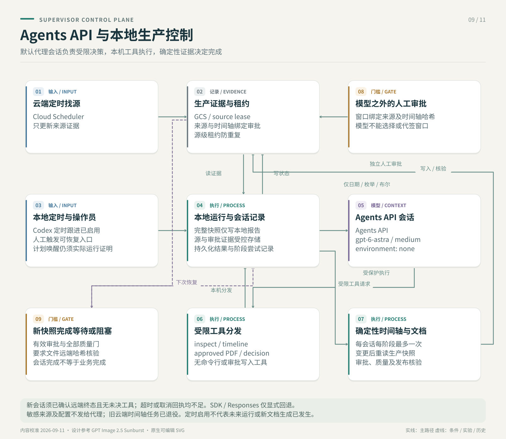

# 证道阅读版生产 Supervisor Agent

## 结论

当前 post-live 阅读版 PDF 流程已经由一个单一的 OpenAI Agents SDK Agent 负责跨阶段监管：

- Cloud Scheduler 只负责轻量直播找源
- Codex 本地 cron 负责唤醒生产 Supervisor
- 现有 Python 脚本在本地负责确定性执行
- GCS state、run-status 和 QA JSON 仍是事实来源
- `Sermon Production Supervisor` 负责读取状态、选择下一步和调用受限工具
- operator 仍然必须人工确认证道开始和结束时间

Agent 不直接下载、裁剪、转录、翻译或渲染 PDF。它只能调用现有的、可测试和可恢复的工具层。

## 架构



Cloud Scheduler 不会把一个 HTTP target 的返回结果自动传给另一个 target。自动交接通过持久状态完成：

1. discovery Scheduler 把 canonical 直播链接写入 `LIVE_SOURCE_MONITOR_STATE_URI`
2. Codex 本地 cron 定时运行 `run_codex_local_sermon_production.py`
3. 本地 Supervisor Agent 从 GCS 读取直播链接以及后续 timeline、审批和 QA 证据
4. 本地确定性脚本完成下载、timeline、转写、阅读编辑、PDF 和 GCS 上传

因此 Scheduler 不需要保存或解析 discovery HTTP response。GCS state 是云端找源与本地生产之间唯一的交接契约。

## 代码入口

- Agent runner：`scripts/run_sermon_production_supervisor_agent.py`
- 确定性工具与状态契约：`scripts/sermon_production_supervisor.py`
- Timeline 工具：`scripts/run_post_live_timeline_job.py`
- 阅读版生成工具：`scripts/run_post_live_subtitle_generation.py`
- API 入口：`POST /api/admin/sundays/<date>/production-supervisor`

Python 依赖固定为：

```text
openai-agents>=0.19.1,<0.20
```

## 两种运行模式

### Shadow

Shadow 模式只向 Agent 暴露 `inspect_production_state`。

Agent 可以：

- 读取当前 production snapshot
- 解释 blocker
- 给出建议动作

Agent 不能：

- 启动 timeline job
- 启动 PDF generation
- 写人工审批

本地示例：

```bash
.venv/bin/python scripts/run_sermon_production_supervisor_agent.py \
  --sunday 2026-08-02 \
  --state-file artifacts/live-source-monitor/state.json \
  --work-root artifacts/post-live-runs \
  --gcs-bucket '' \
  --mode shadow \
  --out artifacts/sermon-production-supervisor/2026-08-02-shadow.json
```

### Execute

Execute 模式另外暴露两个受限工具：

- `run_timeline_probe`
- `run_approved_reading_pdf_generation`

这两个工具内部仍会验证当前状态。Agent 不能通过 prompt 强迫工具跳过状态门禁。

本地生产入口会自动选择当前或下一个 Sunday，并把工作目录保存在仓库忽略的 `artifacts/` 下：

```bash
.venv/bin/python scripts/run_codex_local_sermon_production.py --mode execute
```

公开 YouTube 回放默认不使用 cookies。只有出现下载授权问题时，operator 才应显式提供授权导出的 Netscape `cookies.txt`：

```bash
SERMON_YOUTUBE_COOKIES_FILE=/absolute/path/youtube.cookies.txt \
  .venv/bin/python scripts/run_codex_local_sermon_production.py --mode execute
```

脚本不会把 cookie 内容或本地 cookie 路径写入公开报告。

生产示例：

```bash
.venv/bin/python scripts/run_sermon_production_supervisor_agent.py \
  --sunday 2026-08-02 \
  --state-file 'gs://sermon-zh-artifacts-ai-for-god/sundays/live-source-monitor/backend-state.json' \
  --work-root /tmp/sermon-post-live-subtitles \
  --gcs-bucket sermon-zh-artifacts-ai-for-god \
  --gcs-prefix sundays \
  --api-key-secret 'projects/ai-for-god/secrets/openai-api-key/versions/latest' \
  --youtube-api-key-secret 'projects/ai-for-god/secrets/youtube-api-key/versions/latest' \
  --mode execute \
  --out /tmp/sermon-post-live-subtitles/2026-08-02/production-supervisor-report.json
```

## 人工时间窗审批

机器生成的 `suggestedWindow` 不能直接进入 PDF pipeline。

operator 独立观看完整录像后，使用同一个 runner 写审批：

```bash
.venv/bin/python scripts/run_sermon_production_supervisor_agent.py \
  --sunday 2026-08-02 \
  --state-file 'gs://sermon-zh-artifacts-ai-for-god/sundays/live-source-monitor/backend-state.json' \
  --work-root /tmp/sermon-post-live-subtitles \
  --gcs-bucket sermon-zh-artifacts-ai-for-god \
  --api-key-secret 'projects/ai-for-god/secrets/openai-api-key/versions/latest' \
  --approve-window \
  --start-time 00:29:35 \
  --end-time 01:00:55 \
  --approved-by 'Jony' \
  --approval-note '独立观看完整录像后确认' \
  --mode execute
```

审批文件同时绑定：

- Sunday 日期
- canonical source URL hash
- start/end time
- operator identity
- 当前 timeline report SHA-256

如果 source 或 timeline report 改变，旧审批自动失效。Agent 工具不接受模型提供的 start/end 参数，只能读取有效的审批文件。

## 状态决策

| 当前证据 | Supervisor 动作 |
|---|---|
| 没有 persisted URL | `wait_for_source` |
| 有 URL、没有 timeline report | `run_timeline_probe` |
| 直播还未结束 | `waiting_for_post_live` |
| 云端下载授权失败 | `operator_download_handoff` |
| Timeline 待审核、没有有效审批 | `request_window_approval` |
| 有有效审批 | `run_reading_pdf_generation` |
| 阅读质量或 PDF QA 失败 | `review_quality_failure` |
| GCS artifact 无法读取 | `restore_artifact_access` |
| Generation completed，阅读质量和两个 PDF QA 都 pass | `complete` |

`accessIssues` 与 “artifact missing” 分开记录。网络、凭据或 IAM 错误不会被误判为“尚未生成”。

## Codex 本地定时接入

生产定时任务使用 Codex 项目 cron，工作目录固定为本仓库。每次运行只推进当前状态允许的一步：

- 直播未结束：安全退出，等待下一次运行
- 可以下载：取得 GCS lease 后运行 timeline
- timeline 待确认：停止并通知 operator
- 已存在有效人工审批：运行双 PDF pipeline
- QA 通过：上传 GCS 并标记完成

Cloud Run Job 和 post-live Cloud Scheduler 在本地生产验证后暂停，保留短期回滚，不再作为主执行路径。

## 旧 Cloud Scheduler / API 接入

下面的 Cloud Run Supervisor 方式保留为回滚参考，不是当前推荐的主生产路径。

Scheduler 配置脚本支持 `production-supervisor`：

```bash
python3 scripts/configure_live_source_scheduler.py \
  --project ai-for-god \
  --location us-west1 \
  --service-url 'https://sermon-zh-caption-web-...' \
  --job-id sermon-production-supervisor-shadow \
  --action production-supervisor \
  --sunday upcoming \
  --schedule '*/10 18-23 * * SAT' \
  --timezone America/Los_Angeles \
  --supervisor-mode shadow \
  --agent-model gpt-5.6
```

对应 endpoint：

```text
POST /api/admin/sundays/upcoming/production-supervisor
```

建议生产部署先运行 shadow mode。验证多周决策与人工 operator 判断一致后，再把 Scheduler payload 改为：

```json
{
  "mode": "execute",
  "model": "gpt-5.6",
  "maxTurns": 8
}
```

当 `ENABLE_INLINE_WORKER` 关闭且配置以下环境变量后，API 会异步启动 Cloud Run Job：

```text
SERMON_SUPERVISOR_JOB_PROJECT=ai-for-god
SERMON_SUPERVISOR_JOB_LOCATION=us-west1
SERMON_SUPERVISOR_JOB_NAME=sermon-production-supervisor
SERMON_SUPERVISOR_JOB_TIMEOUT_SECONDS=14400
SERMON_SUPERVISOR_MODE=shadow
```

`SERMON_SUPERVISOR_JOB_CONTAINER` 是可选项，只有 Job 使用多个 container 或需要指定具名 container override 时才配置。Cloud Run Web Service 的 service identity 需要在目标 Job 上具有 `roles/run.developer`（使用 overrides 执行 Job）；Job 自己的 service account 仍需分别具备读取 GCS 与 Secret Manager 的权限。Job container 应把 `python` 配置为 command；每次执行所需的 Agent runner 和受限参数由 API 提供。

如果 Scheduler 调用 endpoint 时 Job 未配置，且 inline worker 关闭，endpoint 返回 HTTP 503，使缺失配置能够进入 Scheduler retry/告警，而不是返回一个不会被执行的 command。

## 完成标准

Agent 只能在以下证据同时成立时返回 `complete`：

- generation report 的 `status = completed`
- `reading-edition-v2/reading_quality_report.json` 为 `pass`
- `sermon_zh_en_reading.qa.json` 为 `pass`
- `sermon_interpretation_zh.qa.json` 为 `pass`

部分转录、PDF 文件单独存在或模型口头判断都不能代表生产完成。

## 安全边界

- Agent 没有工具可以写人工审批。
- API/Scheduler 入口不能传 `startTime` 或 `endTime` 给 Agent。
- Secret resource name 只进入受控命令；raw secret 不进入报告。
- OpenAI trace 设置 `trace_include_sensitive_data=False`。
- Mutation tools 在 shadow mode 完全不暴露。
- GCS、网络或认证读取失败会 fail closed。
- 顶层直播 state 的 GCS 认证或网络错误不会再伪装成“没有直播链接”。
- 配置 GCS 后，只有 GCS 证据可以建立生产状态；本地文件只是当前 execution 的 cache。
- Timeline 和 PDF generation 使用带 generation precondition 的 GCS lease，避免 Scheduler 重试或重叠调用重复启动昂贵任务。
- Agent 返回后会重新读取确定性 snapshot；模型输出本身不能建立 `complete`。
- 原有 QA 门禁、缓存和可恢复状态不因 Agent 接入而改变。
