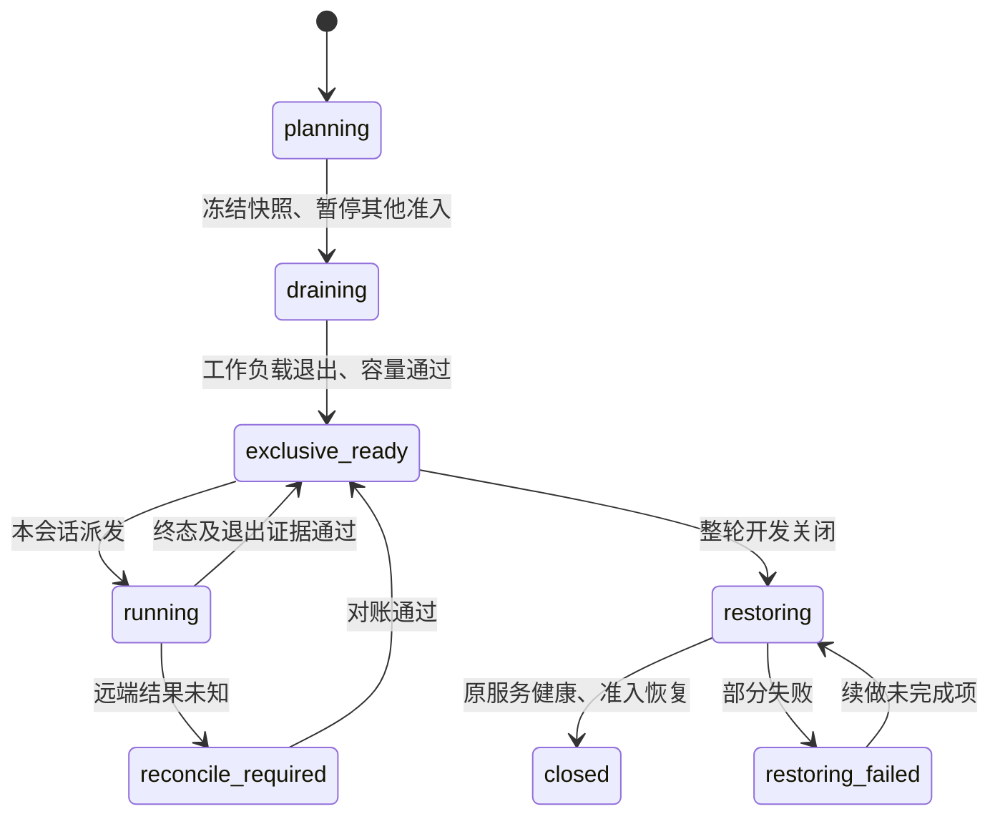

# Spark 整轮开发独占会话设计

状态：设计，尚未接入或部署。2026-10-05 只读调查；没有停止、删除或恢复任何远端服务。用于页面实际制作及真实模型测试，独占窗口跨越多次测试和返修，整轮开发结束时才恢复原服务。纯离线单元测试不需要占用 Spark。

## 当前发现

核验主机 `achillesjing@192.168.1.152`：Docker 所有容器均已停止，但 GPU 上仍有 `llama-server.service` 的 llama-server 进程，报告 35,695 MiB（约 34.9 GiB）。主机 MemAvailable 为 76,301,090,816 bytes（约 71.1 GiB）。这些是调查时刻的读数，不是未来开跑保证。

`llama-server.service` 与 `llama-performance-collector.service` 的 Restart 为 always；`spark-agent.service` 和 `spark-api.service` 为 on-failure。只处理 Docker 不能释放这部分内存；应经服务管理入口停止模型，并阻止调度器重新派发。

Spark Agent 工作目录为 `/home/achillesjing/spark-agent-current`，存在 `resource_control` 的 admission、lease、ownership 和 cleanup 代码；`scheduler_entry.py` 标注 offline deployment。当前检查未证明 guardian 和 hooks 已生效，后续核对实际入口再决定复用。本仓库音频 wrapper 的锁仅保护指定 broker 下的音频 job，不能阻止其他仓库、常驻服务或直接启动的进程。

## 最小实现

在 Spark 上设主机级固定路径的账本和 owner 锁，例如 `/home/achillesjing/.local/state/tongxing-spark-exclusive`。同一 developmentSessionId 绑定多次 runId，不按 run 各建独占目录。begin 在事务锁内持久化 active session；后续命令逐次核验 sessionId、owner 和 revision，不依赖 SSH 连接持续打开。运行级 GPU 锁仍保留。

拟实现 `scripts/spark_exclusive_session.py` 的 inspect、begin、status、finish、reconcile 子命令；该脚本尚不存在，本文不是可执行 runbook。控制目标由明确的 model service、container 和 scheduler adapter 清单限定。

| 阶段 | 行为及验收 |
|---|---|
| 暂停准入 | 优先接入已实际部署的 guardian；否则给 Spark Agent 增加维护模式，拒绝其他会话派发，允许本会话作业，保留只读控制 API。维护状态未证明生效不能报告 ready。直接 SSH、其他调度器逐项标明是否受管，首版不宣称能防止管理员绕过 |
| 保存恢复快照 | 记录原先运行的目标服务／容器、完整 container ID、image ID、autoRemove、restart policy、unit 身份、任务计数和内存读数。只保存必要字段与配置 hash，不保存环境变量、凭据或完整 docker inspect。每项修改前写 intent，之后写 readback |
| 排空任务 | 暂停新派发，等待既有任务及实际子进程退出；不取消已有制作。未知远端执行、仍活动的 worker 或身份不明的 GPU 进程使状态保留 draining。没有 drain adapter 时，只允许经核验 idle 的机器继续 |
| 释放常驻模型 | 当前候选是先停 collector，再通过 systemd 停 llama-server。运行容器按冻结 ID 优雅停止，保留镜像、权重、卷和缓存。autoRemove／一次性容器不能保证原样恢复，先解决可恢复性再纳入操作。调度服务若必须停止，只处理已核验 idle 的受管 launcher |
| 核验容量 | 目标 unit／容器已停，竞争 GPU PID 已退出，MemAvailable 连续稳定并达到本轮 minimumAvailableGiB。阈值依据 8×8 TTS／ASR 实测峰值加余量配置，目前不编造固定安全值。GPU 内存总量为 N/A 时不能当成零占用 |
| 保持整轮独占 | fresh source/MFA、TTS、回转写和后续 renderer 均核验 session token，worker 带归属。返修、locale 切换、阶段结束、等待人审或单个 CLI 退出都不恢复常驻服务。发现外部模型重新启动，停止新派发并报告竞争，不擅自杀进程 |
| 开发结束恢复 | owner 明确关闭整轮会话；确认所有本会话 job 终态且进程退出，再恢复原先运行的模型、collector 和容器，最后解除其他任务准入。原先停止的项目不启动。核验原模型 ID 和服务健康，部分失败保留 restoring_failed，幂等重试只处理未完成项 |

独占期间新的测试模型仍正常占用内存。验收目标是释放竞争模型并获得明确容量，不能把整机内存降到零作为条件；保留系统内存和可回收文件缓存。不调用 drop_caches、docker prune、删除权重或 GPU reset。

## 生命周期及异常恢复

begin 部分失败按逐项 intent 对账；能确认未启动本轮作业且变更结果均已知时，可恢复已停止的原服务。不能在普通 finally 中无条件恢复。SSH 断线、Mac 睡眠、CLI 超时或 owner 心跳失联进入待对账，不自动恢复抢内存、不释放未知 job reservation。超时仅发出提醒。重启导致 bootId 变化后重新对账；若尚未实现开机维护门禁，重启后常驻模型自动启动是明确未覆盖边界，禁止自动续跑测试。

## 接入与验收

当前[下一轮准备报告](reports/20261005-next-concurrency-test-preparation.zh.md)的 ready 是夹具及依赖预检；采用本设计后还需 exclusive_ready。在任何付费 API／CLI 调用前建立会话，避免译审完成才发现 Spark 被占用。代码接入改变冻结实现身份时，新建准备目录及远端快照，保留旧 mock 和收据。

开发顺序：只读 inventory／恢复计划 → 持久会话及 unit/container adapters → idle/drain/admission adapter → 各真实入口 session 核验 → 单次真实 stop/restore 验收。只加本仓库 token 而不封闭 Spark Agent 派发，不满足独占条件。

离线故障测试覆盖双 owner、快照过滤、原先停止的不恢复、身份变化、autoRemove 拒绝、stop/start 未知结果、部分 begin/restore 失败、幂等恢复、终态 job 仍有进程、外部新启动、owner 失联和 bootId 变化。真实验收单独执行：停常驻模型测内存 → 同一会话跑两个测试及一次返修，确认中途未恢复 → 结束核验原模型健康及调度准入恢复。只读调查不代替这些操作证据。

统一 log 记录 sessionId、runIds、host/bootId、状态与耗时、MemAvailable 前后及稳定采样、GPU PID 归属、stop/restore intent/readback、unknown 和最终恢复状态；不记录凭据。独占准备和常驻模型恢复耗时与制作墙钟、模型推理吞吐分别统计。

关联：[计算策略](local-production-compute-policy.zh.md)、[并发设计](production-concurrency-expansion-design.zh.md)。
