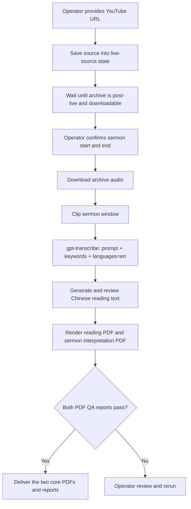

# Stable Post-Live Dual-PDF Workflow

This document describes the repository's current primary working path.

The stable workflow is:

1. save a sermon video URL into resumable project state
2. wait for the public archive to become post-live / downloadable
3. manually confirm the sermon start and end time
4. build the English reference transcript with `gpt-transcribe`
5. generate and QA the Chinese-English reading PDF and Chinese sermon interpretation PDF

This is the workflow that should be documented first in the root README and used as the default operator path today.

## Scope

This workflow is for:

- extracting a usable sermon source from a manually provided YouTube URL
- preserving that source so a later run does not need the URL again
- generating bilingual reading text from a manually confirmed sermon window
- producing two reviewed core deliverables: the reading PDF and sermon interpretation PDF

This workflow is not the same thing as the frontend admin prototype or the Cloud Run backend orchestration. Those paths already work, but they are currently secondary to the stable operator workflow described here.

## Flowchart



## Human checkpoints

Two human checkpoints are part of the stable workflow:

1. The operator saves or confirms the correct source URL.
2. The operator confirms the sermon start and end time before the full run.

The pipeline is intentionally not treated as complete before both core PDFs and their QA reports exist and pass.

## Recommended commands

### 1) Save the manual source URL

Use a canonical YouTube watch URL when possible.

```bash
python3 scripts/live_source_monitor.py \
  --sunday 2026-07-26 \
  --manual-url 'https://www.youtube.com/watch?v=VIDEO_ID' \
  --out artifacts/live-source-monitor/report.json \
  --state-file artifacts/live-source-monitor/state.json
```

This writes resumable source state, including the saved generation request that later post-live runs use.

### 2) Manually confirm the sermon start and end

Use timeline evidence, local playback, or a trusted operator review pass to determine the sermon window in the full archive.

Examples:

- start: `00:29:35`
- end: `01:00:55`

These are absolute offsets in the full downloaded media, not relative offsets inside the sermon clip.

### 3) Run the post-live generation workflow

Before running, make sure `OPENAI_API_KEY` is already present in the environment, or pass `--api-key-secret`.

```bash
python3 scripts/run_post_live_subtitle_generation.py \
  --sunday 2026-07-26 \
  --state-file artifacts/live-source-monitor/state.json \
  --work-root artifacts/post-live-runs \
  --out artifacts/post-live-subtitle-generation/report.json \
  --slug mariners_VIDEO_ID \
  --start-time 00:29:35 \
  --end-time 01:00:55 \
  --output-mode reading \
  --reference-model gpt-transcribe
```

## Main outputs

Under the selected run directory, the operator should expect at least these outputs:

- `asr_reference.json` or `asr_reference_chunks.json`
- `segments_timed_en_corrected.json`
- `segments_timed_zh.json`
- `sermon_zh_en_reading.pdf`
- `sermon_zh_en_reading.qa.json`
- `sermon_interpretation_zh.pdf`
- `sermon_interpretation_zh.qa.json`
- `sermon-interpretation/insights/openai-notes.json`
- `reading-edition-v2/reading_quality_report.json`
- `summary.json`
- `run-status.json`

The reading PDF and sermon interpretation PDF are the two core operator deliverables. The interpretation includes the central message, outline, Scripture context, theological insights, illustrations, pastoral distinctions, reflection questions, a small-group guide, and a response prayer. Every generated item must cite transcript slices, and AI-assisted reflection or prayer content is visibly distinguished from speaker quotations.

The default `reading` mode does not call `whisper-1`. Internal timing values are used only to organize reading blocks and must not be published as synchronized subtitle timing. Select `--output-mode subtitles` explicitly when SRT/VTT timing is required; only that mode enables `whisper-1`.

## Completion rule

Treat the workflow as complete only when all of the following are true:

- the source URL was saved into state successfully
- the sermon window was manually confirmed
- `sermon_zh_en_reading.pdf` exists
- `sermon_zh_en_reading.qa.json` reports pass
- `sermon_interpretation_zh.pdf` exists
- `sermon_interpretation_zh.qa.json` reports pass
- the run report and run status are written

Partial ASR output alone is not success.

## Where the automation actually happens

The stable workflow is implemented mainly by these scripts:

- [../scripts/live_source_monitor.py](../scripts/live_source_monitor.py)
- [../scripts/run_post_live_subtitle_generation.py](../scripts/run_post_live_subtitle_generation.py)
- [../scripts/sermon_pipeline.py](../scripts/sermon_pipeline.py)
- [../scripts/render_mobile_pdf_from_srt.py](../scripts/render_mobile_pdf_from_srt.py)
- [../scripts/generate_notes_with_openai.py](../scripts/generate_notes_with_openai.py)
- [../scripts/render_sermon_interpretation_pdf.py](../scripts/render_sermon_interpretation_pdf.py)

## Secondary but working paths

These parts of the repository already work, but they are not the primary documentation entrypoint today:

- [../backend/README.md](../backend/README.md): backend worker and Cloud Run orchestration
- [../web/README.md](../web/README.md): frontend/admin and playback prototype

They should be documented as supporting paths, not as the main stable workflow.
