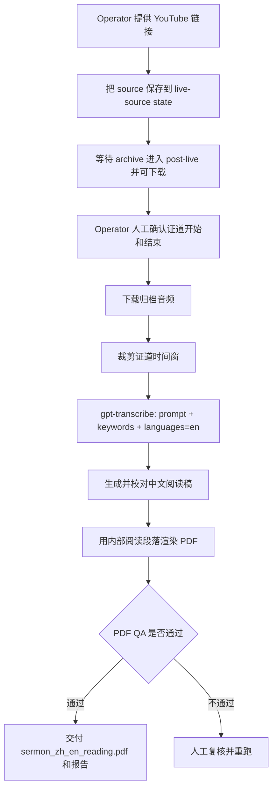

# 稳定的 post-live 阅读版 PDF 工作流

这份文档描述当前这个 repo 最主要、最稳定、最应该先写清楚的工作流。

当前主流程是：

1. 把证道视频链接保存到可恢复状态里
2. 等公开视频归档进入 post-live / 可下载状态
3. 人工确认证道开始和结束时间
4. 用 `gpt-transcribe` 生成英文参考转录
5. 生成并校验中英对照阅读版 PDF

这也是根 README 现在应该优先介绍的默认 operator 路径。

## 适用范围

这条工作流用于：

- 从人工提供的 YouTube 链接提取可用证道源
- 把这个源持久化保存，避免后续运行再次手工提供链接
- 基于人工确认的证道时间窗生成中英阅读稿
- 产出阅读版 PDF，作为当前最重要的交付物

这条工作流不等同于前端 admin prototype，也不等同于 Cloud Run backend orchestration。后两条路径现在已经 working，但当前仍属于次要路径，不是 repo 首页的主要叙事。

## 流程图



## 人工关口

当前稳定工作流有两个必须保留的人工作业点：

1. operator 保存或确认正确的视频源链接
2. operator 在正式全量运行前，确认证道开始和结束时间

只有阅读版 PDF 和 QA 都通过，才算这次运行真正完成。

## 推荐命令

### 1）先保存手工 source URL

尽量直接使用 canonical YouTube watch URL。

```bash
python3 scripts/live_source_monitor.py \
  --sunday 2026-07-26 \
  --manual-url 'https://www.youtube.com/watch?v=VIDEO_ID' \
  --out artifacts/live-source-monitor/report.json \
  --state-file artifacts/live-source-monitor/state.json
```

这一步会写入可恢复的 source state，其中包含后续 post-live 运行要用的 generation request。

### 2）人工确认证道开始和结束时间

根据 timeline evidence、本地播放核对，或者可信的 operator 复核结果，确认完整归档里的证道时间窗。

示例：

- start: `00:29:35`
- end: `01:00:55`

这里的时间必须是完整下载媒体里的绝对偏移，不是证道 clip 内部的相对时间。

### 3）运行 post-live 生成流程

运行前确保环境里已经有 `OPENAI_API_KEY`，或者显式传 `--api-key-secret`。

```bash
python3 scripts/run_post_live_subtitle_generation.py \
  --sunday 2026-07-26 \
  --state-file artifacts/live-source-monitor/state.json \
  --work-root artifacts/post-live-runs \
  --out artifacts/post-live-subtitle-generation/report.json \
  --slug mariners_VIDEO_ID \
  --start-time 00:29:35 \
  --end-time 01:00:55 \
  --output-mode reading \
  --reference-model gpt-transcribe
```

## 主要产物

在对应 run 目录下，至少应该看到这些输出：

- `asr_reference.json` 或 `asr_reference_chunks.json`
- `segments_timed_en_corrected.json`
- `segments_timed_zh.json`
- `sermon_zh_en_reading.pdf`
- `sermon_zh_en_reading.qa.json`
- `reading-edition-v2/reading_quality_report.json`
- `summary.json`
- `run-status.json`

其中阅读版 PDF 是这条稳定工作流当前最主要的交付物。

默认 `reading` 模式不调用 `whisper-1`。内部段落时间只服务于阅读版组织，不得作为同步字幕时间轴发布。需要 SRT/VTT 时必须显式使用 `--output-mode subtitles`，此时才启用 `whisper-1`。

## 完成标准

只有同时满足下面条件，才应把这次运行视为完成：

- source URL 已成功保存进 state
- 证道时间窗已人工确认
- `sermon_zh_en_reading.pdf` 已生成
- `sermon_zh_en_reading.qa.json` 报告为 pass
- run report 和 run status 已写出

只有部分 ASR 结果，不能算成功。

## 主要脚本入口

这条稳定工作流主要由下面几个脚本实现：

- [../scripts/live_source_monitor.py](../scripts/live_source_monitor.py)
- [../scripts/run_post_live_subtitle_generation.py](../scripts/run_post_live_subtitle_generation.py)
- [../scripts/sermon_pipeline.py](../scripts/sermon_pipeline.py)
- [../scripts/render_mobile_pdf_from_srt.py](../scripts/render_mobile_pdf_from_srt.py)

## 已 working 但非主流程的路径

下面这些部分已经 working，但当前不应该作为 repo 首页的主入口：

- [../backend/README.md](../backend/README.md)：backend worker 和 Cloud Run orchestration
- [../web/README.md](../web/README.md)：frontend/admin 与播放原型

它们应该作为支持路径来写，而不是当前最稳定主流程本身。
