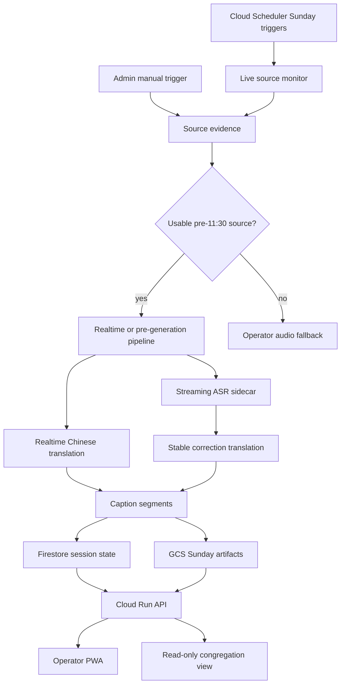

# System Design

Last updated: 2026-06-23

Chinese version: [system-design.zh.md](./system-design.zh.md)

## Product Goal

The system exists to help Chinese-speaking congregants follow the Mariners Church Sunday 11:30 PT sermon while it is being preached. The primary success metric is not after-the-fact archive quality. It is whether the 11:30 congregation can open a usable caption experience before and during the sermon.

## Key Source Finding

Public YouTube VODs are too late for the 11:30 use case. The target video `V6OKiwbjDZE` became publicly visible around 12:28 PT, and recent main sermon VODs from the channel typically appear around 12:28-12:43 PT. That means a public-VOD-only pipeline can serve replay viewers, but it cannot serve the 11:30 congregation.

The production design therefore prioritizes earlier sources:

| Priority | Source | Use |
|---:|---|---|
| 1 | Authorized church audio or production feed | Best long-term realtime source |
| 2 | Earlier official live service, if the sermon is confirmed to match | Best pre-generation path |
| 3 | 10:00 PT live service | Conservative default for pre-11:30 preparation |
| 4 | Operator device audio | Realtime fallback |
| 5 | Public VOD | Offline quality pass only |

## Target Timeline

| Time PT | System behavior |
|---|---|
| 08:30 / 10:00 | Discover and verify earlier live source candidates |
| 10:00-10:55 | Generate English transcript, Chinese captions, scripture candidates, and term annotations |
| 11:15-11:25 | Operator reviews readiness, key terms, scripture, and publish state |
| 11:30-11:50 | Congregation uses captions during the sermon |
| After service | Offline quality pass, notes, quotes, exports |

## Trigger Model

V1 keeps both a manual admin path and a scheduled automatic path.

| Path | Owner | Purpose |
|---|---|---|
| Manual admin trigger | Operator/admin | Enter a live or live-archive URL, optionally provide an approximate sermon start time such as `00:23:25`, and start ingestion quickly when the automatic monitor misses a source or a known URL is available. |
| Scheduled discovery | Backend | Run on Sunday before the 8:30 and 10:00 services, discover official live links, verify that the sermon source is usable, automatically estimate the sermon start time, and start caption generation without ordinary user action. |

The congregation-facing page is read-only. Caption capture, translation, scripture enrichment, notes, quote extraction, and publish decisions are performed by admin tools or backend jobs. Multiple congregants opening the website for the same Sunday should see the same published artifact set, not separate per-user generation.

Generated content is sliced by service Sunday:

```text
public page: /sundays/2026-06-21
GCS prefix:  gs://<bucket>/sundays/2026-06-21/<session_id>/
session id:  sunday-20260621-1000
```

The Sunday slice is the primary read model for the web UI. Realtime sessions and offline jobs can write rolling updates into the slice, while public clients only subscribe to published captions, scripture cards, notes, and quote artifacts. The current realtime MVP stores sanitized English/Chinese deltas in backend memory and JSONL files under `REALTIME_EVENT_LOG_DIR`; when `REALTIME_EVENT_GCS_PREFIX` is configured, the GCS JSONL mirror runs on a background single-worker queue. Mirror upload failures are reported through `gcsMirrorHealthy/gcsMirrorLastError` status and do not block live caption event posts or SSE fanout. iPad/iPhone mic input uses browser WebRTC with `gpt-realtime-translate`, while `scripts/realtime_media_worker.py` can create backend-only sessions, prepare authorized audio/YouTube sources, stream 24 kHz PCM16 audio to the OpenAI translation WebSocket, and publish English/Chinese deltas into the same public caption stream. `scripts/stabilize_realtime_deltas_with_openai.py` turns saved English windows plus draft Chinese captions into `gpt-5.5-mini` stable corrections, and can post them back as `caption_final` events so the SSE caption view replaces the low-latency draft; `scripts/run_realtime_stabilizer_loop.py` repeats that pass every few seconds and skips already-posted segments. Firestore remains the production durable-state target.

## Architecture



## Services

| Service | Responsibility |
|---|---|
| `web` | iPhone/iPad PWA for operator and congregation caption views |
| `api` | sessions, caption segments, manifests, exports, publish state, operator auth |
| `worker` | offline ASR, translation, timeline normalization, scripture resolution, notes and quotes |
| `live-source-monitor` | Sunday source discovery and fallback alerts |
| `realtime-media-worker` | Server-side authorized audio/YouTube source preparation plus OpenAI Realtime translation WebSocket relay |
| `realtime-relay` | Optional future split-out provider relay if media ingest needs a separate service |

Cloud Run is the default deployment target. Firestore stores sessions and caption segment state. GCS stores generated artifacts. Secret Manager stores provider keys and sensitive runtime tokens. Cloud Tasks or Cloud Scheduler can trigger monitor and worker jobs.

## Model Strategy

Use provider interfaces so the product is not hard-bound to one model vendor.

| Task | Primary | Fallback |
|---|---|---|
| Realtime Chinese captions | OpenAI `gpt-realtime-translate` | Gemini Live Translate |
| Realtime English sidecar | OpenAI `gpt-realtime-whisper` | Google/Gemini ASR path |
| Offline ASR | OpenAI `gpt-4o-transcribe` | `gpt-4o-mini-transcribe` / Google batch STT |
| Stable correction translation | OpenAI `gpt-5.5-mini` | Gemini Flash-Lite / OpenRouter text models |
| Offline translation | OpenAI `gpt-5.5-mini` with glossary | Batch translation fallback |
| Scripture resolution | Deterministic Bible index + fuzzy candidates | Rules only |
| Notes and quotes | OpenAI GPT-5.5 mini, reasoning effort medium | Smaller model with review |

See [model-provider-comparison.md](./model-provider-comparison.md) for model, latency, quality, and cost tradeoffs.

## Storage And Secret Boundary

Generated content belongs in GCS:

| Artifact | Example path |
|---|---|
| Reports | `gs://<bucket>/runs/<date>/<session_id>/artifacts/report.json` |
| Captions | `gs://<bucket>/runs/<date>/<session_id>/artifacts/*.vtt` |
| Realtime English/Chinese deltas | `gs://<bucket>/realtime-events/YYYY-MM-DD/<session_id>.jsonl` |
| Playback data | `gs://<bucket>/runs/<date>/<session_id>/web/playback-simulation.generated.js` |
| Model output | `gs://<bucket>/runs/<date>/<session_id>/model-output/*.jsonl` |
| Notes and quotes | `gs://<bucket>/runs/<date>/<session_id>/insights/*.json` |

Secrets must not appear in Git, generated browser JS, public manifests, logs, VTT/SRT, or report files. The production public playback JS should not expose Secret Manager resource names. See [cloud-run-deployment-prep.md](./cloud-run-deployment-prep.md).

## UI Modes

| Mode | Audience | Content |
|---|---|---|
| Congregation view | Chinese-speaking listeners | Large readable Chinese captions, minimal controls, optional scripture panel |
| Operator view | Reviewer/operator | Admin settings, manual trigger, source status, readiness, timeline controls, scripture and term review, publish controls |

Admin settings must include:

- Sunday slice selector, so generated content is grouped by service date.
- Manual live URL input.
- Optional approximate sermon start time, used as a fast seek hint but not as the only source of truth.
- Scheduled discovery status, showing the automatic 8:20/9:50 PT monitor path.

The public congregation view should not expose provider keys, admin tokens, Secret Manager resource names, raw model traces, or controls that start generation. It should read only the current Sunday slice's published state.

V1 stays web-first because iPhone/iPad Safari offers the fastest path for both operator and congregation use. A native iOS app can be revisited if background audio capture or lock-screen behavior becomes necessary.

## Open Questions

- Which source is authorized and stable enough for production Sundays?
- Can the earlier service be confirmed as the same sermon before 11:30?
- Which realtime provider gives the best latency/quality for scripture-heavy sermons?
- What level of operator review is realistic between 11:15 and 11:25?
