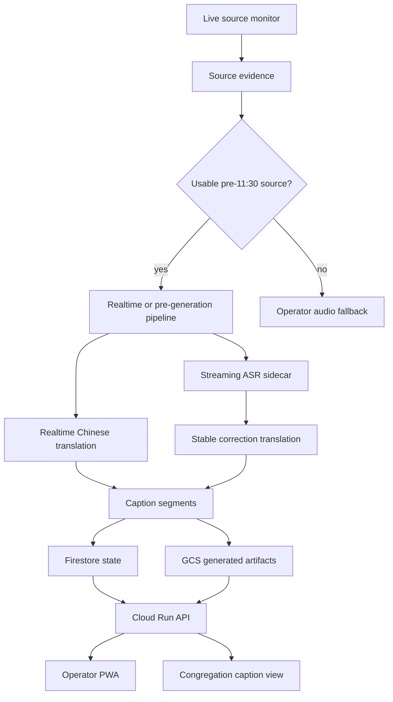

# System Design

Last updated: 2026-06-22

Chinese version: [system-design.zh.md](./system-design.zh.md)

## Product Goal

The system exists to help Chinese-speaking congregants follow the Mariners Church Sunday 11:30 PT sermon while it is being preached. The primary success metric is not after-the-fact archive quality. It is whether the 11:30 congregation can open a usable caption experience before and during the sermon.

## Key Source Finding

Public YouTube VODs are too late for the 11:30 use case. The target video `V6OKiwbjDZE` became publicly visible around 12:28 PT, and recent main sermon VODs from the channel typically appear around 12:28-12:43 PT. That means a public-VOD-only pipeline can serve replay viewers, but it cannot serve the 11:30 congregation.

The production design therefore prioritizes earlier sources:

| Priority | Source | Use |
|---:|---|---|
| 1 | Authorized church audio or production feed | Best long-term realtime source |
| 2 | Earlier official live service, if the sermon is confirmed to match | Best pre-generation path |
| 3 | 10:00 PT live service | Conservative default for pre-11:30 preparation |
| 4 | Operator device audio | Realtime fallback |
| 5 | Public VOD | Offline quality pass only |

## Target Timeline

| Time PT | System behavior |
|---|---|
| 08:30 / 10:00 | Discover and verify earlier live source candidates |
| 10:00-10:55 | Generate English transcript, Chinese captions, scripture candidates, and term annotations |
| 11:15-11:25 | Operator reviews readiness, key terms, scripture, and publish state |
| 11:30-11:50 | Congregation uses captions during the sermon |
| After service | Offline quality pass, notes, quotes, exports |

## Architecture

## Services

| Service | Responsibility |
|---|---|
| `web` | iPhone/iPad PWA for operator and congregation caption views |
| `api` | sessions, caption segments, manifests, exports, publish state, operator auth |
| `worker` | offline ASR, translation, timeline normalization, scripture resolution, notes and quotes |
| `live-source-monitor` | Sunday source discovery and fallback alerts |
| `realtime-relay` | Optional relay for non-browser audio sources |

Cloud Run is the default deployment target. Firestore stores sessions and caption segment state. GCS stores generated artifacts. Secret Manager stores provider keys and sensitive runtime tokens. Cloud Tasks or Cloud Scheduler can trigger monitor and worker jobs.

## Model Strategy

Use provider interfaces so the product is not hard-bound to one model vendor.

| Task | Primary | Fallback |
|---|---|---|
| Realtime Chinese captions | OpenAI `gpt-realtime-translate` | Gemini Live Translate |
| Realtime English sidecar | OpenAI `gpt-realtime-whisper` | Google/Gemini ASR path |
| Stable correction translation | OpenAI `gpt-5.4-mini` | Gemini Flash-Lite / OpenRouter text models |
| Offline translation | Higher-quality text model with glossary | Batch translation fallback |
| Scripture resolution | Deterministic Bible index + fuzzy candidates | Rules only |
| Notes and quotes | Structured text model pass | Smaller model with review |

See [model-provider-comparison.md](./model-provider-comparison.md) for model, latency, quality, and cost tradeoffs.

## Storage And Secret Boundary

Generated content belongs in GCS:

| Artifact | Example path |
|---|---|
| Reports | `gs://<bucket>/runs/<date>/<session_id>/artifacts/report.json` |
| Captions | `gs://<bucket>/runs/<date>/<session_id>/artifacts/*.vtt` |
| Playback data | `gs://<bucket>/runs/<date>/<session_id>/web/playback-simulation.generated.js` |
| Model output | `gs://<bucket>/runs/<date>/<session_id>/model-output/*.jsonl` |
| Notes and quotes | `gs://<bucket>/runs/<date>/<session_id>/insights/*.json` |

Secrets must not appear in Git, generated browser JS, public manifests, logs, VTT/SRT, or report files. The production public playback JS should not expose Secret Manager resource names. See [cloud-run-deployment-prep.md](./cloud-run-deployment-prep.md).

## UI Modes

| Mode | Audience | Content |
|---|---|---|
| Congregation view | Chinese-speaking listeners | Large readable Chinese captions, minimal controls, optional scripture panel |
| Operator view | Reviewer/operator | Source status, readiness, timeline controls, scripture and term review, publish controls |

V1 stays web-first because iPhone/iPad Safari offers the fastest path for both operator and congregation use. A native iOS app can be revisited if background audio capture or lock-screen behavior becomes necessary.

## Open Questions

- Which source is authorized and stable enough for production Sundays?
- Can the earlier service be confirmed as the same sermon before 11:30?
- Which realtime provider gives the best latency/quality for scripture-heavy sermons?
- What level of operator review is realistic between 11:15 and 11:25?
