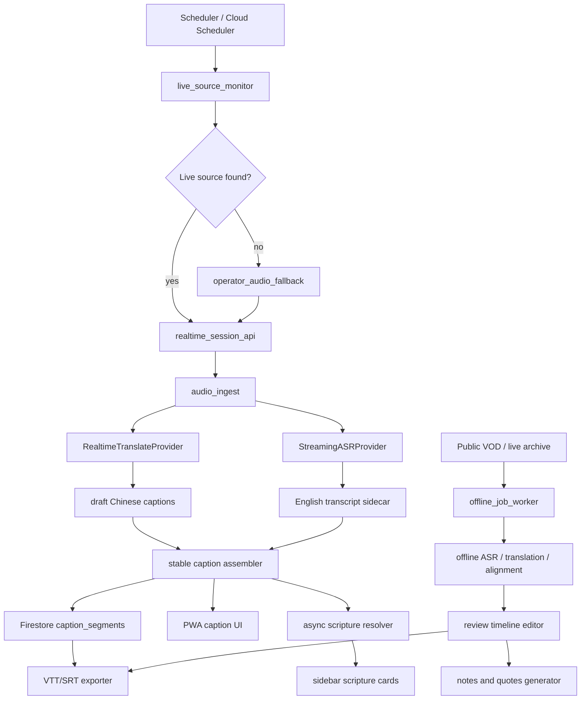

# 证道视频中文字幕 Pipeline System Design

日期：2026-06-22  
目标频道：Mariners Church  
主要目标：每周日 11:30 PT 前可用中文字幕，最晚 11:50 PT 前完成  
默认策略：优先使用 11:30 前最早可验证的同篇证道直播；10:00 PT 作为保守生产默认；公开视频 VOD 作为离线归档源

## 1. 设计结论

公开视频 VOD 不能满足 11:50 PT SLA。目标视频 `V6OKiwbjDZE` 在公开层面约 12:28 PT 才可见，历史主证道视频也集中在 12:28-12:43 PT 公开。

新的可行路径是使用 Mariners Online / YouTube Live 的直播源。官方 Mariners Online 页面显示周日直播时间为 7:00、8:30、10:00、11:30 AM PT；YouTube `@marinerschurch/streams` 也存在同一篇证道的 live archive `FsUijL9uB1I`，metadata 显示 `live_status=was_live`、`media_type=livestream`，其 `release_timestamp` 换算为 2026-06-21 08:21:04 PDT。这个时间点说明 8:30 场很可能已经是可用来源。V1 应优先尝试 8:30 场；若 8:30 无法稳定验证或接入，则使用 10:00 PT 直播作为保守生产输入源。

系统分成两条链路：

- 实时链路：8:20 PT 开始尝试 8:30 场；若失败，9:50 PT 再尝试 10:00 场；直播期间边听边生成中文字幕，11:30 前产出可用版本。
- 离线链路：公开视频或直播归档可用后，生成高质量字幕、时间轴编辑、经文 sidebar、笔记和金句。

## 2. Source Strategy

### 2.1 输入源优先级

| 优先级 | 输入源 | 用途 | SLA 可行性 | 说明 |
|---:|---|---|---|---|
| 1 | 频道方授权音频或导播音频 | 实时字幕 | 高 | 最稳定，推荐长期方案 |
| 2 | 8:30 PT YouTube Live / Mariners Online | 实时字幕 | 高 | 若同篇证道确认，SLA 余量最大 |
| 3 | 10:00 PT YouTube Live / Mariners Online | 实时字幕 | 高 | 保守生产默认，仍有足够 11:30 前处理余量 |
| 4 | Operator 设备麦克风/外接音频 | 实时兜底 | 中 | iPhone/iPad 可用，但音质依赖环境 |
| 5 | YouTube live archive | 快速离线补齐 | 中 | 归档公开时间可能晚于直播结束 |
| 6 | 公开视频 VOD | 高质量离线 | 低 | 不满足 11:50 SLA，只适合事后字幕 |

### 2.2 周日运行时间线

| 时间 PT | 系统行为 |
|---|---|
| 08:20 | `live_source_monitor` 启动，检测 8:30 场 Mariners Online、YouTube streams、已知 live URL |
| 08:30 | 如果 8:30 场确认同篇证道并可接入，启动 realtime caption session |
| 09:20 | 若 8:30 场成功，产出第一版 stable captions 并进入快速 review |
| 09:50 | 若 8:30 场失败或内容不匹配，重新检测 10:00 场 |
| 09:58 | 如果 10:00 直播源仍未发现，提醒 operator 准备手动音频输入 |
| 10:00 | 开始接入 10:00 场直播音频，启动或重启 realtime caption session |
| 10:00-10:55 | 实时生成英文转写、中文字幕、经文候选、术语标注 |
| 10:55-11:15 | 自动整理 stable captions，补齐低置信片段 |
| 11:15-11:30 | 生成可发布 VTT/SRT 和 UI 可读字幕轨 |
| 11:30-11:50 | 人工快速 review、修正关键经文/人名、发布 |
| 12:28+ | 公开视频 VOD 出现后进入离线高质量重处理 |

### 2.3 合规边界

系统不绕过权限、DRM 或平台访问控制。生产方案优先使用频道方授权音频、官方播放器可播放的直播、或 operator 自己设备的实时音频输入。若后续需要自动下载或归档第三方平台内容，应先确认授权和平台规则。

## 3. Architecture



### 3.1 Services

| Service | 责任 |
|---|---|
| `web` | iPhone/iPad PWA，显示实时字幕、时间轴、sidebar、review UI |
| `api` | session、job、segments、exports、operator auth |
| `realtime-relay` | 可选，接入非浏览器音频源并转发给 realtime provider |
| `worker` | 离线 ASR、翻译、时间轴归一、经文解析、笔记和金句 |
| `live-source-monitor` | 周日定时检查官方 live 页面、YouTube streams、fallback 状态 |

默认部署在 Cloud Run。Firestore 存储状态和字幕片段，Cloud Storage 存储音频片段、原始模型输出、导出文件。Cloud Tasks 用于离线 job 编排。

### 3.2 Frontend

V1 使用 Web/PWA，而不是先做 iOS App。原因是：

- iPhone/iPad Safari 可以快速访问和部署，适合 operator-first 工作流。
- 主要 UI 是字幕监控、review、经文 sidebar、时间轴编辑，Web 足够。
- iOS 浏览器不能可靠捕获其他 app 或标签页系统音频，所以音频输入要通过官方源、服务器 relay、外接输入或后续 iOS companion app 解决。

PWA 布局要求：

- iPhone 竖屏：主字幕大字显示，经文 sidebar 作为底部抽屉。
- iPhone 横屏：视频/字幕左侧，经文和状态右侧。
- iPad 竖屏：字幕区 + 下方时间轴，经文 sidebar 可折叠。
- iPad 横屏：三栏布局，左侧视频/字幕，中间时间轴，右侧经文/笔记。

## 4. Realtime Pipeline

### 4.1 Main Flow

1. `live_source_monitor` 优先发现 8:30 PT live source；若失败则发现 10:00 PT live source。
2. `api` 创建 realtime session，返回短期 token 和 session id。
3. `audio_ingest` 将音频以低延迟方式送入 provider。
4. `RealtimeTranslateProvider` 生成 draft Chinese captions。
5. `StreamingASRProvider` 同时生成英文 sidecar transcript。
6. `stable_caption_assembler` 合并、去重、修正断句，产出 stable captions。
7. `scripture_resolver` 异步解析经文、人名、术语，不阻塞字幕显示。
8. `exporter` 持续生成 rolling VTT/SRT，11:15 后冻结可 review 版本。

### 4.2 Latency Budget

| 阶段 | 目标 |
|---|---:|
| 音频采集/上传 | 300-800 ms |
| 首个中文 draft caption | p50 <= 2.5 s |
| stable caption | p95 <= 6 s |
| 经文 sidebar 更新 | stable 后 1-3 s |
| 断线重连恢复 | <= 10 s |

### 4.3 Caption States

| 状态 | 用途 |
|---|---|
| `draft` | 快速显示，可被替换，不导出 |
| `stable` | 已确认片段，可进入 sidebar 和 rolling export |
| `reviewed` | 人工确认后用于最终发布 |
| `locked` | 关键经文、人名、金句引用，不再被自动流程覆盖 |

## 5. Offline Pipeline

离线链路服务两个目标：对公开视频/直播归档做高质量重处理；为时间轴编辑、笔记、金句提供稳定来源。

状态机：

```text
submitted
-> source_checking
-> source_ready | source_waiting | source_failed
-> caption_probe
-> source_captions_imported | audio_extracting
-> audio_ready
-> asr_running
-> english_transcript_ready
-> translation_running
-> chinese_segments_ready
-> alignment_normalizing
-> captions_ready
-> scripture_enriching
-> enriched
-> insights_generating
-> insights_ready
-> reviewed
-> export_ready
```

离线规则：

- 如果 URL 中已有人工字幕或可用英文字幕，先导入字幕。
- 如果没有字幕，提取音频后 ASR。
- 翻译完成后做时间轴归一，保留原 segment id。
- 时间轴 UI 支持上下滑动、单句拖动、批量 offset、split、merge、lock。
- 导出只使用 `edited_zh` track。

## 6. Data Model

### 6.1 Realtime Session

```json
{
  "session_id": "rt_2026_06_28_1000",
  "channel": "Mariners Church",
  "source_type": "youtube_live | mariners_online | authorized_audio | operator_audio",
  "source_url": "https://...",
  "scheduled_start_at": "2026-06-28T10:00:00-07:00",
  "actual_start_at": "2026-06-28T10:00:12-07:00",
  "status": "monitoring | live | reconnecting | ended | failed",
  "sla_target_at": "2026-06-28T11:30:00-07:00",
  "hard_deadline_at": "2026-06-28T11:50:00-07:00"
}
```

### 6.2 Caption Segment

```json
{
  "segment_id": "seg_000123",
  "session_id": "rt_2026_06_28_1000",
  "start_ms": 742000,
  "end_ms": 748500,
  "source_text": "Aaron stood between the dead and the living.",
  "zh_text": "亚伦站在死人和活人中间。",
  "state": "stable",
  "confidence": 0.91,
  "revision": 3,
  "locked": false,
  "scripture_refs": ["Numbers 16"],
  "model_trace": {
    "asr_provider": "openai:gpt-realtime-whisper",
    "translation_provider": "openai:gpt-realtime-translate"
  }
}
```

### 6.3 Insight Output

```json
{
  "job_id": "offline_2026_06_28",
  "summary_zh": "...",
  "outline_zh": ["..."],
  "scriptures": [{"ref": "Numbers 16", "confidence": "exact"}],
  "quotes": [
    {
      "quote_zh": "...",
      "source_segment_id": "seg_000123",
      "timecode": "12:22",
      "source_text": "..."
    }
  ]
}
```

## 7. APIs

### 7.1 Realtime

| Method | Path | 说明 |
|---|---|---|
| `POST` | `/api/realtime/sessions` | 创建 realtime session，返回短期 token |
| `GET` | `/api/realtime/sessions/{id}` | 查询状态、源、SLA |
| `GET` | `/api/realtime/sessions/{id}/events` | SSE 推送 caption/status/scripture events |
| `POST` | `/api/realtime/sessions/{id}:reconnect` | 断线重连，从最新 cursor 恢复 |
| `POST` | `/api/realtime/sessions/{id}:freeze` | 冻结 rolling captions 进入 review |

### 7.2 Offline

| Method | Path | 说明 |
|---|---|---|
| `POST` | `/api/offline/jobs` | 提交 YouTube URL / live archive URL |
| `GET` | `/api/offline/jobs/{job_id}` | 查询 job 状态 |
| `GET` | `/api/offline/jobs/{job_id}/segments` | 获取字幕片段 |
| `PATCH` | `/api/offline/jobs/{job_id}/segments/{segment_id}` | 修改字幕文本或时间轴 |
| `POST` | `/api/offline/jobs/{job_id}/segments:batchOffset` | 批量平移时间轴 |
| `POST` | `/api/offline/jobs/{job_id}/segments/{segment_id}:split` | 拆分片段 |
| `POST` | `/api/offline/jobs/{job_id}/segments:merge` | 合并片段 |
| `POST` | `/api/offline/jobs/{job_id}/exports` | 生成 VTT/SRT |

## 8. Model Strategy

默认使用 provider interface，避免业务代码绑定单一模型。

| 任务 | Primary | Fallback |
|---|---|---|
| 实时中文字幕 | OpenAI `gpt-realtime-translate` | Gemini Live / Google STT + Translation |
| 实时英文转写 sidecar | OpenAI `gpt-realtime-whisper`, delay=low | Google STT V2 |
| 离线 ASR | OpenAI `gpt-4o-transcribe` | `gpt-4o-mini-transcribe` / Google batch STT |
| 离线翻译 | OpenAI GPT-5.5, reasoning effort medium | Google Translation Advanced + glossary |
| 经文识别 | deterministic Bible index + fuzzy model | rules only |
| 笔记和金句 | OpenAI GPT-5.5, reasoning effort medium | smaller model + stricter review |

Provider interfaces：

- `RealtimeTranslateProvider`
- `StreamingASRProvider`
- `OfflineASRProvider`
- `BatchTranslateProvider`
- `ScriptureResolver`
- `InsightProvider`

Glossary 数据：

- 圣经书卷中英文名
- 圣经人名
- Mariners Church 常见人名
- 常见神学术语
- 公开授权中文圣经文本索引

## 9. Scripture, Notes, And Quotes

经文处理分两层：

- deterministic：识别明确引用，例如 `Numbers 16`、`John 3:16`。
- fuzzy：识别隐含经文或 paraphrase，只作为候选，需要 review。

笔记和金句在 `captions_ready` 后生成：

- 中文摘要
- 证道大纲
- 经文列表
- 应用问题
- 5-8 条证道金句

金句必须满足：

- 忠于 source segment，不做营销式改写。
- 每条都有 `source_segment_id`、timecode、英文原文依据。
- 没有可追溯 source 的金句不能进入最终输出。

## 10. Reliability And Failure Modes

| 风险 | 处理 |
|---|---|
| 8:30 live source 未发现或不是同篇证道 | 自动转入 10:00 场监控 |
| 10:00 live source 未发现 | 9:58 提醒 operator，切换麦克风/外接音频 |
| 直播页面变更 | 保留 YouTube streams、Mariners Online、manual URL 三种入口 |
| Cloud Run 连接超时 | 主动重连，Firestore 保存 cursor |
| Realtime provider 限流 | 降级为 streaming ASR + batch translation |
| 网络抖动 | 本地短 buffer + server cursor + gap backfill |
| 经文误识别 | exact 自动显示，fuzzy 仅候选 |
| 翻译漂移 | glossary + reviewed lock + offline 重处理 |
| iOS 后台/锁屏中断 | operator 模式要求前台常亮，V2 考虑 iOS companion app |

## 11. Acceptance Criteria

Realtime：

- 每周日 8:30 PT 或 10:00 PT 场直播可被系统接入或明确 fallback。
- first Chinese caption p50 <= 2.5 秒。
- stable Chinese caption p95 <= 6 秒。
- 30 分钟内断线重连不丢失 stable segment。
- 11:30 PT 前生成可发布 `edited_zh` rolling caption track。
- 11:50 PT 前导出 VTT/SRT。

Offline：

- 已有字幕时优先导入，不重复 ASR。
- 无字幕时自动音频提取、ASR、翻译、对齐。
- VTT/SRT 100% 可解析。
- 时间轴编辑后 segment id 稳定。
- 每条金句 100% 可追溯到 source segment。

UI：

- iPhone 竖屏/横屏可完成实时监控。
- iPad 竖屏/横屏可完成 review、经文查看、时间轴调整。
- 字幕、按钮、sidebar 不重叠。

## 12. Implementation Phases

### Phase 1: Live Source Proof

- 实现 `live_source_monitor`，每周日 8:20 PT 检查 8:30 场 Mariners Online 和 YouTube streams；9:50 PT 检查 10:00 场作为兜底。
- 记录 live source 发现时间、URL、状态、metadata。
- 在一次真实周日 8:30 PT 或 10:00 PT 场完成端到端 dry run。

### Phase 2: Realtime MVP

- 实现 PWA operator screen。
- 实现 realtime session API。
- 接入 realtime translation provider。
- 保存 stable captions 到 Firestore。
- 导出 rolling VTT/SRT。

### Phase 3: Offline Quality Pipeline

- 实现 offline job worker。
- 支持 YouTube VOD/live archive URL。
- 支持字幕导入、ASR、翻译、时间轴归一。
- 实现 review timeline editor。

### Phase 4: Scripture And Insights

- 建立 Bible index 和 glossary。
- 实现 scripture sidebar。
- 实现笔记、摘要、证道金句。
- 加入人工 review 和锁定机制。

### Phase 5: Production Hardening

- Cloud Run 部署。
- Auth、日志、告警、成本监控。
- Provider fallback。
- 周日自动运行 runbook。
- 评估是否需要 iOS companion app。

## 13. Source Evidence

- Mariners Online 官方页面：周日直播时间 7:00、8:30、10:00、11:30 AM PT，页面说明所有时间为 Pacific Time。  
  https://www.marinerschurch.org/online/
- Mariners Church 官方首页：Irvine 周日场次 8:30、10:00、11:30 AM。  
  https://www.marinerschurch.org/
- YouTube channel streams：Mariners Church live archive 列表。  
  https://www.youtube.com/@marinerschurch/streams
- 目标 VOD：`V6OKiwbjDZE`，公开视频，约 12:28 PT 可见。  
  https://www.youtube.com/watch?v=V6OKiwbjDZE
- 同篇证道 live archive：`FsUijL9uB1I`，`live_status=was_live`，`media_type=livestream`，`release_timestamp=2026-06-21 08:21:04 PDT`。  
  https://www.youtube.com/watch?v=FsUijL9uB1I
