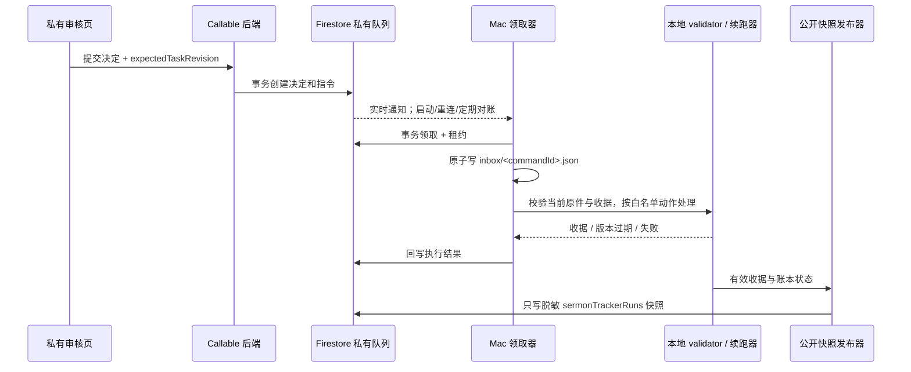

# Tracker 远程审核到本机续跑：通信设计

状态：设计稿，未实现。适用范围：四层制作的 Dev run。现有公开 Tracker、`sermon-tracker` 命名数据库和本机每 15 秒快照发布器继续承担**状态展示**；本文增加私有审核、指令领取和回执，不改变正式包的审核门禁。后端及领取器均须明确连接此命名数据库，避免误写项目的默认/反馈数据库。

## 决定

采用**Firebase 私有指令队列 + 本机常驻领取器**。审核者在登录后的私有页面查看版本绑定的证据，提交结构化决定。服务端验证身份、权限和任务版本，原子写入不可变决定与待处理指令。Mac 上的 LaunchAgent 通过出站连接监听队列，并在启动、重连及每 60 秒全量对账；领取后原子写入本地 JSON 收件箱。确定性校验器先验证本地原件、产物 hash 和正式审核收据，再允许续跑适配器启动对应步骤。领取器把结果写回 Firebase，公开快照仍由现有发布器从本地账本生成。

Firestore 是远程提交和指令状态的权威来源；本地 JSON 是**可恢复的收件箱与执行日志**，不是网页可以任意改写的批准文件。Codex 桌面任务的定时 heartbeat 不是这条链路的投递保证。第一版用确定性领取器处理通信和收据，Agent 只在已验证的 `ready_to_resume` 事件上执行有界的后续任务。这样 Mac 休眠时指令仍可排队，恢复联网后续接。



## 边界与数据位置

| 位置 | 内容 | 读写边界 |
|---|---|---|
| `sermonTrackerRuns/{pageId}` | 现有脱敏公开快照 | 所有人只读；本机发布器写。审核后端和浏览器均不直接改进度。 |
| 私有 `reviewTasks/{taskId}` | `pageId`、检查点、locale、当前候选/音轨/source hash、任务修订、授权审核范围、证据清单 | 服务端创建；审核页只通过鉴权后端取得允许查看的字段。 |
| 私有 `reviewDecisions/{decisionId}` | 审核者 UID、决定、时间、逐项检查和绑定 hash；只追加 | Callable 后端从已验证身份填 UID/时间，禁止客户端自报。 |
| 私有 `executionCommands/{commandId}` | 指令类型、决定引用、预期版本、状态、租约、结果 | 后端创建，本机领取器用独立 IAM 身份领取/回写；浏览器不能写。 |
| 私有 `workerPresence/{workerId}` | 最近本机心跳、能力版本、当前领取数 | 领取器每 30 秒更新；私有审核页超过 2 分钟未见心跳则显示离线。心跳只报告连接状态，不触发制作。 |
| 本机 `artifacts/.../review-bridge/inbox/<commandId>.json` | 已领取指令及当前本地执行阶段 | 领取器原子写；Agent 可读。不要放进 Git、Hosting、公开快照。 |
| 私有媒体存储 | 可远程审阅的音轨、视频片段、原文与审核证据 | 本机证据导出器先计算 hash、生成清单，再上传明确允许的版本；任务绑定不可变对象版本。审核页按任务授权短时访问，不放入公开 Tracker。 |

现有 `firestore.rules` 只允许公开集合读取、其余一律拒绝。第一版的私有浏览器操作全部经 Callable 后端，规则继续拒绝直接访问私有集合。后端使用服务端 SDK 时必须在代码中自行校验权限，并给服务账号最小 IAM 权限；服务端 SDK 不受 Firestore Security Rules 约束。

## 指令合同

`taskId` 固定定位 `pageId + layer + stepId + targetLocale + artifactHash`；Layer 1 的 locale 为空。`decisionId` 和 `commandId` 由后端产生，并用浏览器提交的幂等键去重。指令只允许枚举动作（如 `apply_audio_review`、`apply_text_review`、`record_rejection`、`request_resume`），绝不携带 shell 命令、脚本路径或自由文本提示词。

示意消息（字段和版本在实现时固化为 JSON Schema）：

```json
{
  "schemaVersion": "sermon-review-command-v1",
  "commandId": "opaque-id",
  "taskId": "opaque-id",
  "decisionId": "opaque-id",
  "pageId": "2026-09-20-laodicea-clip",
  "stepId": "L3-05@zh-Hans",
  "targetLocale": "zh-Hans",
  "action": "apply_audio_review",
  "expectedTaskRevision": 7,
  "expectedArtifactSha256": "64-lowercase-hex-chars",
  "state": "queued",
  "createdAt": "server timestamp"
}
```

`expectedArtifactSha256` 只是示意。真实任务须绑定该审核 schema 要求的**全部**身份：英文 Source Package、Target Candidate、Audio Package、整轨、机器筛查收据及单元清单等。提交时后端核对任务修订；领取时本地再与当前原件逐一核对。任一身份不一致，指令进入 `rejected_stale`，保留旧决定但不产生新批准或进度；重新生成审核任务。

`review_target_language_audio.py approve` 当前要求审核表明确记录全文播放、1 倍速视频同步、六项检查、所有 ASR 不确定项的逐项裁决、审核者和时间，并输出独立 v2 收据。远程审核页必须覆盖这些字段及真实媒体回放，不能用一个“通过”按钮补造。Layer 2 使用自己的分组审核收据。技术阻塞（如韩语 L3-02 合成失败）采用故障解决及重试动作，不接受“人审通过”动作。Layer 4 的发布、HTTP、设备和现场验收继续分开。

审核页先显示任务绑定的证据版本、可播放媒体或源文／候选文字、逐项审核要求，再提供「同意」「不同意」和具体意见输入。媒体不能播放时保留明确的文字说明与故障反馈入口；只有状态摘要或文字替代说明时，音频任务的正式「同意」必须禁用。不同意须记录原因和可定位的时间点／单元，作为新修订输入。当前公开 Mockup 的选择与输入仅在浏览器内存中演示，不能生成上述正式决定。

## 本机领取和 Agent 交接

1. **监听与对账**：独立 LaunchAgent 启动 Node/Python 领取器，用 Firestore 查询监听减少延迟；启动、监听出错后和每 60 秒重新查询 `queued`、租约过期的指令。每 30 秒更新私有本机心跳。不要只信监听回调、本地文件变化或心跳。复用现有发布器的 15 秒周期也可作为第一版，但把收指令与发公开状态做成两个模块，避免发布器故障阻断审核领取。
2. **领取**：在 Firestore 事务中从 `queued` 转 `claimed`，写 `workerId`、`leaseUntil`、`attempt`；长任务续租。一个 `pageId + stepId` 同时只允许一个有效处理者。本地再取得进程级锁，防止同一 Mac 上重复执行。
3. **落盘**：先验证指令 schema 和引用的私有决定，再用临时文件、flush、rename 原子写入 `inbox/<commandId>.json`。另写追加式执行事件，记录 `received`、`validated`、`receipt_written`、`ready_to_resume`、`resumed`、`acknowledged`；文件只含必要标识和路径引用，不存令牌。
4. **应用审核**：按动作白名单调用相应本地审核入口。现有收据输出要求不存在；重试时若输出已存在，验证其 `commandId` 关联和所有 hash 后复用，不能再次生成不同批准。正式 validator 通过后才更新本地账本；不能直接把 `waiting_review` 改为 `complete`。
5. **续跑**：`ready_to_resume` 是 Agent/编排器可读事件，包含 `pageId`、locale、下一允许步骤、收据路径和 hash。续跑器重新读取正式包、当前账本和租约，按固定命令映射启动。现有四层 producer 尚无统一自动续跑分发器，因此第一版只实现已明确映射的步骤；其余保持 `ready_to_resume` 并提示操作者，不能报告“Agent 已继续”。模型只规划有界任务，不写人工批准。
6. **回执**：本地记录 `applied`、`rejected_stale`、`failed_retryable` 或 `needs_operator`，并回写私有指令。公开页面只显示脱敏后的待处理数、步骤状态与最近同步时间。网页应同时显示“决定已提交”“本机已领取”“收据已验证”“后续步骤运行中”等状态，防止按钮点击被误认作放行。

本机 JSON 示例：

```json
{
  "schemaVersion": "sermon-review-inbox-v1",
  "commandId": "opaque-id",
  "pageId": "2026-09-20-laodicea-clip",
  "stepId": "L3-05@zh-Hans",
  "action": "apply_audio_review",
  "state": "ready_to_resume",
  "decisionId": "opaque-id",
  "verifiedReceipt": "relative/path/to/audio-human-review-receipt.json",
  "receiptSha256": "64-lowercase-hex-chars",
  "lastCheckedAt": "2026-09-24T20:00:00Z"
}
```

JSON 是结果投影，Agent 读取前仍须通过本地校验入口确认指令及收据有效。对 Agent 的唤醒推荐由领取器在 `ready_to_resume` 后调用一次受控的本地任务入口，而非让聊天 heartbeat 每 15 秒扫描文件。若以后采用 OpenAI Agents API 的自托管执行环境，仍由本机出站连接承接任务；它不能绕过本地审核和租约门禁。

## 故障与恢复

| 情况 | 预期行为 |
|---|---|
| Mac 休眠、离线或登出 | 指令留在 `queued`；页面显示“等待本机领取”及最后本机心跳时间。恢复后对账领取，不丢指令。 |
| 监听断开、重复通知、领取后崩溃 | 定期全量对账；租约到期可重领；`commandId` 与不可变收据保证重放不重复批准/生成。 |
| 本地产物更新或上游失效 | 本地拒绝旧 hash，回写 `rejected_stale`；不修改旧收据，重新发起审核。 |
| 远程决定已保存，本地收据写成但回写失败 | 重启后验证并复用收据，再补写结果；不得再次运行有副作用的 producer。 |
| 人工拒绝或指出问题 | 保留完整决定和问题，不自动续跑；由修订流程产生新版本与新任务。 |
| 同时两名审核者提交 | 后端事务只接受仍开放的当前修订；另一个得到冲突提示。是否允许分段多人审核由版本化合同另行决定。 |

## 交付顺序与验收

1. 私有证据清单和远程访问：先用 Dev fixture 验证审核者只能读取分配的文字和媒体，公开文档不含私有字段。
2. 登录、权限、Callable 提交、不可变决定和指令队列：测未登录、越权、重复提交、旧修订和并发冲突。
3. 本机领取器与 JSON 收件箱：测启动对账、离线后恢复、重复通知、租约到期、崩溃续接；不接正式审核或 producer。
4. 首个完整审核适配器：优先一条 Layer 3 音轨，完成真实全文/同步审阅、v2 收据验证、账本更新和 Firebase 回执；旧 hash 必须被拒绝。
5. 有界续跑适配器：仅为已验证的下一步骤接入；验证重试幂等、执行租约和最终公开快照。再扩展到 Layer 2、Layer 1 和 Layer 4。

验收以“审核者在另一设备提交 → Mac 离线期间保留 → 恢复后仅领取一次有效决定 → 本地正式收据通过 validator → 相应下一步只执行一次 → 公开状态脱敏更新”为端到端用例。提交成功、领取成功、正式放行和产物完成分别显示，不能合并成一个“已完成”。

## 参考

- [当前 Tracker 发布器](../experiments/sermon-dubbing-poc/tracker-admin/publish.mjs)与[只读规则](../experiments/sermon-dubbing-poc/tracker-admin/firestore.rules)
- [四层进度账本](../scripts/four_layer_progress.py)、[音频审核入口](../scripts/review_target_language_audio.py)、[音频审核收据 v2](../schemas/sermon-target-language-audio-human-review-receipt-v2.schema.json)
- [Firebase Callable Functions](https://firebase.google.com/docs/functions/callable)、[Firestore 实时监听](https://firebase.google.com/docs/firestore/query-data/listen)、[Firestore 事务](https://firebase.google.com/docs/firestore/manage-data/transactions)
- [OpenAI Agents API 自托管执行环境](https://developers.openai.com/api/docs/guides/agents-api/environments/self-hosted)（可选后续运行方式，不是第一版依赖）
