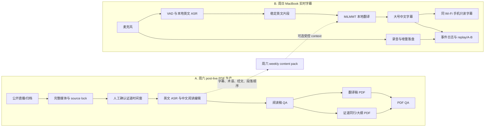
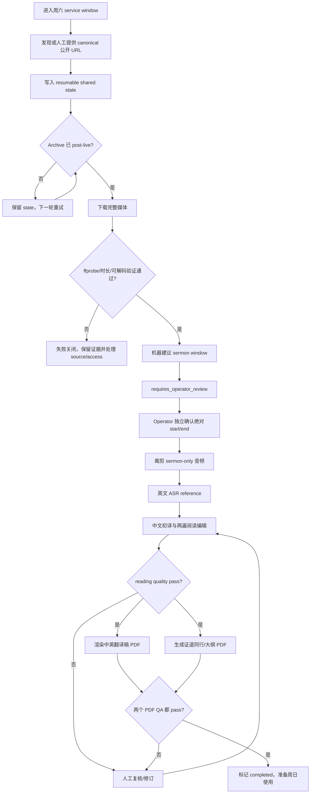
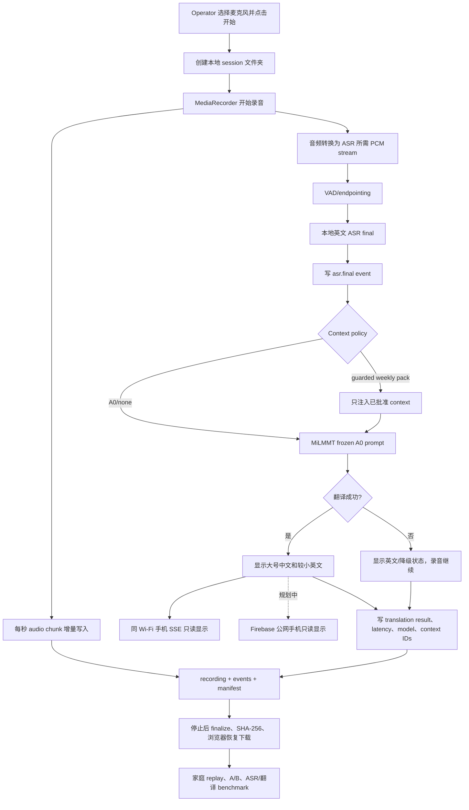
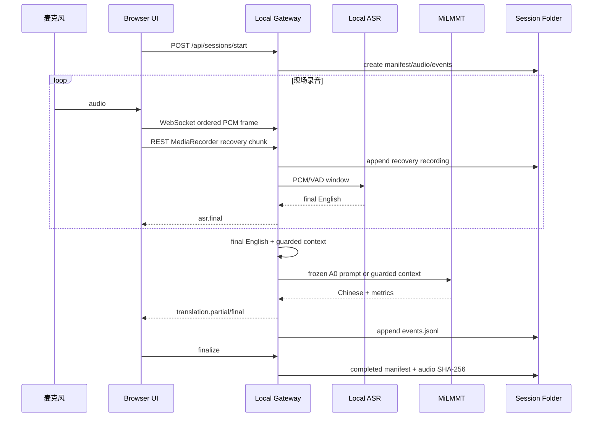

# 周六 PDF 生产与周日实时字幕：完整工作流

这份 README 是项目的 workflow source of truth。它只描述两条面向 operator 的主路径，并明确区分当前已验证能力、尚未接入能力和估算值。

状态定义：

- **Working：** 已经有代码、测试或真实产物证据。
- **POC：** 核心路径可运行，但仍包含 fixture、人工步骤或未完成的现场门槛。
- **Discovery：** 只有方案或局部实验，不能描述成端到端能力。

## 总体关系

核心边界：

- 周六路径的目标是生成经过 QA 的 durable 文档。
- 周日路径的目标是低延迟显示，同时保留足够录音和日志供回放、A/B 与后续训练。
- 周日实时录音不能依赖 ASR 或翻译成功；模型失败时继续录音，并显示英文或降级状态。
- 周六 content pack 是可选增强；`A0 / none` 始终保留为可比较基线。

## A. 周六：直播/归档到两个 PDF

### 完整流程图

### Canonical 输入与产物

| 阶段 | 必须保留的证据 |
|---|---|
| Source | canonical URL、service date、source ID、完整媒体 hash/时长 |
| 人工边界 | operator、绝对 start/end、审批时间、绑定的 source hash |
| ASR/阅读稿 | ASR reference、分段英文、中文阅读稿、prompt/model/version |
| QA | reading quality report、两个 PDF QA report、run status |
| 最终交付 | `sermon_zh_en_reading.pdf`、`sermon_interpretation_zh.pdf` |

`sermon_zh_en_reading.pdf` 是翻译稿/阅读版。`sermon_interpretation_zh.pdf` 是证道同行/大纲，只保留核心信息、结构、经文背景、神学重点、例证与必要的牧养辨析；不加入讨论题或与证道无关的应用任务。

### 周六内容如何服务周日

周六英文字幕、候选中文、术语、经文引用和段落顺序可以转换成短期 `weekly-pack.json`：

1. 以稳定 caption segment 为一条 JSONL，保留 `segmentId`、时间、英文、中文状态、术语和经文引用。
2. 按周六演讲顺序生成一张 ordered sermon map。
3. 机器中文只能作为 candidate；只有 reviewed/corrected/approved 内容可以进入 live prompt。
4. 周日先运行 `A0 / none`，再用相同录音回放 `weekly_terms_v1` 或 `saturday_alignment_v1`。
5. 每次翻译记录命中的 context ID、policy、cursor、模型和延迟，保证 A/B 可复现。

## B. 周日：MacBook 麦克风到实时中文字幕

### 完整流程图

### 运行时 sequence

### 当前实现状态

| 能力 | 状态 | 说明 |
|---|---|---|
| 麦克风选择、音量、开始/停止 | Working | 已用真实浏览器麦克风验证 |
| 增量录音、events、manifest、SHA | Working | 每次启动建立独立 session 文件夹 |
| MiLMMT A0/Ollama translation | Working | 冻结 prompt，`contextPolicy=none` 基线 |
| 大号中文、英文 sidecar、手机只读页 | Working POC | 单页 operator UI；随机 token + SSE，只暴露字幕 GET，不暴露控制接口 |
| 蜂窝网络扫码公网分享 | Design only | Firebase Hosting + Realtime Database；MacBook 只出站发布，不暴露本机端口 |
| 本地英文 ASR | Working POC | Qwen3-ASR 0.6B/MLX 一键默认；Whisper 回退；60 分钟长测通过 |
| 周六 content pack | Working POC | builder/retriever、受控 runtime policy、冻结英文 replay/A-B 已接通 |
| 会后 replay/A-B | Working | 同一组 `asr.final` 按 policy 重放；生成盲评 CSV 和 hash provenance |
| ASR Gold gate | Working gate | 六 case 队列已生成；真人未审核前正式 WER fail-closed |
| Session 保留 | Working | 默认只预览；30 天、保留最近 10 个；只有显式 `--apply` 删除 |

## ASR + 翻译总延迟预算

### 已观测证据与假设

- 测试机器：MacBook Pro，Apple M1 Max，64 GB unified memory。
- MiLMMT A0：`sermon-milmmt-46-4b-v1-q8:benchmark`，Ollama 本地运行。
- 修复后的 2026-09-04 真实 Chrome → 内置麦克风 → Qwen3-ASR/MLX → MiLMMT 60 分钟长测有 1,247 次 ASR processing、1,246 次 final、1 次 empty、0 次 failed。
- 音频结束到 ASR final：p50 `1.279s`、p95 `1.318s`；MiLMMT TTFT：p50 `0.126s`、p95 `0.146s`。
- 音频结束到浏览器第一个中文字幕：p50 `1.419s`、p95 `1.486s`；到完整中文：p50 `1.530s`、p95 `1.720s`。
- 以上是固定房间和播放源的 POC 证据，不是教会现场 SLO；最大值受队列/模型恢复影响，现场声学仍必须另行验证。

### 预算拆分

| 阶段 | Warm 预算 | 证据状态 |
|---|---:|---|
| VAD/等待 final window | 最多 0.5s silence 或 3s 强制窗口 | 运行配置；不计入 audio-end 指标 |
| Qwen3-ASR final | p50 1.279s / p95 1.318s | 修复后 60 分钟真实链路 |
| MiLMMT 首字 | p50 0.126s / p95 0.146s | 同一长测 |
| 浏览器中文首字（端到端） | p50 1.419s / p95 1.486s | audio end → render |
| 浏览器完整中文（端到端） | p50 1.530s / p95 1.720s | audio end → render |

必须区分“讲话时间/分段等待”和“句末后的模型延迟”。当前 UI 展示的是后者；从第一个词到字幕还要加上该段本身的 1–3 秒。启动器会预热两个模型，正式使用前仍应先讲一句测试句确认首字和完整字幕都出现。

### ASR benchmark 必须回答的问题

现有 acoustic benchmark 已覆盖五位讲员、正常/低音量、口音、经文、音乐、双人切换等 case，并比较过 Whisper；当前 runtime 基线改为 Qwen3-ASR。正式模型选择仍要记录：

- WER，以及 Scripture/人名/地名/教会术语的 entity accuracy。
- 2 秒、4 秒、8 秒片段的 RTF、p50/p95 inference latency。
- 不同 VAD silence threshold 下的句末到 final latency。
- 噪音、音乐、远场麦克风和讲员停顿时的删除/重复/幻觉。
- 与 MiLMMT 串联后的句末到中文 p50/p95，以及是否丢 chunk。

选择标准不是单独追求最低 WER，而是在术语准确度、稳定性和句末延迟之间取平衡。GPT-transcribe 参考只能算 provisional；`benchmarks/asr-gold-review-queue-20260904.jsonl` 必须由真人逐词校正、签名、记录时间后，正式 WER gate 才会通过。

## 测试与完成标准

### Unit

- audio chunk/event 顺序、session finalize 与 SHA。
- ASR 输出 parser、VAD endpoint、稳定片段去重。
- Gateway request/response、context policy 与翻译失败降级。

### Integration

- 固定音频 fixture → ASR → MiLMMT → caption event → session artifacts。
- 同一音频分别运行 A0 和 content-pack variant，验证输入完全相同。
- 模型失败、Gateway 重启和磁盘写入失败时，录音仍保留或明确进入 browser fallback。

### 真实 E2E

- 本机 60 分钟完整 sermon soak 已通过；正式教会现场彩排仍是独立且未完成的 production gate。
- 音频可解码、chunk/event sequence 连续、manifest completed、SHA 匹配。
- English final 和 Chinese result 均可见，p50/p95 达标，无静默丢段。
- 录音可以在家中 replay，并复现相同 ASR/翻译版本的结果。

除正式教会现场彩排和单独的翻译模型后训练项目外，当前工程闭环已经具备；人工 Gold 校正和每周盲评属于真实人工审批，不由程序伪造。周日路径只有在现场音频路由、Wi-Fi 手机访问和端到端字幕都通过后，才可以称为 production-ready。

## 相关实现

- [本地 live POC](../../experiments/local-live-poc/README.md)
- [POC 设计](../../experiments/local-live-poc/DESIGN.zh.md)
- [实时音频与字幕传输决策](../../experiments/local-live-poc/STREAMING.zh.md)
- [公网手机字幕分享方案](../../experiments/local-live-poc/PUBLIC_SHARING.zh.md)
- [稳定 post-live PDF 工作流](../stable-post-live-reading-pdf-workflow.zh.md)
- [本地周末生产 runbook](../codex-local-production-runbook.zh.md)
- [完整文档索引](../README.zh.md)
