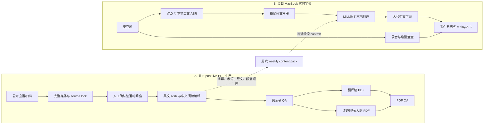
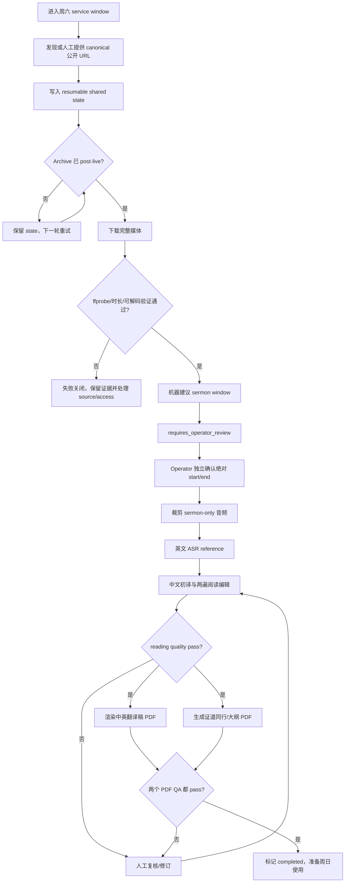
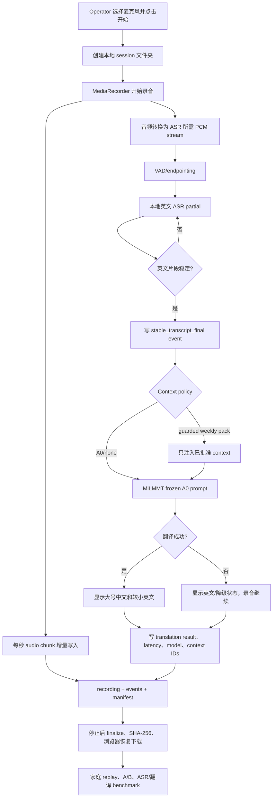
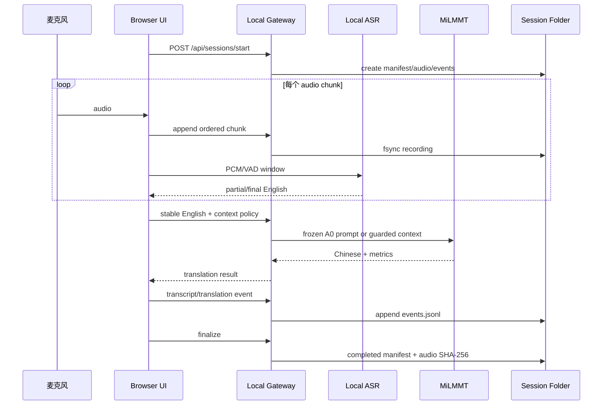

# 周六 PDF 生产与周日实时字幕：完整工作流

这份 README 是项目的 workflow source of truth。它只描述两条面向 operator 的主路径，并明确区分当前已验证能力、尚未接入能力和估算值。

状态定义：

- **Working：** 已经有代码、测试或真实产物证据。
- **POC：** 核心路径可运行，但仍包含 fixture、人工步骤或未完成的现场门槛。
- **Discovery：** 只有方案或局部实验，不能描述成端到端能力。

## 总体关系

核心边界：

- 周六路径的目标是生成经过 QA 的 durable 文档。
- 周日路径的目标是低延迟显示，同时保留足够录音和日志供回放、A/B 与后续训练。
- 周日实时录音不能依赖 ASR 或翻译成功；模型失败时继续录音，并显示英文或降级状态。
- 周六 content pack 是可选增强；`A0 / none` 始终保留为可比较基线。

## A. 周六：直播/归档到两个 PDF

### 完整流程图

### Canonical 输入与产物

| 阶段 | 必须保留的证据 |
|---|---|
| Source | canonical URL、service date、source ID、完整媒体 hash/时长 |
| 人工边界 | operator、绝对 start/end、审批时间、绑定的 source hash |
| ASR/阅读稿 | ASR reference、分段英文、中文阅读稿、prompt/model/version |
| QA | reading quality report、两个 PDF QA report、run status |
| 最终交付 | `sermon_zh_en_reading.pdf`、`sermon_interpretation_zh.pdf` |

`sermon_zh_en_reading.pdf` 是翻译稿/阅读版。`sermon_interpretation_zh.pdf` 是证道同行/大纲，只保留核心信息、结构、经文背景、神学重点、例证与必要的牧养辨析；不加入讨论题或与证道无关的应用任务。

### 周六内容如何服务周日

周六英文字幕、候选中文、术语、经文引用和段落顺序可以转换成短期 `weekly-pack.json`：

1. 以稳定 caption segment 为一条 JSONL，保留 `segmentId`、时间、英文、中文状态、术语和经文引用。
2. 按周六演讲顺序生成一张 ordered sermon map。
3. 机器中文只能作为 candidate；只有 reviewed/corrected/approved 内容可以进入 live prompt。
4. 周日先运行 `A0 / none`，再用相同录音回放 `weekly_terms_v1` 或 `saturday_alignment_v1`。
5. 每次翻译记录命中的 context ID、policy、cursor、模型和延迟，保证 A/B 可复现。

## B. 周日：MacBook 麦克风到实时中文字幕

### 完整流程图

### 运行时 sequence

### 当前实现状态

| 能力 | 状态 | 说明 |
|---|---|---|
| 麦克风选择、音量、开始/停止 | Working | 已用真实浏览器麦克风验证 |
| 增量录音、events、manifest、SHA | Working | 每次启动建立独立 session 文件夹 |
| MiLMMT A0/Ollama translation | Working | 冻结 prompt，`contextPolicy=none` 基线 |
| 大号中文、英文 sidecar、手机宽度 | Working | 单页 UI；手机第二屏同步尚未实现 |
| 本地英文 ASR | Discovery | `whisper-cli` runtime 已安装；production model 尚未选择和 benchmark |
| 周六 content pack | POC | builder/retriever 已有；尚未做现场 A/B |

## ASR + 翻译总延迟预算

### 已观测证据与假设

- 测试机器：MacBook Pro，Apple M1 Max，64 GB unified memory。
- MiLMMT A0：`sermon-milmmt-46-4b-v1-q8:benchmark`，Ollama 本地运行。
- 2026-09-03 的 14 个成功本地翻译事件中，warm translation 约为 p50 `0.39s`、p95 `0.48s`；首次冷请求观测为 `1.45s`。
- 这组 translation 数据使用固定英文 fixture，不包含麦克风、VAD 或 ASR 时间，样本量也不足以成为 production SLO。
- `whisper.cpp` runtime 当前可用，但 production English model artifact 尚未锁定，因此 ASR 数字是工程预算，不是实测 benchmark。

### 预算拆分

| 阶段 | Warm 预算 | 证据状态 |
|---|---:|---|
| VAD/等待一句话稳定 | 0.6–1.2s | 设计值，取决于 silence threshold |
| 2–4 秒英文片段的本地 ASR | 0.3–1.0s | 待 benchmark 的目标区间 |
| MiLMMT A0 翻译 | 0.29–0.48s | 小样本本地实测；cold 约 1.45s |
| Gateway、日志和 UI 更新 | 0.05–0.15s | 工程预算 |

因此需要区分三个数字：

1. **ASR + 翻译纯计算：约 0.6–1.5 秒（warm）。**
2. **从一句话结束到稳定中文字幕：约 1.2–2.8 秒（warm）。**
3. **从一句话第一个词开始计算：约 2.7–5.8 秒**，因为还包含 1.5–3 秒的语音积累/分段时间。

冷启动时，模型加载可能把一次结果推到约 2.4–3.8 秒（从句末算）。现场开始前应预热 ASR 和 MiLMMT；目标门槛建议定为句末到稳定中文 `p50 <= 2.5s`、`p95 <= 4.0s`，再由真实 benchmark 校准。

### ASR benchmark 必须回答的问题

保持简单，只比较两个第一阶段候选：`whisper.cpp base.en` 与 `small.en`。使用同一批真实周六/周日录音片段，记录：

- WER，以及 Scripture/人名/地名/教会术语的 entity accuracy。
- 2 秒、4 秒、8 秒片段的 RTF、p50/p95 inference latency。
- 不同 VAD silence threshold 下的句末到 final latency。
- 噪音、音乐、远场麦克风和讲员停顿时的删除/重复/幻觉。
- 与 MiLMMT 串联后的句末到中文 p50/p95，以及是否丢 chunk。

选择标准不是单独追求最低 WER，而是在术语准确度、稳定性和句末延迟之间取平衡。结果应写入 `artifacts/asr-benchmark/<run-id>/`，并保留模型 hash、参数、音频 hash 和逐片段 JSONL。

## 测试与完成标准

### Unit

- audio chunk/event 顺序、session finalize 与 SHA。
- ASR 输出 parser、VAD endpoint、稳定片段去重。
- Gateway request/response、context policy 与翻译失败降级。

### Integration

- 固定音频 fixture → ASR → MiLMMT → caption event → session artifacts。
- 同一音频分别运行 A0 和 content-pack variant，验证输入完全相同。
- 模型失败、Gateway 重启和磁盘写入失败时，录音仍保留或明确进入 browser fallback。

### 真实 E2E

- 真实麦克风至少运行 10 分钟，再进行一次完整 sermon soak。
- 音频可解码、chunk/event sequence 连续、manifest completed、SHA 匹配。
- English final 和 Chinese result 均可见，p50/p95 达标，无静默丢段。
- 录音可以在家中 replay，并复现相同 ASR/翻译版本的结果。

周日 live path 只有在本地 ASR 实测通过、端到端延迟达标、完整 sermon soak 无丢段、operator runbook 完成后，才可以从 POC 升级为 Working/production-ready。

## 相关实现

- [本地 live POC](../../experiments/local-live-poc/README.md)
- [POC 设计](../../experiments/local-live-poc/DESIGN.zh.md)
- [稳定 post-live PDF 工作流](../stable-post-live-reading-pdf-workflow.zh.md)
- [本地周末生产 runbook](../codex-local-production-runbook.zh.md)
- [完整文档索引](../README.zh.md)
