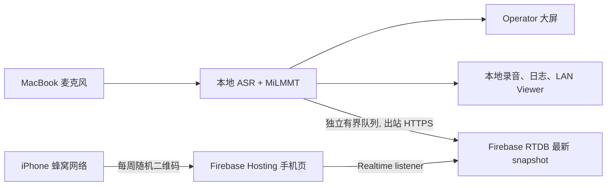

# Firebase 公网字幕：实现与审核

## 结论

当前 POC 继续选 **Firebase Hosting + Realtime Database**，但实现边界比早期草案更严格：

- MacBook 本地 Gateway 通过独立后台队列，只向 RTDB 发布最小字幕 snapshot；
- 手机通过 Firebase Hosting 的 `/s/<random-token>` 页面只读订阅；
- 公网 partial 限制为约 `2 Hz`，final 不节流；
- 云端失败只改变 `publicViewer` 健康状态，不阻塞本地 ASR、翻译、录音或局域网 viewer；
- 不上传音频、完整日志、模型参数、content pack、本地路径或控制接口。

Firebase 官方把 Realtime Database 定位为适合简单数据模型和低延迟同步的 JSON 数据库；虽然官方一般建议新项目优先考虑 Firestore，但这个项目只有“一个发布者、一个小 snapshot、多位只读订阅者”，正好是 RTDB 更简单的边界。[Firebase: Firestore 与 Realtime Database 比较](https://firebase.google.com/docs/database/rtdb-vs-firestore)

## 已建立的最小实现



关键文件：

- `backend/firebase_publisher.py`：投影、2 Hz partial 节流、后台队列、OAuth REST 写入和健康指标。
- `firebase/public/`：只读手机字幕页，支持自动、竖屏、横屏和全屏布局。
- `firebase/database.rules.json`：默认拒绝、过期读取、publisher claim、字段白名单、长度和 sequence 校验。
- `firebase/firebase.json`：Hosting rewrite、安全响应头和 Emulator 配置。

生产发布器使用 `gcloud auth application-default print-access-token` 获取短期 Google OAuth access token，并缓存 45 分钟；token 只进入 `Authorization` header，不写日志。Firebase 官方支持用 OAuth2 bearer token 调用 RTDB REST，并明确警告 service-account 凭据不能提交到仓库或暴露给客户端。[Firebase RTDB REST authentication](https://firebase.google.com/docs/database/rest/auth)

## 数据协议

RTDB 每个 viewer token 只保存一个可覆盖的最新状态：

```json
{
  "schemaVersion": 1,
  "status": "live",
  "sequence": 42,
  "previousFinal": {
    "segmentId": "seg-000041",
    "sourceTextEn": "We walk by faith, not by sight.",
    "targetTextZh": "我们凭信心而行，不凭眼见。"
  },
  "active": {
    "segmentId": "seg-000042",
    "sourceTextEn": "That changes how we face tomorrow.",
    "targetTextZh": "这改变了我们面对明天的方式。",
    "phase": "streaming"
  },
  "publishedAt": 1788566400000,
  "expiresAt": 1788580800000
}
```

手机订阅整个小 snapshot，而不是累计消息列表。这样首次打开和重连都立即得到当前可读状态，不需要 replay 历史。浏览器 Web SDK 会在连接期间维持本地状态并在恢复连接后同步最新数据，但 Web 端不会跨页面关闭持久保存离线写入；本项目 viewer 只有读取，不依赖离线写入。[RTDB Web read/write and offline behavior](https://firebase.google.com/docs/database/web/read-and-write) · [RTDB connection state](https://firebase.google.com/docs/database/web/offline-capabilities)

## 安全审核

### 已满足

- 根路径默认 `.read=false`、`.write=false`。
- Viewer 只能读取一个随机 token 节点；节点过期或 `revoked` 后 Rules 拒绝读取。
- 客户端写入要求 `captionPublisher` custom claim；服务端 OAuth 写入由 IAM 管理。
- Rules 限制 schema、phase、最大文本长度、过期时间不超过 24 小时，并拒绝未知字段。
- Hosting 设置 `no-store`、`no-referrer`、`nosniff` 和 `DENY` frame header。
- Firebase web config 是公开配置，不包含写权限；OAuth token 和 service-account 文件不得进入前端或 Git。

Security Rules 是服务端执行的声明式访问控制，验证结构应使用 `.validate`；Firebase 官方建议通过 Emulator Suite 对 allow/deny case 做完整测试。[Rules core syntax](https://firebase.google.com/docs/database/security/core-syntax) · [Rules validation](https://firebase.google.com/docs/database/security/rules-conditions) · [Rules unit testing](https://firebase.google.com/docs/rules/unit-tests)

### 部署前仍需完成

- 当前 Mac 没有 Java runtime，因此本轮无法实际启动 RTDB Emulator；Rules 文件已建立，但不能宣称 emulator 验证通过。
- 创建独立 Firebase dev project 后，必须安装 Java，再运行 Rules allow/deny 测试。
- 为发布用 service account 只授予目标 RTDB 所需的最小 IAM 权限；不要使用个人 Owner 凭据作为周日常态。
- GCP/Firebase Console 中设置预算告警、dev/prod 分离、数据库区域和 24 小时清理任务。
- 随机 URL 是适合公开聚会的临时 bearer link，不适合敏感或会员内容；需要敏感访问时改为观众身份验证。

## 市面成熟实时方案比较

| 方案 | 优点 | 代价 / 风险 | 当前判断 |
|---|---|---|---|
| Firebase Hosting + RTDB | 静态 HTTPS、浏览器实时 listener、当前状态恢复、Rules、GCP 体系内；不用维护 WebSocket server | 按下载流量计费；Spark 只有 100 个同时连接；token-link 只适合公开内容 | **POC 默认** |
| Cloud Firestore | Firebase 官方推荐的新项目数据库；自动扩展、查询和更高典型可用性 | 当前字幕持续覆盖一个 document，会引入按 read/write 计费和不必要的数据模型复杂度 | 如果以后要可查询历史、多个会场或运营后台再考虑 |
| Ably / Pusher Channels | 成熟托管 pub/sub、重连、channel auth、presence 和可观测性 | 需要额外供应商、channel 授权后端；“最新状态”持久恢复需另加 history/state | 观众数大、跨区域 SLA 成为核心时再评估。Pusher 的 private channel 必须通过授权端点。[Pusher Channels](https://pusher.com/docs/channels/) |
| Supabase Realtime Broadcast | WebSocket Broadcast、RLS 授权、REST 发布；可与 Postgres 历史数据结合 | 多出 Postgres/RLS/Realtime 管理；按每位订阅者收到的 message 计费 | 已采用 Supabase 时很合理；当前 GCP 项目没有必要换栈。[Supabase Broadcast](https://supabase.com/docs/guides/realtime/broadcast) |
| Cloudflare Durable Objects | 单房间状态和 WebSocket 很自然；Hibernation 可降低闲置成本 | 要自己实现认证、重连、snapshot、清理和运维；Paid plan 有最低月费 | 大规模互动字幕房间可考虑；当前只读 POC 过度设计。[Durable Objects pricing](https://developers.cloudflare.com/durable-objects/platform/pricing/) |
| Cloud Run WebSocket/SSE | 完整服务端控制、IAM 和自定义审计 | 需要连接重连、共享状态和扩缩容设计；比 RTDB 多一层运行服务 | 只有需要签发/撤销/审计 API 时再增加 |

Firebase Spark 的 RTDB 免费档是 `100` 个同时连接、`1 GB` 存储、`10 GB/月` 下载；Blaze 是每 database 约 `200,000` 个同时连接，免费 `1 GB` 存储和每天 `360 MB` 下载，超出后 RTDB 下载为 `$1/GB`。[Firebase pricing](https://firebase.google.com/pricing) 因此现场目标达到 100 位观众时不能依赖 Spark 的刚好 100 连接上限，应使用 Blaze 并设预算告警。

## 成熟字幕产品设计比较

| 成熟模式 | 可借鉴点 | 不直接照搬的部分 |
|---|---|---|
| Google Live Transcribe | 文本字号可调、音量指示、可暂时 hold 阅读、支持 custom words | 它是完整滚动 transcript；我们的第一目标是远距离大字，不把历史列表放主屏。[Google Live Transcribe](https://support.google.com/accessibility/android/answer/9158064) |
| Google Live Caption | caption box 可在 2–12 行之间展开，也允许调整尺寸与样式 | 它覆盖在媒体之上并可拖动；我们的手机页是专用全屏，无需拖动浮窗。[Google Live Caption](https://support.google.com/accessibility/answer/9350862) |
| Microsoft Teams captions | 桌面可调字号、颜色、位置和行数；移动端可调颜色、背景和高度 | Teams 的 meeting chrome 和设置层级对扫码即看过重。[Microsoft Teams live captions](https://support.microsoft.com/en-us/teams/meetings/use-live-captions-in-microsoft-teams-meetings) |
| W3C live caption styles | 支持 paint-on、pop-on 与 roll-up 的混合；可按内容选择表现 | 连续 roll-up 会压缩字号并增加移动；本项目保留“当前句 paint-on + 前一句 final”即可。[W3C media accessibility requirements](https://www.w3.org/WAI/PF/media-accessibility-reqs/) |

当前 B 设计保留成熟方案最有价值的三个共同点：状态始终可见、用户能调显示模式、断线时保留最后字幕；同时坚持本项目特有的“当前中文最大、英文核对、仅保留前一句 final”。

## 延迟与费用预估

RTDB 的实际公网延迟必须用 `localFinalAt → cloudPublishedAt → viewerRenderedAt` 实测，不能从官方文档推断一个保证值。工程目标先定为：

- MacBook snapshot ready → RTDB write ack：p50 `<150 ms`，p95 `<500 ms`；
- RTDB ack → iPhone render：p50 `<150 ms`，p95 `<500 ms`；
- 公网分发新增 p95 `<1 s`，且不计入本地模型 latency。

当前典型双层 snapshot 约 `420 bytes`。以 2 小时、2 Hz partial 粗估，仅 payload：

| 同时观众 | payload 下载 | 加上协议/重连后的保守区间 | 单场 Blaze 量级 |
|---:|---:|---:|---:|
| 25 | 约 0.15 GB | 约 0.2–0.4 GB | 通常接近每日免费量 |
| 50 | 约 0.30 GB | 约 0.4–0.7 GB | 约 `$0–$0.34` |
| 100 | 约 0.61 GB | 约 0.8–1.2 GB | 约 `$0.44–$0.84` |

这是容量估算，不是账单承诺；RTDB 计费下载包含协议和加密开销，Firebase Console Usage 才是事实来源。[RTDB billing metrics](https://firebase.google.com/docs/database/usage/billing) 将 public partial 从 5 Hz 降至 2 Hz，100 人两小时的 payload 从约 1.51 GB 降至约 0.61 GB，也是本轮审核后最重要的成本修正。

## 部署步骤

1. 在 GCP 中创建独立 Firebase dev project，启用 Hosting 和 RTDB；选择离加州观众最近、组织允许的数据库区域。
2. 复制 `firebase/.firebaserc.example` 为未提交的 `firebase/.firebaserc` 并填写 project ID。
3. 安装 Java 与 Firebase CLI，先用 `demo-*` project 运行 Emulator 和 Rules 测试；Firebase 官方推荐 demo project 防止误触生产资源。[Connect to RTDB Emulator](https://firebase.google.com/docs/emulator-suite/connect_rtdb)
4. 部署前设置预算告警；Hosting 默认提供 SSL、CDN 和 `web.app` / `firebaseapp.com` 域名。[Firebase Hosting quickstart](https://firebase.google.com/docs/hosting/quickstart)
5. 配置本地环境变量：

```bash
export LOCAL_LIVE_FIREBASE_DATABASE_URL="https://PROJECT-default-rtdb.firebaseio.com"
export LOCAL_LIVE_FIREBASE_VIEWER_URL="https://PROJECT.web.app"
gcloud auth application-default login
```

6. 启动周日 POC。Gateway 健康响应中的 `publicViewer.configured` 应为 `true`；开始录音后二维码优先使用公网 URL，LAN URL 仍保留为 fallback。
7. 用 iPhone 关闭 Wi-Fi，只开蜂窝网络完成 60 分钟测试；验证重连、横竖屏、final 不丢、云断线不影响本地录音。

## 当前验证边界

- 已完成 Python projection、节流、后台失败隔离测试。
- 已完成手机页 demo 视觉实现，可在本地浏览器审核。
- 未创建或修改任何 Firebase/GCP 云资源，未产生云费用。
- 未运行 Emulator Rules 测试：当前 Mac 缺少 Java runtime。
- 未做真实蜂窝网络和 RTDB 延迟测试；这两项仍是上线前 P0 gate。
