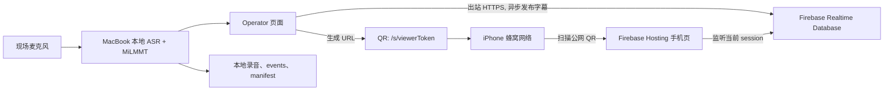

# 周日实时字幕公网分享方案

## 结论

手机不需要连接教会 Wi-Fi。二维码应指向一个公网 HTTPS 页面，MacBook 继续在本地完成麦克风采集、ASR 和翻译，只把最小字幕事件通过**出站连接**发送到 Google Cloud。

POC 首选：

- **Firebase Hosting**：托管手机字幕页和稳定的公网 URL。
- **Firebase Realtime Database**：把当前字幕实时推送给手机浏览器。
- **Keyless service account + Security Rules**：MacBook 用短期 OAuth token 写入；扫码观众只读。

当前同 Wi-Fi SSE viewer 保留为局域网兜底。第一版不把 MacBook 端口暴露到公网，也不使用路由器端口转发或公网 tunnel。

## 最小架构



这条公网支路不能阻塞本地字幕：云端发布失败时，本机字幕、录音和日志继续运行，只在 operator 页面显示“公网分享已断开”。

## 为什么先选 Firebase，而不是直接暴露 MacBook

Firebase Realtime Database 的 Web listener 在连接时取得一次当前状态，之后在数据变化时继续收到更新，正好对应“一个发布者、多个只读观众”的字幕分发。Security Rules 可以分别限制 `.read`、`.write` 和数据结构校验。[Realtime Database Web listener](https://firebase.google.com/docs/database/web/read-and-write) · [Security Rules](https://firebase.google.com/docs/database/security)

直接暴露 MacBook 会让现场电脑成为公网 origin，还会受到网络 NAT、venue firewall、IP 变化和本机进程故障影响。让 MacBook 只发起出站 HTTPS，不要求手机和 MacBook 位于同一局域网，风险和现场配置都更小。

Google Cloud 的几个候选组件边界如下：

| 组件 | 本项目用途 | 第一版判断 |
|---|---|---|
| Firebase Hosting | 公网手机前端、HTTPS、可选自定义域名 | 使用 |
| Firebase Realtime Database | 当前字幕与少量最近 final 的实时 fan-out | 使用 |
| Keyless service account / Rules | 本地 publisher 短期身份、viewer 只读与字段校验 | 使用 |
| Cloud Run | 后续增加受控 ingest API、审计或更强身份验证 | 暂不需要 |
| Memorystore for Redis | 多个 Cloud Run WebSocket instance 之间同步 | 不使用 |
| Pub/Sub | 后端异步消息，不是浏览器字幕接口 | 不使用 |
| API Gateway | REST API 管理，不负责当前的实时 viewer | 不使用 |

## 公网 URL 与 session

录音开始后生成：

```text
https://captions.example.org/s/<viewerToken>
```

`viewerToken` 使用至少 128 bit 的安全随机数，不使用日期、递增 ID 或本地 session ID。二维码只包含这个公网 URL。

Realtime Database 只保存公网显示所需字段：

```json
{
  "sequence": 42,
  "zh": "我们因信而行，不凭眼见。",
  "en": "We walk by faith, not by sight.",
  "phase": "final",
  "publishedAt": 1788566400000,
  "expiresAt": 1788580800000
}
```

不上传音频、完整日志、模型控制接口、后台 restart 接口、content pack 或本地文件路径。`sequence` 必须单调递增，手机忽略迟到的旧事件。

## 权限与过期策略

- 本机用户登录 `gcloud` 后 impersonate 专用 publisher service account，运行时只生成短期 OAuth token，不保存 JSON key。
- OAuth publisher 会绕过数据 Rules，因此 dev project 使用独立身份和 Firebase RTDB 专用预定义角色；观众读取和数据结构仍由 Rules 限制。
- Viewer 不需要账户，只能读取随机 token 对应的 session；URL 本身是临时 bearer link，适用于公开聚会字幕，不适合敏感内容。
- Rules 校验允许字段、类型、最大字符串长度、单调 sequence 和 `expiresAt`；默认拒绝其他路径。
- Session 结束后立即标记 `ended`，默认 4 小时后不可读，24 小时内清除云端字幕数据。
- 不在普通日志中记录完整 viewer token；operator 页面提供“重新生成分享链接”，旧 token 随即失效。
- 正式部署前使用 Firebase Local Emulator Suite 测试 Rules 的允许与拒绝 case。

Firebase 默认可以拒绝所有访问；如果为了调试临时打开 public access，任何人都可能访问数据库，因此不能把 test mode 当成部署配置。[Firebase Rules 基础](https://firebase.google.com/docs/rules/basics)

## 手机端横屏 / 竖屏设计

手机的字幕层级、当前句流式规则和前一句双语保留方案见 [实时字幕显示方案](./CAPTION_DISPLAY.zh.md)。

手机页保持一个页面，默认跟随设备方向，同时提供明确的两个按钮：

- **竖屏布局**：中文 2–4 行，尽量占满宽度；英文保持较小字号。
- **横屏布局**：中文优先 1–2 行并继续放大；英文在下方，可由用户隐藏。
- **进入全屏**：减少浏览器地址栏占用。

按钮首先切换**页面布局**，并把选择保存在 `sessionStorage`。浏览器支持时，可以在用户点击且进入全屏后尝试 `screen.orientation.lock()`；失败时仍然完成布局切换。Web Screen Orientation lock 不是所有主流浏览器都支持，而且通常只允许在移动设备的全屏上下文使用，因此不能把物理旋转作为必需条件。[MDN Screen Orientation lock](https://developer.mozilla.org/en-US/docs/Web/API/ScreenOrientation/lock)

状态区只显示：`直播中 / 正在重连 / 已结束`、最后更新时间和网络状态。断线时保留最后一条字幕并标记“正在重连”，不能清空为白屏。

## 更新频率与延迟

- `final` 立即发布。
- 流式中文 partial 最多每秒发布 2 次，并沿用本地“只追加、不回写”的稳定规则。
- 每个 token 只覆盖一个小 snapshot，其中包含当前句和前一句 final；不累计整场历史。
- 公网发布使用独立有界队列；满载时丢弃旧 partial、保留最新 partial 和所有 final。
- 增加 `localFinalAt`、`cloudPublishedAt`、`viewerRenderedAt` 三个时间点，测量云分发延迟，但不放入模型关键路径。

建议新增的公网体验指标：

- MacBook 字幕完成 → 云端写入 p50/p95。
- 云端写入 → 手机 render p50/p95。
- 在线 viewer 数、重连次数、过期事件丢弃数。
- 公网分享可用率，以及分享故障是否影响本地录音（目标必须为 0 次）。

## 什么时候增加 Cloud Run

如果后续需要服务端签发 session、撤销链接、审计 operator，或不希望浏览器直接拥有 Firebase 写权限，可增加一个 Cloud Run ingest：

```text
MacBook local gateway -> authenticated Cloud Run ingest -> Realtime Database -> phones
```

MacBook 仍只发起出站请求。手机继续使用 Hosting + Realtime Database，不需要连接 Cloud Run WebSocket。

Cloud Run 本身支持 WebSocket，但每条连接仍受 request timeout 约束，最大 60 分钟，客户端必须能够重连；session affinity 也是 best effort，多 instance 还需要共享状态。因此不建议第一版做“Cloud Run 内存中的 WebSocket 房间”。[Cloud Run WebSockets](https://cloud.google.com/run/docs/triggering/websockets) · [Cloud Run request timeout](https://cloud.google.com/run/docs/configuring/request-timeout)

如果未来改用 Cloud Run SSE，观众方向只有 server → client，SSE 已足够；只有当手机也需要持续、低延迟地向服务端发送互动事件时才需要 WebSocket。

## 分阶段实现

### P0：公网只读字幕

1. 新建独立 Firebase project 的 dev 环境，启用 Hosting、Realtime Database 和 IAM Credentials API。
2. 实现手机单页、响应式方向和手动布局按钮。
3. Operator 页面生成公网 URL 和 QR，只异步发布最小字幕 projection。
4. 编写并用 Emulator 验证 Rules、TTL、旧 sequence 和超长字段拒绝测试。
5. 用一台 iPhone 关闭 Wi-Fi，仅用蜂窝网络完成 60 分钟 E2E。

### P1：运行加固

1. 增加断线重连、bounded queue、公网延迟日志和 viewer stale 状态。
2. 验证 10、50、100 台模拟 viewer 的带宽、更新频率和费用。
3. 配置自定义域名、预算告警和 dev/prod 隔离。
4. 现场断 Internet 时自动回退到当前 LAN viewer，并明确显示分享模式。

### P2：需要时才增加 Cloud Run

增加 session 签发、撤销、强身份验证和审计；不改变本地 ASR、翻译、录音或手机显示协议。

## 验收标准

- iPhone 关闭 Wi-Fi 后，扫码可在蜂窝网络打开字幕。
- 横屏布局、竖屏布局、自动方向和全屏 fallback 都可操作。
- 手机断网 30 秒后恢复，自动追到最新 `sequence`，不重复、不倒退。
- 云发布进程失败时，本地字幕、录音和 session finalize 不受影响。
- Viewer 无法调用任何控制、录音、日志、模型或 restart 接口。
- 过期/撤销链接不可继续读取；未知 token 不泄露 session 是否存在。
- 完整 60 分钟测试记录本地模型延迟与公网分发延迟，两者分别统计。

## 当前状态

Firebase publisher、Hosting 手机页、RTDB Rules 和本地测试骨架已经在 `codex/caption-display-design` 分支建立；详细审核、竞品比较、成本修正与部署步骤见 [Firebase 公网字幕：实现与审核](./FIREBASE_PUBLIC_VIEWER.zh.md)。

独立 Firebase dev project `ai-for-god-caption-dev`、`us-central1` RTDB、锁定 Rules 和 Hosting 已部署；本地 `runtime.env` 已配置，开始录音后二维码会优先使用公网 viewer，LAN URL 仍作为 fallback。真实公网 E2E 已验证，正式现场前仍需完成蜂窝网络和长时间测试。
