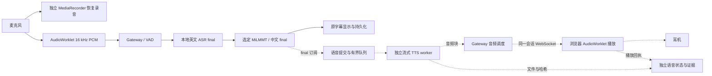

# 实时中文语音传译：产品调研与实施方案

调研日期：2026-09-05（America/Los_Angeles）。代码基线：`main@752910d`。
状态：Discovery / 设计草案；本文件没有启用 TTS、运行语音实验或扩大模型验收范围。

2026-09-06 用户提出现场改用手机采音、远端推理、多人收听；该部署与产品方向见 [手机采集与远端传译方案](../mobile-live-translation/PLAN.zh.md)。本文件保留为本地 TTS 能力和工程对照方案，不能据此要求现场必须携带 MacBook。

建议先做 **MacBook 单向英语证道 → 中文耳机听译**：沿用现有 ASR、翻译和字幕链路，增加独立的流式 TTS、有限播放队列和实际播出观测。第一版使用固定中文音色；手机后台收听、声线复刻、云端语音模型列为后续独立实验。

v4.1 仍是神学质量门未通过的实验候选。声音会放大误译的影响，因此接通声音不等于可交给会众使用；其 `experimental_local_only`、无 LAN/Firebase 发布和来源约束继续适用。原 Q8 字幕默认项保持不变。

## 1. 产品实际采用什么方式

以下区分官方披露、研究原型和本项目设计推导；产品发布日期不等于本机已具备该能力。

| 对象 | 已核实的实现或交互 | 对本项目的意义与限制 |
|---|---|---|
| Meta Ray-Ban / Oakley 眼镜 | 2025-11-14 官方复盘明确：五麦阵列/波束成形，ASR → 文本翻译 → TTS，各阶段流式推进；当时离线路径在眼镜端计算。公布从 5+ 秒降到 2.7 秒。[技术复盘](https://www.meta.com/blog/live-translation-ai-glasses-deep-dive/) | 分层流水线能够产品化。2.7 秒未给测量端点、语言对或分位数，不能当作英中 POC 目标的已知下限。 |
| Meta 当前语种能力 | 当前支持页列 20 种在线语言，含普通话；离线仅英、西、法、意、葡、德，须预下载。配对、语言选择和文字展示依赖手机 App。[当前支持页](https://www.meta.com/help/ai-glasses/955732293123641/) | 英中需要网络。新增在线语种的眼镜/手机/云端计算分配未披露，不能把旧版全端侧结论套到普通话。 |
| Google Translate | Listening、Conversation、Text only 分离；2026-09-04 更新已支持 Android 后台/锁屏继续听译，iOS 后台仍待推出，iOS 听筒输出已推出。[模式说明](https://support.google.com/translate/answer/6142474?co=GENIE.Platform%3DAndroid&hl=en)、[最新更新](https://blog.google/products-and-platforms/products/translate/google-translate-ios-android-upgrades/) | 连续证道适合 Listening。原生 App 的后台能力不能推定 Safari/Chrome 网页也具备。 |
| Gemini 3.5 Live Translate | 2026-06-09 发布连续语音到语音模型；70+ 语言，在上下文与跟随速度之间折中。Translate App 推出，开发者 API 为 public preview，Meet 扩展版当时为 private preview。[发布说明](https://blog.google/innovation-and-ai/models-and-research/gemini-models/gemini-live-3-5-translate/) | 可作为独立云端对照；公开的音频接口不证明内部没有中间文本，也不说明使用哪篇旧研究的架构。 |
| Google Meet | 当前通用帮助列英↔法、德、印地、意、葡、西，未列中文；新版预览不能视为所有账号已可用。[Meet 帮助](https://support.google.com/meet/answer/16221730?hl=en) | 适合借鉴翻译状态、轮流回应等交互，不作为当前英中证道的直接依赖。 |
| 研究：Seamless / SimulTron | Meta SeamlessStreaming 的 EMMA 按可用上下文决定输出；Google 作者的 SimulTron 是可调等待的端侧直接语音翻译原型，曾部署 Pixel 7 Pro。[Seamless 论文](https://arxiv.org/abs/2312.05187)、[SimulTron 论文](https://arxiv.org/abs/2406.02133) | 借鉴“等待多少上下文”必须实验比较的思想。研究成绩不能冒充眼镜/Translate 的商业架构或本机延迟。 |

这些来源没有提供可直接替代本项目验收的 30–60 分钟英中证道数据，尤其没有神学术语、累计漏译、持续落后和实际耳机输出的联合结果。

## 2. 采用的实践与路线选择

以下是基于调研和现有代码作出的本项目设计，不是厂商已公开的内部机制。

| 可采纳的实践 | 第一版具体做法 |
|---|---|
| 把持续听译与对话分开 | 固定 EN → 简体中文；持续采集，耳机播放；不加助手问答、自动回应或轮次 VAD。 |
| 已播出的内容无法撤回 | 只让成功的 `translation.final` 进入播报；`asr.partial`、`translation.partial`、显示动画和失败翻译均不能触发声音。 |
| 少等待，同时保留含义 | 先测每条 final 原样播报的基线，再单独比较语音短句合并。否定、数词、经文和未完关系从句要列入检查，不能为缩短延迟省略。 |
| 声音与文字并行 | 字幕按原链路显示；TTS 失败、静音或耳机断开时字幕和恢复录音继续。显示正在播报的译文，区分它与当前最新字幕。 |
| 关注整个会话的落后程度 | 同时测首音、持续内容延迟、TTS 运算速度、待播音频秒数和未播文本年龄。不能只报 TTFA。 |
| 显示实际能力 | 区分模型加载、可播、缓冲、播放、落后、暂停、失败；没有播放设备或浏览器未解锁音频时不能显示“正在听译”。 |
| 声线稳定优先 | 首轮固定普通中文音色；译义、发音和可懂度先于模仿讲员声线。 |

| 路线 | 优点 | 主要代价 | 决定 |
|---|---|---|---|
| A：现有本地 ASR → MiLMMT → 流式 TTS | 复用已接入的模型身份、英文 final、录音和字幕证据；可分别定位错误 | 三模型竞争本机算力；短片段不一定适合听；需实现播放和积压控制 | **先做** |
| B：独立 Gemini Live Translation 音频实验 | 可直接连续输入/输出语音，作为外部体验与延迟对照 | 需要上传源音频；预览 API、网络和成本；无法注入现有 Context Pack 指令；文本契约需另验 | 准备接口笔记，后续明确选择此云端实验后再运行 |
| C：本地直接 S2S 研究模型 | 有机会联合优化延迟和韵律 | 新模型、部署资源、中文质量和来源对齐均须重新验证 | 暂不进入第一版 |

路线 B 的当前接口能力：`gemini-3.5-live-translate-preview`、目标 `zh-Hans`；输入 16 kHz/PCM16/mono，输出 24 kHz/PCM16/mono，建议 100 ms 输入块；可返回输入/输出转录。仅音频输入，无文本、tools 或 instructions；`echoTargetLanguage=false` 可避免复述目标语输入。转录的不可变 final、词级对齐和断线补发不能按现有 POC 协议假定。声线在长停顿或换人后可能变化。[API 指南](https://ai.google.dev/gemini-api/docs/live-api/live-translate)

## 3. 当前本机证据与延迟预算

现有实现与边界见 [v4.1 接入报告](benchmarks/MILMMT_V41_POC_INTEGRATION_20260905.zh.md) 和 [运行说明](MILMMT_V41_LOCAL.zh.md)。下列为已有产物复核，不是这次新跑的语音实验，也不保证当前服务在线。

| 已有测量 | 结果 | 不能据此推断 |
|---|---|---|
| v4.1 原始证道文件，1 倍速 45 秒、17 条 final | ASR final → 中文 final：p50 649 ms；输入片段末尾 → 中文 final：p50 1,963 ms、p95 2,195.8 ms | 没有声音；不是耳机或浏览器实际播出延迟，也不是现场声学证明 |
| Qwen3-TTS 1.7B CustomVoice 8-bit，已有分组合成 | 71.410 s 生成 / 107.20 s 成品音频，RTF 约 0.666 | 不是流式首音，也不是 ASR/MT/TTS 并发的余量 |
| 同模型，已有逐句合成 | 63.559 s / 103.38 s，RTF 约 0.615；排除插入静音后约 0.629 | 有限语料、模型加载不在其中，人工听感仍待验收 |

本地原始证据：`artifacts/benchmarks/v41-poc-integration-20260905/original-file-replay.events.jsonl`（本 POC 目录下；17 条 `translation.final.uxMetrics`，p95 使用线性插值）；根目录 `artifacts/sermon-dubbing/2026-09-05-fluency-poc-v2/build-report.json`。完整音频/日志保持 ignored。配音实验是测量依据，不自动成为实时路径或可注入的翻译资料。

**安装版本的流式限制：**当前 `mlx-audio 0.3.1` 的 Qwen3-TTS CustomVoice Python 路径支持 `stream=True` 和 `streaming_interval`；Base 的 `ref_audio + ref_text` ICL 分支不传这两个参数。现有 `mlx_audio.server` 的 speech 请求和调用链也没有传递它们，HTTP `StreamingResponse` 本身不代表模型早出音。该版本流式结果的部分时间字段是零占位，必须自行记录单调时钟；`speed` 也不能未经核验就当成有效提速控制。以上来自本机已安装代码，不能用 [上游最新流式指南](https://github.com/Blaizzy/mlx-audio/blob/main/docs/guides/streaming.md) 覆盖版本差异。

第一版采用独立、固定版本的 TTS worker，通过 Python 流式生成接口取音频；不升级或复用正在承担 ASR 的 HTTP 服务来试错。导入 MLX、加载模型、生成与同步由同一 worker 线程负责。进程分开有利于故障隔离，但不会隔离 GPU/统一内存竞争。

另外，安装版本的 `_generate_audio` 在恰好整块结束时存在继续进入全量 yield 的静态风险；不能把后续全量结果再次当新音频播放。P0 必须覆盖整块结束、尾块和空输出，按累计 sample offset 验证拼接无重复。这是代码审查发现，尚未通过实际生成复现。生成器没有显式取消参数，适配器需在 yield 边界检查取消，并对无响应 worker 设置超时；前端清空声音不能等待模型退出。

延迟拆分：

```text
输入片段末尾 → 耳机听到对应中文
  = ASR/翻译耗时 + 语音提交等待 + TTS 首块耗时
  + 前序声音等待 + 传输/浏览器缓冲 + 输出设备延迟
```

初始预算为：短句、模型已加载、无需额外合并且队列为空时，流式 TTS/播放新增 **1–3 秒**，总延迟争取 **3–5 秒**。这是待验证的工程目标，不是已有实测或 SLA；若采用整句合成后才播放，已有短句生成耗时提示新增约 3–6 秒，总计可能 5–8 秒。延迟分位数不能直接相加，合并等待和实际并发会改变结果。

RTF 定义为“生成耗时 / 生成音频时长”。RTF < 1 仅说明合成能够比自己的音频播放更快；即使生成瞬时完成，若每 10 秒英文对应 12 秒中文音频，播放仍会每分钟多落后约 12 秒。必须单独检查中文音频时长与源时间的比值。

## 4. 拟议架构与接入边界

图中虚线部分是新增方案；其余沿用现有 POC。当前任务不改变运行中的链路。



### 4.1 提交与内容对应

1. 在成功 final 已交给原字幕/持久化链路后，以非阻塞方式通知语音队列；`persistenceFailed`、空中文或失败结果禁止进入。禁止在翻译回调、录音写入或 ASR worker 内等待 TTS。
2. 首轮基线按单条 final 的中文原样合成，不朗读 token partial。记录每个原始 final ID、中文哈希和覆盖范围，避免断线重放导致重复声音。
3. 稳定文本不等于语义完整。基线先量化碎片发声问题；下一轮才比较有界相邻 final 合并，保持中文字符顺序与含义，不重写、不概括。不得把 UI 的 `readable_chunks` 提交直接当作语音语义完成证明。
4. 合并候选最多两条 final、最长等待暂定 3.2 秒，单列为实验变量；超时仍明显未完的片段标为 `unresolved_fragment` 并暂停语音，字幕继续。不能宣称这个启发式规则保证语义完整，也不能把这轮延迟套进无等待预算。
5. 数字/经文读法如需规范化，保留 `translationText` 和独立 `spokenText`、规则版本及映射；不能静默把生成译文改成另一个意思。否定关系、神学称谓、经文编号必须有人听审后才谈使用资格。

### 4.2 传输与播放

- 保留一个双向实时 WebSocket：上行仍为原 PCM；新增协商后的下行音频帧。REST 继续负责生命周期、健康和完整音频下载。单 Mac 首版不引入 broker、WebRTC 或浏览器直连模型。
- 在 `stream.start` / `stream.ready` 协商 `speechProtocol=local-live-speech-v1`、格式和会话身份；只有明确开启语音且支持协议的客户端收到二进制音频，旧字幕客户端保持兼容。
- 拟用版本化二进制封装：magic、头长度、有限 JSON 头和 PCM payload；头包含 session、epoch、unit、chunk sequence、采样率和采样偏移。小块传送，目标每块 100–200 ms；实际采样率读取 TTS 输出，不假设与输入 16 kHz 相同。
- Gateway 出站调度优先处理控制/字幕事件，音频有限额和发送超时；音频慢客户端不阻塞持久化。不得把整段 WAV/Base64 放入普通字幕事件或 Firebase。
- 浏览器使用独立播放队列/AudioWorklet；由用户点击“开启中文语音”解锁输出，先做耳机短测试。显示正在播放的内容和落后状态，暂停按钮始终可用。
- 先在 MacBook 耳机验证收音/输出隔离；不把合成语音送到房间扬声器，以免被再次识别。输出设备切换、蓝牙延迟和浏览器音频挂起均需实际检测/试验。

### 4.3 有限队列、停止和恢复

同时约束未合成文本数量、最老源片段年龄，以及已生成/已排程的待播音频秒数。初始未合成上限设为 8 个 unit 或 2,048 个中文字符，先触及者生效；长句本身超过上限时显式拒绝语音。音频块数本身不能代替播放积压。

| 状态或动作 | 拟议行为 |
|---|---|
| 正常 | 单个 TTS 生成任务；顺序播报，记录已合成、已排程和已播完的位置 |
| 开始落后 | 初值：待播 > 4 秒时显示落后；这些阈值是调试参数，不是验收结论 |
| 超出边界 | 初值：已知待播 > 10 秒、最老未播片段 > 12 秒或输入队列达到上限时，停止接纳语音并显式降级；字幕/录音继续 |
| 暂停收听 | 立即停止声音、取消当前 TTS 并清空待播；暂停期间不积压合成任务，记录该时间窗未播报 |
| 恢复收听 | 明示“从当前内容继续”；新 epoch，从之后的 final 开始，日志保留被跳过的 ID/原因 |
| 停止并保存 | 即刻停止播放、使旧 epoch 失效；原 ASR/翻译/录音仍按既有规则 drain/save，排空阶段的新 final 不再发声 |
| TTS/设备/连接失败 | 自动退回字幕；显示原因，不自动改模型、变声或播放旧缓存 |
| 重连/重启 | 语音保持暂停，用户重新开启；过期 epoch/chunk 一律拒绝，历史保存音频只供主动下载/回听 |

不通过静默丢句、摘要或任意加速掩盖积压。第一版固定播放速度；后续若试轻度变速，需独立验证可懂度、音调和设备支持，再决定是否提供给用户。

### 4.4 契约与落盘

新增能力采用独立 `local-live-speech-v1` 描述，不能改写既有不可变英文 final 或把老会话重新标为含语音成功。具体 JSON schema 在实现阶段加入。

| 对象 | 必需证据 |
|---|---|
| session speech config | enabled、协议版本、provider/model/weights/runtime/voice identity、采样格式、分段/排队策略、发布限制 |
| speech unit | sessionId、epoch、单调 unit sequence、源 ASR/translation final IDs、源时间范围、中文哈希、spokenText/规则哈希、幂等键 |
| audio chunk | unit/chunk sequence、sample offset/count、格式、生成时间；重复/缺口/越界拒绝规则 |
| playback acknowledgement | received、scheduled、started/ended、canceled/dropped 与原因、浏览器时钟/可观测性；无回执为 unknown，不能填零 |
| speech result | 合成音频文件/hash、完整/部分/取消/失败状态，覆盖与未播 ID，首音/持续延迟/积压/故障统计 |

音频与详细语音日志放在现有 ignored session 的独立 speech 子目录。核心录音 `completed` 只继承现有录音验收含义；另有 `speechStatus` 标明声音是否完成、暂停或失败。TTS 失败不能伪造语音完成，也不能单独否定已完好保存的源录音。

v4.1 会话在 Gateway 再次检查 `publicSharingAllowed=false`；音频不得绕过其本机限制。即使将来普通模型允许 LAN 音频，也需独立设计鉴权、带宽和设备验收，不能直接扩展现有公开字幕发布器。

## 5. 如何量测与验收

Google 的评估方法同时观察输入起声到输出起声、对应词语的延迟，以及断续、声线漂移和音频伪影。该方法没有给可搬用的延迟分位数。[评估说明](https://deepmind.google/models/evals-methodology/gemini-3-5-live-translate)

本项目采用以下指标，必须注明测量端点：

| 指标 | 定义/注意点 |
|---|---|
| TTS TTFA | worker 接纳已提交文本 → 首个可用 PCM 块；冷启动和已加载分开 |
| 内容到声延迟 | 源片段末尾 → 对应 unit 实际开始输出；另报源起点，不能与厂商未定义“几秒”混比 |
| 持续延迟 | 取全程语义单元的 p50/p95/max 及随时间走势；英中重排时需要人工校准对齐，不能按 token 序号配对 |
| 运算/播放容量 | 并发 TTS RTF、生成音频/源音频时长比、未播文本年龄、所有层的待播秒数与增长斜率 |
| 原链路退化 | 同源、同配置、语音关闭/开启的 ASR final 数、字幕延迟、录音连续性、队列、内存与长时温度/节流观察 |
| 语义与听感 | 覆盖、漏译、重复、否定/术语/数词、发音、句间断裂、削波/爆音、长停顿后的声线一致性 |
| 停止与恢复 | 点停止到可听输出停止的时间；迟到数据拒绝、跨 session 声音数、恢复后重复或未说明跳过数 |

正常连续长测的播报分母为预先划定测量窗内、按既有翻译准入产生的全部非空成功 `translation.final`，包括后来被语音队列拒绝、取消或超时的项；合并后的 unit 按原 final/字符映射计数。要求这些译文对应的音频 **100% 完整播完，重复为零**。不能新增过滤或只统计已入语音队列/成功播放的样本。ASR/翻译失败、输入缺口或自动退回字幕也使正常连续听译门失败，不能通过缩小该分母掩盖。语义准确性另由 P3 判断。

测量窗和热身在运行前冻结；正常长测不安排主动暂停，源音频结束后保留至多 15 秒观察最后输出并计入尾部延迟，再执行停止。超时未播完计失败。主动停止、网络断开等故障注入另开运行，报告全部未播项；它们可验证故障处理，却不能用来通过正常覆盖率、延迟和积压门。

后端用单调时钟；浏览器记录自己的时间域并保存同步偏移/不确定性。AudioWorklet 消费或 Web Audio 已排程只证明软件播放进度，不等于人耳已听到；蓝牙/系统输出延迟须单列，并用设备回路或实际耳机听验校准。TTS 自带的零占位 timing 字段不能进入分位统计。

## 6. 分阶段任务与通过条件

时间是工程估计，P0 后修订；当前仅交付方案。所有实验使用已有获准原始音频和开发诊断资料，不打开 sealed final，不重复付费翻译/训练。

| 阶段 | 具体交付 | 通过条件 / 未通过时处理 |
|---|---|---|
| P0：流式可行性，约 0.5–1 天 | 固定本机 CustomVoice 模型/音色/版本；12 条不同长度中文，含否定、经文、数字、短碎片；整句与流式、两种 chunk interval 对比，记录冷/热 TTFA、RTF、完整音频、资源和听感 | 确认首块早于全文完成，输出无漏尾/重复、无零 timing；热 TTFA 争取 ≤ 1.5 秒、RTF 争取 ≤ 0.75。若不达标，先定位 runtime/模型/分块，尚不承诺 3–5 秒总延迟 |
| P1：本地网页闭环，约 1–2 天 | final 订阅、独立 TTS、协商音频帧、播放回执、开启/暂停/恢复/停止、身份与 local-only 守卫；固定原始音频 10 分钟 1 倍速与耳机试听 | 无跨会话/重复声音；所提交中文全部有成功或明确失败状态；停止后不再消费旧 epoch；源录音/字幕保持完整。接口假引擎测试与实际模型/播放证据分别提供 |
| P2：连续性和故障，约 2–4 天 | 同源关/开语音对比；30–60 分钟原始音频经真实声学输入、ASR/MT/TTS 并发；另跑 TTS 退出、慢客户端、设备断开、暂停/恢复、Gateway 重启 | 正常 run 先满足本节 100% 应播覆盖且重复为零，再评初始工程门：字幕 p95 额外增加 ≤ 300 ms；持续内容到声 p95 争取 ≤ 5 秒；最后 10 分钟相对最初稳定 10 分钟的积压增幅 ≤ 1 秒。故障 run 的停止可听尾音目标 ≤ 0.5 秒且实测；所有未播项披露，不能代替正常 run 通过 |
| P3：语义与听用资格 | 人工逐音频检查高风险例子，再听完整长段；对照英文与实际播出中文，分别评翻译和合成 | 严重含义错误不得放行。既有 v4.1 质量失败独立解决；工程门通过不覆盖质量门，也不把机器评分变成人工批准 |
| P4：手机/现场，多日独立阶段 | 模型及发布政策满足后再设计每位听众耳机、LAN/公网音频、设备路由、后台与锁屏恢复、实际会场验收 | Android/iOS 和网络分别实测；缺少后台能力时明确标为前台限定；未通过不能宣称整场手机收听可用 |

第一版预计 2–4 个工程日可形成可试用闭环；稳定长测与修复通常还需数日。质量修正和现场验收不纳入这个工期承诺。P0 是下一项最小实验，不先承诺换模型或扩展部署。

## 7. 预期代码落点与验证范围

实现前重新检查对应代码/差异；下表是计划，名称可在代码审查时调整。

| 当前或拟新增位置 | 计划责任 |
|---|---|
| `backend/live_pipeline.py` / `backend/live_server.py` | final 后的轻量通知、语音会话状态、协商与消息发送；保持 ASR/翻译 worker 独立 |
| 新 `backend/speech_pipeline.py`、`backend/tts_client.py` | 提交策略、有界任务、取消、幂等、TTS 协议；模型在独立 worker 中运行 |
| `backend/gateway.py` / `backend/session_store.py` | 固定启动/健康入口、provider 与会话发布限制、语音配置及独立结果引用 |
| 新 `backend/schemas/local-live-speech-v1.schema.json` | 配置、unit/chunk/回执与终态定义，老客户端兼容要求 |
| `src/liveSocket.js` / `src/App.jsx` 与新播放模块 | 当前 socket 忽略非字符串消息，需在协商后解析音频；播放队列、音频解锁、状态/停止与回执；不复用录音队列 |
| `backend/tests/`、`tests/frontend/` 与回放工具 | 单元状态机/假引擎、协议/停止/故障集成、实际模型和耳机路径分开验证 |

文档阶段只做链接/路径检查和 `git diff --check`。真正实现后按 [POC 指南](AGENTS.md) 跑相关单元和集成测试；跨层交付跑完整 `npm test`，再完成对应真实模型、声学、设备与人工听验。录音、模型和完整运行日志继续留在 Git 之外。
