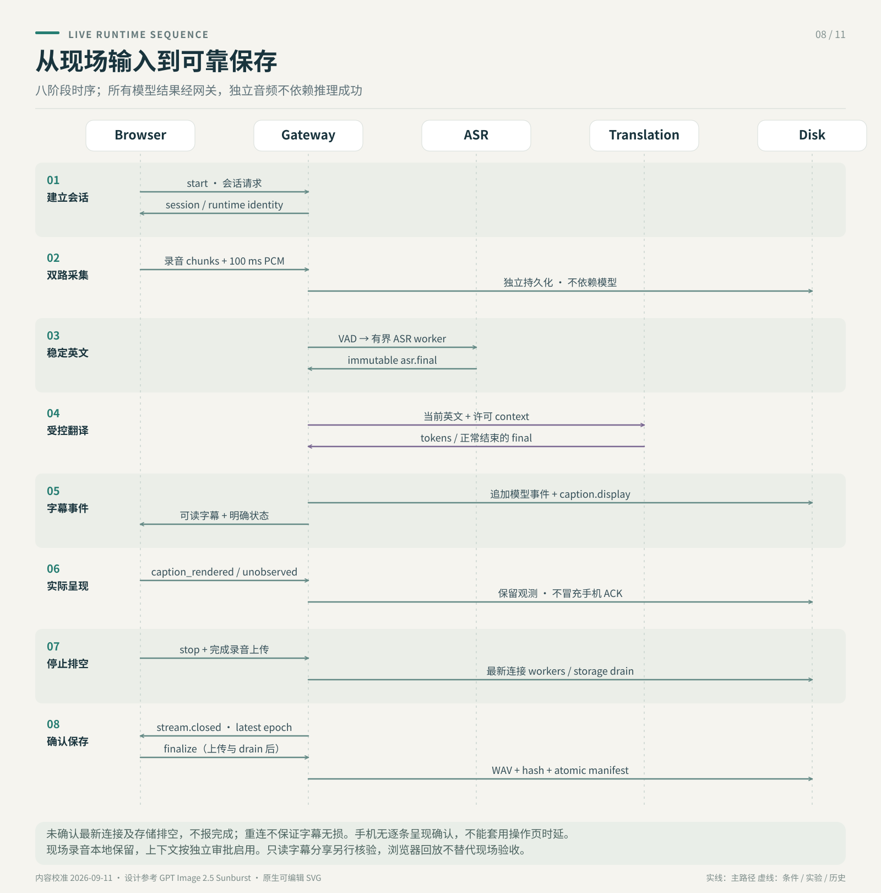

# 实时音频与字幕传输决策

这份文档固定周日现场 POC 的下一阶段连接方式。目标是降低感知延迟，同时保留简单、可恢复、可回放的录音与日志链路。

当前状态（2026-09-04）：Phase 1–3 的工程链路已实现。REST 控制面、WebSocket PCM/字幕数据面、Qwen/Whisper provider、MiLMMT NDJSON token streaming、局域网 SSE 只读页、自动化测试和修复后的固定 60 分钟浏览器/扬声器/麦克风长测均有 tracked 证据。教会现场彩排、人工 ASR Gold 和多场连续资源上限仍未完成。

## 决策


采用“REST 控制面 + 一条 WebSocket 实时数据面”，不让浏览器直接连接 ASR 或 Ollama：

```text
Browser
  ├── REST: health / session start / recovery audio / finalize
  └── WebSocket: ordered PCM frames <-> caption/status events
                    │
                    v
                 Gateway
                  ├── append-only recording and events
                  ├── VAD + persistent ASR worker
                  ├── guarded Content Pack retrieval
                  └── Ollama + MiLMMT
```

- 当前每秒一个 MediaRecorder HTTP chunk 的链路继续作为恢复录音，不作为 ASR 输入。
- ASR 输入使用独立的规范化 PCM 流。Gateway 是所有模型和日志的唯一协调者。
- 只把稳定英文送给 MiLMMT；Gateway 将增量中文作为 `translation.partial` 显示，并以 `translation.final` 提交稳定大字幕和永久日志。
- 不采用 WebRTC、WebTransport、Kafka/Redis 或浏览器直连模型。它们不能为当前单机 POC 提供足以抵消复杂度的收益。

## 为什么这样选

业界实时 ASR 通常使用双向长连接：客户端持续上传音频，服务端持续返回 partial/final 结果。Amazon Transcribe 的正式接口支持双向 HTTP/2 或 WebSocket；Google StreamingRecognize 使用双向 gRPC。对浏览器到本机 Gateway，兼容性最好的等价方案是标准 WebSocket。

音频不应该继续用一秒 WebM 文件块驱动 ASR。AWS 建议实时 PCM 使用 50–200 ms 的等长 chunk；Microsoft Speech 的流输入规格也是 signed 16-bit、mono PCM，常用 16 kHz。我们的基线取中间值 100 ms：每帧 3,200 bytes。

浏览器通过 AudioWorklet 在主线程之外获取音频，降采样为 16 kHz mono，再转换为 little-endian int16。标准 WebSocket 没有自动背压，因此发送端必须观察 `bufferedAmount`，使用有上限的本地队列，不能无限累积延迟。

ASR 的 partial 可能反复修订；final 才是该音频区间的不可变结果。主字幕只翻译 final 英文，避免重复推理、中文闪烁和错序。partial 英文可以显示在较小的英文行，但必须有明显的 draft 状态。

Ollama `/api/generate` 的 NDJSON 流式响应已经接入。Gateway 发出 `translation.partial` 供页面逐步显示，完成后发出并持久化 `translation.final`；partial 不替代 final，也不被当作会后 canonical 译文。

## 音频合同

| 字段 | 固定值/规则 |
|---|---|
| Encoding | signed PCM, little-endian, int16 |
| Sample rate | 16,000 Hz |
| Channels | 1 |
| Frame duration | 100 ms |
| PCM payload | 3,200 bytes |
| Wire frame | 4-byte unsigned sequence header + 3,200-byte PCM payload |
| Sequence | session 内从 1 严格递增 |
| Clock | `audioStartMs`/`audioEndMs` 相对 session 开始 |

WebSocket 建立后的第一条消息是 JSON 配置；之后音频使用二进制帧。每个二进制帧的前 4 bytes 是 network byte order 的 unsigned sequence，后 3,200 bytes 是 PCM；时间由 sequence 和固定帧长推导。这样重连或客户端过载丢帧后，Gateway 能明确记录 gap，而不为每帧重复编码 JSON。状态与字幕事件使用 JSON 文本帧。

```json
{"type":"stream.start","schemaVersion":1,"sessionId":"...","encoding":"pcm_s16le","sampleRateHz":16000,"channels":1,"frameDurationMs":100}
```

## 字幕事件合同



所有事件至少包含 `schemaVersion`、`type`、`sessionId`、`segmentId`、`sequence` 和相对音频时间：

```json
{"schemaVersion":1,"type":"asr.partial","sessionId":"...","segmentId":"seg-42","sequence":87,"audioStartMs":8200,"audioEndMs":10500,"sourceTextEn":"For God so...","stability":0.72}
{"schemaVersion":1,"type":"asr.final","sessionId":"...","segmentId":"seg-42","sequence":88,"audioStartMs":8200,"audioEndMs":11200,"sourceTextEn":"For God so loved the world."}
{"schemaVersion":1,"type":"translation.partial","sessionId":"...","segmentId":"seg-42","targetTextZh":"神爱","contextPolicy":"none"}
{"schemaVersion":1,"type":"translation.final","sessionId":"...","segmentId":"seg-42","sourceTextEn":"For God so loved the world.","targetTextZh":"神爱世人。","contextPolicy":"none","latencyMs":410}
```

规则：

- 同一 `segmentId` 的 partial 可以覆盖，但不能进入永久最终稿。
- `asr.final` 一旦写入不得修改；修正必须产生显式 correction event。
- 每个 `asr.final` 最多启动一次现场翻译。重复发送按 `segmentId` 去重。
- Gateway 生成并落盘模型事件，再发送给 UI；UI 不是日志 source of truth。
- WebSocket 中断时 MediaRecorder 恢复录音继续。UI 显示降级状态，不静默丢弃音频。

## 背压、重连与顺序

首版保持有限状态，不实现任意断点续传：

1. 浏览器 PCM 队列上限为 2 秒。
2. `WebSocket.bufferedAmount` 超过门槛时暂停从队列发送；恢复后按 sequence 继续。
3. 如果队列达到 2 秒仍无法发送，记录 `audio_stream_overrun`，丢弃最旧的实时 ASR 帧，但不影响 MediaRecorder 恢复录音。
4. WebSocket 断开后最多自动重连一次；重连成功发送新的 `stream.start` 和下一 sequence。
5. Gateway 检测 sequence gap 并写事件。不能把 gap 后的字幕描述成完整覆盖。
6. 翻译请求串行或最多一个 in-flight；新 final 进入有界队列，避免 MiLMMT 堆积越来越多延迟。

## 分阶段实现

### Phase 1：固定基线（已完成）

- 保留现有 REST 录音、session、日志和非流式 MiLMMT。
- 用冻结音频 benchmark `base.en` 与 `small.en`，确定 production ASR 模型和 VAD 参数。
- 测量 100 ms PCM 生成、发送和丢帧，不接真实字幕 UI。

### Phase 2：真正实时 ASR（已完成）

- 增加 AudioWorklet、一个标准 WebSocket endpoint 和 ASR worker。当前能量 VAD 默认 RMS 阈值为 `150`，可用 `LOCAL_LIVE_VAD_THRESHOLD_RMS` 针对现场噪声调整。
- 实现 `asr.partial`、`asr.final`、去重、背压和 gap 日志。
- 只有 `asr.final` 调用现有 `/api/translate` 内部逻辑；中文完整返回后提交 UI。

### Phase 3：按证据优化（POC 已完成）

- 已根据实测启用 Ollama NDJSON streaming，并保留 final-only 的持久化契约。
- 已增加带随机 token 的局域网 SSE 只读页；麦克风采集仍只在 MacBook localhost operator 页面进行，因此远端手机不需要 `getUserMedia`。

## 完成门槛

- 10 分钟真实麦克风测试无 sequence gap、无无界内存增长，恢复录音可解码。
- 30 分钟网络/模型故障测试中，断开 ASR 或 Ollama不会停止录音。
- 同一冻结音频 replay 产生相同 final segment 顺序，所有事件能按 `segmentId` 关联。
- 记录 capture、ASR partial/final、translation start/end、render 的独立时间戳。
- 修复后的固定 60 分钟 POC 长测已完成；该结果只证明当次房间、扬声器和麦克风路径，不替代教会现场彩排或人工质量验收。

## 参考依据

- [Amazon Transcribe streaming best practices](https://docs.aws.amazon.com/transcribe/latest/dg/streaming.html)
- [Amazon Transcribe partial/final results](https://docs.aws.amazon.com/transcribe/latest/dg/streaming-partial-results.html)
- [Microsoft Speech audio input stream format](https://learn.microsoft.com/en-us/azure/ai-services/speech-service/how-to-use-audio-input-streams)
- [MDN AudioWorklet](https://developer.mozilla.org/en-US/docs/Web/API/Web_Audio_API/Using_AudioWorklet)
- [MDN WebSocket API and backpressure](https://developer.mozilla.org/en-US/docs/Web/API/WebSockets_API)
- [whisper.cpp real-time stream example](https://github.com/ggml-org/whisper.cpp/tree/master/examples/stream)
- [Ollama streaming](https://docs.ollama.com/api/streaming)
