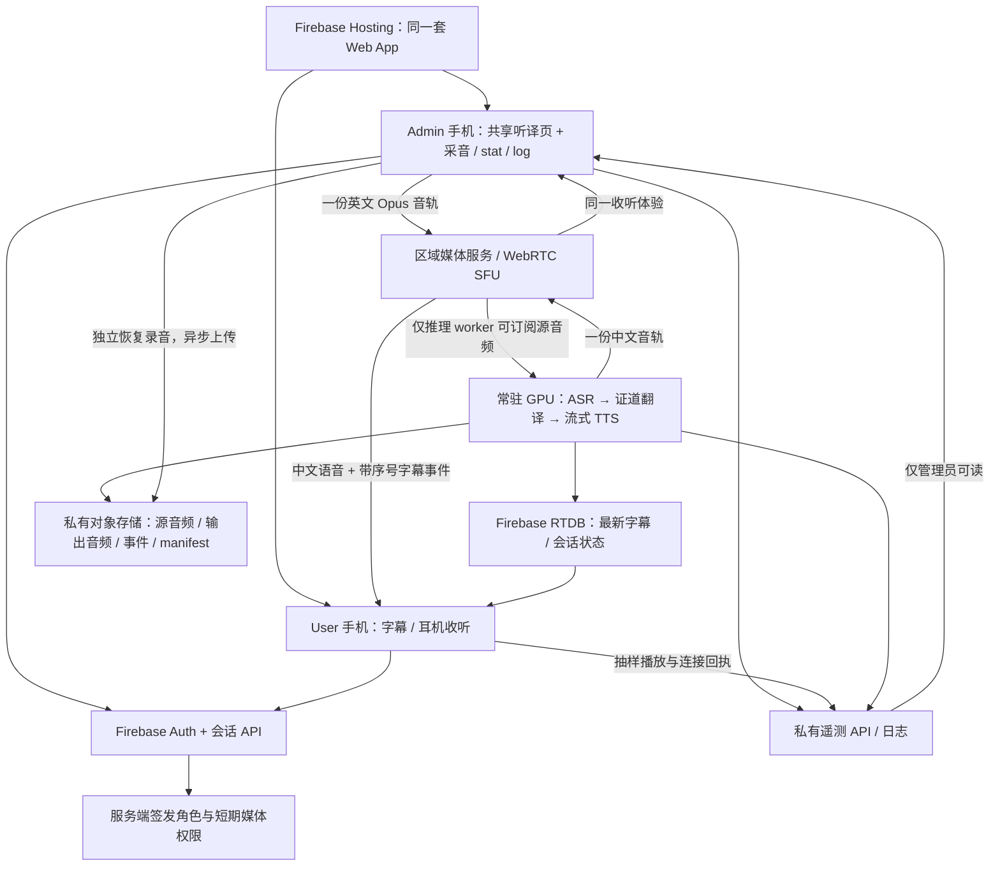

# 手机采集、远端证道传译与多人收听方案

日期：2026-09-06。状态：Discovery。M0 独立媒体探针与两端 MT 诊断已开始执行，实际结果见 [实验报告](REPORT_20260906.zh.md)；完整 Firebase admin/user 产品和真实手机音频路径尚未验收。

本方案承接用户的新目标：现场不带笔记本，由手机 admin 采集英文证道；admin/user 网页部署在 Firebase；远端完成 ASR、翻译、中文语音生成，手机接收字幕和声音。Admin 与 user 共用收听/字幕体验，只增加采音、会话控制、stat 和 log。质量目标是**在证道内容上优于 Google Translate，延迟尽量接近或优于对照**，而不是仅证明链路能运行。

暂按单场、一个采音 admin、20–50 位听众、英→简体中文、iPhone/Android 混合设计；人数待用户补充后调整。2026-09-06 用户已将推理范围限定为 **现有 DGX 或 MacBook Pro，暂不考虑云 GPU**，并要求开始手机媒体回路与两种运行时对照。此处提出目标与验证方法，不声明已经超过 Google。

## 1. 建议架构

**Firebase 承载应用与会话管理；目标实时音频走 WebRTC；模型由 DGX 或 MacBook Pro 上的常驻 worker 处理；一份中文语音分发给所有听众。** 首轮先用可控 WSS 媒体回路比较两台自有主机，再验证 WebRTC；媒体协议不让前端绑定某台机器。两台机器均可放在现场以外。

Firebase Hosting 提供静态网页、HTTPS 和 CDN，模型推理需独立运行环境。[Firebase Hosting](https://firebase.google.com/docs/hosting)

图是逻辑分工，源音频与中文音轨可以由同一个 SFU 服务转发；不得误实现成两次独立模型推理。SFU 接收一份编码音轨后转发给订阅者，适合共享同一中文版本；人数主要增加分发带宽与连接。[SFU 官方架构](https://docs.livekit.io/reference/internals/livekit-sfu/)

首版在同一媒体服务内分成私有 ingest room 与收听 room：前者只有 admin 和 worker，后者只发布中文。服务端签发绑定房间/角色的短期权限，user 无权加入 ingest room；禁止仅靠前端不订阅来隐藏英文源轨道。初期私有测试用户采用白名单身份；面向公开聚会的扫码只听权限在质量门通过后另行配置。

### Firebase、实时媒体和计算各做什么

| 层 | 建议责任 | 不进入这层的内容 |
|---|---|---|
| Hosting | `/admin/...` 和 `/s/...`，同一个前端构建，共享字幕/播放器组件 | GPU 模型、持续音频处理 |
| Firebase Auth + 会话 API | admin 登录、会话归属、采集者租约、短期 join 权限、撤销/结束 | 长期服务账号密钥下发手机 |
| RTDB | 当前字幕快照、当前状态、重连后立即恢复显示 | 原始音频、TTS 字节、完整语音工作队列、私有 stat/log |
| WebRTC / SFU | admin 音轨上行、worker 中文音轨下行、实时分发；TURN 回退 | 把每位听众变成一个独立翻译请求 |
| GPU worker | 连续 ASR、翻译、TTS、有界排队、模型身份与内容对应 | 按听众数自动扩大同一场证道的推理任务 |
| 私有对象存储 + 遥测 | 恢复录音、可追溯事件、输出音频、hash、诊断；异步批量传输 | 每帧等待日志入库后才继续收音/播音 |

可用 LiveKit 等成熟 SFU 实现作为首选验证对象；未决定购买服务或部署供应商。自托管 SFU 需要可达的 UDP/ICE/TURN 端口，不能把普通 Cloud Run HTTP service 当作相同的媒体入口。[媒体端口要求](https://docs.livekit.io/transport/self-hosting/ports-firewall/)、[Cloud Run 容器契约](https://docs.cloud.google.com/run/docs/container-contract)

## 2. Admin 与 user 是同一产品的两个角色

| 功能 | User | Admin |
|---|---|---|
| 大字中文、可选英文、前一句、横竖屏/字号 | 相同 | 相同 |
| 开始听译、暂停/恢复、音量、字幕模式 | 相同 | 相同；采音时默认静音，戴耳机后可监听 |
| 直播/重连/已结束、当前播放内容 | 相同 | 相同 |
| 麦克风授权、输入电平、开始/停止采集 | 无 | 有 |
| 采音/网络/模型/播放 stat | 仅简单体验状态 | 可展开详细统计 |
| log 导出、恢复录音上传状态 | 无 | 当前会话的私有诊断 |

User 不需要麦克风权限。Admin 采音手机应靠近讲员或可清晰听到扩声的位置，第一轮就是手机麦克风验证；外接麦克风/调音台输入是后续可选增强，不能用增强输入对比 Google 的远场弱输入后宣称模型更好。

开启声音时默认显示“正在播报”的完整双语单元，跟随该手机实际播放进度；用户切到纯字幕模式时立即显示最新稳定字幕。最新字幕通常领先声音，不能将新英文与正在播放的旧中文错误配对。此逻辑由共享组件实现，admin/user 不分别维护两套规则。

Admin 只控制采集会话，用户独立控制自己的播放：一个用户暂停不能暂停全场。全场停止或管理员撤销会话则使所有旧音轨/事件 epoch 失效。

## 3. 实时上传与分发的选择

### 推荐主路径：WebRTC 音轨

- 手机 `getUserMedia` 取得源音频，WebRTC 编码为单声道 Opus，初始比较 32/48 kbps；这是待测试配置，不是质量保证。浏览器通常按协商的媒体采样率工作，worker 解码后再统一重采样到 ASR 的 16 kHz mono PCM。
- 媒体持续发送小包；worker 聚合成现有 ASR 所需 100 ms 帧。文件保存可以每几秒形成一块，但实时推理不能等待文件块上传完成，更不能等整场录音。
- worker 生成一次中文音轨并发布；观众只订阅中文音轨。原英文轨道由服务端授权限制为推理/获准录音路径，不能仅依赖客户端隐藏。
- 音频媒体有独立序号/时间轴，字幕可靠事件带 `sessionId / epoch / finalId / speechUnitId`。RTDB 只做最新状态恢复；首轮可保留 RTDB 字幕作为对照，但不从其快照重建待播句子。
- TURN/网络回退、连接切换和丢包须可观察。源音频丢包、解码补偿、静音插入要保留证据；不能把补偿音频当成原始声音的无损记录。

WebRTC 的连接机制提供 ICE/STUN/TURN 路径选择；具体是否更快仍由现场 Wi-Fi/蜂窝测试决定。[WebRTC 连接机制](https://webrtc.org/getting-started/peer-connections)

### 保留 WSS 作为对照，而非先重写所有媒体基础设施

WSS 可以复用现有 100 ms PCM/事件协议，适合 1–5 台设备跑最小基线。代价是要自己处理音频播放时钟、缓冲、网络积压和重连；拥堵时不要无限重放旧音频。

如果采用 Cloud Run WSS，连接应直连专用后端域名：Firebase Hosting 动态 rewrite 有 60 秒超时；Cloud Run WebSocket 本身默认 5 分钟、最长 60 分钟，重连也不保证回到同一实例。因此不能把整场会话只放在某条 HTTP 连接的内存里。[Hosting 转发限制](https://firebase.google.com/docs/hosting/cloud-run)、[Cloud Run WebSocket](https://docs.cloud.google.com/run/docs/triggering/websockets)

这个远程多人场景与原单 Mac 的“一个 WS”设计目标不同。新增媒体协议应放在独立实验入口；原本机 Gateway 不直接开放公网。

## 4. 延迟：先统一测量端点，再优化

### 4.1 三种数字必须同时报告

1. **对应内容延迟**：源语义单元/词结束 → 对应中文实际开始从用户耳机输出。跨语言重排要校准对应关系，不能为了报更低数字只选择靠后的源片段终点。
2. **起声延迟**：原英语开始讲话 → 首次听到中文。这里包含收集第一个有意义英文单元的时间，通常大于“片段末尾 → 输出”。
3. **持续落后**：全场对应内容延迟的 p50/p95/max、随时间走势、音频待播秒数、所有未播单元。首句快但 20 分钟后落后半分钟仍不合格。

软件排程/解码与实际耳机发声分别计量。WebRTC `getStats` 可提供抖动缓冲、丢包、RTT 等诊断，但它们不是完整端到端延迟；设备不提供的字段记 unknown。[W3C WebRTC Stats](https://www.w3.org/TR/webrtc-stats/)

### 4.2 已知基线与新增成本

现有 v4.1 在 MacBook 的 45 秒原始文件回放：片段末尾 → 中文 final 的 p50 为 1.963 秒，p95 为约 2.196 秒；没有手机上行或语音输出。这是有限样本的历史证据，不能当作手机/DGX 链路实测。[本地接入报告](../local-live-poc/benchmarks/MILMMT_V41_POC_INTEGRATION_20260905.zh.md)、[TTS 初步方案与测量边界](../local-live-poc/SPEECH_TRANSLATION_RESEARCH_AND_PLAN.zh.md)

主机搬到远端首先会增加传输与播放成本，DGX 是否快于 MacBook 必须按相同输入和明确运行时测量。可用以下分配安排第一轮 profiling：

| 阶段 | 优化后初始预算 | 如何降低/验证 |
|---|---|---|
| 采样成包、手机上行到 worker | 0.08–0.25 s | 小包持续发送，实测直连/TURN，避免跨区中转 |
| ASR 片段尾部确认与可用稳定英文 | 0.40–1.00 s | 流式 ASR、有界语义单元；同时验否定、专名、句尾修正 |
| MT 排队与最终译文 | 0.20–0.60 s | 单场优先调度、固定短上下文、实测推理运行时 |
| 语音提交/必要语义等待 | 0–0.30 s 常规预算 | final-only；高风险未完句可多等，计入长尾，不能强截断 |
| TTS 首个可用音频块 | 0.25–0.80 s | 常驻、预热、真正流式合成，不能用 HTTP 流包装冒充 |
| 下行、SFU、抖动缓冲和输出设备 | 0.12–0.40 s | 同区媒体、有限缓冲、耳机实测，区分蓝牙与有线 |

以上都是待测工程分配，不是厂商 SLA 或各阶段 p95；不能把各行的分位数相加声称系统 p95。包接收/模型处理会部分重叠，单元上下文也可能增加额外等待，最终以同一时钟映射的实际输出为准。

第一轮复用现有链路可先接受 **约 3–6 秒的可诊断语音闭环**；面向使用的优化目标设为**对应内容延迟 p50 2–3.5 秒、p95 ≤ 5 秒，正常长测无持续积压**。起声延迟另报；如果一句需要先听 2 秒，这 2 秒不能从对标 Google 的起声/逐词延迟里隐藏。

最终“接近 Google”的判据以同场同条件对照为准，初始目标是 p50/p95 不超过 Google 超过 0.5 秒，并同时满足质量改进门。绝对目标和相对目标都应报告；未同时达到就如实展示取舍，不通过改口径宣布双赢。

### 4.3 优先优化顺序

1. **输入清晰与 ASR 稳定单元**：低质收音会同时损害准确率和断句速度。先验实际手机位置/设置，保留不带额外降噪的对照。
2. **去掉多余串行等待**：不等文件上传、不等整段 TTS、不在热路径调用大模型二次审稿、日志异步写入。
3. **常驻并预热三个模型**：开场前实际跑 ASR/MT/TTS readiness；容器存活和 GPU 分配完成都不够。
4. **推理与网络位置**：测 DGX/MacBook、媒体入口到 worker 的完整路径；不要只测 Hosting 首页加载或 ping。
5. **播放容量**：每 10 秒英文如果变成 12 秒中文声音，即使 TTS 零耗时也每分钟积压 12 秒。RTF 与中文音频/源时长比必须分别看。

首轮固定音色和正常语速。若后续需要轻度变速，作为单独受控实验；不通过省略、摘要或快速念完经文降低延迟。

## 5. 推理放在哪里

| 选项 | 用途与优势 | 需要证明的条件 |
|---|---|---|
| 现有 DGX，主动连接公网 SFU | 快速验证手机现场、家中/办公室机器推理；手机不需要访问私网，也不暴露 SSH/模型管理端口 | 实际上/下行与稳定性、已有工作负载隔离、模型服务常驻、断电/断网恢复；不能凭 LAN 测试推断公网表现 |
| MacBook Pro，主动连接公网媒体入口 | 优先复用当前经过验证的 MLX 模型；也用来隔离“手机网络变化”与“模型运行时迁移”的影响 | 主机供电、睡眠、持续在线和远程媒体路径；不要求现场携带，也不自动成为生产主机 |

云 GPU 不在本轮选择、采购、部署或测试范围内。Firebase 与必要的媒体转发服务仅承载网页、控制和数据传输。

服务并发以“同时几场证道”计，不按 50 位听众配置 50 路推理。先一个 worker 接一场，再证明是否可多场；ASR/MT 优先，TTS 有限队列。记录两台机器已有工作负载，不停止其他服务来制造不真实的对照。

### 模型迁移不能只复制启动命令

现有 v4.1 Q5、ASR 和拟用 MLX Audio TTS 的验收都绑定当前本机运行时；本机另有合并 BF16 模型，配置为 `Gemma3ForConditionalGeneration`。DGX 的框架、量化、tokenizer、prompt、EOS 和输出需重新核验。Mac Q5 与 DGX BF16 属于两种部署运行时对照，不能将全部差异归因于硬件。

不能概括“MLX 只能 Apple”：本机 MLX 0.32.2 metadata 已列 Linux CUDA/CPU extras；但这也不证明当前 `mlx-audio 0.3.1`、模型包和所有音频路径已在 Linux 通过。迁移只改变一项变量，冻结模型/hash/解码契约并用已有开发诊断对照；不重跑训练，不打开 sealed final。

原 v4.1 provider 的 `contextPolicy=none`、`experimental_local_only` 和质量状态保留。新远端候选定义独立 provider/runtime/发布策略，先私有测试会话；网络接通不自动取得向会众发布的资格。

## 6. 如何在证道质量上超过通用翻译

**有机会形成优势的部分是证道领域数据、受控上下文、断句与质量评价；Firebase 和 WebRTC 负责交付，不能带来语义优势。** 当前 v4.1 仍有严重错误，不能直接作为“已经更好”的依据。

| 杠杆 | 实施原则 | 对延迟的影响 |
|---|---|---|
| 证道 ASR 词汇/专名 | 经人工确认的人名、地名、经文书名可进入明确支持的 ASR 提示/纠错实验；保留原 ASR final，不静默替换原声 | 预加载，通常不需要另一轮大模型；实际 provider 能力需验证 |
| 领域译法 | 建立经审核的术语、固定译法和纠错样例；覆盖 Trinity、grace/mercy、faith、covenant、称谓与引用关系 | 小而固定的上下文，测 prefill 成本；不能无限堆 RAG |
| 同场上下文 | 最近已确认的英文语境、已批准的周资料和引用定位；现场语音仍为唯一事实依据 | 有界缓存/检索；检索失败退回基础翻译，不能阻塞采音 |
| 圣经引用 | 区分逐字引用、意译、讲员解释；只在证据充分时使用已批准译本片段，不自动用整段经文覆盖现场内容 | 预索引查找；识别不确定时保留普通翻译 |
| 稳定语义单元 | 少量有界等待解决未完否定、指代、条件句；不朗读会被改写的草稿 | 会增加部分长尾，必须在质量/延迟曲线上选择 |
| 轻量风险检查 | 检查数字、专名、异常重复、明显源/译缺失；高风险项可暂缓声音、显示状态 | 规则不能保证语义正确；新增检查成本单独测量 |
| 后训练迭代 | 将人工已纠正的证道错误纳入下一版训练/诊断，训练与评测按整篇讲章隔离 | 主要离线完成；不把在线强模型审稿放到每句必经路径 |

当前 v4.1 不支持任意加入上述 prompt/context 仍称同一候选；上下文增强和后训练版本必须分别命名与做消融。未审核机器中文、旧周讲章或自动检索的相似段落不能替代现场内容。

质量策略应先追求“少严重错误、术语一致、完整表达”，再比较音色。已播出的错误不能靠后台改文字抹去；发现严重错误时保留修正记录并明确提示，需要时显式更正播报。

## 7. Google 对标与验收设计

Google Translate App 与 Gemini Live Translation API 是两个对照，分别记录结果。API 可提供同一 PCM 的工程对照，但不能代表手机 App 的完整体验；Google 连续语音接口及限制见 [API 文档](https://ai.google.dev/gemini-api/docs/live-api/live-translate)。

### 三类对照分开做

| 对照 | 输入条件 | 能说明什么 |
|---|---|---|
| A：同源音频工程对照 | 同一获准源 PCM、1 倍速、冻结完整源窗口；自研与 Gemini API | 算法/服务链路质量和延迟，不能说明手机收音或 Google App 体验 |
| B：真实手机产品对照 | 同型号双机同一声学播放，交换位置；或同机随机顺序；同网络/耳机条件；避免争抢麦克风 | 用户实际听到的质量、持续性和延迟 |
| C：带证道资料的产品对照 | 自研可使用明确列出的人工审核资料；另保留无资料版本 | 证明准备材料与领域能力带来的收益；不得标成两模型相同上下文的纯能力对照 |

先用 3 段各 10 分钟定位问题，再冻结至少 6 篇未进入训练的证道、累计至少 120 分钟、覆盖不同讲员/语速/叙事/引用/祷告。划定至少 400 个源语义单元；不足时增加材料。不能把调参用过的段落再叫最终测试，也不擅自开启现有 sealed final。

两名具备英中及圣经术语理解的评审进行匿名随机盲听，先校准错误标准，分歧由复核解决。自动评分可筛查，不代替人工 Gold。记录 App/浏览器/OS/模型版本、测试日期、设备/音频路线、网络、输入/hash、所有实际输出和未输出窗口。

### 初始验收门，测试前冻结

- **语义质量**：相对 Google 的严重/主要错误不增加；加权错误率目标至少降低 20%，按每千源词归一化，权重在标注指南中预先冻结。报告按讲章聚类的 95% 区间与逐讲章结果；相对改进区间下界须大于 0 才声明优势。样本不足以支持优势时继续收集，不只报总均值。
- **领域错误**：否定反转、神学称谓错误、经文编号/关键数词错误单列。发现严重神学误译仍阻止公开语音推广；不能靠其他简单句的胜率抵消。
- **覆盖**：冻结全部源语义单元为分母，漏译、无声、排队丢弃、后台中断都保留。源单元的核心命题/关系在看系统输出前标注；完整表达记 1，保留部分但缺失核心关系记 0.5，未表达、反义或截止仍未播出记 0，同时按预定严重度计质量错误。正常 run 的源覆盖分数须 ≥ 99%，0 分单元数须为 0，关键否定/经文/数词全部正确。每个源单元的对应核心内容须在该单元最后源词后 10 秒内实际播出；最终输出完整性仍检查至源结束后最多 15 秒排空窗口。两系统使用相同截止规则。全部应播 final 也须有实际完整播出记录且无重复；源覆盖和工程覆盖分别通过，不能只用成功 TTS 作分母。
- **延迟**：同时报告起声、对应内容 p50/p95/max、长期增长；成功样本分位数必须附覆盖率和超时数。不得通过丢慢句改善分位数。先满足覆盖与质量门，再讨论绝对及 Google 相对延迟目标。
- **连续使用**：完整 60 分钟正常 run；故障注入、主动暂停、锁屏实验单列。20–50 人负载不能让同场模型运行 20–50 份。
- **听感/同步**：实际中文读音、句间停顿、音频伪影和耳机可懂度分别评估。同步定义为“该双语单元在手机屏幕实际显示切换的时刻 − 该单元在耳机实际起声的时刻”，不以数据到达或首块排程代替。初始门为绝对偏差 p95 ≤ 200 ms、max ≤ 500 ms；另检验单元结束/下一单元切换，不提前配上新英文。计时校准不确定性须 ≤ 50 ms，否则同步验收记未验证；校准只修正测量偏差，不能看完结果后放宽目标。

Google 的质量、起声/逐词延迟、声音自然度也应分开看，不能以一个综合分掩盖错误。[Google 评估方法](https://deepmind.google/models/evals-methodology/gemini-3-5-live-translate)

## 8. 手机长时间运行的边界

首轮范围是 **admin 前台保持采音，user 点击后前台听译**。Admin 请求 Wake Lock 保持亮屏，并显示真实收音/上传进度；拒绝或失效时清楚提示。PWA 安装不是后台执行保证，Wake Lock 在页面不可见时会释放。[Screen Wake Lock](https://www.w3.org/TR/screen-wake-lock/)

音频上下文暂停时 MediaStream 输入会丢失，AudioWorklet 不能补回未采到的声音；页面生命周期也受浏览器策略影响。监测音轨 mute/ended、实际 sample count、服务端最后收音时间及播放回执，不能只用 WebSocket“已连接”证明健康。[Web Audio](https://www.w3.org/TR/webaudio-1.1/)、[Chrome 生命周期](https://developer.chrome.com/docs/web-platform/page-lifecycle-api)

User 端通过“开始听译”明确解锁声音，不请求麦克风来绕过自动播放限制。[Chrome 自动播放](https://developer.chrome.com/blog/autoplay)、[WebKit WebRTC](https://webkit.org/blog/7763/a-closer-look-into-webrtc/)

后台能力分两张验收表：admin 锁屏/切 App 能否继续采音；user 锁屏能否继续听译。各按 iOS Safari/PWA、Android Chrome/PWA、OS 版本和耳机组合实测。不能预设所有手机网页都能或都不能。Google 2026-09-04 公告中 Android 已支持后台/锁屏实时翻译，iOS 后台仍待推出；公平产品对标应单列这一能力。[Google 最新更新](https://blog.google/products-and-platforms/products/translate/google-translate-ios-android-upgrades/)

如果目标必须是“admin 放入口袋锁屏仍可靠采音”，而目标设备的 Web 验收不能通过，应新增使用原生音频采集能力的移动端适配层；简单 WebView 包装不等于解决问题。可以继续复用前端体验、Firebase 身份与同一远端协议。

## 9. 会话、恢复、stat 和 log

### 身份与时序

- 一个 session 只有一个有效采集者租约；重连更新 connection epoch，双手机抢占或旧连接迟到不能重复进入 ASR。
- `captureSequence / sourceSampleOffset / asrFinalId / translationFinalId / speechUnitId / audioSampleOffset` 建立全链路关系；应用时钟、worker 单调时钟与媒体时钟分别保存映射及不确定性。
- 音频生成一次，播放进度按每位听众独立记录；重连订阅当前直播位置，不自动播放断线期间的全部积压。历史回听作为单独模式，不能标“实时”。
- 原 ASR final 不可变；只从成功 translation final 产生声音；增补新协议如 `remote-sermon-session-v1` / `speech-unit-v1`，不把 v1 RTDB 快照改成隐含音频队列。

### 录音与断网

Admin 同时维护独立恢复录音，探测支持的 MediaRecorder 格式；拟以 2–5 秒块写入本地持久缓存并异步上传，限制容量、记录 hash/确认序号。手机存储配额、系统回收、页面刷新与后台停采必须实测，不能承诺永不丢失。

短时网络中断后实时通道追到当前，过期源音频不静默补入正在直播的时间轴；缺口明确记账。恢复文件单独上传作离线修复，它不能抹去听众当时没有听到的内容。长断网时显示“采集保留中，实时传译中断”，不回放旧字幕冒充直播。

TTS/推理失败时，admin 的独立录音继续；已有字幕可保留并标状态。停止采集使全场声音停止并拒绝旧 epoch，录音/事件按独立 drain/save 规则完成。生成、分发、实际播放、源录音四种完成状态分别记录。

### 遥测分层

| 层 | 建议字段 |
|---|---|
| Admin 采音 | 电平/削波比例、实际采样率、mute/ended、采样推进、录音缓存/上传确认、当前设备与页面状态 |
| 网络/媒体 | 上行/下行 RTT、丢包、jitter buffer、重连/ICE 路线、每端最后收到媒体时间 |
| 推理 | ASR/MT/TTS 队列、耗时、模型身份、最后 final、TTS 首块、显存/资源状态 |
| 播放 | 已接收/排程/播完、缓冲秒数、源到声估计/实测、暂停/取消/丢弃原因 |
| 会话汇总 | 收听连接数、有效播放回执数、失败数、覆盖、延迟区间、log/恢复音频完整性 |

设备连接不等于有人在听。按约 5 秒汇总、故障立即报告；用户遥测采样和批量上传，避免每包写数据库。Admin 可看聚合和获准诊断，普通用户仅看简单状态。stat/log 放独立私有路径或鉴权 API，绝不放匿名可读字幕节点；凭据、完整 bearer token 和私有模型路径不入客户端 log。

## 10. 带宽与容量估算

按十进制 MB、纯音频载荷计算，不含包头、TLS、重传、FEC、TURN 和存储副本：

| 数据 | 理论载荷 |
|---|---|
| 单 admin 32 kbps Opus 上行 | 约 14.4 MB/小时 |
| 单 admin 48 kbps Opus 上行 | 约 21.6 MB/小时 |
| 单 user 32 kbps 中文音频 | 约 14.4 MB/小时 |
| 50 位 user，32 kbps 连续中文音频 | 合计约 0.72 GB/小时；100 人约 1.44 GB/小时 |
| 未压缩 16 kHz PCM16 mono | 256 kbps，约 115.2 MB/小时，仅单路上行 |

这是选择媒体编码/共享推理的依据，不是费用报价；实际媒体费用在选定 SFU/TURN 和听众数后核算，本轮不产生云 GPU 费用。预算告警不是费用硬上限。多音色、多语言或个性化改写会产生额外流，首版只有一种中文音色。

## 11. 现有代码如何复用

2026-09-06 只读检查 `main@752910d`，未核查云端当前健康或部署：

| 现有位置，相对仓库根目录 | 可复用 | 必须新增/隔离 |
|---|---|---|
| `experiments/local-live-poc/src/App.jsx` | 采音、字幕显示、停止保存经验 | 抽取共享 viewer 组件；手机持久恢复、admin 身份、远端 stat/log |
| `experiments/local-live-poc/firebase/public/` | 只读字幕布局、序号/过期处理 | 当前不是 React admin 构建；无 Auth/音频，需新 app 构建与路由 |
| `experiments/local-live-poc/backend/live_pipeline.py` | VAD/ASR/MT 有界 worker、final 与持久化契约 | 新媒体 ingress adapter 和独立 TTS；不放开旧 loopback API |
| `experiments/local-live-poc/backend/firebase_publisher.py` | 字幕 projection、异步发布 | `LatestSnapshotQueue` 会合并包括 final 的快照，不可当可靠语音队列 |
| `experiments/local-live-poc/firebase/database.rules.json` | 默认拒绝/过期/只读设计 | 新 admin 私有授权、声音索引和 schema；不要扩字段后泄露整份 log |
| `experiments/local-live-poc/backend/runtime_identity.py` / `gateway.py` | 模型/策略身份思想 | 原 origin 和 URL 明确 loopback，无 Firebase admin 鉴权；新远端服务另建契约 |

原本机 POC 与已部署字幕 viewer 保留为已知对照。新实验放本目录，先独立构建/路由/会话命名空间；不通过改几处 localhost/CORS 就公开模型、录音或重启接口。

## 12. 实施顺序与决定点

| 阶段 | 交付与主要问题 | 继续条件 |
|---|---|---|
| M0：手机传输/输出，先不跑模型 | 同一手机 admin、两种 user 手机；WSS PCM 对照 WebRTC/Opus；预生成音频分发；RTT/丢包/实际耳机延迟、前台/锁屏分开验证 | 传输/播放可测且连续；确定编码、媒体地域和网页能力。此阶段不能宣称实时翻译成功 |
| M1：远端模型，先字幕 | 同一源验证 DGX/MacBook Pro 运行时、prompt/输出；phone → ASR → MT → phone；admin stat/log/恢复录音 | 源/译身份和覆盖正确，旧模型质量结论不被迁移覆盖；实际手机麦克风路径成立 |
| M2：一份流式中文音频 | 按已有 TTS 方案先完成 P0 流式完整性检查；共享音轨、语音字幕对应、停止/重连/积压控制；5 人再 20–50 人 | 100% 应播 final 有实际播放结果且无重复；带源标注的正常 run 同时检查第 7 节源覆盖/截止门。按用户报告播放，不能只看 SFU 发送成功 |
| M3：证道质量对标 | 先无上下文，再术语/周资料/后训练消融；Google API 与 App 分开、盲测与延迟同报 | 质量优势和可接受延迟有冻结评测证据；严重错误未解决保持私有实验 |
| M4：现场与产品能力 | 60 分钟手机现场、不同网络/耳机；admin/user后台分别测试，必要时原生采音；主机和媒体故障恢复 | 现场、设备、覆盖、质量、负载各门通过后，再决定公开提供范围 |

建议下一项最小工作是 **M0 的手机媒体回路与 M1 的远端运行时对照**：先判断网络/网页和模型各自的延迟上限，再投入完整 admin UI 和领域训练。模型与声音诊断可以独立推进，状态修改/部署仍按具体目标顺序执行。

方案初稿仅新增文档；随后用户已授权 M0 媒体回路与 DGX/MacBook 运行时实验，实际结果以新建的实验报告为准，不由本方案推定。云 GPU 仍排除。实现时重新检查目标项目和现有差异，按改动区域运行相关测试；跨层交付仍需完整自动化测试与手机真实路径证据。
